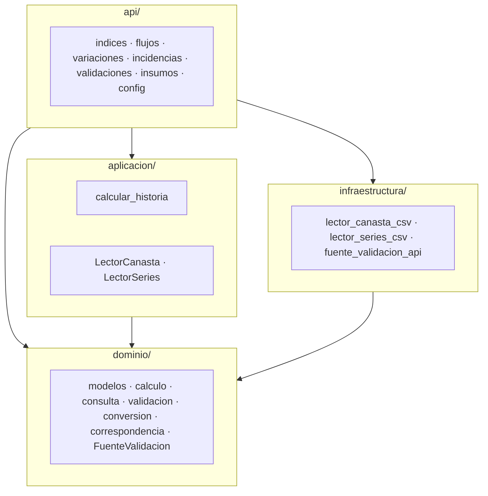
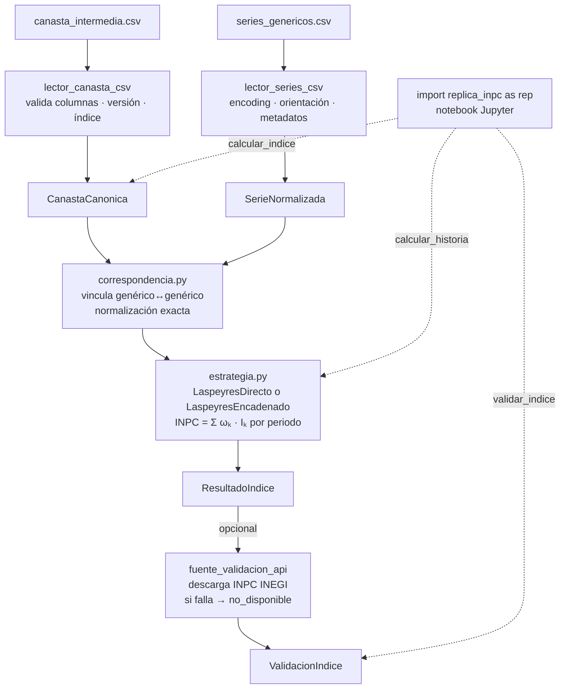

# Diseño del sistema — replica-inpc-mx

Documento vivo. Refleja el estado actual de las decisiones de diseño del sistema.
El historial de cambios vive en git.

---

## Índice

- [Diseño del sistema — replica-inpc-mx](#diseño-del-sistema--replica-inpc-mx)
  - [Índice](#índice)
  - [1. Arquitectura](#1-arquitectura)
    - [1.1 Patrón principal: Hexagonal (Ports \& Adapters)](#11-patrón-principal-hexagonal-ports--adapters)
    - [1.2 Patrones de diseño](#12-patrones-de-diseño)
      - [Strategy — cálculo del INPC](#strategy--cálculo-del-inpc)
      - [Facade — api/](#facade--api)
      - [Adapter — infraestructura](#adapter--infraestructura)
    - [1.3 Dirección de dependencias](#13-dirección-de-dependencias)
    - [1.4 Convenciones de código](#14-convenciones-de-código)
  - [2. Estructura del proyecto](#2-estructura-del-proyecto)
  - [3. Stack técnico](#3-stack-técnico)
  - [4. Flujo de datos](#4-flujo-de-datos)
  - [5. Dominio](#5-dominio)
    - [5.0 Mapa del dominio](#50-mapa-del-dominio)
    - [5.1 Semántica compartida](#51-semántica-compartida)
    - [5.2 Tipos compartidos](#52-tipos-compartidos)
    - [5.3 Periodos](#53-periodos)
    - [5.4 Modelos de entrada](#54-modelos-de-entrada)
    - [5.5 Modelo base](#55-modelo-base)
    - [5.6 Calculadores de índice](#56-calculadores-de-índice)
    - [5.7 ResultadoIndice](#57-resultadoindice)
    - [5.8 Resultados derivados](#58-resultados-derivados)
    - [5.9 Modelos de validación](#59-modelos-de-validación)
    - [5.10 Conversión y combinación](#510-conversión-y-combinación)
    - [5.11 Cálculo de variaciones e incidencias](#511-cálculo-de-variaciones-e-incidencias)
    - [5.12 Funciones de consulta](#512-funciones-de-consulta)
    - [5.13 Correspondencia](#513-correspondencia)
    - [5.14 Validación — validacion/](#514-validación--validacion)
    - [5.15 Errores](#515-errores)
  - [6. Fachada — api/](#6-fachada--api)
    - [6.1 config.py](#61-configpy)
    - [6.2 insumos.py](#62-insumospy)
    - [6.3 indices.py](#63-indicespy)
    - [6.4 variaciones.py](#64-variacionespy)
    - [6.5 incidencias.py](#65-incidenciaspy)
    - [6.6 validaciones.py](#66-validacionespy)
    - [6.7 flujos.py](#67-flujospy)
  - [7. Aplicación](#7-aplicación)
    - [7.1 Puertos](#71-puertos)
    - [7.2 Casos de uso](#72-casos-de-uso)
  - [8. Infraestructura](#8-infraestructura)
    - [8.1 lector\_canasta\_csv](#81-lector_canasta_csv)
    - [8.2 lector\_series\_csv](#82-lector_series_csv)
    - [8.3 fuente\_validacion\_api](#83-fuente_validacion_api)
  - [9. Estrategia de errores](#9-estrategia-de-errores)
    - [9.1 Jerarquía de excepciones](#91-jerarquía-de-excepciones)
    - [9.2 Propagación](#92-propagación)
    - [9.3 Traducción en adaptadores](#93-traducción-en-adaptadores)
  - [10. Estrategia de testing](#10-estrategia-de-testing)
    - [10.1 Tipos de test](#101-tipos-de-test)
    - [10.2 Fixtures](#102-fixtures)
    - [10.3 Mock de la API del INEGI](#103-mock-de-la-api-del-inegi)
    - [10.4 Criterio de suficiencia](#104-criterio-de-suficiencia)
  - [11. Decisiones de diseño](#11-decisiones-de-diseño)
    - [11.1 `SerieNormalizada` en formato ancho](#111-serienormalizada-en-formato-ancho)
    - [11.2 `generico_original` como diccionario](#112-generico_original-como-diccionario)
    - [11.3 Correspondencia por normalización exacta](#113-correspondencia-por-normalización-exacta)
    - [11.4 pandas en el dominio](#114-pandas-en-el-dominio)
    - [11.5 `ponderador` y `encadenamiento` como `str`](#115-ponderador-y-encadenamiento-como-str)
    - [11.6 `Periodo` como tipo propio](#116-periodo-como-tipo-propio)
    - [11.7 Categorías de clasificación version-específicas](#117-categorías-de-clasificación-version-específicas)
    - [11.8 Tolerancia numérica por versión](#118-tolerancia-numérica-por-versión)
    - [11.9 Reglas de `estado_calculo`](#119-reglas-de-estado_calculo)
    - [11.10 Detección de `null_por_faltantes`](#1110-detección-de-null_por_faltantes)
    - [11.11 Firma de `validacion/indices.py`](#1111-firma-de-validacionindicespy)
    - [11.12 `id_corrida` en `ResultadoIndice`](#1112-id_corrida-en-resultadoindice)
    - [11.13 Schema condicional en `ReporteDetalladoValidacion`](#1113-schema-condicional-en-reportedetalladovalidacion)
    - [11.14 `TIPOS_CON_VALIDACION` en el dominio](#1114-tipos_con_validacion-en-el-dominio)
    - [11.15 Cache de clase en `FuenteValidacionApi`](#1115-cache-de-clase-en-fuentevalidacionapi)
    - [11.16 UTF-8 como primer encoding en `LectorSeriesCsv`](#1116-utf-8-como-primer-encoding-en-lectorseriescsv)
    - [11.17 Dispatch interno en `CalculadorBase`](#1117-dispatch-interno-en-calculadorbase)
    - [11.18 Vectorización del loop interno de `validacion/indices.py`](#1118-vectorización-del-loop-interno-de-validacionindicespy)
    - [11.19 `LaspeyresEncadenado` — derivación de `f_h`](#1119-laspeyresencadenado--derivación-de-f_h)
      - [Primer enfoque (descartado): media ponderada con ponderadores nuevos](#primer-enfoque-descartado-media-ponderada-con-ponderadores-nuevos)
      - [Enfoque final: empalme desde el resultado de la versión anterior](#enfoque-final-empalme-desde-el-resultado-de-la-versión-anterior)
    - [11.20 Imputación de faltantes en series](#1120-imputación-de-faltantes-en-series)
    - [11.21 `empalmar` — combinación histórica](#1121-empalmar--combinación-histórica)
    - [11.22 `RENOMBRES_INDICES` y normalización cross-versión](#1122-renombres_indices-y-normalización-cross-versión)
    - [11.23 `empalmar` — topología PATH](#1123-empalmar--topología-path)
    - [11.24 `rebasar` — huérfanos con `UserWarning`](#1124-rebasar--huérfanos-con-userwarning)
    - [11.25 `bfill→ffill` y estado `"rellenado"`](#1125-bfillffill-y-estado-rellenado)
    - [11.26 Autoreload IPython — `type(self)._PROXY`](#1126-autoreload-ipython--typeself_proxy)
    - [11.27 `FuenteValidacion` en `dominio/`, no en `aplicacion/`](#1127-fuentevalidacion-en-dominio-no-en-aplicacion)
    - [11.28 Re-export de errores y tipos en `replica_inpc/__init__.py`](#1128-re-export-de-errores-y-tipos-en-replica_inpc__init__py)
    - [11.29 `a_mensual` — filtrado de manifiestos huérfanos](#1129-a_mensual--filtrado-de-manifiestos-huérfanos)
    - [11.30 `ManifestUnidad.ruta_canasta` y `ruta_series` opcionales](#1130-manifestunidadruta_canasta-y-ruta_series-opcionales)
  - [12. Gaps conocidos](#12-gaps-conocidos)
    - [12.1 Validación por niveles en `LectorCanastaCsv`](#121-validación-por-niveles-en-lectorcanastacsv)
    - [12.2 Detección dinámica del header en `LectorSeriesCsv`](#122-detección-dinámica-del-header-en-lectorseriescsv)
    - [12.3 Catalogación incompleta de `RENOMBRES_INDICES` para 2010 y 2013](#123-catalogación-incompleta-de-renombres_indices-para-2010-y-2013)
    - [12.4 `DiagnosticoValidacion` — cobertura temporal de la API INEGI](#124-diagnosticovalidacion--cobertura-temporal-de-la-api-inegi)
    - [12.5 Tool de ponderadores — bugs propios pendientes](#125-tool-de-ponderadores--bugs-propios-pendientes)

---

## 1. Arquitectura

### 1.1 Patrón principal: Hexagonal (Ports & Adapters)

El dominio y los casos de uso no conocen CSV, filesystem ni APIs.
Solo conocen contratos (puertos). La infraestructura implementa esos contratos mediante adaptadores.

Esto permite agregar nuevas fuentes de entrada o formatos de salida sin modificar la lógica de negocio.

**Capas:**

| Capa               | Responsabilidad                                     |
| ------------------ | --------------------------------------------------- |
| `api/`             | Fachada pública — punto de entrada desde notebooks  |
| `dominio/`         | Lógica de negocio pura, sin dependencias externas   |
| `aplicacion/`      | Casos de uso y contratos de puertos (Protocols)     |
| `infraestructura/` | Adaptadores concretos (CSV, API INEGI)              |



### 1.2 Patrones de diseño

#### Strategy — cálculo del INPC

`laspeyres_directo.py` y `laspeyres_encadenado.py` implementan la misma interfaz `CalculadorBase`.
`estrategia.py` selecciona el calculador exclusivamente por `canasta.version`:

| Versión | Calculador |
| ------- | ---------- |
| 2010, 2018 | `LaspeyresDirecto` |
| 2013 | `LaspeyresEncadenadoT1` |
| 2024 | `LaspeyresEncadenadoT2` |

Las versiones encadenadas normalizan cada índice por `f_k` (columna `encadenamiento` de la canasta) y aplican un `factor_h` de empalme al resultado. Las fórmulas exactas y la derivación de `f_k` están en §5.6 y §11.20.

Agregar una nueva variante de cálculo no requiere modificar el código existente.

#### Facade — api/

`api/` expone funciones flat estilo pandas. Toda la superficie pública se importa
directamente desde `replica_inpc` — los submódulos (`api/indices.py`, etc.) son
implementación interna:

```python
import replica_inpc as rep

canasta   = rep.cargar_canasta("data/canasta_2018.csv", version=2018)
serie     = rep.cargar_serie("data/series_2018.csv", version=2018)
resultado = rep.calcular_indice(canasta, serie, tipo="INPC")
```

#### Adapter — infraestructura

Cada módulo en `infraestructura/` adapta una tecnología concreta al contrato del puerto correspondiente:

- `lector_canasta_csv.py` implementa `LectorCanasta`
- `lector_series_csv.py` implementa `LectorSeries`
- `fuente_validacion_api.py` implementa `FuenteValidacion`

### 1.3 Dirección de dependencias

Las dependencias apuntan siempre hacia el dominio. El dominio nunca importa de capas externas.

| Capa               | Puede importar de                              |
| ------------------ | ---------------------------------------------- |
| `dominio/`         | stdlib, pandas, numpy — nada más               |
| `aplicacion/`      | `dominio/`                                     |
| `infraestructura/` | `dominio/`                                     |
| `api/`             | `dominio/`, `aplicacion/`, `infraestructura/`  |

Violar esta regla rompe el aislamiento del dominio y hace que los contratos dependan de detalles de implementación.

### 1.4 Convenciones de código

| Convención | Regla |
| --- | --- |
| Errores de dominio | `InvarianteViolado`, nunca `ValueError` |
| `ponderador`, `encadenamiento` | `str` en `CanastaCanonica`; `astype(float)` solo al calcular |
| `_repr_html_` | siempre `# type: ignore[operator]` (bug en stubs de pandas) |
| Warnings al usuario | `print(f"[replica_inpc] ...")`, nunca `warnings.warn` (rompe Jupyter con `filterwarnings("error")`) |
| Módulos privados (`_*.py`) | internos a su paquete; no importar desde fuera |

---

## 2. Estructura del proyecto

```text
replica-inpc-mx/
├── src/
│   └── replica_inpc/
│       ├── __init__.py
│       ├── api/
│       │   ├── __init__.py
│       │   ├── _periodos.py
│       │   ├── config.py
│       │   ├── flujos.py
│       │   ├── incidencias.py
│       │   ├── indices.py
│       │   ├── insumos.py
│       │   ├── validaciones.py
│       │   └── variaciones.py
│       ├── aplicacion/
│       │   ├── __init__.py
│       │   ├── casos_uso/
│       │   │   ├── __init__.py
│       │   │   └── calcular_historia.py
│       │   └── puertos/
│       │       ├── __init__.py
│       │       ├── lector_canasta.py
│       │       └── lector_series.py
│       ├── dominio/
│       │   ├── __init__.py
│       │   ├── calculo/
│       │   │   ├── __init__.py
│       │   │   ├── _subindices.py
│       │   │   ├── _temporal.py
│       │   │   ├── base.py
│       │   │   ├── estrategia.py
│       │   │   ├── incidencias.py
│       │   │   ├── laspeyres_directo.py
│       │   │   ├── laspeyres_encadenado.py
│       │   │   └── variaciones.py
│       │   ├── consulta/
│       │   │   ├── __init__.py
│       │   │   ├── _comun.py
│       │   │   ├── incidencias.py
│       │   │   └── variaciones.py
│       │   ├── conversion.py
│       │   ├── correspondencia.py
│       │   ├── correspondencia_canastas.py
│       │   ├── errores.py
│       │   ├── fuente_validacion.py
│       │   ├── modelos/
│       │   │   ├── __init__.py
│       │   │   ├── base.py
│       │   │   ├── canasta.py
│       │   │   ├── incidencia.py
│       │   │   ├── indice.py
│       │   │   ├── serie.py
│       │   │   ├── validacion.py
│       │   │   └── variacion.py
│       │   ├── periodos.py
│       │   ├── tipos.py
│       │   └── validacion/
│       │       ├── __init__.py
│       │       ├── _comun.py
│       │       ├── incidencias.py
│       │       ├── indices.py
│       │       └── variaciones.py
│       └── infraestructura/
│           ├── __init__.py
│           ├── csv/
│           │   ├── __init__.py
│           │   ├── _utils.py
│           │   ├── lector_canasta_csv.py
│           │   └── lector_series_csv.py
│           └── inegi/
│               ├── __init__.py
│               └── fuente_validacion_api.py
├── notebooks/
├── tests/
│   ├── unit/
│   ├── integration/
│   └── fixtures/
├── data/                   # gitignored
│   ├── inputs/
│   │   ├── series/
│   │   └── canastas/
├── output/                 # gitignored
├── docs/
├── pyproject.toml
└── README.md
```

---

## 3. Stack técnico

| Componente      | Decisión                    | Razón                                                        |
| --------------- | --------------------------- | ------------------------------------------------------------ |
| Python          | >=3.10                      | Union syntax `X \| Y` en type hints requiere 3.10            |
| DataFrames      | pandas                      | Notebook-first, display automático en Jupyter                |
| Numérico        | numpy                       | Operaciones vectorizadas en el cálculo                       |
| Correspondencia | unicodedata (stdlib)        | Normalización exacta genérico↔genérico                       |
| HTTP            | requests                    | Simple, sin necesidad de async                               |
| Testing         | pytest                      | Estándar de facto en Python                                  |
| Linting         | ruff                        | Rápido, reemplaza flake8 + isort + pyupgrade en un solo tool |
| Tipos           | mypy + pandas-stubs         | Type checking estático; stubs cubren la API de pandas        |
| Visualización   | plotnine                    | Presente en el proyecto de referencia                        |
| Columnar        | pyarrow                     | Presente en el proyecto de referencia                        |
| Empaquetado     | setuptools + pyproject.toml | Estándar moderno, src layout                                 |

**Dependencias runtime** (`[project.dependencies]` en `pyproject.toml`):
pandas, numpy, requests, python-dateutil, plotnine, pyarrow, ipython, jupyter, ipykernel

**Dependencias de desarrollo** (`[project.optional-dependencies.dev]`):
pytest, pytest-mock, ruff, mypy, pandas-stubs, types-requests

**Dependencias de ponderadores** (`[project.optional-dependencies.ponderadores]`):
openpyxl, pdfplumber

---

## 4. Flujo de datos



`calcular_historia` orquesta internamente carga → cálculo por versión → empalme → conversión de frecuencia → rebase en una sola llamada. `calcular_indice` expone cada paso por separado.

---

## 5. Dominio

`dominio/` contiene lógica de negocio pura: sin IO, sin infraestructura, sin orquestación. El dominio recibe `Periodo*` — nunca strings de periodo.

Dos jerarquías de contratos: `Resultado` (cálculo) y `Validacion` (comparación contra INEGI). `ValidacionX` compone un `ResultadoX`; no hereda de `Resultado`. Invariantes lanzan `InvarianteViolado`, nunca `ValueError`.

---

### 5.0 Mapa del dominio

| Módulo | Exporta |
| ------ | ------- |
| `periodos.py` | `PeriodoQuincenal`, `PeriodoMensual`, `periodo_desde_str` |
| `errores.py` | jerarquía de excepciones; `InvarianteViolado` |
| `tipos.py` | `VersionCanasta`, `INDICE_POR_TIPO`, `COLUMNAS_CLASIFICACION`, `TIPOS_CON_VALIDACION`, `RANGOS_VALIDOS`, `ManifestUnidad`, `ManifestDerivado` |
| `fuente_validacion.py` | `FuenteValidacion` (Protocol) |
| `correspondencia.py` | `alinear_genericos` |
| `correspondencia_canastas.py` | `RENOMBRES_GENERICOS`, `RENOMBRES_INDICES` |
| `conversion.py` | `empalmar`, `rebasar`, `a_mensual` |
| `modelos/base.py` | `Resultado` (ABC), `Validacion` (ABC), `Vista` |
| `modelos/canasta.py` | `CanastaCanonica` |
| `modelos/serie.py` | `SerieNormalizada` |
| `modelos/indice.py` | `ResultadoIndice` |
| `modelos/variacion.py` | `ResultadoVariacion` |
| `modelos/incidencia.py` | `ResultadoIncidencia` |
| `modelos/validacion.py` | `ValidacionIndice`, `ValidacionVariacion`, `ValidacionIncidencia` |
| `calculo/base.py` | `CalculadorBase` |
| `calculo/estrategia.py` | `para_canasta` |
| `calculo/laspeyres_directo.py` | `LaspeyresDirecto` |
| `calculo/laspeyres_encadenado.py` | `LaspeyresEncadenadoT1`, `LaspeyresEncadenadoT2` |
| `calculo/variaciones.py` | `variacion_periodica`, `variacion_acumulada_anual`, `variacion_desde` |
| `calculo/incidencias.py` | `incidencia_periodica`, `incidencia_acumulada_anual`, `incidencia_desde` |
| `consulta/variaciones.py` | `inflacion_en`, `inflacion_acumulada`, `inflacion_promedio`, `inflacion_maxima`, `inflacion_minima` |
| `consulta/incidencias.py` | `incidencia_en`, `incidencia_acumulada`, `incidencia_promedio`, `mayor_incidencia`, `menor_incidencia` |
| `validacion/indices.py` | `validar_indices` — privada; llamada desde `api/validaciones.py` |
| `validacion/variaciones.py` | `validar_variaciones` — privada; llamada desde `api/validaciones.py` |
| `validacion/incidencias.py` | `validar_incidencias` — privada; llamada desde `api/validaciones.py` |

---

### 5.1 Semántica compartida

**Propiedades compartidas por `Resultado*` y `Validacion*`**

| Propiedad | Semántica |
| --------- | --------- |
| `.resumen` | vista agregada; inspección rápida del estado del contrato |
| `.reporte` | detalle de la unidad de análisis relevante |
| `.diagnostico` | anomalías, faltantes o combinaciones no verificables |

**Propiedades de `Resultado`**

| Propiedad | Tipo | Semántica |
| --------- | ---- | --------- |
| `.df` | `pd.DataFrame` | resultado mínimo; solo columna calculada en formato largo |
| `.resultado` | `Vista` | resultado completo con metadata; expone `.largo` y `.ancho` |
| `.resultado.largo` | `pd.DataFrame` | DataFrame completo con metadata en formato largo |
| `.resultado.ancho` | `pd.DataFrame` | columna calculada pivoteada por periodo; filas = índice, columnas = periodo |
| `.pipe(fn, *args, **kwargs)` | callable | encadenamiento estilo pandas sobre el objeto resultado |
| `_repr_html_()` | HTML | representación rica en notebooks |

`Vista` envuelve un DataFrame con MultiIndex `(periodo, indice)` y materializa `.largo` y `.ancho` bajo demanda. `.resultado.ancho` usa `unstack("periodo")`.

**Propiedades de `Validacion`**

Sin `.df` y sin `.pipe()` — validaciones son terminales; no se encadenan.

| Propiedad | Tipo | Semántica |
| --------- | ---- | --------- |
| `.resultado` | `Vista` | comparación replicado vs INEGI; columnas covariantes por subclase |
| `.resultado.ancho` | `pd.DataFrame` | filas = MultiIndex `(indice, metrica)`, columnas = periodo |

**Catálogo `estado_calculo` — `ResultadoIndice`**

| Valor | Significado |
| ----- | ----------- |
| `ok` | todas las quincenas disponibles; cálculo completo |
| `rellenado` | ≥1 genérico con NaN sustituido por bfill→ffill; cálculo procede con dato aproximado |
| `parcial` | solo una quincena disponible en el mes; cálculo procede con calidad reducida |
| `sin_datos` | sin datos de entrada para `(periodo, indice)`; columna calculada = NaN |
| `fallida` | cálculo intentado y fallido por error interno; columna calculada = NaN |

Severidad en `.resumen`: `fallida` > `sin_datos` > `parcial` > `rellenado` > `ok`.

**Catálogo `estado_calculo` — derivados (`ResultadoVariacion`, `ResultadoIncidencia`)**

| Valor | Significado |
| ----- | ----------- |
| `ok` | todos los periodos fuente tenían `estado_calculo != parcial` |
| `parcial` | ≥1 periodo fuente tenía `estado_calculo = parcial` |

Fuentes con `sin_datos` o `fallida` producen combinaciones **ausentes** del derivado — NaN implícito en `.resultado.ancho`. Fuentes con `rellenado` producen `ok` en el derivado (la degradación queda trazada en el fuente, no propagada).

**Contrato NaN**

| Clase | Filas con `sin_datos`/`fallida` en `.df` | NaN en columna calculada |
| ----- | ---------------------------------------- | ------------------------ |
| `ResultadoIndice` | sí — todas las combinaciones intentadas | explícito |
| `ResultadoVariacion`, `ResultadoIncidencia` | no — solo combinaciones computables | implícito en `.resultado.ancho` |

`ResultadoIndice` conserva trazabilidad de intentos fallidos. Los derivados no tienen fila para combinaciones no computables.

---

### 5.2 Tipos compartidos

Definidos en `tipos.py`. Sin lógica de negocio — estructuras puras compartidas entre dominio, aplicación y API.

**`VersionCanasta`**

```python
VersionCanasta = Literal[2010, 2013, 2018, 2024]
```

Alias de tipo. Reemplaza `int` en todos los contratos que aceptan versión de canasta.

**`INDICE_POR_TIPO`**

```python
INDICE_POR_TIPO: dict[str, str] = {"inpc": "INPC"}
```

Mapeo `tipo` → nombre del nivel `indice` en el MultiIndex. Aplica cuando `tipo` representa un índice agregado. El string `"INPC"` es el valor que aparece en `.df.index.get_level_values("indice")`.

**`COLUMNAS_CLASIFICACION`**

```python
COLUMNAS_CLASIFICACION: frozenset[str] = frozenset({
    "COG", "CCIF division", "CCIF grupo", "CCIF clase",
    "inflacion componente", "inflacion subcomponente", "inflacion agrupacion",
    "SCIAN sector", "SCIAN rama", "durabilidad", "canasta basica",
})
```

Columnas de `CanastaCanonica` válidas como `tipo` para calcular subíndices. Cuando `tipo in COLUMNAS_CLASIFICACION`, el calculador hace split por categoría; el nivel `indice` de cada fila = valor de la categoría (ej. `"subyacente"`).

**`TIPOS_CON_VALIDACION`**

```python
TIPOS_CON_VALIDACION: frozenset[str] = frozenset(
    {"inpc", "inflacion componente", "inflacion subcomponente"}
)
```

Tipos con series publicadas por el INEGI comparables directamente. Solo estos pueden pasarse a `validar_indices`, `validar_variaciones`, `validar_incidencias`.

**`RANGOS_VALIDOS`**

```python
RANGOS_VALIDOS: dict[VersionCanasta, tuple[PeriodoQuincenal, PeriodoQuincenal | None]] = {
    2010: (PeriodoQuincenal(2010, 12, 2), PeriodoQuincenal(2013, 3, 2)),
    2013: (PeriodoQuincenal(2013, 3, 2), PeriodoQuincenal(2018, 7, 2)),
    2018: (PeriodoQuincenal(2018, 7, 2), PeriodoQuincenal(2024, 7, 2)),
    2024: (PeriodoQuincenal(2024, 7, 2), None),
}
```

Periodos válidos por versión de canasta. `None` como fin = hasta el último periodo disponible. Usado en `calculo/base.py` para recortar `SerieNormalizada` antes del cálculo.

**`ManifestUnidad`**

Trazabilidad de una corrida elemental sobre una sola canasta. `empalmar` concatena listas de `ManifestUnidad` sin colapsarlas.

| Campo | Tipo | Notas |
| ----- | ---- | ----- |
| `id_corrida` | `str` | identificador único de la corrida elemental |
| `version` | `VersionCanasta` | versión de canasta usada en el tramo |
| `tipo` | `str` | tipo de índice calculado |
| `calculador` | `Literal[...]` | `"LaspeyresDirecto"`, `"LaspeyresEncadenadoT1"`, `"LaspeyresEncadenadoT2"` |
| `ruta_canasta` | `Path \| None` | origen físico; `None` cuando construido desde memoria |
| `ruta_series` | `Path \| None` | origen físico; `None` cuando construido desde memoria |
| `fecha` | `datetime` | marca temporal; default `datetime.now()` |

Sin invariantes en construcción.

**`ManifestDerivado`**

Trazabilidad de un resultado derivado. Terminal — no combinable vía `empalmar`.

| Campo | Tipo | Notas |
| ----- | ---- | ----- |
| `id_corrida` | `list[str]` | IDs de todas las corridas origen |
| `tipo` | `str` | tipo de índice derivado |
| `clase` | `str` | clase del derivado; ver catálogo en secciones 5.8 y 5.9 |
| `descripcion` | `str` | no vacío cuando `clase = "desde"`; vacío en otros casos |
| `fecha` | `datetime` | marca temporal |
| `inpc_ids` | `list[str] \| None` | IDs corridas INPC; solo para `ResultadoIncidencia` |
| `clasificacion_ids` | `list[str] \| None` | IDs corridas clasificación; solo para `ResultadoIncidencia` |

Invariantes:
- `clase` no vacío → `InvarianteViolado` si no
- `(inpc_ids is None) == (clasificacion_ids is None)` → `InvarianteViolado` si no

---

### 5.3 Periodos

Definidos en `periodos.py`. Value objects sortables, hashables y convertibles a `pd.Timestamp`. Usados como claves del MultiIndex en `ResultadoIndice`, como columnas de `SerieNormalizada` y como argumentos en funciones de variación e incidencia.

El dominio recibe siempre objetos `Periodo*` — nunca strings. La conversión de strings a periodos ocurre en la API pública.

**`PeriodoQuincenal`**

Tripleta `(año, mes, quincena)`. Orden natural: `(año, mes, quincena)`.

```python
PeriodoQuincenal(2024, 7, 2)  # → "2Q Jul 2024"
```

| Atributo / método | Tipo | Notas |
| --- | --- | --- |
| `año`, `mes`, `quincena` | `int` | atributos de instancia |
| `__str__` | `str` | `"1Q Ene 2024"` |
| `__repr__` | `str` | `"PeriodoQuincenal(2024, 1, 1)"` |
| `.desde_str(texto)` | classmethod → `PeriodoQuincenal` | texto en formato `"1Q Mes AAAA"`; lanza `PeriodoNoInterpretable` si falla |
| `.to_timestamp()` | `pd.Timestamp` | 1Q → día 15 del mes; 2Q → último día del mes |

Constructor lanza `ValueError` si `quincena ∉ {1, 2}`, `mes ∉ 1–12` o `año ≤ 0`. (Excepción consciente — ver §1.4.)

**`PeriodoMensual`**

Par `(año, mes)`. Orden natural: `(año, mes)`. Producido exclusivamente por `a_mensual()` — nunca es input del calculador ni de `LectorSeriesCsv`.

```python
PeriodoMensual(2024, 7)  # → "Jul 2024"
```

| Atributo / método | Tipo | Notas |
| --- | --- | --- |
| `año`, `mes` | `int` | atributos de instancia |
| `__str__` | `str` | `"Jul 2024"` |
| `__repr__` | `str` | `"PeriodoMensual(2024, 7)"` |
| `.desde_str(texto)` | classmethod → `PeriodoMensual` | texto en formato `"Mes AAAA"`; lanza `PeriodoNoInterpretable` si falla |
| `.to_timestamp()` | `pd.Timestamp` | último día del mes |

Constructor lanza `ValueError` si `mes ∉ 1–12` o `año ≤ 0`.

Comparación cross-type (`PeriodoQuincenal` vs `PeriodoMensual`) → `NotImplemented` → `TypeError` en runtime. Un `ResultadoIndice` nunca mezcla los dos tipos en su índice.

**`periodo_desde_str`**

```python
def periodo_desde_str(texto: str) -> PeriodoQuincenal | PeriodoMensual: ...
```

Detecta el formato por número de palabras: 3 palabras → `PeriodoQuincenal`; 2 palabras → `PeriodoMensual`. Lanza `PeriodoNoInterpretable` si el texto no encaja en ninguno.

```python
periodo_desde_str("1Q Ene 2024")  # → PeriodoQuincenal(2024, 1, 1)
periodo_desde_str("Ene 2024")     # → PeriodoMensual(2024, 1)
```

**Convención `to_timestamp()`**

| Tipo | Regla | Ejemplo |
| ---- | ----- | ------- |
| `PeriodoQuincenal(año, mes, 1)` | día 15 del mes | `1Q Ene 2024` → 15 Ene 2024 |
| `PeriodoQuincenal(año, mes, 2)` | último día del mes | `2Q Ene 2024` → 31 Ene 2024 |
| `PeriodoMensual(año, mes)` | último día del mes | `Ene 2024` → 31 Ene 2024 |

Regla unificada: "último día del periodo". Que `2Q` y mensual del mismo mes coincidan en timestamp no es problema — `ResultadoIndice` es siempre homogéneo y nunca mezcla los dos tipos.

---

### 5.4 Modelos de entrada

Contratos de datos que alimentan el calculador. Sin lógica de cálculo — solo representación y validación estructural.

**`CanastaCanonica`**

DataFrame-backed. Índice: `generico` (str). Encapsula la tabla de genéricos con sus ponderadores y metadatos de clasificación. `ponderador` y `encadenamiento` se conservan como `str` — se convierten con `astype(float)` solo al calcular (ver §1.4).

```python
CanastaCanonica(df, version=2018)
```

Propiedades:

| Propiedad | Tipo | Notas |
| --- | --- | --- |
| `.df` | `pd.DataFrame` | DataFrame interno; índice = `generico` |
| `.version` | `VersionCanasta` | solo lectura |
| `_repr_html_()` | HTML | display automático en Jupyter |

Esquema del DataFrame (índice: `generico`):

| Columna | dtype | Notas |
| --- | --- | --- |
| `ponderador` | `object` (str) | texto decimal exacto del archivo fuente |
| `encadenamiento` | `object` (str / NaN) | texto decimal exacto; NaN cuando no aplica |
| `COG` | `object` (str) | |
| `CCIF division` | `object` (str) | |
| `CCIF grupo` | `object` (str) | |
| `CCIF clase` | `object` (str) | |
| `inflacion componente` | `object` (str) | |
| `inflacion subcomponente` | `object` (str) | |
| `inflacion agrupacion` | `object` (str) | |
| `SCIAN sector` | `object` (str) | número + nombre, ej. `"32 Industrias manufactureras"` |
| `SCIAN rama` | `object` (str) | código + nombre, ej. `"3241 Fabricación de..."` |
| `durabilidad` | `object` (str) | vacío cuando no aplica a la versión |
| `canasta basica` | `object` (str) | `"X"` si pertenece; `""` si no |
| `canasta consumo minimo` | `object` (str) | `"X"` si pertenece; `""` o NaN si no aplica |

Invariantes — validados al construir (lanza `InvarianteViolado`):

| Invariante | Regla |
| --- | --- |
| Versión válida | `version in {2010, 2013, 2018, 2024}` |
| Sin duplicados | índice sin valores repetidos |
| Genérico no vacío | ningún valor del índice es `""` |
| Ponderador positivo | `float(ponderador) > 0` para cada fila |
| Suma de ponderadores | `abs(sum(ponderadores) - 100) <= 1e-5` |
| Encadenamiento positivo | cuando no nulo: `float(encadenamiento) > 0` |

**`SerieNormalizada`**

DataFrame-backed, formato ancho. Índice: `generico_limpio` (str). Columnas: objetos `PeriodoQuincenal`. Valores: `float64` o NaN. Las series de entrada son siempre quincenales — datos mensuales se obtienen solo vía `a_mensual(resultado)`, nunca cargando CSVs mensuales.

```python
SerieNormalizada(df, mapeo={"arroz": "Arroz", ...})
```

Propiedades:

| Propiedad | Tipo | Notas |
| --- | --- | --- |
| `.df` | `pd.DataFrame` | DataFrame interno |
| `.mapeo` | `dict[str, str]` | trazabilidad `generico_limpio → generico_original`; vacío si se omite en construcción |
| `_repr_html_()` | HTML | display automático en Jupyter |

Esquema del DataFrame:

| Dimensión | Tipo | Notas |
| --- | --- | --- |
| Índice | `str` | `generico_limpio` |
| Columnas | `PeriodoQuincenal` | una columna por quincena |
| Valores | `float64` / NaN | NaN cuando falta el índice del genérico en ese periodo |

Invariantes — validados al construir (lanza `InvarianteViolado`):

| Invariante | Regla |
| --- | --- |
| Sin duplicados | índice sin valores repetidos |
| Genérico no vacío | ningún valor del índice es `""` |
| Al menos un periodo | al menos una columna |
| Columnas son `PeriodoQuincenal` | todas las columnas son instancias de `PeriodoQuincenal` |
| Valores no negativos | todo valor numérico es ≥ 0 |

---

### 5.5 Modelo base

Clases abstractas en `modelos/base.py`. Definen el contrato compartido por todos los contratos de resultado y validación.

**`Vista`**

Envuelve un `pd.DataFrame` con MultiIndex `(periodo, indice)` y expone formato largo y ancho bajo demanda.

```python
Vista(df, columnas=["indice_replicado"])
```

| Propiedad | Tipo | Comportamiento |
| --- | --- | --- |
| `.largo` | `pd.DataFrame` | DataFrame completo con metadata |
| `.ancho` | `pd.DataFrame` | columna(s) pivoteadas por `periodo`; filas = `indice` si 1 columna; filas = MultiIndex `(indice, metrica)` si N columnas |
| `_repr_html_()` | HTML | muestra `.largo` |

Sin invariantes en construcción.

**`Resultado` (ABC)**

Base de `ResultadoIndice`, `ResultadoVariacion` y `ResultadoIncidencia`. El constructor valida la estructura mínima del `df`; la subclase pasa solo la columna calculada.

```python
class MiResultado(Resultado):
    def __init__(self, df_completo, ...):
        super().__init__(df_completo[["columna_calculada"]])
        ...
```

Invariantes del constructor (lanza `InvarianteViolado`):

| Invariante | Regla |
| --- | --- |
| No vacío | `df` no puede estar vacío |
| MultiIndex exacto | `df.index` es MultiIndex de 2 niveles con nombres `["periodo", "indice"]` |
| Una sola columna | `df.shape[1] == 1` |
| Sin duplicados | `df.index` sin combinaciones repetidas |

Propiedades y métodos concretos:

| Miembro | Tipo | Notas |
| --- | --- | --- |
| `.df` | `pd.DataFrame` | resultado mínimo; solo columna calculada |
| `.pipe(fn, *args, **kwargs)` | `Any` | llama `fn(self, *args, **kwargs)`; encadenamiento estilo pandas |

Propiedades abstractas (cada subclase define su esquema):

| Miembro | Tipo |
| --- | --- |
| `.resultado` | `Vista` |
| `.resumen` | `pd.DataFrame` |
| `.reporte` | `pd.DataFrame` |
| `.diagnostico` | `pd.DataFrame` |
| `_repr_html_()` | `str` |

**`Validacion` (ABC)**

Base de `ValidacionIndice`, `ValidacionVariacion` y `ValidacionIncidencia`. Sin constructor propio — no hay invariantes de base.

Sin `.df` y sin `.pipe()` — validaciones son terminales; no se encadenan.

Propiedades abstractas (cada subclase define su esquema):

| Miembro | Tipo |
| --- | --- |
| `.resultado` | `Vista` |
| `.resumen` | `pd.DataFrame` |
| `.reporte` | `pd.DataFrame` |
| `.diagnostico` | `pd.DataFrame` |
| `_repr_html_()` | `str` |

---

### 5.6 Calculadores de índice

`calculo/` produce `ResultadoIndice`. Las implementaciones concretas son privadas a `calculo/`; el punto de entrada público es `para_canasta`.

**`CalculadorBase`**

Clase abstracta. Contrato único:

```python
def calcular(
    self,
    canasta: CanastaCanonica,
    serie: SerieNormalizada,
    id_corrida: str,
    tipo: str,
    ruta_canasta: Path | None = None,
    ruta_series: Path | None = None,
    fecha: datetime | None = None,
) -> ResultadoIndice:
```

`tipo` debe estar en `INDICE_POR_TIPO` o `COLUMNAS_CLASIFICACION` → `InvarianteViolado` si no. Cuando `tipo in COLUMNAS_CLASIFICACION`, el calculador divide la canasta por categoría y produce una fila por categoría; el nivel `indice` = valor de la categoría (ej. `"subyacente"`).

**`para_canasta`**

Factory. Selecciona calculador según `canasta.version`:

| `version` | Calculador | Requiere `referencia_empalme_por_indice` |
| --- | --- | --- |
| 2010 | `LaspeyresDirecto` | no |
| 2013 | `LaspeyresEncadenadoT1` | sí — tramo anterior = 2010 |
| 2018 | `LaspeyresDirecto` | no |
| 2024 | `LaspeyresEncadenadoT2` | sí — tramo anterior = 2018 |

```python
para_canasta(canasta, referencia_empalme_por_indice={"INPC": 100.0, ...})
```

`referencia_empalme_por_indice` mapea nombre de índice → valor en el periodo de traslape. `None` = sin escalado (escala natural del cálculo).

**`LaspeyresDirecto`** (versiones 2010 y 2018)

Media ponderada simple por periodo:

```
resultado[t] = Σ(serie[t] · ponderador) / Σ(ponderador)
```

Si hay referencia de empalme:

```
factor_h = referencia / resultado[traslape]
resultado_final = resultado * factor_h
```

**`LaspeyresEncadenadoT1`** (versión 2013)

`f_k[i]`: factor de encadenamiento del genérico `i` — normaliza su serie al periodo de traslape. Fuente: columna `encadenamiento` de la canasta. Si `encadenamiento[i]` es NaN, se deriva de la propia serie: `serie[i, 2Q Mar 2013] / 100`.

```
i_tramo  = Σ(serie[t] / f_k · ponderador) / Σ(ponderador)
factor_h = referencia / i_tramo[2Q Mar 2013]   si hay referencia
         = 1.0                                  si no
resultado = i_tramo * factor_h
```

**`LaspeyresEncadenadoT2`** (versión 2024)

`f_k[i]`: igual que T1 pero con traslape 2Q Jul 2024. La columna `encadenamiento` de la canasta 2024 ya contiene `I_k^{2Q Jul 2024} / 100`. Fallback si NaN: `serie[i, 2Q Jul 2024] / 100`.

```
i_tramo  = Σ(serie[t] / f_k · ponderador) / Σ(ponderador)   [igual a T1]
factor_h = referencia / 100                                   si hay referencia
         = Σ(ponderador · f_k) / Σ(ponderador)               si no
resultado = i_tramo * factor_h
```

**Preparación de la serie (compartida entre calculadores)**

Antes del cálculo cada calculador aplica en orden:

1. Recorta la `SerieNormalizada` al rango válido de la versión (`RANGOS_VALIDOS`).
2. Rellena NaN via `bfill→ffill` por fila; periodos afectados → `estado_calculo = "rellenado"`.
3. Periodos con NaN irrellenable → `estado_calculo = "sin_datos"`, `indice_replicado = NaN`.

Catálogo `estado_calculo` completo en [5.1](#51-semántica-compartida).

---

### 5.7 ResultadoIndice

Resultado de un cálculo elemental sobre una sola canasta, o de un empalme entre tramos. Hereda de `Resultado` (ver [5.5](#55-modelo-base)).

**Constructor**

```python
ResultadoIndice(
    df: pd.DataFrame,
    manifiesto: list[ManifestUnidad],
    reporte_df: pd.DataFrame,
    diagnostico_df: pd.DataFrame,
    periodo_referencia: PeriodoQuincenal | PeriodoMensual | None = None,
)
```

Invariantes adicionales a los de `Resultado` (ver [5.5](#55-modelo-base)):

| Invariante | Condición | Error |
| --- | --- | --- |
| `manifiesto` no vacío | `len(manifiesto) >= 1` | `InvarianteViolado` |
| Columnas mínimas | `df` contiene `version`, `tipo`, `indice_replicado`, `estado_calculo` | `InvarianteViolado` |
| `estado_calculo` válido | valores ⊆ `{"ok", "rellenado", "parcial", "sin_datos", "fallida"}` | `InvarianteViolado` |
| Coherencia manifiesto↔df | cada `ManifestUnidad` tiene ≥1 fila en `df` con su `version` y `tipo` | `InvarianteViolado` |

**`.manifiesto`**

`list[ManifestUnidad]`. Un elemento por corrida elemental; `empalmar` concatena listas sin colapsar. Ver campos de `ManifestUnidad` en [5.2](#52-tipos-compartidos).

**`.periodo_referencia`**

`PeriodoQuincenal | PeriodoMensual | None`. Periodo en el que los valores del índice son `valor_base` (default 100). `None` = resultado en escala natural del cálculo. `rebasar()` devuelve un nuevo `ResultadoIndice` con este campo seteado.

**`.resultado.largo` — columnas**

| Columna | Tipo | NaN cuando |
| --- | --- | --- |
| `version` | `int` | nunca |
| `tipo` | `str` | nunca |
| `indice_replicado` | `float` | `estado_calculo` = `sin_datos` o `fallida` |
| `estado_calculo` | `str` | nunca |
| `motivo_error` | `str` | `estado_calculo` = `ok`, `parcial` o `rellenado` |

**`.resumen` — esquema**

Índice: `id_corrida`. Una fila por `ManifestUnidad`. `estado_calculo` = peor estado del tramo.

| Columna | Tipo |
| --- | --- |
| `version` | `int` |
| `tipo` | `str` |
| `estado_calculo` | `str` |
| `periodo_inicio` | `PeriodoQuincenal \| PeriodoMensual` |
| `periodo_fin` | `PeriodoQuincenal \| PeriodoMensual` |

**`.reporte` — esquema**

Índice: MultiIndex `(periodo, indice)`. Cobertura de genéricos por periodo.

| Columna | Tipo | Descripción |
| --- | --- | --- |
| `version` | `int` | |
| `estado_calculo` | `str` | |
| `motivo_error` | `str/NaN` | |
| `genericos_esperados` | `int` | total de genéricos en la canasta (o subgrupo) |
| `genericos_con_indice` | `int` | genéricos con valor no-NaN en el periodo |
| `genericos_sin_indice` | `int` | genéricos con NaN |
| `cobertura_genericos_pct` | `float` | `genericos_con_indice / genericos_esperados * 100` |
| `ponderador_esperado` | `float` | suma de ponderadores del grupo |
| `ponderador_cubierto` | `float` | suma de ponderadores de genéricos con valor |

**`.diagnostico` — esquema**

Índice: entero. Una fila por celda NaN o por celda rellenada en la serie.

| Columna | Tipo |
| --- | --- |
| `id_corrida` | `str` |
| `version` | `int` |
| `tipo` | `str` |
| `periodo` | `PeriodoQuincenal` |
| `generico` | `str` |
| `nivel_faltante` | `str` |
| `tipo_faltante` | `str` (`"indice"` o `"rellenado"`) |
| `detalle` | `str` |

---

### 5.8 Resultados derivados

`ResultadoVariacion` y `ResultadoIncidencia` encapsulan variaciones e incidencias calculadas sobre un `ResultadoIndice`. Ambos heredan de `Resultado` ([5.5](#55-modelo-base)). Estructura simétrica; las diferencias están en el nombre de la columna calculada y el nombre del campo de clase.

**Constructores**

```python
ResultadoVariacion(
    df: pd.DataFrame,
    manifiesto: ManifestDerivado,
    reporte_df: pd.DataFrame,
    diagnostico_df: pd.DataFrame,
    indices_parciales: pd.DataFrame | None = None,
)

ResultadoIncidencia(
    df: pd.DataFrame,
    manifiesto: ManifestDerivado,
    reporte_df: pd.DataFrame,
    diagnostico_df: pd.DataFrame,
    indices_parciales: pd.DataFrame | None = None,
)
```

Invariantes adicionales a los de `Resultado`:

| Invariante | Condición | Error |
| --- | --- | --- |
| Columnas mínimas | `df` contiene `tipo`, `clase_X`, columna calculada, `estado_calculo` | `InvarianteViolado` |
| `clase_X` homogénea | todas las filas tienen el mismo valor de `clase_variacion`/`clase_incidencia` | `InvarianteViolado` |
| `clase_X` en catálogo | ver catálogo abajo | `InvarianteViolado` |
| `tipo` homogéneo | todas las filas tienen el mismo `tipo` | `InvarianteViolado` |
| Coherencia manifiesto | `manifiesto.clase == clase` y `manifiesto.tipo == tipo` | `InvarianteViolado` |
| `estado_calculo` válido | valores ⊆ `{"ok", "parcial"}` | `InvarianteViolado` |
| `indices_parciales` ↔ `clase` | `indices_parciales is not None` si y solo si `clase == "desde"` | `InvarianteViolado` |

**Diferencias entre subclases**

| Aspecto | `ResultadoVariacion` | `ResultadoIncidencia` |
| --- | --- | --- |
| Columna calculada | `variacion_pp` | `incidencia_pp` |
| Campo de clase | `clase_variacion` | `clase_incidencia` |

**Catálogo de clases** (compartido por ambas):

`"periodica_quincenal"`, `"periodica_mensual"`, `"periodica_bimestral"`, `"periodica_trimestral"`, `"periodica_cuatrimestral"`, `"periodica_semestral"`, `"periodica_anual"`, `"acumulada_anual"`, `"desde"`.

`estado_calculo` y contrato NaN en [5.1](#51-semántica-compartida). `ManifestDerivado` en [5.2](#52-tipos-compartidos).

**`.resultado.largo` — columnas**

| Columna | `ResultadoVariacion` | `ResultadoIncidencia` |
| --- | --- | --- |
| `tipo` | `str` | `str` |
| `clase_variacion` | `str` | — |
| `clase_incidencia` | — | `str` |
| `variacion_pp` / `incidencia_pp` | `float` | `float` |
| `estado_calculo` | `str` (`ok`, `parcial`) | `str` (`ok`, `parcial`) |
| `version_t` | `int` | `int` |

Solo filas computables — sin filas `sin_datos`/`fallida`.

**`.resumen` — esquema**

Índice: entero (una sola fila).

| Columna | `ResultadoVariacion` | `ResultadoIncidencia` |
| --- | --- | --- |
| `tipo` | `str` | `str` |
| `clase_variacion` | `str` | — |
| `clase_incidencia` | — | `str` |
| `descripcion` | `str` | `str` |
| `estado_calculo` | `str` | `str` |
| `periodo_inicio` | `Periodo*` | `Periodo*` |
| `periodo_fin` | `Periodo*` | `Periodo*` |

**`.reporte` — esquema**

Índice: MultiIndex `(periodo, indice)`. Incluye combinaciones computables y no computables (contrario a `.diagnostico`).

| Columna | Variacion | Incidencia |
| --- | --- | --- |
| `estado_calculo` | ✓ | ✓ |
| `motivo_error` | ✓ | ✓ |
| `periodo_lag` | ✓ | ✓ |
| `indice_t` | ✓ | ✓ |
| `indice_lag` | ✓ | ✓ |
| `ponderador_t` | — | ✓ |
| `ponderador_lag` | — | ✓ |
| `version_t` | ✓ | ✓ |
| `version_lag` | ✓ | ✓ |
| `cobertura_pct_t` | ✓ | ✓ |
| `cobertura_pct_lag` | ✓ | ✓ |

**`.diagnostico` — esquema**

Índice: entero. Solo combinaciones no computables.

| Columna | Variacion | Incidencia |
| --- | --- | --- |
| `id_corrida` | ✓ | ✓ |
| `tipo` | ✓ | ✓ |
| `clase_variacion` | ✓ | — |
| `clase_incidencia` | — | ✓ |
| `periodo` | ✓ | ✓ |
| `indice` | ✓ | ✓ |
| `estado_calculo` | ✓ | ✓ |
| `motivo_error` | ✓ | ✓ |
| `periodo_lag` | ✓ | ✓ |
| `version_t` | ✓ | ✓ |
| `version_lag` | ✓ | ✓ |

**`.indices_parciales`**

`pd.DataFrame | None`. Existe solo cuando `clase == "desde"`. Índice: `indice`.

| Columna | Tipo | Descripción |
| --- | --- | --- |
| `periodo_desde_real` | `Periodo*` | primer periodo válido usado como base |
| `periodo_hasta_real` | `Periodo*` | último periodo válido usado como tope |

DataFrame vacío si todos los índices tuvieron dato exacto en ambos extremos; de lo contrario, una fila por índice ajustado.

---

### 5.9 Modelos de validación

`ValidacionIndice`, `ValidacionVariacion` y `ValidacionIncidencia` encapsulan la comparación entre un resultado replicado y las series publicadas por INEGI. Todas heredan de `Validacion` (ver [5.5](#55-modelo-base)).

Sin `.df` ni `.pipe()` — las validaciones son terminales. `_repr_html_()` expone `.resumen` en notebooks. El `Resultado*` subyacente no tiene acceso externo; toda la información está expuesta vía `.resultado`, `.resumen`, `.reporte` y `.diagnostico`. `TIPOS_CON_VALIDACION` en [5.2](#52-tipos-compartidos). `estado_validacion` en [5.1](#51-semántica-compartida).

**ValidacionIndice — constructor**

Compara un `ResultadoIndice` contra series de nivel publicadas por INEGI.

```python
ValidacionIndice(
    resultado: ResultadoIndice,
    resultado_largo_df: pd.DataFrame,
    resumen_df: pd.DataFrame,
    reporte_df: pd.DataFrame,
    diagnostico_df: pd.DataFrame,
)
```

| Invariante | Condición | Error |
| --- | --- | --- |
| Tipos validables | todos `manifiesto[i].tipo` ∈ `TIPOS_CON_VALIDACION` | `InvarianteViolado` |
| Columnas Vista | `resultado_largo_df` contiene `indice_replicado`, `indice_inegi`, `error_absoluto`, `estado_validacion` | `InvarianteViolado` |

**`.resultado`** — `Vista(resultado_largo_df, ["indice_replicado", "indice_inegi", "error_absoluto", "estado_validacion"])`.

**`.resultado.largo` — columnas**

Hereda columnas de `ResultadoIndice.resultado.largo` y agrega columnas de comparación INEGI:

| Columna | Tipo | NaN cuando |
| --- | --- | --- |
| `version` | `int` | nunca |
| `tipo` | `str` | nunca |
| `indice_replicado` | `float` | `estado_calculo` = `sin_datos` o `fallida` |
| `estado_calculo` | `str` | nunca |
| `motivo_error` | `str` | `estado_calculo` = `ok` o `parcial` |
| `indice_inegi` | `float` | `estado_validacion` ∈ `{no_disponible, fuera_rango_inegi}`; en `sin_calculo` conserva el valor INEGI si existe |
| `error_absoluto` | `float` | `estado_validacion` ∈ `{no_disponible, fuera_rango_inegi, sin_calculo}` |
| `estado_validacion` | `str` | nunca |

**`.resultado.ancho`** — pivota las cuatro columnas de Vista por periodo. Índice: MultiIndex `(indice, metrica)`. Columnas: periodos.

**`.resumen` — esquema**

Extiende `ResultadoIndice.resumen`. Índice: `id_corrida`. Una fila por `ManifestUnidad`. Agrega columnas de validación:

| Columna | Tipo | Descripción |
| --- | --- | --- |
| `n_comparables` | `int` | filas con comparación INEGI disponible (`ok`, `diferencia_detectada`, `diferencia_por_parcial`) |
| `n_fuera_rango_inegi` | `int` | periodos sin publicación INEGI para ese indicador |
| `n_no_disponibles` | `int` | periodos en rango publicado pero sin valor |
| `n_diferencia_por_parcial` | `int` | diferencias atribuibles a datos parciales; `0` para resultados quincenales |
| `n_sin_calculo` | `int` | filas con `estado_calculo` = `sin_datos` o `fallida`; comparación imposible desde el lado replicado |
| `error_absoluto_max` | `float` | `NaN` si `n_comparables == 0` |
| `estado_validacion_global` | `str` | `ok`, `diferencia_detectada`, `sin_calculo`, `diferencia_por_parcial`, `no_disponible`; `fuera_rango_inegi` no afecta el estado global |

**`.reporte` — esquema**

Extiende `ResultadoIndice.reporte`. Índice: MultiIndex `(periodo, indice)`. Agrega:

| Columna | Tipo | NaN cuando |
| --- | --- | --- |
| `indice_replicado` | `float` | `estado_calculo` = `sin_datos` o `fallida` |
| `indice_inegi` | `float` | `estado_validacion` ∈ `{fuera_rango_inegi, no_disponible}` |
| `error_absoluto` | `float` | `estado_validacion` ∈ `{fuera_rango_inegi, no_disponible, sin_calculo}` |
| `estado_validacion` | `str` | nunca |

**`.diagnostico` — esquema**

Índice: entero. Filas donde `estado_validacion != ok` (`diferencia_detectada`, `diferencia_por_parcial`, `sin_calculo`, `no_disponible`, `fuera_rango_inegi`).

| Columna | Tipo | NaN cuando |
| --- | --- | --- |
| `id_corrida` | `str` | nunca |
| `version` | `int` | nunca |
| `tipo` | `str` | nunca |
| `periodo` | `PeriodoQuincenal \| PeriodoMensual` | nunca |
| `indice` | `str` | nunca |
| `estado_validacion` | `str` | nunca |
| `estado_calculo` | `str` | nunca |
| `indice_replicado` | `float` | `estado_calculo` = `sin_datos` o `fallida` |
| `indice_inegi` | `float` | `estado_validacion` ∈ `{no_disponible, fuera_rango_inegi}` |
| `error_absoluto` | `float` | `estado_validacion` ∈ `{no_disponible, fuera_rango_inegi, sin_calculo}` |

`estado_calculo` da contexto adicional para filas `diferencia_detectada`: si `estado_calculo = ok`, la diferencia no tiene causa conocida y merece mayor atención.

**ValidacionVariacion y ValidacionIncidencia**

Misma estructura que `ValidacionIndice`. Diferencias:

| Aspecto | `ValidacionVariacion` | `ValidacionIncidencia` |
| --- | --- | --- |
| Input | `ResultadoVariacion` | `ResultadoIncidencia` |
| Columnas Vista | `variacion_pp`, `variacion_inegi_pp`, `error_absoluto_pp`, `estado_validacion` | `incidencia_pp`, `incidencia_inegi_pp`, `error_absoluto_pp`, `estado_validacion` |
| Invariante de tipo | `manifiesto.tipo` ∈ `TIPOS_CON_VALIDACION` | idem |
| `.resumen` base | extiende `ResultadoVariacion.resumen` (índice `0`, una fila) | extiende `ResultadoIncidencia.resumen` (índice `0`, una fila) |

**Asimetría respecto a `ValidacionIndice`:** el `.resultado.largo` de derivados solo contiene filas computables — sin filas `sin_datos`/`fallida`. Las combinaciones no computables aparecen en `.reporte`/`.diagnostico` con `estado_validacion = sin_calculo`, pero no en `.resultado.largo`. Por esto, el `.resumen` de derivados no incluye `n_sin_calculo` y `estado_validacion_global` nunca vale `sin_calculo`.

**`.resultado.largo` de derivados — columnas adicionales sobre la base derivada**

| Columna | `ValidacionVariacion` | `ValidacionIncidencia` |
| --- | --- | --- |
| `variacion_pp` / `incidencia_pp` | `float` (nunca NaN en filas presentes) | `float` (nunca NaN en filas presentes) |
| `variacion_inegi_pp` / `incidencia_inegi_pp` | `float` / NaN cuando `estado_validacion` ∈ `{no_disponible, fuera_rango_inegi}` | idem |
| `error_absoluto_pp` | `float` / NaN cuando `estado_validacion` ∈ `{no_disponible, fuera_rango_inegi, sin_calculo}` | idem |
| `estado_validacion` | `str`, nunca NaN | idem |

**`.resumen` de derivados — columnas de validación**

| Columna | Tipo | Descripción |
| --- | --- | --- |
| `n_comparables` | `int` | filas con comparación INEGI disponible |
| `n_fuera_rango_inegi` | `int` | filas sin publicación INEGI para ese indicador/periodo |
| `n_no_disponibles` | `int` | filas en rango pero sin valor INEGI |
| `n_diferencia_por_parcial` | `int` | diferencias atribuibles a datos parciales; `0` para quincenales |
| `error_absoluto_max_pp` | `float` | `NaN` si `n_comparables == 0` |
| `estado_validacion_global` | `str` | `ok`, `diferencia_detectada`, `diferencia_por_parcial`, `no_disponible` |

**`.reporte` de derivados — columnas adicionales**

Extiende `ResultadoVariacion.reporte` / `ResultadoIncidencia.reporte`. Índice: MultiIndex `(periodo, indice)`. Agrega:

| Columna | `ValidacionVariacion` | `ValidacionIncidencia` | NaN cuando |
| --- | --- | --- | --- |
| `variacion_pp` / `incidencia_pp` | `float` | `float` | `estado_validacion = sin_calculo` |
| `variacion_inegi_pp` / `incidencia_inegi_pp` | `float` | `float` | `estado_validacion` ∈ `{no_disponible, fuera_rango_inegi}` |
| `error_absoluto_pp` | `float` | `float` | `estado_validacion` ∈ `{no_disponible, fuera_rango_inegi, sin_calculo}` |
| `estado_validacion` | `str` | `str` | nunca |

`sin_calculo` aparece solo en filas no computables — presentes en `.reporte`/`.diagnostico` pero ausentes de `.resultado.largo`.

**`.diagnostico` de derivados — columnas**

| Columna | `ValidacionVariacion` | `ValidacionIncidencia` |
| --- | --- | --- |
| `tipo` | `str` | `str` |
| `clase_variacion` | `str` | — |
| `clase_incidencia` | — | `str` |
| `periodo` | `PeriodoX` | `PeriodoX` |
| `indice` | `str` | `str` |
| `version_t` | `int` | `int` |
| `estado_validacion` | `str` | `str` |
| `estado_calculo` | `str` | `str` |
| `variacion_pp` / `incidencia_pp` | `float` / NaN en `sin_calculo` | `float` / NaN en `sin_calculo` |
| `variacion_inegi_pp` / `incidencia_inegi_pp` | `float` / NaN | idem |
| `error_absoluto_pp` | `float` / NaN | idem |

---

### 5.10 Conversión y combinación

Funciones puras en `dominio/conversion.py`. Sin IO; sin infraestructura; entradas no mutadas.

**empalmar**

```python
empalmar(
    resultados: list[ResultadoIndice],
    forzar: bool = False,
    version_nombres: VersionCanasta | None = None,
) -> ResultadoIndice
```

Concatena tramos del mismo `tipo` en un único `ResultadoIndice`, resolviendo la propiedad de la frontera por `(periodo, indice)` y normalizando nomenclatura de categorías entre versiones. Los tramos se ordenan automáticamente por periodo mínimo; no es necesario pasarlos en orden.

| Condición | Error |
| --- | --- |
| `len(resultados) < 2` | `InvarianteViolado` |
| `tipo` distinto entre inputs | `InvarianteViolado` |
| par consecutivo sin periodo compartido | `InvarianteViolado` |
| par consecutivo con más de 1 periodo compartido | `InvarianteViolado` |
| par no-consecutivo con periodos compartidos | `InvarianteViolado` |
| `version_nombres` fuera del rango `[min_version_inputs, max_version_inputs]` | `InvarianteViolado` |
| `tramo_i.periodo_referencia ∉ {None, frontera}` con `forzar=False` | `InvarianteViolado` |
| `tramo_i.periodo_referencia ∉ {None, frontera}` con `forzar=True` | `UserWarning` |
| inputs con periodos mensuales | `UserWarning` |

**Regla de propiedad de la frontera:**

| Periodo | Índice | Quién aporta |
| --- | --- | --- |
| antes de frontera | cualquiera | tramo anterior |
| frontera | existe en tramo anterior | tramo anterior |
| frontera | solo existe en tramo posterior | tramo posterior |
| después de frontera | cualquiera | tramo posterior |

Garantiza cobertura completa de índices versión-específicos desde su primer periodo.

Retorno: `ResultadoIndice` con `.manifiesto` = concatenación de todos los inputs; `.periodo_referencia` = del último tramo con ref explícita, o `None` si todos son `None`; nombres de categorías normalizados según `version_nombres` (default: `max(versions)` de inputs) vía `RENOMBRES_INDICES` ([5.13](#513-correspondencia)). Si el renombre colapsa dos variantes del mismo índice, se preserva la primera aparición (dedup silencioso, `keep="first"`).

Solo opera sobre `ResultadoIndice`. No existe `empalmar` para derivados — siempre empalmar el índice fuente antes de calcular variaciones o incidencias.

```python
hist = empalmar([indice_2018, indice_2024])
hist = empalmar([indice_2010, indice_2013, indice_2018, indice_2024], forzar=True)
```

---

**rebasar**

```python
rebasar(
    resultado: ResultadoIndice,
    periodo_referencia: PeriodoQuincenal | PeriodoMensual,
    valor_base: float = 100.0,
) -> ResultadoIndice
```

Reexpresa cada índice como `valor / valor_en_ref × valor_base`. Endógeno: el denominador es el valor replicado propio del resultado en `periodo_referencia`.

Comportamiento por índice:

| Condición | Resultado |
| --- | --- |
| `(periodo_referencia, indice)` no existe en el df | `UserWarning` + skip (huérfano; conserva escala original) |
| `estado_calculo ∉ {ok, parcial, rellenado}` en `periodo_referencia` | `InvarianteViolado` |
| `indice_replicado` es NaN en `periodo_referencia` | `InvarianteViolado` |
| `indice_replicado == 0` en `periodo_referencia` | `InvarianteViolado` |

Solo reescala filas con `estado_calculo ∈ {ok, parcial, rellenado}`; filas `sin_datos`/`fallida` en otros periodos no se modifican.

Retorno: nuevo `ResultadoIndice` con `.periodo_referencia` seteado al periodo indicado. Mismo mecanismo para rebase intra-canasta y cross-canasta.

```python
rebased = rebasar(hist, periodo_referencia=PeriodoQuincenal(2018, 7, 2))
```

---

**a_mensual**

```python
a_mensual(resultado: ResultadoIndice) -> ResultadoIndice
```

Convierte un resultado quincenal a mensual promediando 1Q y 2Q de cada mes.

| Condición | Error |
| --- | --- |
| `resultado` con periodos mensuales | `InvarianteViolado` |

Reglas de agregación por `(mes, indice)` (prioridad descendente):

| Condición | `indice_replicado` | `estado_calculo` |
| --- | --- | --- |
| alguna quincena es `fallida` | `NaN` | `fallida` |
| ninguna `fallida`, ambas con valor, alguna `rellenado` | promedio simple 1Q + 2Q | `rellenado` |
| ninguna `fallida`, ambas con valor, ninguna `rellenado` | promedio simple 1Q + 2Q | `ok` |
| ninguna `fallida`, solo una con valor | valor de la quincena disponible | `parcial` |
| ninguna `fallida`, ninguna con valor | `NaN` | `sin_datos` |

Retorno: `ResultadoIndice` con periodos `PeriodoMensual` y `.periodo_referencia = None`. El `None` es invariante — el promedio destruye la escala del rebase original; usar siempre `a_mensual` antes de `rebasar` cuando se necesitan datos mensuales rebased.

Único mecanismo para obtener datos mensuales — nunca cargar CSV mensuales directamente.

```python
mensual = a_mensual(indice)
mensual_rebased = rebasar(a_mensual(indice), periodo_referencia=PeriodoMensual(2018, 7))
```

---

### 5.11 Cálculo de variaciones e incidencias

Funciones puras en `dominio/calculo/variaciones.py` y `dominio/calculo/incidencias.py`. Sin IO; sin infraestructura; entradas no mutadas.

**Frecuencia**

```python
Frecuencia = Literal[
    "quincenal", "mensual", "bimestral", "trimestral",
    "cuatrimestral", "semestral", "anual",
]
```

Lags válidos por tipo de periodo:

| Frecuencia | Lag quincenal | Lag mensual |
| --- | --- | --- |
| quincenal | 1 | — |
| mensual | 2 | 1 |
| bimestral | 4 | 2 |
| trimestral | 6 | 3 |
| cuatrimestral | 8 | 4 |
| semestral | 12 | 6 |
| anual | 24 | 12 |

---

**Variaciones** (`dominio/calculo/variaciones.py`)

```python
variacion_periodica(
    resultado: ResultadoIndice,
    frecuencia: Frecuencia,
) -> ResultadoVariacion

variacion_acumulada_anual(
    resultado: ResultadoIndice,
) -> ResultadoVariacion

variacion_desde(
    resultado: ResultadoIndice,
    desde: PeriodoQuincenal | PeriodoMensual,
    hasta: PeriodoQuincenal | PeriodoMensual | None = None,
    incluir_parciales: bool = True,
) -> ResultadoVariacion
```

`variacion_periodica` — variación `(I_t / I_base − 1) × 100` de cada `(periodo, indice)` contra N periodos anteriores según `frecuencia`. `clase_variacion = "periodica_<frecuencia>"`.

`variacion_acumulada_anual` — variación de cada periodo contra el cierre del año anterior: `PeriodoQuincenal(año − 1, 12, 2)` o `PeriodoMensual(año − 1, 12)`. `clase_variacion = "acumulada_anual"`.

`variacion_desde` — variación total del rango `[desde, hasta]`; una fila por índice. `hasta = None` usa el último periodo disponible. `clase_variacion = "desde"`.

Con `incluir_parciales = True`, un índice sin dato exacto en `desde`/`hasta` usa el primer/último periodo válido del rango; el periodo real utilizado queda en `ResultadoVariacion.indices_parciales`. Con `incluir_parciales = False`, los índices con estado derivado `parcial` se descartan de `.df`.

`estado_calculo` en `ResultadoVariacion.df` solo puede ser `ok` o `parcial`. El estado `rellenado` del fuente se absorbe como `ok` en derivados — variaciones no propagan `rellenado`.

| Condición | Función | Error |
| --- | --- | --- |
| `frecuencia` inválida para el tipo de periodo | `variacion_periodica` | `InvarianteViolado` |
| `desde` no existe en el resultado | `variacion_desde` | `InvarianteViolado` |
| `hasta` no existe en el resultado | `variacion_desde` | `InvarianteViolado` |
| `hasta < desde` | `variacion_desde` | `InvarianteViolado` |
| sin periodos computables | todas | `InvarianteViolado` |

---

**Incidencias** (`dominio/calculo/incidencias.py`)

```python
incidencia_periodica(
    inpc: ResultadoIndice,
    clasificacion: ResultadoIndice,
    canastas: dict[int, CanastaCanonica],
    frecuencia: Frecuencia,
) -> ResultadoIncidencia

incidencia_acumulada_anual(
    inpc: ResultadoIndice,
    clasificacion: ResultadoIndice,
    canastas: dict[int, CanastaCanonica],
) -> ResultadoIncidencia

incidencia_desde(
    inpc: ResultadoIndice,
    clasificacion: ResultadoIndice,
    canastas: dict[int, CanastaCanonica],
    desde: PeriodoQuincenal | PeriodoMensual | None = None,
    hasta: PeriodoQuincenal | PeriodoMensual | None = None,
    incluir_parciales: bool = True,
) -> ResultadoIncidencia
```

Combinan un resultado `tipo = "inpc"` con un resultado de clasificación (`COG`, `CCIF division`, etc.) para calcular la contribución de cada categoría a la variación del INPC. Propiedad clave de `incidencia_acumulada_anual`: la suma de `incidencia_pp` de todos los genéricos en un periodo es igual a la variación acumulada anual del INPC en ese periodo.

Fórmula: `inc_i = w_i × (I_t / f_h_i − I_base / f_h_i) / (INPC_base / f_h_INPC)`

Dos correcciones vs. la fórmula naive:

- **Fix 1** — `w_i` usa los ponderadores de la canasta del **periodo base**, no del periodo `t`.
- **Fix 2** — de-encadenamiento: cuando `t` y `base` son de la misma versión y esa versión usa `LaspeyresEncadenado`, se divide por `f_h_i` (valor replicado en el traslape ÷ 100). Versiones con `LaspeyresDirecto` tienen `f_h_i = 1`.

| Condición | Función | Error |
| --- | --- | --- |
| `inpc.periodo_referencia ≠ clasificacion.periodo_referencia` | todas | `InvarianteViolado` |
| `inpc.tipo ≠ "inpc"` | todas | `ErrorConfiguracion` |
| `clasificacion.tipo ∉ COLUMNAS_CLASIFICACION` | todas | `ErrorConfiguracion` |
| falta `canastas[v]` para alguna versión en `clasificacion` | todas | `ErrorConfiguracion` |
| `frecuencia` inválida para el tipo de periodo | `incidencia_periodica` | `InvarianteViolado` |
| `desde` o `hasta` no existen en el resultado | `incidencia_desde` | `InvarianteViolado` |
| `hasta < desde` | `incidencia_desde` | `InvarianteViolado` |
| sin genéricos computables | todas | `InvarianteViolado` |

`incidencia_desde` con `desde = None` usa el primer periodo de `clasificacion`; con `hasta = None` usa el último. Comportamiento de `incluir_parciales` análogo a `variacion_desde`; el periodo real queda en `ResultadoIncidencia.indices_parciales`. Estado `rellenado` del fuente se absorbe como `ok` en derivados.

```python
inc = incidencia_periodica(inpc_hist, cog, {2018: c2018, 2024: c2024}, "mensual")
inc = incidencia_desde(inpc, cog, canastas, desde=PeriodoMensual(2024, 1))
```

---

### 5.12 Funciones de consulta

Funciones thin en `dominio/consulta/variaciones.py` y `dominio/consulta/incidencias.py`. Sin estado ni IO. Devuelven escalares, tuplas o `DataFrame` — nunca un `ResultadoX`. La lógica común vive en `dominio/consulta/_comun.py`; los módulos son envoltorios parametrizados por columna (`variacion_pp` / `incidencia_pp`).

Todas lanzan `InvarianteViolado` si `periodo`, `desde`, `hasta` o `indice` no existen en el resultado, o si `hasta < desde`.

**Variaciones** (`consulta/variaciones.py`)

```python
inflacion_en(resultado: ResultadoVariacion, periodo: Periodo) -> pd.DataFrame
```
Todas las categorías en `periodo`; índice del DataFrame = `indice`.

```python
inflacion_acumulada(resultado, desde, hasta=None, *, indice) -> float
```
Suma de `variacion_pp` en `[desde, hasta]` para `indice`.

```python
inflacion_promedio(resultado, desde=None, hasta=None, *, indice, metodo="tcac") -> float
```
`metodo = "simple"` → media aritmética. `metodo = "tcac"` → tasa de crecimiento anual compuesta: `Π(1 + v/100)` anualizado con `ppy = 24` (quincenal) o `12` (mensual). Lanza `InvarianteViolado` para `metodo` distinto de `"tcac"` o `"simple"`.

```python
inflacion_maxima(resultado, desde=None, hasta=None, indice=None) -> tuple[Periodo, str, float]
inflacion_minima(resultado, desde=None, hasta=None, indice=None) -> tuple[Periodo, str, float]
```
`(periodo, indice, variacion_pp)` del máximo/mínimo en el rango. `indice = None` busca entre todos. Desempate: primer `(periodo, indice)` en orden del índice.

---

**Incidencias** (`consulta/incidencias.py`)

```python
incidencia_en(resultado: ResultadoIncidencia, periodo: Periodo) -> pd.DataFrame
incidencia_acumulada(resultado, desde, hasta=None, *, indice) -> float
incidencia_promedio(resultado, desde=None, hasta=None, *, indice) -> float
mayor_incidencia(resultado, desde=None, hasta=None, indice=None) -> tuple[Periodo, str, float]
menor_incidencia(resultado, desde=None, hasta=None, indice=None) -> tuple[Periodo, str, float]
```

Análogas a las de variaciones sobre `incidencia_pp`. `incidencia_promedio` no tiene parámetro `metodo` — siempre media aritmética; TCAC no aplica a incidencias.

---

### 5.13 Correspondencia

**alinear_genericos** (`dominio/correspondencia.py`)

```python
alinear_genericos(
    canasta: CanastaCanonica,
    serie: SerieNormalizada,
) -> SerieNormalizada
```

Verifica que todos los genéricos de `canasta` estén en `serie` (por igualdad exacta de `generico_limpio`) y devuelve una `SerieNormalizada` filtrada y reordenada al orden de `canasta.df.index`. El `mapeo` resultante se filtra al mismo subconjunto.

| Condición | Error |
| --- | --- |
| algún genérico de `canasta` no existe en `serie` | `CorrespondenciaInsuficiente` |

---

**RENOMBRES_INDICES** (`dominio/correspondencia_canastas.py`)

```python
RENOMBRES_INDICES: dict[str, dict[int, dict[str, str]]]
# tipo → version_origen → {nombre_viejo: nombre_canonico}
```

Mapas de renombre 1:1 validados para `"CCIF division"`, `"CCIF grupo"`, `"CCIF clase"`, `"SCIAN sector"` y `"SCIAN rama"`. `empalmar` los consume para normalizar nomenclatura entre versiones ([5.10](#510-conversión-y-combinación)).

El mismo archivo contiene tablas de cambios de cobertura entre versiones de canasta (`RENOMBRES_GENERICOS`, `DESAGREGACIONES_GENERICOS`, `FUSIONES_GENERICOS`, `NUEVOS_GENERICOS`, `ELIMINADOS_GENERICOS`). Son datos de referencia — ninguna función del dominio las consume en tiempo de ejecución.

---

### 5.14 Validación — validacion/

Tres funciones en `dominio/validacion/`. Privadas — llamadas solo desde `api/validaciones.py`. Comparan resultados replicados contra datos publicados por INEGI mediante `FuenteValidacion` ([5.5](#55-modelo-base)). La fuente es una dependencia inyectada; sin IO directo.

**validar_indices** (`validacion/indices.py`)

```python
validar_indices(
    resultado: ResultadoIndice,
    fuente: FuenteValidacion,
    tolerancia: float = 0.0009,
) -> ValidacionIndice
```

Solo admite tipos en `TIPOS_CON_VALIDACION` ([5.2](#52-tipos-compartidos)). Lanza `InvarianteViolado` para otros tipos.

---

**validar_variaciones** (`validacion/variaciones.py`)

```python
validar_variaciones(
    resultado: ResultadoVariacion,
    fuente: FuenteValidacion,
    tolerancia_pp: float = 0.009,
) -> ValidacionVariacion
```

Solo admite `resultado.manifiesto.tipo ∈ TIPOS_CON_VALIDACION`. Solo las clases siguientes son comparables contra INEGI:

| `clase_variacion` | `tipo_variacion` en `FuenteValidacion` |
| --- | --- |
| `periodica_quincenal` | `periodica` |
| `periodica_mensual` | `periodica` |
| `periodica_anual` | `interanual` |
| `acumulada_anual` | `acumulada_anual` |

Cualquier otra clase lanza `ErrorConfiguracion`.

---

**validar_incidencias** (`validacion/incidencias.py`)

```python
validar_incidencias(
    resultado: ResultadoIncidencia,
    fuente: FuenteValidacion,
    tolerancia_pp: float = 0.009,
) -> ValidacionIncidencia
```

Solo admite `resultado.manifiesto.tipo ∈ TIPOS_CON_VALIDACION`. Solo `clase_incidencia = "periodica_mensual"` es comparable; INEGI únicamente publica incidencias periódicas mensuales. Cualquier otra clase lanza `ErrorConfiguracion`.

---

**Estados de validación y rollup**

| `estado_validacion` | Cuando |
| --- | --- |
| `ok` | error ≤ tolerancia |
| `diferencia_detectada` | error > tolerancia y `estado_calculo ∈ {ok, rellenado}` |
| `diferencia_por_parcial` | error > tolerancia y `estado_calculo = parcial` |
| `sin_calculo` | `estado_calculo ∈ {sin_datos, fallida}` — sin valor replicado |
| `fuera_rango_inegi` | periodo no cubierto por la fuente |
| `no_disponible` | INEGI no publicó valor para ese `(periodo, indice)` |

`rollup_global` por prioridad descendente: `diferencia_detectada` > `diferencia_por_parcial` > `sin_calculo` > `no_disponible` (solo cuando no hay ninguna fila comparable) > `ok`. `fuera_rango_inegi` nunca afecta el estado global.

`estado_validacion_global` en `.resumen` de `ValidacionVariacion` y `ValidacionIncidencia` nunca toma el valor `sin_calculo` — su `.resumen` se calcula solo sobre filas computables de `.resultado.largo`. Las filas `sin_calculo` aparecen en `.reporte` y `.diagnostico`, pero no afectan el resumen de derivados.

---

**Modelos de salida**

`ValidacionIndice`, `ValidacionVariacion` y `ValidacionIncidencia` heredan de `Validacion` (abstract). Exponen `.resultado`, `.resumen`, `.reporte` y `.diagnostico`; sin `.df` ni `.pipe()`.

| Propiedad | Contenido |
| --- | --- |
| `.resultado.largo` | DataFrame con columna calculada, valor INEGI, `error_absoluto[_pp]` y `estado_validacion` |
| `.resultado.ancho` | mismo transpuesto, columnas = periodo |
| `.resumen` | una fila por corrida (`ValidacionIndice`, índice = `id_corrida`) o una fila global (variación/incidencia) |
| `.reporte` | todas las filas, incluyendo no computables (`fuera_rango_inegi`, `no_disponible`, `sin_calculo`) |
| `.diagnostico` | solo filas con `estado_validacion ≠ ok` |

---

### 5.15 Errores

Jerarquía completa en `dominio/errores.py`. Todas heredan de `ReplicaInpcError`; las capas internas nunca importan excepciones de librerías externas.

```
ReplicaInpcError
├── ErrorImportacion          # falla la corrida inmediatamente al leer datos
│   ├── ArchivoNoEncontrado
│   ├── ArchivoVacio
│   ├── ArchivoCorrupto
│   ├── EncodingNoLegible
│   ├── OrientacionNoDetectable
│   ├── ColumnasMinFaltantes
│   ├── CanastaNoSoportada
│   ├── PeriodoNoInterpretable
│   ├── VersionNoCoincide
│   ├── SerieVacia
│   └── PeriodosInsuficientes
├── ErrorDominio              # contrato interno del dominio violado
│   └── InvarianteViolado
├── ErrorCalculo              # falla el cálculo de la corrida
│   ├── CorrespondenciaInsuficiente
│   ├── PonderadorFaltante
│   └── CanastaSinGenericos
├── ErrorValidacion           # no falla la corrida
│   ├── FuenteNoDisponible
│   └── RespuestaInvalida
├── ErrorConfiguracion        # ensamblado o invocación inválida
└── ErrorPersistencia         # lectura/escritura de artefactos
    └── ArtefactoNoEncontrado
```

Excepciones conscientes documentadas en §1.4:
- `periodos.py` lanza `ValueError` (no `InvarianteViolado`) para entradas de construcción inválidas.
- `conversion.py` usa `warnings.warn` (no excepciones) para huérfanos en `rebasar` y para inputs mensuales en `empalmar`.

---

## 6. Fachada — api/

Capa de acceso público. Estilo flat: `import replica_inpc as rep` → `rep.<func>(...)`. Sin clases fachada; funciones libres son la API principal. Los tipos `Resultado*` exponen `.pipe(fn, *args, **kwargs)` para encadenamiento estilo pandas.

**Estructura de módulos**

| Archivo | Tema |
| --- | --- |
| `config.py` | Configuración global (token, tolerancias, timeout) |
| `insumos.py` | IO de inputs: canastas y series |
| `indices.py` | Cálculo y transformaciones de índices |
| `variaciones.py` | Análisis de variaciones |
| `incidencias.py` | Análisis de incidencias |
| `validaciones.py` | Validaciones contra INEGI |
| `flujos.py` | Flujos orquestados completos |
| `__init__.py` | Vacío — re-export y proxy de módulo en paquete raíz |

**Convenciones de naming**

Funciones públicas en español. Prohibido: `obtener_*`, `crear_*`, `procesar_*`, inglés, sufijo `_csv` en pública.

| Patrón | Ejemplos |
| --- | --- |
| `verbo_objeto` | `cargar_canasta`, `calcular_indice`, `cargar_serie` |
| `objeto_modificador` | `variacion_periodica`, `incidencia_desde` |
| verbo solo (transformaciones) | `empalmar`, `rebasar`, `a_mensual` |
| `validar_*` + qué | `validar_indice`, `validar_variacion` |

**Manejo de periodos**

Funciones públicas aceptan `str` en parámetros de periodo; nunca `Periodo*` en la superficie pública. `api/` convierte con `periodo_desde_str` antes de pasar al dominio. Insensible a mayúsculas.

| Formato | Ejemplo | Tipo resultante |
| --- | --- | --- |
| `"NQ Mmm AAAA"` | `"1Q ene 2015"`, `"2Q JUL 2018"` | `PeriodoQuincenal` |
| `"Mmm AAAA"` | `"ene 2015"`, `"DIC 2024"` | `PeriodoMensual` |

**Decisiones de diseño**

**§D1 — Acoplamiento api/ → infraestructura/:** `api/` instancia directamente `LectorCanastaCsv`, `LectorSeriesCsv` y `FuenteValidacionApi` sin inyección de dependencias. Pragmático y suficiente para v2: solo existe una fuente de cada tipo. La migración a puertos + DI se difiere a cuando se agreguen fuentes alternativas (SQL, HTTP, etc.); entonces `config.py` inyectará el adaptador concreto al arrancar. Los modelos de dominio no cambian — solo se suma el adaptador nuevo.

**§D2 — Token híbrido en config.py:** `get_token()` busca la env var `INEGI_TOKEN` primero y solo después el valor de `set_token`. El orden no es arbitrario: en CI y en CLI el token se fija por entorno sin escribir código, y ese contexto debe ganar sobre un `set_token` dejado por error en una celda de notebook. En un notebook interactivo, donde no hay env var, `set_token` sigue siendo el único mecanismo. Si ninguno está disponible, `get_token()` lanza `ErrorConfiguracion`.

**§D3 — Versión explícita en insumos:** `version` es obligatorio en `cargar_canasta` y `cargar_serie` porque las canastas 2010 y 2013 tienen genéricos idénticos; auto-detect no puede distinguirlas y elegiría mal en silencio, produciendo un cálculo erróneo sin error visible.

**§D4 — Re-export en `replica_inpc/__init__.py`:** el paquete raíz re-exporta en `__all__` los tipos de error de `dominio/errores.py` (`rep.ArchivoNoEncontrado`, `rep.InvarianteViolado`, etc.), los tipos de periodo (`rep.PeriodoMensual`, `rep.PeriodoQuincenal`, `rep.periodo_desde_str`), `rep.VersionCanasta` y `rep.TIPOS_CON_VALIDACION`. El usuario no necesita importar desde rutas internas. `api/__init__.py` es vacío — el ensamblado ocurre solo en el paquete raíz.

---

### 6.1 config.py

Configuración global de la sesión.

**set_token**

```python
def set_token(token: str) -> None:
```

Almacena el token INEGI en memoria para la sesión. La validez del token se verifica al llamar `validar_*`, no aquí. Cualquier string es aceptado. En CLI usar env var `INEGI_TOKEN`; `set_token` no aplica en CLI.

| Parámetro | Tipo | Contrato |
| --- | --- | --- |
| `token` | `str` | token INEGI; almacenado en memoria de sesión |

```python
rep.set_token("mi-token-inegi")
```

```bash
export INEGI_TOKEN="mi-token-inegi"
```

**limpiar_cache**

```python
def limpiar_cache() -> None:
```

Limpia el cache de respuestas INEGI (`FuenteValidacionApi._cache`). La siguiente llamada a `validar_*` vuelve a consultar la API. Útil en notebooks de larga duración donde los datos INEGI pueden haber cambiado.

```python
rep.limpiar_cache()
```

**Variables configurables**

| Variable | Tipo | Default | Descripción |
| --- | --- | --- | --- |
| `tolerancia_indice` | `float` | `0.0009` | diferencia absoluta máxima aceptable en validación de índices |
| `tolerancia_derivados` | `float` | `0.009` | diferencia absoluta máxima aceptable en validación de variaciones e incidencias (pp) |
| `timeout_api` | `int` | `10` | timeout en segundos para llamadas a la API INEGI |

Las tres variables viven en `api/config.py`. `replica_inpc/__init__.py` instala un proxy de módulo (`_ReplicaModule`) que redirige `rep.tolerancia_indice = X` a `config.tolerancia_indice`; sin el proxy, la reasignación solo actualizaría el nombre en el paquete raíz y las funciones de validación leerían el valor anterior.

```python
rep.tolerancia_indice = 0.001
rep.tolerancia_derivados = 0.01
rep.timeout_api = 30
```

**reset_config**

```python
def reset_config() -> None:
```

Restaura `tolerancia_indice`, `tolerancia_derivados` y `timeout_api` a sus valores por defecto. No toca el token — para ese, usar `set_token` de nuevo.

```python
rep.tolerancia_indice = 0.999
rep.reset_config()
assert rep.tolerancia_indice == 0.0009  # restaurado
```

**mostrar_config**

```python
def mostrar_config() -> None:
```

Imprime el estado actual de la configuración en stdout. No expone el valor del token — solo indica si está configurado y por qué mecanismo (`INEGI_TOKEN` o `set_token`).

```python
rep.mostrar_config()
# tolerancia_indice:    0.0009
# tolerancia_derivados: 0.009
# timeout_api:          10
# token INEGI:          no configurado
# cache:                0 indicadores
```

---

### 6.2 insumos.py

IO de inputs. Sin transformaciones de dominio; solo carga y normalización de CSV.

**cargar_canasta**

```python
def cargar_canasta(
    ruta: str,
    version: Literal[2010, 2013, 2018, 2024],
) -> CanastaCanonica:
```

| Parámetro | Tipo | Contrato |
| --- | --- | --- |
| `ruta` | `str` | ruta al CSV; relativa o absoluta |
| `version` | `Literal[2010, 2013, 2018, 2024]` | versión de la canasta; explícita siempre — sin auto-detect (ver §D3) |

Devuelve `CanastaCanonica` — índice = `generico`; columnas `ponderador` y `encadenamiento` como `str`.

| Condición | Error |
| --- | --- |
| `ruta` no existe | `ArchivoNoEncontrado` |
| archivo existe pero vacío | `ArchivoVacio` |
| CSV no parseable | `ArchivoCorrupto` |
| columnas requeridas ausentes | `ColumnasMinFaltantes` |
| `version` fuera de `[2010, 2013, 2018, 2024]` | `InvarianteViolado` |

```python
canasta = rep.cargar_canasta("data/canasta_2018.csv", version=2018)
```

**cargar_serie**

```python
def cargar_serie(
    ruta: str,
    version: Literal[2010, 2013, 2018, 2024],
) -> SerieNormalizada:
```

| Parámetro | Tipo | Contrato |
| --- | --- | --- |
| `ruta` | `str` | ruta al CSV; relativa o absoluta |
| `version` | `Literal[2010, 2013, 2018, 2024]` | versión de la canasta correspondiente |

Devuelve `SerieNormalizada` — índice = `generico_limpio`; columnas = `PeriodoQuincenal`.

| Condición | Error |
| --- | --- |
| `ruta` no existe | `ArchivoNoEncontrado` |
| archivo existe pero vacío | `ArchivoVacio` |
| CSV no parseable | `ArchivoCorrupto` |
| orientación de columnas no detectable | `OrientacionNoDetectable` |
| ninguna fila útil tras normalización | `SerieVacia` |
| `version` fuera de `[2010, 2013, 2018, 2024]` | `InvarianteViolado` |

Siempre quincenal — datos mensuales se obtienen vía `a_mensual(resultado)`, nunca cargando CSV mensuales. Soporta formato BIE jerárquico (2010/2013) y estándar (2018/2024).

```python
serie = rep.cargar_serie("data/serie_2018.csv", version=2018)
```

**Funciones diferidas**

- `normalizar_ponderadores(canasta)` — diferida por baja prioridad en v2

---

### 6.3 indices.py

Cálculo de índices y transformaciones sobre `ResultadoIndice`.

**calcular_indice**

```python
def calcular_indice(
    canasta: CanastaCanonica,
    serie: SerieNormalizada,
    tipo: str,
    referencia: ResultadoIndice | None = None,
) -> ResultadoIndice:
```

| Parámetro | Tipo | Contrato |
| --- | --- | --- |
| `canasta` | `CanastaCanonica` | canasta ya cargada; versión determinada por el objeto |
| `serie` | `SerieNormalizada` | serie ya cargada; misma versión que `canasta` |
| `tipo` | `str` | tipo de índice a calcular; valores válidos en `INDICE_POR_TIPO ∪ COLUMNAS_CLASIFICACION` (ej. `"inpc"`, `"inflacion componente"`, `"durabilidad"`) |
| `referencia` | `ResultadoIndice \| None` | resultado del tramo anterior; requerido para versiones encadenadas (2013 → base 2010, 2024 → base 2018); `None` para versiones base (2010, 2018) |

Devuelve `ResultadoIndice` para el tramo de la canasta; `periodo_referencia = None`.

| Condición | Error |
| --- | --- |
| genéricos de `canasta` sin correspondencia en `serie` | `CorrespondenciaInsuficiente` |
| `canasta` sin genéricos utilizables | `CanastaSinGenericos` |
| ponderador faltante para el cálculo | `PonderadorFaltante` |
| `referencia=None` cuando la versión requiere encadenamiento | `InvarianteViolado` |
| `tipo` no en `INDICE_POR_TIPO ∪ COLUMNAS_CLASIFICACION` | `InvarianteViolado` |

Una canasta a la vez; historia completa = varias llamadas + `empalmar`.

```python
canasta = rep.cargar_canasta("canasta_2018.csv", version=2018)
serie   = rep.cargar_serie("serie_2018.csv", version=2018)
indice  = rep.calcular_indice(canasta, serie, tipo="inpc")
```

**empalmar**

```python
def empalmar(
    resultados: list[ResultadoIndice],
    forzar: bool = False,
    version_nombres: Literal[2010, 2013, 2018, 2024] | None = None,
) -> ResultadoIndice:
```

Concatena tramos del mismo `tipo` en un único `ResultadoIndice`, resolviendo propiedad de la frontera por `(periodo, indice)` y normalizando nomenclatura de categorías entre versiones. Los tramos se ordenan automáticamente por periodo mínimo.

| Parámetro | Tipo | Contrato |
| --- | --- | --- |
| `resultados` | `list[ResultadoIndice]` | al menos dos elementos; mismo `tipo` |
| `forzar` | `bool` | si `True`, permite junturas desalineadas emitiendo `UserWarning` |
| `version_nombres` | `Literal[2010, 2013, 2018, 2024] \| None` | vocabulario de nombres de categorías en el output; `None` = `max(versions)` de los inputs |

Devuelve `ResultadoIndice` unificado — `manifiesto` concatenado, `reporte` y `diagnostico` mergeados, nombres normalizados según `version_nombres`.

| Condición | Error |
| --- | --- |
| lista vacía o con un solo elemento | `InvarianteViolado` |
| `tipo` distinto entre resultados | `InvarianteViolado` |
| par consecutivo sin periodo compartido | `InvarianteViolado` |
| par no-consecutivo con periodos compartidos | `InvarianteViolado` |
| `version_nombres` fuera del rango `[min_version_inputs, max_version_inputs]` | `InvarianteViolado` |
| `tramo_i.periodo_referencia ∉ {None, periodo_frontera}` con `forzar=False` | `InvarianteViolado` |
| `tramo_i.periodo_referencia ∉ {None, periodo_frontera}` con `forzar=True` | `UserWarning` |
| inputs con periodos mensuales | `UserWarning` |

**Topología PATH:** ordenados cronológicamente, cada par consecutivo comparte exactamente 1 periodo (la frontera); ningún par no-consecutivo comparte periodos.

**Propiedad de la frontera:** el tramo anterior posee `(frontera, indice)` si ese índice existe en él; si no existe, el tramo posterior lo aporta — garantiza cobertura completa de índices versión-específicos.

**Semántica de `forzar`:** `forzar=False` requiere que `tramo_i.periodo_referencia ∈ {None, periodo_frontera}` — el tramo precedente fue rebasado exactamente en la juntura o no tiene base explícita. `forzar=True` omite esa verificación, permitiendo junturas con escala discontinua.

Renombrado de categorías vía `RENOMBRES_INDICES` en `correspondencia_canastas.py`; si no existe mapa para `(tipo, version_origen)`, los índices de ese tramo no se renombran.

```python
# par básico 2018+2024
hist = rep.empalmar([indice_2018, indice_2024])

# historia completa en una sola llamada
hist = rep.empalmar([indice_2010, indice_2013, indice_2018, indice_2024], forzar=True)

# FALLA: par no-consecutivo sin periodo compartido
rep.empalmar([indice_2010, indice_2018])  # InvarianteViolado
```

**rebasar**

```python
def rebasar(
    resultado: ResultadoIndice,
    periodo_referencia: str,
    valor_referencia: float = 100.0,
) -> ResultadoIndice:
```

| Parámetro | Tipo | Contrato |
| --- | --- | --- |
| `resultado` | `ResultadoIndice` | resultado a reexpresar |
| `periodo_referencia` | `str` | periodo en que los índices valdrán `valor_referencia`; ver §Manejo de periodos |
| `valor_referencia` | `float` | valor al que se normaliza el periodo de referencia; default `100.0` |

Devuelve `ResultadoIndice` reescalado; `.periodo_referencia` seteado al periodo indicado.

| Condición | Error |
| --- | --- |
| `periodo_referencia` con formato inválido | `PeriodoNoInterpretable` |
| periodo no existe en `resultado` | `InvarianteViolado` |
| índice en `periodo_referencia` es NaN (`sin_datos` o `fallida`) | `InvarianteViolado` |

Mecánica: `valor / valor_en_periodo_referencia × valor_referencia`. Misma función para rebase intra-canasta y cross-canasta.

```python
rebased = rep.rebasar(hist, periodo_referencia="2Q Jul 2018")
```

**a_mensual**

```python
def a_mensual(resultado: ResultadoIndice) -> ResultadoIndice:
```

Devuelve `ResultadoIndice` mensual — periodos = `PeriodoMensual`; valor = promedio simple 1Q y 2Q.

| Condición | Error |
| --- | --- |
| `resultado` ya tiene periodos mensuales | `InvarianteViolado` |

Si solo hay una quincena disponible en el mes, `estado_calculo = parcial`. Único mecanismo para obtener datos mensuales — nunca cargar CSV mensuales directamente.

```python
mensual = rep.a_mensual(indice)
```

**Funciones diferidas**

- `desencadenar(resultado)` — remoción de factores de encadenamiento para recuperar Laspeyres crudo; diferida por baja prioridad en v2
- `normalizar_categorias(resultado, version_nombres)` — diferida; `empalmar` lo hace internamente vía `version_nombres`

---

### 6.4 variaciones.py

Cálculo y análisis de variaciones (inflación). Dos grupos: funciones de serie (devuelven `ResultadoVariacion`) y funciones de análisis (devuelven escalares o `pd.DataFrame`).

**variacion_periodica**

```python
def variacion_periodica(resultado: ResultadoIndice, frecuencia: str) -> ResultadoVariacion:
```

Variación de cada periodo contra N periodos anteriores según `frecuencia`.

| Parámetro | Tipo | Contrato |
| --- | --- | --- |
| `resultado` | `ResultadoIndice` | resultado de índices; quincenal o mensual |
| `frecuencia` | `str` | `"quincenal"` (1Q), `"mensual"` (1M), `"bimestral"` (2M), `"trimestral"` (3M), `"cuatrimestral"` (4M), `"semestral"` (6M), `"anual"` (12M) |

| Condición | Error |
| --- | --- |
| `frecuencia` fuera del conjunto válido | `InvarianteViolado` |
| `frecuencia="quincenal"` con resultado mensual | `InvarianteViolado` |

**variacion_acumulada_anual**

```python
def variacion_acumulada_anual(resultado: ResultadoIndice) -> ResultadoVariacion:
```

Variación acumulada del año en curso: ene → periodo actual vs dic del año anterior. Una fila por periodo.

**variacion_desde**

```python
def variacion_desde(
    resultado: ResultadoIndice,
    desde: str,
    hasta: str | None = None,
    incluir_parciales: bool = True,
) -> ResultadoVariacion:
```

Variación total del rango `[desde, hasta]`; una fila por índice.

| Parámetro | Tipo | Contrato |
| --- | --- | --- |
| `resultado` | `ResultadoIndice` | resultado de índices |
| `desde` | `str` | periodo inicial; ver §Manejo de periodos |
| `hasta` | `str \| None` | periodo final; `None` = último disponible |
| `incluir_parciales` | `bool` | si `False`, excluye periodos con `estado_calculo = parcial`; default `True` |

| Condición | Error |
| --- | --- |
| `desde`/`hasta` con formato inválido | `PeriodoNoInterpretable` |
| `desde` o `hasta` no existe en resultado | `InvarianteViolado` |
| `desde` posterior a `hasta` | `InvarianteViolado` |

```python
vars_mensual = rep.variacion_periodica(indice, frecuencia="mensual")
acum_anual   = rep.variacion_acumulada_anual(indice)
rango        = rep.variacion_desde(indice, desde="Ene 2015", hasta="Dic 2024")
```

Las funciones de análisis toman `resultado: ResultadoVariacion` como primer parámetro (omitido de tablas).

**inflacion_en**

```python
def inflacion_en(resultado: ResultadoVariacion, periodo: str) -> pd.DataFrame:
```

Variación de todas las categorías en `periodo`. Índice = `indice`, columna = `variacion_pp`.

| Parámetro | Tipo | Contrato |
| --- | --- | --- |
| `periodo` | `str` | ver §Manejo de periodos |

| Condición | Error |
| --- | --- |
| `periodo` con formato inválido | `PeriodoNoInterpretable` |
| `periodo` no existe en resultado | `InvarianteViolado` |

**inflacion_acumulada**

```python
def inflacion_acumulada(
    resultado: ResultadoVariacion,
    desde: str,
    hasta: str | None = None,
    *,
    indice: str,
) -> float:
```

Variación total del rango para `indice`. `indice` es keyword-only.

| Parámetro | Tipo | Contrato |
| --- | --- | --- |
| `desde` | `str` | periodo inicial; ver §Manejo de periodos |
| `hasta` | `str \| None` | `None` = último disponible |
| `indice` | `str` | índice a consultar; debe existir en resultado |

| Condición | Error |
| --- | --- |
| `desde`/`hasta` con formato inválido | `PeriodoNoInterpretable` |
| `desde` o `hasta` no existe en resultado | `InvarianteViolado` |
| `desde` posterior a `hasta` | `InvarianteViolado` |
| `indice` no existe en resultado | `InvarianteViolado` |

Solo tiene sentido si `resultado` proviene de `variacion_periodica` — con `variacion_desde` o `variacion_acumulada_anual` los valores ya son totales y sumarlos sería incorrecto.

**inflacion_promedio**

```python
def inflacion_promedio(
    resultado: ResultadoVariacion,
    desde: str | None = None,
    hasta: str | None = None,
    *,
    indice: str,
    metodo: Literal["tcac", "simple"] = "tcac",
) -> float:
```

Inflación promedio del rango para `indice`. `indice` es keyword-only. `tcac` = tasa de crecimiento anual compuesta; `simple` = media aritmética.

| Parámetro | Tipo | Contrato |
| --- | --- | --- |
| `desde` | `str \| None` | `None` = primer disponible |
| `hasta` | `str \| None` | `None` = último disponible |
| `indice` | `str` | índice a consultar |
| `metodo` | `Literal["tcac", "simple"]` | default `"tcac"` |

| Condición | Error |
| --- | --- |
| `desde`/`hasta` con formato inválido | `PeriodoNoInterpretable` |
| `desde` o `hasta` no existe en resultado | `InvarianteViolado` |
| `indice` no existe en resultado | `InvarianteViolado` |

Solo tiene sentido con `variacion_periodica` como fuente (ver nota en `inflacion_acumulada`).

**inflacion_maxima / inflacion_minima**

```python
def inflacion_maxima(
    resultado: ResultadoVariacion,
    desde: str | None = None,
    hasta: str | None = None,
    indice: str | None = None,
) -> tuple[str, str, float]:

def inflacion_minima(
    resultado: ResultadoVariacion,
    desde: str | None = None,
    hasta: str | None = None,
    indice: str | None = None,
) -> tuple[str, str, float]:
```

`(periodo, indice, variacion_pp)` del máximo/mínimo en el rango. `periodo` se devuelve como `str`. `indice=None` = máximo/mínimo global entre todos los índices y periodos.

| Parámetro | Tipo | Contrato |
| --- | --- | --- |
| `desde` | `str \| None` | `None` = sin límite inferior |
| `hasta` | `str \| None` | `None` = sin límite superior |
| `indice` | `str \| None` | `None` = busca en todos los índices |

| Condición | Error |
| --- | --- |
| `desde`/`hasta` con formato inválido | `PeriodoNoInterpretable` |
| `desde` o `hasta` no existe en resultado | `InvarianteViolado` |
| `indice` no existe en resultado | `InvarianteViolado` |

```python
variaciones = rep.variacion_periodica(indice, frecuencia="mensual")

en      = rep.inflacion_en(variaciones, periodo="Dic 2024")
acum    = rep.inflacion_acumulada(variaciones, "Ene 2015", "Dic 2024", indice="inpc")
prom    = rep.inflacion_promedio(variaciones, "Ene 2015", "Dic 2024", indice="inpc")
p, i, v = rep.inflacion_maxima(variaciones)
p, i, v = rep.inflacion_maxima(variaciones, indice="Alimentos")
```

---

### 6.5 incidencias.py

Cálculo y análisis de incidencias. Misma estructura que §6.4: funciones de serie (devuelven `ResultadoIncidencia`) y funciones de análisis (escalares o `pd.DataFrame`).

**Parámetros comunes a las funciones de serie**

| Parámetro | Tipo | Contrato |
| --- | --- | --- |
| `inpc` | `ResultadoIndice` | resultado de índice INPC global |
| `clasificacion` | `ResultadoIndice` | resultado de clasificación (componentes o subcomponentes); mismo `periodo_referencia` que `inpc` |
| `canastas` | `dict[int, CanastaCanonica]` | canastas por versión; claves = `VersionCanasta` |

**incidencia_periodica**

```python
def incidencia_periodica(
    inpc: ResultadoIndice,
    clasificacion: ResultadoIndice,
    canastas: dict[int, CanastaCanonica],
    frecuencia: str,
) -> ResultadoIncidencia:
```

Incidencia de cada periodo contra N periodos anteriores según `frecuencia`.

| Parámetro | Tipo | Contrato |
| --- | --- | --- |
| `frecuencia` | `str` | `"quincenal"` (1Q), `"mensual"` (1M), `"bimestral"` (2M), `"trimestral"` (3M), `"cuatrimestral"` (4M), `"semestral"` (6M), `"anual"` (12M) |

| Condición | Error |
| --- | --- |
| `inpc.periodo_referencia != clasificacion.periodo_referencia` | `InvarianteViolado` |
| `frecuencia` fuera del conjunto válido | `InvarianteViolado` |
| `frecuencia="quincenal"` con resultado mensual | `InvarianteViolado` |

**incidencia_acumulada_anual**

```python
def incidencia_acumulada_anual(
    inpc: ResultadoIndice,
    clasificacion: ResultadoIndice,
    canastas: dict[int, CanastaCanonica],
) -> ResultadoIncidencia:
```

Incidencia acumulada del año en curso por genérico: ene → periodo actual. Propiedad: suma de genéricos = variación anual acumulada del INPC.

| Condición | Error |
| --- | --- |
| `inpc.periodo_referencia != clasificacion.periodo_referencia` | `InvarianteViolado` |

**incidencia_desde**

```python
def incidencia_desde(
    inpc: ResultadoIndice,
    clasificacion: ResultadoIndice,
    canastas: dict[int, CanastaCanonica],
    desde: str | None = None,
    hasta: str | None = None,
    incluir_parciales: bool = True,
) -> ResultadoIncidencia:
```

Incidencia total del rango `[desde, hasta]`; una fila por genérico. A diferencia de `variacion_desde`, `desde` también es opcional.

| Parámetro | Tipo | Contrato |
| --- | --- | --- |
| `desde` | `str \| None` | `None` = primer disponible; ver §Manejo de periodos |
| `hasta` | `str \| None` | `None` = último disponible |
| `incluir_parciales` | `bool` | si `False`, excluye genéricos con `estado_calculo = parcial`; default `True` |

| Condición | Error |
| --- | --- |
| `inpc.periodo_referencia != clasificacion.periodo_referencia` | `InvarianteViolado` |
| `desde`/`hasta` con formato inválido | `PeriodoNoInterpretable` |
| `desde` o `hasta` no existe en resultado | `InvarianteViolado` |
| `desde` posterior a `hasta` | `InvarianteViolado` |

```python
inc_mensual = rep.incidencia_periodica(inpc, clasificacion, canastas, frecuencia="mensual")
inc_anual   = rep.incidencia_acumulada_anual(inpc, clasificacion, canastas)
rango       = rep.incidencia_desde(inpc, clasificacion, canastas, desde="Ene 2015", hasta="Dic 2024")
```

Las funciones de análisis toman `resultado: ResultadoIncidencia` como primer parámetro (omitido de tablas).

**incidencia_en**

```python
def incidencia_en(resultado: ResultadoIncidencia, periodo: str) -> pd.DataFrame:
```

Incidencia de todas las categorías en `periodo`. Índice = `indice`, columna = `incidencia_pp`.

| Parámetro | Tipo | Contrato |
| --- | --- | --- |
| `periodo` | `str` | ver §Manejo de periodos |

| Condición | Error |
| --- | --- |
| `periodo` con formato inválido | `PeriodoNoInterpretable` |
| `periodo` no existe en resultado | `InvarianteViolado` |

**incidencia_acumulada**

```python
def incidencia_acumulada(
    resultado: ResultadoIncidencia,
    desde: str,
    hasta: str | None = None,
    *,
    indice: str,
) -> float:
```

Incidencia acumulada del rango para `indice`. `indice` es keyword-only.

| Parámetro | Tipo | Contrato |
| --- | --- | --- |
| `desde` | `str` | periodo inicial; ver §Manejo de periodos |
| `hasta` | `str \| None` | `None` = último disponible |
| `indice` | `str` | índice a consultar; debe existir en resultado |

| Condición | Error |
| --- | --- |
| `desde`/`hasta` con formato inválido | `PeriodoNoInterpretable` |
| `desde` o `hasta` no existe en resultado | `InvarianteViolado` |
| `desde` posterior a `hasta` | `InvarianteViolado` |
| `indice` no existe en resultado | `InvarianteViolado` |

Solo tiene sentido con `incidencia_periodica` como fuente — con `incidencia_desde` o `incidencia_acumulada_anual` los valores ya son totales y sumarlos sería incorrecto.

**incidencia_promedio**

```python
def incidencia_promedio(
    resultado: ResultadoIncidencia,
    desde: str | None = None,
    hasta: str | None = None,
    *,
    indice: str,
) -> float:
```

Media aritmética de `incidencia_pp` en el rango para `indice`. `indice` es keyword-only. Sin parámetro `metodo` — siempre promedio simple (a diferencia de `inflacion_promedio`).

| Parámetro | Tipo | Contrato |
| --- | --- | --- |
| `desde` | `str \| None` | `None` = primer disponible |
| `hasta` | `str \| None` | `None` = último disponible |
| `indice` | `str` | índice a consultar |

| Condición | Error |
| --- | --- |
| `desde`/`hasta` con formato inválido | `PeriodoNoInterpretable` |
| `desde` o `hasta` no existe en resultado | `InvarianteViolado` |
| `indice` no existe en resultado | `InvarianteViolado` |

**mayor_incidencia / menor_incidencia**

```python
def mayor_incidencia(
    resultado: ResultadoIncidencia,
    desde: str | None = None,
    hasta: str | None = None,
    indice: str | None = None,
) -> tuple[str, str, float]:

def menor_incidencia(
    resultado: ResultadoIncidencia,
    desde: str | None = None,
    hasta: str | None = None,
    indice: str | None = None,
) -> tuple[str, str, float]:
```

`(periodo, indice, incidencia_pp)` del máximo/mínimo en el rango. `periodo` se devuelve como `str`. `indice=None` = máximo/mínimo global entre todos los índices y periodos.

| Parámetro | Tipo | Contrato |
| --- | --- | --- |
| `desde` | `str \| None` | `None` = sin límite inferior |
| `hasta` | `str \| None` | `None` = sin límite superior |
| `indice` | `str \| None` | `None` = busca en todos los índices |

| Condición | Error |
| --- | --- |
| `desde`/`hasta` con formato inválido | `PeriodoNoInterpretable` |
| `desde` o `hasta` no existe en resultado | `InvarianteViolado` |
| `indice` no existe en resultado | `InvarianteViolado` |

```python
en      = rep.incidencia_en(inc_mensual, periodo="Dic 2024")
acum    = rep.incidencia_acumulada(inc_mensual, "Ene 2024", "Dic 2024", indice="Alimentos")
prom    = rep.incidencia_promedio(inc_mensual, "Ene 2024", "Dic 2024", indice="Alimentos")
p, i, v = rep.mayor_incidencia(inc_mensual)
p, i, v = rep.mayor_incidencia(inc_mensual, indice="Alimentos")
```

---

### 6.6 validaciones.py

Comparación de resultados replicados contra series publicadas por INEGI. Las tres funciones usan las tolerancias configuradas en `config.py` (§6.1) y obtienen el token vía `get_token()`.

`TIPOS_CON_VALIDACION = {"inpc", "inflacion componente", "inflacion subcomponente"}` — re-exportado como `rep.TIPOS_CON_VALIDACION`.

**validar_indice**

```python
def validar_indice(resultado: ResultadoIndice) -> ValidacionIndice:
```

| Parámetro | Tipo | Contrato |
| --- | --- | --- |
| `resultado` | `ResultadoIndice` | resultado a validar; todos los `manifiesto[i].tipo` deben ser iguales y pertenecer a `TIPOS_CON_VALIDACION` |

| Condición | Error |
| --- | --- |
| `resultado.manifiesto` mezcla varios tipos | `ErrorConfiguracion` |
| `tipo` no en `TIPOS_CON_VALIDACION` | `ErrorConfiguracion` |
| token INEGI no configurado | `ErrorConfiguracion` |
| API INEGI no responde / HTTP error | `FuenteNoDisponible` |
| respuesta INEGI con formato inesperado | `RespuestaInvalida` |

Tolerancia aplicada: `config.tolerancia_indice` (default `0.0009`). Frecuencia auto-detectada por tipo de periodo en el resultado: `PeriodoQuincenal` → quincenal; `PeriodoMensual` → mensual.

**validar_variacion**

```python
def validar_variacion(resultado: ResultadoVariacion) -> ValidacionVariacion:
```

| Parámetro | Tipo | Contrato |
| --- | --- | --- |
| `resultado` | `ResultadoVariacion` | resultado a validar; `manifiesto.tipo` ∈ `TIPOS_CON_VALIDACION`; `manifiesto.clase` comparable |

| Condición | Error |
| --- | --- |
| `manifiesto.tipo` no en `TIPOS_CON_VALIDACION` | `ErrorConfiguracion` |
| `manifiesto.clase` no comparable contra INEGI | `ErrorConfiguracion` |
| token INEGI no configurado | `ErrorConfiguracion` |
| API INEGI no responde / HTTP error | `FuenteNoDisponible` |
| respuesta INEGI con formato inesperado | `RespuestaInvalida` |

Clases comparables: `"periodica_quincenal"`, `"periodica_mensual"`, `"periodica_anual"`, `"acumulada_anual"`. `"desde"` y cualquier otro valor lanzan `ErrorConfiguracion`.

Tolerancia aplicada: `config.tolerancia_derivados` (default `0.009` pp).

**validar_incidencia**

```python
def validar_incidencia(resultado: ResultadoIncidencia) -> ValidacionIncidencia:
```

| Parámetro | Tipo | Contrato |
| --- | --- | --- |
| `resultado` | `ResultadoIncidencia` | resultado a validar; `manifiesto.tipo` ∈ `TIPOS_CON_VALIDACION`; `manifiesto.clase = "periodica_mensual"` |

| Condición | Error |
| --- | --- |
| `manifiesto.tipo` no en `TIPOS_CON_VALIDACION` | `ErrorConfiguracion` |
| `manifiesto.clase ≠ "periodica_mensual"` | `ErrorConfiguracion` |
| token INEGI no configurado | `ErrorConfiguracion` |
| API INEGI no responde / HTTP error | `FuenteNoDisponible` |
| respuesta INEGI con formato inesperado | `RespuestaInvalida` |

INEGI únicamente publica incidencias periódicas mensuales; cualquier otra clase no tiene contraparte comparable.

Tolerancia aplicada: `config.tolerancia_derivados` (default `0.009` pp).

```python
import replica_inpc as rep

rep.set_token("mi-token-inegi")

val_indice     = rep.validar_indice(indice)
val_variacion  = rep.validar_variacion(variacion_periodica_mensual)
val_incidencia = rep.validar_incidencia(incidencia_periodica_mensual)
```

---

### 6.7 flujos.py

Flujo orquestado completo. Para control granular sobre cualquier paso usar las funciones de `insumos.py` e `indices.py` directamente.

**calcular_historia**

```python
def calcular_historia(
    insumos: list[tuple[VersionCanasta, str, str]],
    tipo: str = "inpc",
    referencia: str = "2Q Jul 2018",
    periodicidad: Literal["quincenal", "mensual"] = "mensual",
) -> ResultadoIndice:
```

| Parámetro | Tipo | Contrato |
| --- | --- | --- |
| `insumos` | `list[tuple[VersionCanasta, str, str]]` | orden cronológico; cada elemento = `(version, ruta_canasta, ruta_series)`; mínimo 1 elemento; sin versiones duplicadas; si contiene 2013 → debe contener 2010; si contiene 2024 → debe contener 2018 |
| `tipo` | `str` | clasificación a calcular; debe existir en todas las canastas; default `"inpc"` |
| `referencia` | `str` | periodo base para `rebasar`; solo formato quincenal `"NQ Mmm AAAA"`; con `periodicidad="mensual"` se convierte automáticamente a su equivalente mensual; default `"2Q Jul 2018"` |
| `periodicidad` | `Literal["quincenal", "mensual"]` | frecuencia del resultado final; default `"mensual"` |

Devuelve `ResultadoIndice` empalmado, rebased a `referencia`, en `periodicidad` indicada; nombres de categorías de la versión más reciente en `insumos`.

| Condición | Error |
| --- | --- |
| `insumos` vacío | `InvarianteViolado` |
| versión duplicada en `insumos` | `InvarianteViolado` |
| versión encadenada (2013 o 2024) sin su versión base | `InvarianteViolado` |
| `tipo` no presente en alguna canasta | `InvarianteViolado` |
| path no encontrado | `ArchivoNoEncontrado` |
| archivo vacío | `ArchivoVacio` |
| archivo corrupto / formato inválido | `ArchivoCorrupto` |
| encoding no legible | `EncodingNoLegible` |
| columnas requeridas faltantes en canasta | `ColumnasMinFaltantes` |
| orientación no detectable en serie | `OrientacionNoDetectable` |
| sin genéricos útiles en serie | `SerieVacia` |
| `referencia` no parseable | `ErrorConfiguracion` |
| `referencia` en formato mensual | `ErrorConfiguracion` |

**Orquestación interna** (el usuario no tiene acceso a resultados intermedios):

1. Por cada `(version, ruta_canasta, ruta_series)` en `insumos`: `cargar_canasta` + `cargar_serie`
2. `calcular_indice` por versión con encadenamiento automático entre versiones consecutivas
3. Si `len(insumos) > 1`: `empalmar` encadenado por pares vecinos en orden cronológico; nomenclatura final = versión más reciente
4. Si `periodicidad="mensual"`: `a_mensual`
5. `rebasar` al periodo `referencia`

`a_mensual` precede a `rebasar`: `a_mensual` devuelve `periodo_referencia=None`, por lo que rebasear antes lo anularía; además, con `periodicidad="mensual"` el `referencia` resuelto es `PeriodoMensual` y `rebasar` exige que exista en el resultado.

**Funciones diferidas**

- `calcular_variacion` — diferida; `calcular_historia` + `variacion_periodica` cubre el caso con una línea adicional
- `calcular_incidencia` — diferida; mismo argumento
- `verificar` — diferida; firma compleja por `clasificacion`
- `exportar` — diferida; pandas ya expone `to_csv`/`to_excel`

```python
import replica_inpc as rep

insumos = [
    (2010, "ponderadores_2010.csv", "series_2010.csv"),
    (2018, "ponderadores_2018.csv", "series_2018.csv"),
    (2024, "ponderadores_2024.csv", "series_2024.csv"),
]
historico = rep.calcular_historia(insumos)
```

---

## 7. Aplicación

Capa de contratos e intermediación. `aplicacion/` define los puertos (`Protocol`) que el dominio y `api/` requieren, y los casos de uso que orquestan la lógica de negocio. El acoplamiento real vive solo en `api/` — dominio y casos de uso reciben interfaces, nunca adaptadores concretos.

**Estructura de archivos**

| Archivo | Contenido |
| --- | --- |
| `puertos/lector_canasta.py` | `LectorCanasta` — sin cambio vs v1 |
| `puertos/lector_series.py` | `LectorSeries` — sin cambio vs v1 |
| `dominio/fuente_validacion.py` | `FuenteValidacion` — agrega `obtener_variaciones` y `obtener_incidencias` |
| `casos_uso/calcular_historia.py` | `CalcularHistoria` — nuevo; reemplaza `EjecutarCorrida` |

> `FuenteValidacion` vive en `dominio/`, no en `aplicacion/puertos/`. El dominio depende de ella directamente (`dominio/validacion/` la consume); moverla a `aplicacion/` crearía una dependencia dominio→aplicacion prohibida por la arquitectura hexagonal.

**Puertos eliminados vs v1**

| Puerto eliminado | Razón |
| --- | --- |
| `AlmacenArtefactos` | Solo lo consumía `EjecutarCorrida`; la persistencia es responsabilidad del notebook o del usuario |
| `EscritorResultados` | Tipos v1 eliminados |
| `RepositorioCorridas` | `ManifestCorrida` eliminado en v2 |

---

### 7.1 Puertos

Cada puerto es un `Protocol` de Python — el dominio depende de la interfaz, no de la implementación. Un adaptador nuevo (xlsx, SQL, HTTP, etc.) solo necesita implementar el puerto correspondiente sin tocar el dominio.

**LectorCanasta**

Carga un CSV de canasta y devuelve una `CanastaCanonica` validada. La versión es siempre explícita — las canastas 2010 y 2013 tienen genéricos idénticos y no son distinguibles por auto-detect.

```python
class LectorCanasta(Protocol):
    def leer(self, ruta: Path, version: VersionCanasta) -> CanastaCanonica: ...
```

| Parámetro | Tipo | Contrato |
| --- | --- | --- |
| `ruta` | `Path` | ruta al CSV; existencia no garantizada por el puerto |
| `version` | `VersionCanasta` | versión de canasta; requerida para validar e interpretar el CSV |

| Condición | Lanza |
| --- | --- |
| `ruta` no existe | `ArchivoNoEncontrado` |
| archivo vacío | `ArchivoVacio` |
| CSV no parseable | `ArchivoCorrupto` |
| columnas requeridas ausentes | `ColumnasMinFaltantes` |
| `version` inválida | `InvarianteViolado` |

Implementado por `infraestructura/csv/lector_canasta_csv.py` — `LectorCanastaCsv`.

---

**LectorSeries**

Carga un CSV de series de genéricos y devuelve una `SerieNormalizada`. Resuelve internamente orientación, metadatos y encoding. `version` no es parámetro del puerto — el filtrado por rango válido de periodos lo hace `CalcularHistoria`, no el lector.

```python
class LectorSeries(Protocol):
    def leer(self, ruta: Path) -> SerieNormalizada: ...
```

| Parámetro | Tipo | Contrato |
| --- | --- | --- |
| `ruta` | `Path` | ruta al CSV; existencia no garantizada por el puerto |

| Condición | Lanza |
| --- | --- |
| `ruta` no existe | `ArchivoNoEncontrado` |
| archivo vacío | `ArchivoVacio` |
| CSV no parseable | `ArchivoCorrupto` |
| orientación no detectable | `OrientacionNoDetectable` |
| ninguna fila útil tras normalización | `SerieVacia` |

Implementado por `infraestructura/csv/lector_series_csv.py` — `LectorSeriesCsv`.

---

**FuenteValidacion**

Obtiene series publicadas por INEGI para tres tipos de dato: niveles de índice, variaciones e incidencias. El `tipo` se fija en el constructor del implementador, no en el método.

```python
class FuenteValidacion(Protocol):
    def obtener_indices(
        self,
        periodos: list[PeriodoQuincenal | PeriodoMensual],
    ) -> dict[str, dict[PeriodoQuincenal | PeriodoMensual, float | None]]: ...

    def obtener_variaciones(
        self,
        periodos: list[PeriodoQuincenal | PeriodoMensual],
        tipo_variacion: Literal["periodica", "interanual", "acumulada_anual"],
    ) -> dict[str, dict[PeriodoQuincenal | PeriodoMensual, float | None]]: ...

    def obtener_incidencias(
        self,
        periodos: list[PeriodoMensual],
        tipo_incidencia: Literal["periodica"],
    ) -> dict[str, dict[PeriodoMensual, float | None]]: ...
```

> **Modificación vs v1:** v1 solo declaraba `obtener`. v2 agrega `obtener_variaciones` y `obtener_incidencias` para soportar `dominio/validacion/variaciones.py` y `dominio/validacion/incidencias.py`.

**Esquema de retorno compartido**

Todos los métodos devuelven `dict[str, dict[Periodo, float | None]]`:

| Nivel | Clave | Significado |
| --- | --- | --- |
| exterior | nombre del índice | ej. `"INPC"`, `"subyacente"`, `"mercancias"` |
| interior | `Periodo` | el periodo consultado |
| interior valor | `float` | valor publicado por INEGI |
| interior valor | `None` | INEGI tiene el periodo en rango pero sin dato (`no_disponible`) |
| interior ausente | — | periodo antes del inicio del histórico INEGI (`fuera_rango_inegi`) |

**Claves de retorno por tipo**

| `tipo` | Claves devueltas |
| --- | --- |
| `"inpc"` | `"INPC"` |
| `"inflacion componente"` | `"subyacente"`, `"no subyacente"` |
| `"inflacion subcomponente"` | `"mercancias"`, `"servicios"`, `"agropecuarios"`, `"energeticos y tarifas autorizadas por el gobierno"` |

`obtener_variaciones` y `obtener_incidencias` devuelven las mismas claves que `obtener_indices` según `tipo`.

**obtener_indices**

Niveles de índice publicados por INEGI (series BIE de nivel). Frecuencias soportadas: quincenal y mensual. Detección por `type(periodos[0])`.

| Condición | Lanza |
| --- | --- |
| `len(periodos) == 0` | `InvarianteViolado` |
| `tipo` sin indicador INEGI disponible | `ErrorConfiguracion` |
| API no responde / HTTP error | `FuenteNoDisponible` |
| respuesta INEGI con formato inesperado | `RespuestaInvalida` |

**obtener_variaciones**

Series de variación publicadas por INEGI. Frecuencias soportadas: quincenal y mensual para los tres `tipo_variacion`.

| `tipo_variacion` | Significado |
| --- | --- |
| `"periodica"` | variación periodo a periodo |
| `"interanual"` | variación respecto al mismo periodo del año anterior |
| `"acumulada_anual"` | variación acumulada en el año calendario |

| Condición | Lanza |
| --- | --- |
| `len(periodos) == 0` | `InvarianteViolado` |
| `tipo_variacion` inválido | `ErrorConfiguracion` |
| `tipo` sin indicadores de variación para `tipo_variacion` | `ErrorConfiguracion` |
| API no responde / HTTP error | `FuenteNoDisponible` |
| respuesta INEGI con formato inesperado | `RespuestaInvalida` |

**obtener_incidencias**

Series de incidencia publicadas por INEGI. Solo mensual — INEGI no publica incidencias quincenales. `tipo_incidencia="periodica"` es el único tipo publicado.

| Condición | Lanza |
| --- | --- |
| `len(periodos) == 0` | `InvarianteViolado` |
| `tipo_incidencia` inválido | `ErrorConfiguracion` |
| `tipo` sin indicadores de incidencia | `ErrorConfiguracion` |
| API no responde / HTTP error | `FuenteNoDisponible` |
| respuesta INEGI con formato inesperado | `RespuestaInvalida` |

**Mapeo desde contratos de dominio**

`dominio/validacion/` traduce `clase_variacion`/`clase_incidencia` a los parámetros del puerto antes de llamar.

| `clase_variacion` | `tipo_variacion` | Notas |
| --- | --- | --- |
| `"periodica_quincenal"` | `"periodica"` | `periodos` son `PeriodoQuincenal` |
| `"periodica_mensual"` | `"periodica"` | `periodos` son `PeriodoMensual` |
| `"periodica_bimestral"`, `"periodica_trimestral"`, `"periodica_cuatrimestral"`, `"periodica_semestral"` | — | INEGI no publica → `ErrorConfiguracion` |
| `"periodica_anual"` | `"interanual"` | — |
| `"acumulada_anual"` | `"acumulada_anual"` | — |
| `"desde"` | — | no comparable → `ErrorConfiguracion` |

| `clase_incidencia` | `tipo_incidencia` | Notas |
| --- | --- | --- |
| `"periodica_mensual"` | `"periodica"` | único caso comparable; `periodos` son `PeriodoMensual` |
| cualquier otro | — | INEGI no publica → `ErrorConfiguracion` |

**Invariantes del implementador**

- cache de clase compartido entre instancias — primera llamada descarga histórico completo; siguientes reutilizan sin requests adicionales
- detección de frecuencia por `type(periodos[0])`; lista vacía → comportamiento indefinido
- `tipo` fijo en constructor; no cambia entre llamadas

Implementado por `infraestructura/inegi/fuente_validacion_api.py` — `FuenteValidacionApi`.

---

### 7.2 Casos de uso

**CalcularHistoria**

Orquesta carga, cálculo, empalme, rebase y conversión de frecuencia para producir un `ResultadoIndice` histórico a partir de una lista de insumos por versión de canasta. Reemplaza `EjecutarCorrida` de v1.

```python
class CalcularHistoria:
    def __init__(
        self,
        lector_canasta: LectorCanasta,
        lector_series: LectorSeries,
    ) -> None:
```

```python
def ejecutar(
    self,
    insumos: list[tuple[VersionCanasta, Path, Path]],
    tipo: str,
    periodo_referencia: PeriodoQuincenal | PeriodoMensual,
    periodicidad: Literal["quincenal", "mensual"],
) -> ResultadoIndice:
```

| Parámetro | Tipo | Contrato |
| --- | --- | --- |
| `insumos` | `list[tuple[VersionCanasta, Path, Path]]` | cada elemento = `(version, ruta_canasta, ruta_series)`; mínimo 1; sin versiones duplicadas; versiones contiguas en `(2010, 2013, 2018, 2024)`; el orden no importa — se ordena internamente |
| `tipo` | `str` | tipo de índice a calcular; debe existir en todas las canastas |
| `periodo_referencia` | `PeriodoQuincenal \| PeriodoMensual` | periodo para `rebasar`; debe existir en el resultado empalmado |
| `periodicidad` | `Literal["quincenal", "mensual"]` | frecuencia del resultado final |

Devuelve `ResultadoIndice` — resultado empalmado, rebased, en `periodicidad` indicada; `.periodo_referencia` seteado.

**Pasos de orquestación**

Pasos en orden; el llamador no tiene acceso a resultados intermedios:

1. Por cada `(version, ruta_canasta, ruta_series)` en `insumos`: `lector_canasta.leer` + `lector_series.leer`
2. `calcular_indice` por versión con encadenamiento automático entre versiones consecutivas
3. Si `len(insumos) > 1`: `empalmar` por pares vecinos (fold-left), `version_nombres` de la versión más reciente de cada par
4. Si `periodicidad="mensual"`: `a_mensual`
5. `rebasar` al `periodo_referencia` — sobre el resultado ya en la periodicidad final

> **Orden `a_mensual` → `rebasar`:** `a_mensual` devuelve `periodo_referencia=None`; si se rebaseara antes, la conversión a mensual anularía el rebase. Además, con `periodicidad="mensual"` el `periodo_referencia` es `PeriodoMensual` y `rebasar` requiere que exista en el resultado, lo que solo ocurre tras `a_mensual`.

**Errores**

| Condición | Lanza |
| --- | --- |
| `insumos` vacío | `InvarianteViolado` |
| `periodicidad` inválida | `InvarianteViolado` |
| versión duplicada en `insumos` | `InvarianteViolado` |
| versión desconocida (fuera de `(2010, 2013, 2018, 2024)`) | `InvarianteViolado` |
| versiones no contiguas en `(2010, 2013, 2018, 2024)` | `InvarianteViolado` |
| versión encadenada sin su versión base en `insumos` | `InvarianteViolado` |
| `periodo_referencia` no existe en resultado empalmado | `InvarianteViolado` (desde `rebasar`) |
| error de IO en carga | propaga errores de `LectorCanasta` / `LectorSeries` |

Usado por `api/flujos.py` — `calcular_historia` instancia `CalcularHistoria(LectorCanastaCsv(), LectorSeriesCsv())` y llama `ejecutar`.

**§D1 — Eliminación de puertos de persistencia**

`AlmacenArtefactos`, `EscritorResultados` y `RepositorioCorridas` se eliminan en v2 porque `EjecutarCorrida` era su único consumidor y se reemplaza por `calcular_historia`. La persistencia de artefactos es responsabilidad del notebook o del usuario — `ResultadoIndice` expone `.df` como DataFrame de pandas, exportable con `.df.to_csv(...)` o `.df.to_parquet(...)` sin intermediarios.

**§D2 — FuenteValidacion con tres métodos**

El puerto expone `obtener_indices`, `obtener_variaciones` y `obtener_incidencias` por separado en lugar de un método genérico unificado. Unificar requeriría un parámetro `clase` con semántica variable y dispatch interno en el puerto — la separación hace explícita la diferencia de frecuencia (`obtener_incidencias` solo acepta `PeriodoMensual`) y de parámetros adicionales, sin romper el Liskov Substitution Principle en los implementadores.

---

## 8. Infraestructura

Adaptadores concretos que implementan los puertos de §7.1. El dominio y la capa de aplicación no conocen estos detalles — solo operan con los contratos.

**Archivos eliminados vs v1**

| Archivo | Puerto | Razón |
| --- | --- | --- |
| `infraestructura/fs/repositorio_corridas_fs.py` | `RepositorioCorridas` | `ManifestCorrida` eliminado |
| `infraestructura/fs/almacen_artefactos_fs.py` | `AlmacenArtefactos` | Puerto eliminado |
| `infraestructura/csv/escritor_resultados_csv.py` | `EscritorResultados` | Puerto eliminado |

---

### 8.1 lector_canasta_csv

`LectorCanastaCsv` implementa `LectorCanasta`. Carga un CSV canónico de ponderadores y devuelve `CanastaCanonica`.

**Formato del CSV**

Todas las versiones (2010, 2013, 2018, 2024) comparten el mismo esquema de CSV intermedio. Este archivo se genera en preparación de datos (fuera del pipeline) a partir de los archivos fuente (.xlsx, .pdf).

| Columna | Tipo | Notas |
| --- | --- | --- |
| `generico` | `str` | Índice — nombre del genérico |
| `ponderador` | `float` | Peso del genérico; suma 100 por versión |
| `encadenamiento` | `float` | Factor de encadenamiento; vacío en 2010 y 2018 |
| `COG` | `str` | Clasificación por objeto del gasto |
| `CCIF` | `str` | Clasificación del consumo individual por finalidad |
| `inflacion 1` | `str` | Categoría de inflación nivel 1 |
| `inflacion 2` | `str` | Categoría de inflación nivel 2 |
| `inflacion 3` | `str` | Categoría de inflación nivel 3 |
| `SCIAN 1` | `str` | Clasificación SCIAN nivel 1 |
| `SCIAN 2` | `str` | Clasificación SCIAN nivel 2 |
| `canasta basica` | `str` | `'X'` si pertenece, vacío si no |
| `canasta consumo minimo` | `str` | `'X'` si pertenece, vacío si no |

**Normalización del índice**

`LectorCanastaCsv` lee `generico` como índice y convierte `ponderador` y `encadenamiento` a `str` antes de construir `CanastaCanonica`. Las columnas de clasificación se pasan al DataFrame sin modificar.

El índice `generico` se normaliza con la misma función que `LectorSeriesCsv` aplica para producir `generico_limpio`: eliminar tildes vocálicas (`á`→`a`, etc.), conservar `ñ`, eliminar puntuación, convertir a minúsculas. Normalización simétrica garantiza comparabilidad directa en `correspondencia.py`. Verificado: 299 genéricos de la canasta 2018 coinciden exactamente con los 299 extraídos de las series BIE.

Función de normalización en `infraestructura/csv/_utils.py`, compartida con `LectorSeriesCsv`.

**Adaptador**

```python
class LectorCanastaCsv:
    def leer(self, ruta: Path, version: VersionCanasta) -> CanastaCanonica: ...
```

| Condición | Lanza |
| --- | --- |
| `ruta` no existe | `ArchivoNoEncontrado` |
| archivo vacío | `ArchivoVacio` |
| CSV no parseable | `ArchivoCorrupto` |
| encoding no decodificable | `EncodingNoLegible` |
| columnas requeridas ausentes | `ColumnasMinFaltantes` |

---

### 8.2 lector_series_csv

`LectorSeriesCsv` implementa `LectorSeries`. Carga un CSV exportado del BIE del INEGI y devuelve `SerieNormalizada`. Resuelve internamente orientación, metadatos y encoding.

**Formato del CSV**

Archivo descargado del BIE del INEGI. Todas las versiones comparten el mismo formato de exportación con dos variantes: con columnas de metadatos o sin ellas.

**Encabezado INEGI:** siempre 5 líneas a saltar (`skiprows=5`): 4 líneas de metadatos institucionales + 1 línea vacía.

**Orientación horizontal** (filas = genéricos, columnas = periodos):

| Columna | Notas |
| --- | --- |
| `Título` (posición 0) | Descripción larga del genérico o agregado |
| Metadatos opcionales | `Periodicidad`, `Unidad`, `Base`, `Aviso`, etc. |
| `Cifra`, `Serie` | Presentes en ambas variantes; se descartan |
| `1Q Ene 2018`, `2Q Ene 2018`, … | Columnas de periodo; formato `[12]Q Mes YYYY` |

**Orientación vertical** (filas = periodos, columnas = genéricos): el `Título` en posición 0 contiene cadenas de periodo; el resto de columnas son títulos largos de series. Se normaliza a horizontal transponiendo.

**Detección de orientación:**

1. Leer con `skiprows=5`. Si `df.columns[0] != 'Título'` → `ArchivoCorrupto`.
2. Si `'Cifra' in df.columns` → horizontal.
3. Si `'Cifra' in df.iloc[:, 0].values` → vertical.
4. Si ninguno → `OrientacionNoDetectable`.

El metadata se descarta implícitamente: en horizontal se conservan solo columnas cuyo nombre coincide con el patrón de periodo; en vertical, solo filas cuyo `Título` coincide con ese patrón.

**Extracción del genérico desde `Título`**

Dos estrategias determinísticas según formato:

1. **Formato con clave de 3 dígitos** (series 2018/2024): regex `\b\d{3}\b\s*(.*)` sobre cada fila. Solo las filas con código de 3 dígitos son genéricos — el resto son agregados CCIF y se descartan.
2. **Formato jerárquico BIE sin clave terminal** (series 2010/2013): se identifican filas terminales del árbol BIE (títulos sin hijos cuyo título empiece con `titulo + ","`). En esas filas, el extractor ubica el último componente con código CCIF (`01.1.1`, `04.5.1`, etc.) y genera candidatos de sufijo. Esto preserva genéricos con comas, como `Leche evaporada, condensada y maternizada`. Aplica tabla mínima de aliases para diferencias reales verificadas (`niña`/`niñas`, `deshechables`/`desechables`). Sin fuzzy matching.

**Normalización de nombres:** eliminar tildes vocálicas, conservar `ñ`, eliminar puntuación, minúsculas. Resultado: `generico_limpio`; nombre original: `generico_original`. Implementada en `infraestructura/csv/_utils.py`.

**Parseo de periodos:** `"1Q Ene 2018"` → `PeriodoQuincenal(2018, 1, 1)`. Mes en español abreviado (`Ene`…`Dic`). Internamente usa `periodo_desde_str`; si el string no puede parsearse lanza `PeriodoNoInterpretable`.

**Adaptador**

```python
class LectorSeriesCsv:
    def leer(self, ruta: Path) -> SerieNormalizada: ...
```

| Condición | Lanza |
| --- | --- |
| `ruta` no existe | `ArchivoNoEncontrado` |
| archivo vacío | `ArchivoVacio` |
| CSV no parseable o `df.columns[0] != 'Título'` | `ArchivoCorrupto` |
| encoding no decodificable | `EncodingNoLegible` |
| orientación no detectable | `OrientacionNoDetectable` |
| columna de periodo no parseable | `PeriodoNoInterpretable` |
| ninguna estrategia produce genéricos válidos | `SerieVacia` |

---

### 8.3 fuente_validacion_api

`FuenteValidacionApi` implementa `FuenteValidacion`. Consulta la API de indicadores del INEGI BIE-BISE y devuelve históricos completos con cache de clase.

**Constructor**

```python
class FuenteValidacionApi:
    def __init__(self, token: str, tipo: str, timeout: int = 10) -> None: ...
```

Lanza `ErrorConfiguracion` si `tipo not in _INDICADORES_QUINCENALES`.

**URL de la API**

```
https://www.inegi.org.mx/app/api/indicadores/desarrolladores/jsonxml/INDICATOR/{indicador}/es/00/false/BIE-BISE/2.0/{token}?type=json
```

Una sola llamada devuelve todo el histórico disponible (~917 observaciones para INPC quincenal). El token no es validado por la API (cualquier string funciona para acceso; credenciales incorrectas → HTTP 4xx → `FuenteNoDisponible`).

**Formato de respuesta**

```json
{
  "Series": [{
    "OBSERVATIONS": [
      {"TIME_PERIOD": "2026/03/01", "OBS_VALUE": "145.44600000000000000000"},
      ...
    ]
  }]
}
```

Las observaciones vienen en orden cronológico descendente. `OBS_STATUS` siempre es `"3"` — no se filtra.

**Mapeo `TIME_PERIOD` → periodo**

`_fetch()` detecta el tipo por conteo de partes (`split("/")`):

| Formato | Partes | Tipo | Construcción |
| --- | --- | --- | --- |
| `"YYYY/MM/QQ"` | 3 | quincenal | `PeriodoQuincenal(YYYY, MM, QQ)` |
| `"YYYY/MM"` | 2 | mensual | `PeriodoMensual(YYYY, MM)` |

`OBS_VALUE` es string con decimales. Se convierte con `float()`. Si es JSON `null` → `None` para ese periodo.

**Mapeo tipo → indicador — niveles quincenales**

| `tipo` | índice | BIE |
| --- | --- | --- |
| `"inpc"` | `"INPC"` | `910420` |
| `"inflacion componente"` | `"subyacente"` | `910421` |
| `"inflacion componente"` | `"no subyacente"` | `910424` |
| `"inflacion subcomponente"` | `"mercancias"` | `910422` |
| `"inflacion subcomponente"` | `"servicios"` | `910423` |
| `"inflacion subcomponente"` | `"agropecuarios"` | `910425` |
| `"inflacion subcomponente"` | `"energeticos y tarifas autorizadas por el gobierno"` | `910426` |

**Mapeo tipo → indicador — niveles mensuales**

| `tipo` | índice | BIE |
| --- | --- | --- |
| `"inpc"` | `"INPC"` | `910392` |
| `"inflacion componente"` | `"subyacente"` | `910393` |
| `"inflacion componente"` | `"no subyacente"` | `910396` |
| `"inflacion subcomponente"` | `"mercancias"` | `910394` |
| `"inflacion subcomponente"` | `"servicios"` | `910395` |
| `"inflacion subcomponente"` | `"agropecuarios"` | `910397` |
| `"inflacion subcomponente"` | `"energeticos y tarifas autorizadas por el gobierno"` | `910398` |

**Mapeo tipo → indicador — variaciones mensuales**

| `tipo_variacion` | `tipo` | índice | BIE |
| --- | --- | --- | --- |
| `"periodica"` | `"inpc"` | `"INPC"` | `910399` |
| `"periodica"` | `"inflacion componente"` | `"subyacente"` | `910400` |
| `"periodica"` | `"inflacion componente"` | `"no subyacente"` | `910403` |
| `"periodica"` | `"inflacion subcomponente"` | `"mercancias"` | `910401` |
| `"periodica"` | `"inflacion subcomponente"` | `"servicios"` | `910402` |
| `"periodica"` | `"inflacion subcomponente"` | `"agropecuarios"` | `910404` |
| `"periodica"` | `"inflacion subcomponente"` | `"energeticos y tarifas autorizadas por el gobierno"` | `910405` |
| `"interanual"` | `"inpc"` | `"INPC"` | `910406` |
| `"interanual"` | `"inflacion componente"` | `"subyacente"` | `910407` |
| `"interanual"` | `"inflacion componente"` | `"no subyacente"` | `910410` |
| `"interanual"` | `"inflacion subcomponente"` | `"mercancias"` | `910408` |
| `"interanual"` | `"inflacion subcomponente"` | `"servicios"` | `910409` |
| `"interanual"` | `"inflacion subcomponente"` | `"agropecuarios"` | `910411` |
| `"interanual"` | `"inflacion subcomponente"` | `"energeticos y tarifas autorizadas por el gobierno"` | `910412` |
| `"acumulada_anual"` | `"inpc"` | `"INPC"` | `910413` |
| `"acumulada_anual"` | `"inflacion componente"` | `"subyacente"` | `910414` |
| `"acumulada_anual"` | `"inflacion componente"` | `"no subyacente"` | `910417` |
| `"acumulada_anual"` | `"inflacion subcomponente"` | `"mercancias"` | `910415` |
| `"acumulada_anual"` | `"inflacion subcomponente"` | `"servicios"` | `910416` |
| `"acumulada_anual"` | `"inflacion subcomponente"` | `"agropecuarios"` | `910418` |
| `"acumulada_anual"` | `"inflacion subcomponente"` | `"energeticos y tarifas autorizadas por el gobierno"` | `910419` |

**Mapeo tipo → indicador — variaciones quincenales**

| `tipo_variacion` | `tipo` | índice | BIE |
| --- | --- | --- | --- |
| `"periodica"` | `"inpc"` | `"INPC"` | `910427` |
| `"periodica"` | `"inflacion componente"` | `"subyacente"` | `910428` |
| `"periodica"` | `"inflacion componente"` | `"no subyacente"` | `910431` |
| `"periodica"` | `"inflacion subcomponente"` | `"mercancias"` | `910429` |
| `"periodica"` | `"inflacion subcomponente"` | `"servicios"` | `910430` |
| `"periodica"` | `"inflacion subcomponente"` | `"agropecuarios"` | `910432` |
| `"periodica"` | `"inflacion subcomponente"` | `"energeticos y tarifas autorizadas por el gobierno"` | `910433` |
| `"interanual"` | `"inpc"` | `"INPC"` | `910438` |
| `"interanual"` | `"inflacion componente"` | `"subyacente"` | `910439` |
| `"interanual"` | `"inflacion componente"` | `"no subyacente"` | `910442` |
| `"interanual"` | `"inflacion subcomponente"` | `"mercancias"` | `910440` |
| `"interanual"` | `"inflacion subcomponente"` | `"servicios"` | `910441` |
| `"interanual"` | `"inflacion subcomponente"` | `"agropecuarios"` | `910443` |
| `"interanual"` | `"inflacion subcomponente"` | `"energeticos y tarifas autorizadas por el gobierno"` | `910444` |
| `"acumulada_anual"` | `"inpc"` | `"INPC"` | `910445` |
| `"acumulada_anual"` | `"inflacion componente"` | `"subyacente"` | `910446` |
| `"acumulada_anual"` | `"inflacion componente"` | `"no subyacente"` | `910449` |
| `"acumulada_anual"` | `"inflacion subcomponente"` | `"mercancias"` | `910447` |
| `"acumulada_anual"` | `"inflacion subcomponente"` | `"servicios"` | `910448` |
| `"acumulada_anual"` | `"inflacion subcomponente"` | `"agropecuarios"` | `910450` |
| `"acumulada_anual"` | `"inflacion subcomponente"` | `"energeticos y tarifas autorizadas por el gobierno"` | `910451` |

**Mapeo tipo → indicador — incidencias mensuales**

| `tipo_incidencia` | `tipo` | índice | BIE |
| --- | --- | --- | --- |
| `"periodica"` | `"inpc"` | `"INPC"` | `909281` |
| `"periodica"` | `"inflacion componente"` | `"subyacente"` | `909282` |
| `"periodica"` | `"inflacion componente"` | `"no subyacente"` | `909290` |
| `"periodica"` | `"inflacion subcomponente"` | `"mercancias"` | `909283` |
| `"periodica"` | `"inflacion subcomponente"` | `"servicios"` | `909286` |
| `"periodica"` | `"inflacion subcomponente"` | `"agropecuarios"` | `909291` |
| `"periodica"` | `"inflacion subcomponente"` | `"energeticos y tarifas autorizadas por el gobierno"` | `909294` |

**Cache de clase**

`_cache: dict[str, dict[_Periodo, float | None]]` es variable de clase — compartida entre instancias. Primera llamada por indicador descarga histórico completo; siguientes reutilizan sin requests adicionales. Para limpiar en tests: `FuenteValidacionApi._cache.clear()`.

**Errores**

| Condición | Lanza |
| --- | --- |
| `tipo not in _INDICADORES_QUINCENALES` en constructor | `ErrorConfiguracion` |
| red / timeout (`requests.exceptions.RequestException`) | `FuenteNoDisponible` |
| HTTP 4xx / 5xx | `FuenteNoDisponible` |
| respuesta no es JSON válido | `RespuestaInvalida` |
| sin clave `Series` / `OBSERVATIONS`, o `Series` vacío | `RespuestaInvalida` |
| `TIME_PERIOD` o `OBS_VALUE` con formato inesperado | `RespuestaInvalida` |

---

## 9. Estrategia de errores

Todas las excepciones del sistema heredan de `ReplicaInpcError` y se definen en `dominio/errores.py`. Los adaptadores traducen errores externos antes de que lleguen al dominio; las capas intermedias no capturan ni envuelven — dejan pasar.

---

### 9.1 Jerarquía de excepciones

```python
# Base
class ReplicaInpcError(Exception): ...

# Errores de importación — fallan la corrida inmediatamente
class ErrorImportacion(ReplicaInpcError): ...
class ArchivoNoEncontrado(ErrorImportacion): ...
class ArchivoVacio(ErrorImportacion): ...
class ArchivoCorrupto(ErrorImportacion): ...
class EncodingNoLegible(ErrorImportacion): ...
class OrientacionNoDetectable(ErrorImportacion): ...
class ColumnasMinFaltantes(ErrorImportacion): ...
class CanastaNoSoportada(ErrorImportacion): ...
class PeriodoNoInterpretable(ErrorImportacion): ...
class VersionNoCoincide(ErrorImportacion): ...
class SerieVacia(ErrorImportacion): ...
class PeriodosInsuficientes(ErrorImportacion): ...

# Errores de dominio — invariante violado al construir un contrato
class ErrorDominio(ReplicaInpcError): ...
class InvarianteViolado(ErrorDominio): ...

# Errores de cálculo — fallan la corrida inmediatamente
class ErrorCalculo(ReplicaInpcError): ...
class CorrespondenciaInsuficiente(ErrorCalculo):
    def __init__(self, faltantes: list[str]) -> None: ...
class PonderadorFaltante(ErrorCalculo): ...
class CanastaSinGenericos(ErrorCalculo): ...

# Errores de validación — no fallan la corrida
class ErrorValidacion(ReplicaInpcError): ...
class FuenteNoDisponible(ErrorValidacion): ...
class RespuestaInvalida(ErrorValidacion): ...

# Errores de configuración — el sistema fue ensamblado o invocado incorrectamente
class ErrorConfiguracion(ReplicaInpcError): ...

# Errores de persistencia — en la jerarquía por compatibilidad; no lanzados en v2
class ErrorPersistencia(ReplicaInpcError): ...
class ArtefactoNoEncontrado(ErrorPersistencia): ...
```

Todos los tipos de error se re-exportan en `replica_inpc/__init__.py` — el usuario los importa como `rep.ArchivoNoEncontrado`, `rep.InvarianteViolado`, etc., sin rutas internas.

### 9.2 Propagación

Los errores se lanzan lo más cerca posible de donde ocurren. Las capas intermedias no capturan ni envuelven — dejan pasar.

| Error | Dónde se lanza | Quién captura | Efecto |
| --- | --- | --- | --- |
| `ErrorImportacion` | adaptador (infraestructura) | `CalcularHistoria` / `api/` | falla la operación |
| `ErrorDominio` | constructor del contrato (dominio) | `CalcularHistoria` / `api/` | falla la operación |
| `ErrorCalculo` | dominio (cálculo) | `CalcularHistoria` / `api/` | falla la operación |
| `ErrorValidacion` | adaptador (infraestructura) | `dominio/validacion/` | validación `no_disponible` |
| `ErrorConfiguracion` | constructor de adaptador | llamador directo | error de ensamblado |

`ErrorValidacion` no falla la corrida: `dominio/validacion/` lo captura y marca la validación como `no_disponible` para los periodos afectados, preservando el resultado de índice.

### 9.3 Traducción en adaptadores

Los adaptadores traducen excepciones externas a errores propios del sistema antes de que lleguen al dominio. El dominio nunca ve `FileNotFoundError`, `UnicodeDecodeError` ni excepciones de librerías externas.

```python
# Ejemplo en lector_series_csv.py
try:
    df = pd.read_csv(ruta, encoding="cp1252")
except FileNotFoundError:
    raise ArchivoNoEncontrado(ruta)
except UnicodeDecodeError:
    raise EncodingNoLegible(ruta)
```

Esto mantiene los casos de uso independientes de las librerías concretas y hace que los errores sean predecibles desde cualquier adaptador.

---

## 10. Estrategia de testing

### 10.1 Tipos de test

| Componente | Tipo | Archivo |
| --- | --- | --- |
| `PeriodoQuincenal`, `PeriodoMensual` | Unit | `test_periodos.py` |
| Manejo de periodos en `api/` | Unit | `test_api_periodos.py` |
| `correspondencia.py` | Unit | `test_correspondencia.py` |
| `LaspeyresDirecto` | Unit | `test_calculo_laspeyres_directo.py` |
| `LaspeyresEncadenado` | Unit | `test_calculo_laspeyres_encadenado.py` |
| Estrategia de cálculo (`para_canasta`) | Unit | `test_calculo_estrategia.py` |
| Subíndices | Unit | `test_calculo_subindices.py` |
| Imputación de faltantes | Unit | `test_calculo_faltantes.py` |
| `a_mensual`, `empalmar`, `rebasar` | Unit | `test_conversion.py` |
| Modelos de entrada y base | Unit | `test_modelos_base.py` |
| `ResultadoIndice` | Unit | `test_modelos_indice.py` |
| `ResultadoVariacion` | Unit | `test_modelos_variacion.py` |
| `ResultadoIncidencia` | Unit | `test_modelos_incidencia.py` |
| Modelos de validación | Unit | `test_modelos_validacion.py` |
| Funciones de variación | Unit | `test_consulta_variaciones.py`, `test_variaciones.py` |
| Funciones de incidencia | Unit | `test_consulta_incidencias.py`, `test_incidencias.py` |
| `validar_indices` | Unit | `test_validar_indices.py` |
| `validar_variaciones` | Unit | `test_validar_variaciones.py` |
| `validar_incidencias` | Unit | `test_validar_incidencias.py` |
| `CalcularHistoria` | Unit | `test_calcular_historia.py` |
| `api/config.py` | Unit | `test_api_config.py` |
| `api/insumos.py` | Unit | `test_api_insumos.py` |
| `api/indices.py` | Unit | `test_api_indices.py` |
| `api/variaciones.py` | Unit | `test_api_variaciones.py` |
| `api/incidencias.py` | Unit | `test_api_incidencias.py` |
| `api/validaciones.py` | Unit | `test_api_validaciones.py` |
| Re-exports de `api/` | Unit | `test_api_exports.py` |
| `LectorCanastaCsv` | Integration | `test_lector_canasta_csv.py` — archivos reales |
| `LectorSeriesCsv` | Integration | `test_lector_series_csv.py` — archivos reales |
| `FuenteValidacionApi` | Integration | `test_fuente_validacion_api.py` — mockeada (ver §10.3) |
| `api/flujos.py` | Integration | `test_api_flujos.py` — archivos reales |

---

### 10.2 Fixtures

Fixtures viven en `tests/fixtures/` (vacío; cada test construye sus datos sintéticos inline) y en `data/inputs/` para tests de integración con archivos reales.

**Sintéticos** — construidos con 5-10 genéricos ficticios dentro de cada archivo de test. Cubren las variantes de CSV de series:

| Orientación | Metadatos | Ruido |
| --- | --- | --- |
| Horizontal | Con | Sin |
| Horizontal | Sin | Sin |
| Vertical | Con | Sin |
| Vertical | Sin | Sin |
| Horizontal | Con | Con ruido (subclasificaciones, índices adicionales) |

Un CSV de canasta sintético por versión soportada.

**Integración con datos reales** — archivos reales de `data/inputs/` para verificar que el sistema procesa insumos INEGI sin errores y produce resultados dentro de tolerancia. `test_lector_series_csv.py` verifica las cuatro variantes `series2010_*` (360 candidatos únicos, 283/283 genéricos alineados contra `ponderadores_2010.csv`).

---

### 10.3 Mock de la API del INEGI

`FuenteValidacion` se mockea en todos los tests — nunca se llama a la API real. El patrón es una clase mínima que implementa los tres métodos del protocolo:

```python
class _Fuente:
    def obtener_indices(self, periodos: list) -> dict:
        return {"INPC": {p: 134.471 for p in periodos}}

    def obtener_variaciones(self, periodos: list, tipo_variacion: str) -> dict:
        return {"INPC": {p: 0.55 for p in periodos}}

    def obtener_incidencias(self, periodos: list, tipo_incidencia: str) -> dict:
        return {"INPC": {p: 0.04 for p in periodos}}

class _FuenteExplota:
    def obtener_indices(self, periodos: list) -> dict:
        raise FuenteNoDisponible("test")
```

Los mocks cubren cuatro escenarios:

| Escenario | Comportamiento |
| --- | --- |
| Respuesta normal | Devuelve valores para todos los periodos |
| Periodo sin dato | Devuelve `None` para algún periodo |
| API no disponible | Lanza `FuenteNoDisponible` → validación `no_disponible` |
| Respuesta inválida | Lanza `RespuestaInvalida` → validación `no_disponible` |

---

### 10.4 Criterio de suficiencia

El suite es suficiente cuando cubre:

- Corrida completa exitosa — canasta única (2018), series completas
- Corrida histórica completa — `CalcularHistoria` con insumos 2018+2024, `empalmar` correcto
- Corrida con faltantes en series → periodos en `estado_calculo = "parcial"` o `"sin_datos"`
- Corrida con faltante en ponderador → falla inmediata (`PonderadorFaltante`)
- Corrida con API no disponible → continúa, validación `no_disponible`
- Corrida con respuesta inválida de API → continúa, validación `no_disponible`
- `LaspeyresEncadenado` con `referencias` → `f_h` exacto, `error_absoluto ≤ 0.0009`
- `LaspeyresEncadenado` sin `referencias` → fallback media ponderada
- `empalmar` de dos `ResultadoIndice` → serie continua, sin duplicados, `version_nombres` correcto
- `rebasar` → índice de referencia = 100.0 en el periodo base
- `a_mensual` → promedio simple 1Q/2Q, `estado_calculo` correcto
- Variaciones e incidencias: periódica, interanual, acumulada anual — valores dentro de tolerancia
- Validación cruzada contra INEGI — `error_absoluto ≤ tolerancia_indice`, `error_pp ≤ tolerancia_derivados`
- Invariantes de todos los contratos del dominio
- Las 4 variantes de CSV de series (con/sin metadatos × horizontal/vertical)
- Correspondencia: match exitoso; fallo por cobertura insuficiente (`CorrespondenciaInsuficiente`)
- Test de integración con datos reales — canasta 2018 y 2024

---

## 11. Decisiones de diseño

### 11.1 `SerieNormalizada` en formato ancho

**Decisión:** DataFrame con `generico_limpio` como índice y objetos `PeriodoQuincenal` como columnas.

**Alternativa considerada:** formato largo — columnas `generico_limpio`, `periodo`, `indice`.

**Razón:** el cálculo Laspeyres sobre todos los periodos es una multiplicación matricial directa entre el vector de ponderadores y la matriz de índices. El formato ancho lo hace eficiente y legible. El formato largo requeriría un pivot antes de cada cálculo.

---

### 11.2 `generico_original` como diccionario

**Decisión:** `generico_original` vive en `serie.mapeo` como `dict[str, str]` (`generico_limpio → generico_original`), fuera del DataFrame.

**Alternativa considerada:** columna opcional en el DataFrame de `SerieNormalizada`.

**Razón:** `generico_original` es dato de trazabilidad, no de cálculo. Mantenerlo fuera del DataFrame evita que aparezca en operaciones sobre la matriz de índices y deja claro su propósito.

---

### 11.3 Correspondencia por normalización exacta

**Decisión:** matching exacto después de normalizar — quitar tildes + lowercase (`unicodedata`). `rapidfuzz` removido del stack.

**Alternativa considerada:** matching fuzzy con `rapidfuzz`.

**Razón:** la divergencia entre nombres de series y canasta es sistemática y
determinista. En 2018/2024, después de normalizar ambos lados, los genéricos
extraídos de las series BIE coinciden exactamente con la canasta. En 2010/2013,
el problema no es de correspondencia sino de extracción: los títulos BIE no
terminan con una clave de genérico de 3 dígitos, por lo que `LectorSeriesCsv`
produce el mismo `generico_limpio` usando una estrategia jerárquica
determinística (ver §8.2). Una vez producida la `SerieNormalizada`,
`correspondencia.py` sigue comparando strings directos y falla si falta algún
genérico.

El fuzzy resolvía un problema que la normalización y la extracción determinística
resuelven de forma predecible, sin riesgo de falsos positivos entre genéricos
con nombres parecidos.

---

### 11.4 pandas en el dominio

**Decisión:** los contratos del dominio usan DataFrames de pandas directamente.

**Alternativa considerada:** dominio sin dependencias externas, pandas solo en infraestructura.

**Razón:** el proyecto es notebook-first. Aislar pandas del dominio agregaría una capa de conversión sin beneficio real — el dominio siempre va a operar sobre estructuras tabulares. El hexágono aísla formato y fuente de datos, no librerías de procesamiento.

---

### 11.5 `ponderador` y `encadenamiento` como `str`

**Decisión:** se almacenan como `str` en `CanastaCanonica`. La conversión a `float` ocurre solo en el momento del cálculo.

**Alternativa considerada:** almacenar directamente como `float`.

**Razón:** los archivos fuente tienen precisión decimal que puede perderse en la conversión binaria a `float`. Almacenar como `str` preserva el valor exacto extraído del CSV oficial. La conversión a `float` en el cálculo no acumula error adicional porque se aplica una sola vez por operación.

---

### 11.6 `Periodo` como tipo propio

**Decisión:** value objects `PeriodoQuincenal(año, mes, quincena)` y `PeriodoMensual(año, mes)`. La función `periodo_desde_str` detecta el formato automáticamente.

**Alternativa considerada:** `str` con formato `"1Q Ene 2020"` o `pd.Timestamp`.

**Razón:** una quincena no tiene representación natural en Python ni en pandas. `str` no permite sorting natural ni uso como clave hashable confiable. `pd.Timestamp` requiere una convención arbitraria para el día (día 1 o día 16) que no es un dato real. `PeriodoQuincenal` encapsula esa convención en `to_timestamp()` y expone sorting, hash e igualdad de forma explícita. `PeriodoMensual` cubre el caso de uso de `a_mensual` sin requerir quincena.

---

### 11.7 Categorías de clasificación version-específicas

**Decisión:** las columnas de clasificación en `CanastaCanonica` almacenan texto tal como viene del CSV intermedio. No se usan `pd.Categorical`. El mapeo cross-versión de nombres no vive en `CanastaCanonica` sino en `RENOMBRES_INDICES` en `correspondencia_canastas.py` — se aplica al combinar resultados, no al leer la canasta (ver §11.22).

**Columnas con categorías en canasta 2018** (`encadenamiento` y `canasta consumo minimo` están vacías para esta versión):

| Columna | N categorías | Valores |
| ------- | -----------: | ------- |
| `COG` | 8 | `alimentos, bebidas y tabaco` · `educacion y esparcimiento` · `muebles, aparatos y accesorios domesticos` · `otros servicios` · `ropa, calzado y accesorios` · `salud y cuidado personal` · `transporte` · `vivienda` |
| `CCIF division` | 12 | `alimentos y bebidas no alcoholicas` · `bebidas alcoholicas y tabaco` · `bienes y servicios diversos` · `comunicaciones` · `educacion` · `muebles, articulos para el hogar y para su conservacion` · `prendas de vestir y calzado` · `recreacion y cultura` · `restaurantes y hoteles` · `salud` · `transporte` · `vivienda, agua, electricidad, gas y otros combustibles` |
| `CCIF grupo` | 44 | (ver CSV `ponderadores_2018.csv`) |
| `CCIF clase` | 87 | (ver CSV `ponderadores_2018.csv`) |
| `inflacion componente` | 2 | `no subyacente` · `subyacente` |
| `inflacion subcomponente` | 4 | `agropecuarios` · `energeticos y tarifas autorizadas por el gobierno` · `mercancias` · `servicios` |
| `inflacion agrupacion` | 9 | `alimentos, bebidas y tabaco` · `educacion (colegiaturas)` · `energeticos` · `frutas y verduras` · `mercancias no alimenticias` · `otros servicios` · `pecuarios` · `tarifas autorizadas por el gobierno` · `vivienda` |
| `SCIAN sector` | 18 | (ver CSV `ponderadores_2018.csv`) |
| `SCIAN rama` | 91 | (ver CSV `ponderadores_2018.csv`) |
| `durabilidad` | 4 | `duradero` · `no duradero` · `semiduradero` · `servicio` |
| `canasta basica` | 1 | `X` (indica pertenencia; ausente si no aplica) |

**Nota cross-versión:** entre versiones hay cambios de nombre de categorías (ej. `"comunicaciones"` en 2018 → `"informacion y comunicacion"` en 2024). `empalmar` vía `_construir_mapa_renombre` + `_aplicar_renombre` resuelve automáticamente los nombres para `CCIF division`, `SCIAN rama` y, de forma preliminar, para renombres 1:1 de `CCIF grupo` y `CCIF clase`. `SCIAN sector` no tiene renombres 1:1 confirmados. Los splits, fusiones, categorías nuevas y categorías eliminadas no se mapean.

---

### 11.8 Tolerancia numérica por versión

**Decisión:** tolerancias fijas para marcar diferencias:

| Tipo | Tolerancia | Condición |
| ---- | ---------- | --------- |
| Índices | `error_absoluto ≤ 0.0009` | todas las versiones |
| Derivados (variaciones, incidencias) | `error_pp ≤ 0.009` | todas las versiones |

**Razón:** la validación histórica completa queda en el orden de milésimas de punto de índice. La tolerancia homogénea `0.0009` cubre los tramos 2010, 2013 y 2018; el peor error observado pertenece al empalme 2024 y es esperado por redondeo/encadenamiento. Los derivados tienen un orden de magnitud más de tolerancia (`0.009 pp`) porque acumulan el error de dos índices.

---

### 11.9 Reglas de `estado_calculo`

**Decisión:** `estado_calculo` en `ResultadoIndice` es una columna por fila `(periodo, indice)` con cinco estados ordenados por severidad:

| Estado | Severidad | Significado |
| ------ | --------: | ----------- |
| `ok` | 0 | Periodo calculado con datos completos |
| `rellenado` | 1 | Algún genérico del periodo fue imputado por bfill/ffill (ver §11.25) |
| `parcial` | 2 | Mes mensual calculado con solo una quincena disponible |
| `sin_datos` | 3 | Hay NaN irrellenables; `indice_replicado = NaN` |
| `fallida` | 4 | Cálculo fallido; `indice_replicado = NaN` |

El orden de severidad (`_ORDEN_SEVERIDAD` en `modelos/indice.py`) se usa en `ResultadoIndice.resumen` para reportar el peor estado de una corrida: `max(estados, key=_ORDEN_SEVERIDAD)`. En `a_mensual`, el estado del mes se determina con lógica específica — no con max-severidad: si ambas quincenas son computables → `"ok"` o `"rellenado"` según si alguna fue imputada; si solo una quincena disponible → `"parcial"`; si alguna es `"fallida"` → `"fallida"`; si ninguna computable → `"sin_datos"`.

**Propagación a derivados:** al calcular variaciones e incidencias, `"rellenado"` se propaga como `"ok"` — la imputación ya quedó registrada en el `ResultadoIndice` subyacente. Solo `"parcial"` se propaga como `"parcial"` hacia los derivados, porque indica cobertura incompleta en el periodo base del cálculo. `"sin_datos"` y `"fallida"` producen `NaN` en el derivado (no hay valor que derivar).

**Alternativa considerada:** un único campo booleano `calculo_completo` por periodo.

**Razón:** el campo booleano no distingue entre imputación (advertencia de calidad) y datos faltantes sin solución (fallo real). El estado de 5 niveles permite que el usuario evalúe la calidad del resultado con granularidad suficiente sin necesidad de consultar el diagnóstico.

---

### 11.10 Detección de `null_por_faltantes`

**Decisión:** la detección de valores faltantes en la serie por periodo es responsabilidad del calculador (`LaspeyresDirecto`, `LaspeyresEncadenado`), no de `validacion/indices.py`.

**Razón:** el calculador es quien conoce si el cálculo fue íntegro. Si la serie tiene NaN irrellenable para un genérico en un periodo, ese periodo se marca `estado_calculo = "sin_datos"` e `indice_replicado = NaN`. `validacion/indices.py` solo valida — no recalcula ni inspecciona la serie.

---

### 11.11 Firma de `validacion/indices.py`

**Decisión:** el dominio recibe el puerto `FuenteValidacion` directamente — `validar_indices(resultado: ResultadoIndice, fuente: FuenteValidacion) -> ValidacionIndice`. La función llama internamente `fuente.obtener_indices(periodos)` para obtener los datos oficiales.

**Razón:** `FuenteValidacion` es un Protocol definido en `dominio/fuente_validacion.py` (ver §11.27). Recibirlo directamente evita que la capa de aplicación pre-fetche el dict y lo pase al dominio — el dominio sabe qué periodos necesita y los solicita él mismo. El dict de resultados ya obtenido tiene estructura `dict[str, dict[Periodo, float | None]]` — clave exterior = nombre del índice (ej. `"INPC"` para `inpc`). Esto unifica el acceso para índice único y para subíndices sin condicionales adicionales.

---

### 11.12 `id_corrida` en `ResultadoIndice`

**Decisión:** `CalcularHistoria` genera el UUID y lo pasa como parámetro `id_corrida: str` a `CalculadorBase.calcular()`. El calculador crea un `ManifestUnidad(id_corrida, version, tipo, ...)` por corrida. Después de `empalmar`, el `manifiesto` del resultado combinado agrega las entradas de todos los tramos.

**Razón:** el calculador no debe generar IDs — esa responsabilidad pertenece al caso de uso. Pasar `id_corrida` como parámetro mantiene el calculador como función pura. El `ManifestUnidad` como unidad de manifiesto (en lugar de un solo string) permite que un `ResultadoIndice` empalmado registre la procedencia de cada tramo.

---

### 11.13 Schema condicional en `ReporteDetalladoValidacion`

**Decisión:** `ValidacionIndice.reporte` tiene esquemas distintos según si el `tipo` tiene validación INEGI disponible. Con validación incluye `indice_inegi`, `error_absoluto` y `estado_validacion`; sin validación esas columnas están ausentes.

**Alternativa considerada:** schema único siempre con todas las columnas, rellenando con `NaN` cuando el tipo no tiene validación INEGI.

**Razón:** un schema único con NaN genera ambigüedad — el usuario no puede distinguir si `indice_inegi = NaN` significa "no hay dato para ese periodo" o "este tipo nunca tendrá dato INEGI". El schema condicional hace explícita la ausencia de columnas como propiedad estructural del tipo, no como dato faltante.

---

### 11.14 `TIPOS_CON_VALIDACION` en el dominio

**Decisión:** `TIPOS_CON_VALIDACION` vive en `dominio/tipos.py`, aunque `INDICADORES_INEGI` (que mapea tipo → indicador concreto) vive en `infraestructura/inegi/fuente_validacion_api.py`.

**Alternativa considerada:** derivar `TIPOS_CON_VALIDACION` dinámicamente desde `INDICADORES_INEGI` en infraestructura.

**Razón:** qué tipos admiten comparación contra una fuente oficial es una propiedad del dominio — afecta el esquema de `ValidacionIndice.reporte` y la lógica de `validacion/indices.py`, ambos en el dominio. Que el indicador concreto sea `910420` es un detalle del adaptador INEGI. Si se agrega un adaptador distinto (ej. CSV con datos oficiales), `TIPOS_CON_VALIDACION` no debería cambiar.

---

### 11.15 Cache de clase en `FuenteValidacionApi`

**Decisión:** `_cache` en `FuenteValidacionApi` es un atributo de clase (`dict[str, dict[Periodo, float | None]]`), no de instancia.

**Alternativa considerada:** cache de instancia — cada objeto `FuenteValidacionApi` mantiene su propio cache.

**Razón:** la API del INEGI devuelve el histórico completo en una sola llamada — no hay paginación por rango de fechas. Un cache de instancia no evitaría llamadas redundantes entre corridas distintas que instancian objetos separados. El cache de clase garantiza que el histórico de un indicador se descarga una sola vez por sesión, sin importar cuántas instancias o corridas se ejecuten. En tests se limpia con `FuenteValidacionApi._cache.clear()`.

---

### 11.16 UTF-8 como primer encoding en `LectorSeriesCsv`

**Decisión:** el orden de encodings a intentar en `LectorSeriesCsv._leer_csv` es `["utf-8", "cp1252", "latin-1"]`.

**Alternativa considerada:** mantener solo `["cp1252", "latin-1"]` — suficiente para archivos reales del INEGI.

**Razón:** los archivos del demo (`demo/series_demo.csv`) se generan en UTF-8. Un archivo UTF-8 con caracteres no-ASCII leído con cp1252 produce texto corrupto sin lanzar `UnicodeDecodeError`, por lo que el fallback nunca se activaría. Agregar UTF-8 primero es seguro: los archivos cp1252 del INEGI contienen bytes no-ASCII que forman secuencias UTF-8 inválidas, lo que sí lanza `UnicodeDecodeError` y activa el fallback a cp1252. El comportamiento con archivos reales no cambia.

---

### 11.17 Dispatch interno en `CalculadorBase`

**Decisión:** el dispatch entre INPC y subíndices vive dentro de cada implementación de `CalculadorBase` (no en `CalcularHistoria`). El split por categoría lo hace el helper `grupos_por_clasificacion(canasta, serie, tipo)` en `dominio/calculo/subindices.py` — un generador que hace un solo `groupby` y entrega pares `(categoria, df_canasta, df_serie)` crudos. Cada calculador aplica su propia fórmula sobre esos pares. Los ponderadores no se renormalizan: la fórmula usa $\sum w_j$ como denominador, válido tanto para la canasta completa ($\sum w_j = 100$) como para subgrupos ($\sum w_j < 100$). La firma de `CalculadorBase.calcular()` incluye `tipo` como parámetro — se deriva el nombre del índice internamente con `INDICE_POR_TIPO[tipo]`.

**Razón:** `CalcularHistoria` queda con una sola llamada `calculador.calcular(canasta, serie, id_corrida, tipo)` sin conocer el tipo de cálculo. `grupos_por_clasificacion` hace el split una vez en O(n) y es reutilizable por `LaspeyresEncadenado`. La renormalización desaparece — el denominador correcto es siempre $\sum w_j$.

---

### 11.18 Vectorización del loop interno de `validacion/indices.py`

**Decisión:** operaciones vectorizadas de pandas en lugar de loops Python escalares en `validar_indices()`.

**Por qué:** profiling con SCIAN rama (91 categorías, 158 periodos, canasta 2018) mostró que el loop ingenuo consume el 96% del tiempo de la corrida. Tres causas:

1. 3× `.loc[(periodo, indice), col]` por iteración del loop `indices × periodos` → ≈40 000 llamadas a `__getitem__` con tupla sobre MultiIndex.
2. `serie_col[ponderadores.index]` + 2× `notna()` por iteración → ≈26 000 llamadas escalares.
3. Loop `for generico × for periodo` en el bloque de diagnóstico → ≈47 000 accesos escalares `pd.isna()`.

**Tres cambios:**

1. `res_lookup = resultado.df[cols].to_dict("index")` pre-computado — acceso O(1) por par `(periodo, indice)`.
2. `notna_df = ~serie.df.isna()` pre-computado; dentro del loop por índice: `notna_df.loc[idx_grupo].sum()` y `.multiply(ponderadores, axis=0).sum()` calculan cobertura ponderada para todos los periodos a la vez.
3. Diagnóstico: `serie.df.isna().stack()` seguido de filtro booleano — 1 operación vectorizada.

**Alternativa descartada:** `numba` o `cython`. La causa raíz es el overhead de dispatch de pandas por acceso escalar, no el costo aritmético — la vectorización lo elimina directamente.

---

### 11.19 `LaspeyresEncadenado` — derivación de `f_h`

#### Primer enfoque (descartado): media ponderada con ponderadores nuevos

El diseño original computaba $f_h$ como media ponderada de los $f_k$ individuales usando los ponderadores de la canasta nueva:

$$f_h^{\text{nuevo}} = \frac{\sum_{k \in h} w_k^{\text{nueva}} \cdot f_k}{\sum_{k \in h} w_k^{\text{nueva}}}$$

**Por qué falló con datos reales en 2024:** el INEGI calcula $f_h$ con los 299
ponderadores de la canasta 2018, no con los 292 de la canasta 2024. Las dos
estructuras son diferentes tanto en número de genéricos como en los pesos
relativos. El error resultante:

- `error_absoluto` ≈ 0.716–0.737 puntos de índice (creciente conforme sube el INPC)
- `error_relativo` ≈ 0.53% sistemático en todos los periodos post-traslape
- Estado de validación: `diferencia_detectada` en todos los periodos

#### Enfoque final: empalme desde el resultado de la versión anterior

**Decisión:** `LaspeyresEncadenado` recibe un diccionario de valores de referencia
por índice, extraídos del `ResultadoIndice` de la canasta anterior en el periodo
de traslape. La forma de convertir esa referencia a factor de empalme depende de
la versión:

- **2024:** la referencia 2018 se divide entre 100:

$$f_h^{\text{INEGI}} = \frac{I_h^{(2018)}[t_{\text{traslape}}]}{100}$$

  donde $I_h^{(2018)}[t_{\text{traslape}}]$ es el índice calculado con
  `LaspeyresDirecto` sobre la canasta 2018 en `2Q Jul 2024`.

- **2013:** la referencia 2010 está en la misma escala vieja (`2Q Dic 2010 = 100`).
  El factor de empalme se calcula como:

$$f_h^{2013} = \frac{I_h^{(2010)}[2Q\,Mar\,2013]}{I_h^{\text{base 2013}}[2Q\,Mar\,2013]}$$

  Esto garantiza continuidad en el empalme real `2Q Mar 2013`.

**Por qué funciona para 2024:** en el traslape $I_k^{\text{pub}} = f_k \times 100$, por lo que $I_h^{(2018)}[t] = 100 \cdot f_h^{\text{INEGI}}$.

**Por qué funciona para 2013:** el campo `encadenamiento` de `ponderadores_2013.csv`
actúa como factor de alineación por genérico. La variante verificada con datos
reales fue $I_k^{\text{alineado}}[t] = I_k^{\text{pub}}[t] / f_k$.

**Fallback:** si `resultado_referencia` es `None` o el índice no está en el dict,
2013 usa `factor_h = 1.0` y 2024 usa la media ponderada con ponderadores nuevos.
El fallback de 2024 introduce el error sistemático descrito arriba.

**No-aditividad:** cada agregado $h$ tiene su propio $f_h$. Los subíndices encadenados no suman al INPC encadenado post-traslape. Propiedad esperada y documentada por el INEGI.

---

### 11.20 Imputación de faltantes en series

Las series del INEGI ocasionalmente contienen `NaN` para un genérico en un periodo específico, incluso cuando ese genérico tiene datos en periodos adyacentes.

**Algoritmo:** `bfill(axis=1).ffill(axis=1)` sobre el DataFrame de la serie (columnas = periodos ordenados ascendente). Ver §11.25 para la mecánica exacta y los estados resultantes.

**Implementación:** función privada `_rellenar_faltantes(df_serie, id_corrida, version, tipo)` en `dominio/calculo/base.py`. Se llama dentro de cada calculador (`LaspeyresDirecto`, `LaspeyresEncadenado`) antes del cálculo Laspeyres. El `df_corr_relleno` que devuelve — un DataFrame con columnas `(id_corrida, version, tipo, periodo, generico, nivel_faltante, tipo_faltante, detalle)` — se concatena con el diagnóstico de faltantes de la corrida (`_construir_diagnostico`).

**Por qué en el dominio y no en aplicación:** el calculador es quien conoce la serie cruda y puede registrar exactamente qué genérico fue imputado y desde qué periodo. Delegar la imputación a `CalcularHistoria` requeriría pasar información interna del calculador hacia afuera — acopla la interfaz innecesariamente.

**Limitación:** el valor fuente (el periodo desde el que se tomó el dato) queda en el campo `detalle` como texto. Consultas programáticas sobre qué valor se usó requieren parsear `detalle`.

---

### 11.21 `empalmar` — combinación histórica

**Problema:** cada corrida cubre un solo rango de canasta. Para construir la serie histórica continua del INPC (ej. 2010–hoy) el usuario necesita combinar resultados de múltiples corridas.

**Decisión:** función suelta `empalmar(resultados: list[ResultadoIndice]) -> ResultadoIndice` en `dominio/conversion.py`. Exportada desde `replica_inpc/__init__.py`.

**Por qué función suelta y no método de `CalcularHistoria`:** no requiere puertos ni infraestructura — es lógica pura sobre modelos de dominio. Vive en el dominio.

**Algoritmo:**

1. Ordenar cronológicamente por el mínimo de periodos de cada resultado.
2. Validar topología PATH (ver §11.23) — exactamente un periodo compartido entre cada par consecutivo.
3. Aplicar `_construir_mapa_renombre` + dedup defensivo por tramo (ver §11.22). Dedup con `keep="first"` — el tramo anterior prevalece cuando un renombre colapsa dos variantes en el mismo índice.
4. Acumular tramos: cada tramo posterior contribuye solo sus periodos NO presentes ya en el acumulador; en el periodo frontera, aporta únicamente índices nuevos que el acumulador no tiene aún. En la práctica el periodo frontera queda del primer tramo — el segundo no añade nada para índices ya vistos.
5. `pd.concat` de los DataFrames filtrados.
6. El `manifiesto` del resultado combinado agrega las entradas `ManifestUnidad` de todos los tramos.

**Invariantes que se preservan:** el df combinado cumple todos los invariantes de `ResultadoIndice`. Un df con filas de versión 2018 y 2024 es válido porque `version` es columna por fila.

**Rebase histórico:** para empalmar el bloque 2010+2013 con la base actual `2Q Jul 2018 = 100`, el dominio expone `rebasar(resultado, periodo_referencia, valor_base=100.0)` en `dominio/conversion.py`. El denominador es endógeno: usa el valor replicado propio del `ResultadoIndice` en `periodo_referencia`. En `CalcularHistoria`, el flujo es:

```python
acc_2010 = empalmar([r2010, r2013], forzar=True)
acc_rebased = rebasar(acc_2010, PeriodoQuincenal(2018, 7, 2))
resultado = empalmar([acc_rebased, r2018, r2024], forzar=True)
```

---

### 11.22 `RENOMBRES_INDICES` y normalización cross-versión

**Problema:** al combinar `ResultadoIndice` de canastas distintas, el nivel `indice` del MultiIndex contiene el nombre de la categoría tal como lo generó cada corrida. Para `CCIF division`, los nombres cambiaron entre 2018 y 2024 (ej. `"comunicaciones"` → `"informacion y comunicacion"`). Sin normalización, `empalmar` produce dos filas separadas para lo que conceptualmente es la misma serie.

**Decisión:** constante `RENOMBRES_INDICES` en `dominio/correspondencia_canastas.py`. Funciones privadas `_construir_mapa_renombre(tipo, version_origen, version_canonica)` y `_aplicar_renombre(df, mapa)` en `conversion.py`. `empalmar` las invoca por tramo antes de acumular.

**Determinación de `version_origen` por tramo:** `empalmar` usa `max(manifest.versions)` del tramo input como `version_origen` al llamar `_construir_mapa_renombre` — NO la columna `version` por fila del df. Razón: tras un `empalmar` previo, todas las filas del resultado quedan en la nomenclatura de la versión más reciente del tramo; la columna `version` por fila solo registra el origen del cálculo de cada fila, no la nomenclatura vigente del tramo.

**Estructura de `RENOMBRES_INDICES`:**

```python
RENOMBRES_INDICES: dict[str, dict[int, dict[str, str]]]
# tipo → version_origen → {nombre_viejo: nombre_canonico}
```

**Tabla de correspondencia CCIF division (2018 → 2024):**

| 2018 | 2024 (canónico) |
| ---- | --------------- |
| `bienes y servicios diversos` | `cuidado personal, proteccion social y bienes diversos` |
| `comunicaciones` | `informacion y comunicacion` |
| `educacion` | `servicios educativos` |
| `muebles, articulos para el hogar y para su conservacion` | `mobiliario, equipo domestico y mantenimiento rutinario del hogar` |
| `prendas de vestir y calzado` | `ropa y calzado` |
| `recreacion y cultura` | `recreacion, deporte y cultura` |
| `restaurantes y hoteles` | `restaurantes y servicios de alojamiento` |
| `vivienda, agua, electricidad, gas y otros combustibles` | `vivienda, agua, electricidad y gas` |

Sin cambio (4): `alimentos y bebidas no alcoholicas`, `bebidas alcoholicas y tabaco`, `salud`, `transporte`.

Nueva solo en 2024: `seguros y servicios financieros` — sin equivalente en 2018.

**Algoritmo de `_construir_mapa_renombre(tipo, version_origen, version_canonica)`:**

1. Si `tipo` no está en `RENOMBRES_INDICES`, o `version_origen == version_canonica`: retorna `{}`.
2. Si `version_origen < version_canonica` (forward): `mapa = RENOMBRES_INDICES[tipo].get(version_origen, {})` — nombres de la versión antigua al canónico.
3. Si `version_origen > version_canonica` (backward): `mapa_forward = RENOMBRES_INDICES[tipo].get(version_canonica, {})`, luego invierte: `{v: k for k, v in mapa_forward.items()}` — del nombre canónico de vuelta a la versión más antigua.

`_aplicar_renombre(df, mapa)` mapea la columna `"indice"` del MultiIndex usando `mapa.get(x, x)` (sin-mapeo → identidad).

**CCIF grupo — versión preliminar:** 19 renombres 1:1 (2018 → 2024). La selección usa reciprocidad estricta sobre genéricos comunes en los CSVs de ponderadores. Ver tabla completa en `dominio/correspondencia_canastas.py`.

**CCIF clase:** 52 renombres 1:1 (2018 → 2024). Con esta normalización, las clases comunes pasan de 25 a 77. Ver tabla en `dominio/correspondencia_canastas.py`.

**SCIAN rama:** 4 renombres 1:1 (2018 → 2024). Ramas comunes pasan de 82 a 86. `SCIAN sector` sin mapeo — `49 transportes...` aparece solo en 2018.

**Validación:** todos los renombres de `CCIF grupo` y `CCIF clase` fueron verificados contra los CSVs de ponderadores (reciprocidad estricta) y contra COICOP 2018 (UN Statistics Division). Los cambios de nombre son oficiales de la revisión COICOP 2018.

---

### 11.23 `empalmar` — topología PATH

**Decisión:** `empalmar` valida que los `ResultadoIndice` recibidos formen una topología PATH lineal: cada par consecutivo comparte exactamente 1 periodo (el periodo frontera), y ningún par no-consecutivo comparte periodos.

**Implementación:** función privada `_validar_topologia(ordenados)` en `dominio/conversion.py`. Lanza `InvarianteViolado` en tres casos:

1. Par consecutivo sin periodo compartido — no hay frontera válida para empalmar.
2. Par consecutivo con más de 1 periodo compartido — la frontera es ambigua.
3. Par no-consecutivo con periodos compartidos — la topología no es lineal (grafo con ciclo o bifurcación).

**Alternativas consideradas:**

- _Permitir múltiples periodos compartidos_ y truncar al último: ambigüedad sobre qué valor usar como referencia de escala.
- _No validar la topología_ y dejar que `pd.concat` produzca duplicados: el resultado combinado no pasaría su propio invariante de índice único.

**Razón:** la topología PATH garantiza que el resultado empalmado tiene una sola serie continua por índice, sin saltos ni solapamientos. El parámetro `forzar=True` omite la validación de `periodo_referencia` coincidente entre tramos (necesario cuando `rebasar` cambia la escala de un tramo antes de empalmar), pero no omite la validación de topología.

---

### 11.24 `rebasar` — huérfanos con `UserWarning`

**Decisión:** `rebasar(resultado, periodo_referencia, valor_base=100.0)` emite `UserWarning` y deja sin rebasar los índices que no tienen dato en `periodo_referencia`. No lanza `InvarianteViolado`.

**Comportamiento exacto:** si el índice `I` no tiene fila `(periodo_referencia, I)` en el df, se conserva el valor original en todos sus periodos y se agrega `I` a la lista `huerfanos`. Al final, si `len(huerfanos) > 0`, se emite un `UserWarning` con la lista de índices afectados.

**Excepciones sí lanzadas (`InvarianteViolado`):**
- El índice tiene fila en `periodo_referencia` pero `estado_calculo` no está en `_ESTADOS_CON_VALOR` (`"sin_datos"` o `"fallida"`) — el valor base no está disponible.
- `indice_replicado` es `NaN` a pesar de tener estado con valor — inconsistencia interna.
- `indice_replicado == 0.0` — dividir entre cero no produce un índice rebased válido.

**Alternativa considerada:** lanzar `InvarianteViolado` ante cualquier huérfano.

**Razón:** en el flujo histórico (`CalcularHistoria`), el tramo 2010+2013 puede tener índices de subcomponentes que no están presentes en el periodo de traslape `2Q Jul 2018 = 100` (p. ej. subíndices de inflación que el INEGI no publicaba en 2018). Esos índices son válidos en sus propios periodos; convertirlos en error terminaría la corrida. El `UserWarning` alerta al usuario sin interrumpir el flujo.

---

### 11.25 `bfill→ffill` y estado `"rellenado"`

**Decisión:** la imputación de faltantes en las series usa `df.bfill(axis=1).ffill(axis=1)`. Los periodos que recibieron al menos un genérico imputado quedan marcados `estado_calculo = "rellenado"`. Los periodos donde la imputación deja NaN irrellenables (genérico sin datos en toda la serie) quedan `estado_calculo = "sin_datos"` e `indice_replicado = NaN`.

**Mecánica:**

1. `mask_antes = df_serie.isna()` — marca NaN originales.
2. `df_rel = df_serie.bfill(axis=1).ffill(axis=1)` — rellena: primero hacia adelante (siguiente periodo disponible), luego hacia atrás (anterior) para los NaN al final del rango.
3. `mask_rel = mask_antes & df_rel.notna()` — identifica qué NaN fueron resueltos.
4. `periodos_rellenados = set(df_rel.columns[mask_rel.any(axis=0)])` — periodos con al menos un relleno.
5. El calculador marca esos periodos `"rellenado"` en el df resultado, pero solo si no son también `"sin_datos"` (un periodo puede tener genéricos imputados y además genéricos irrellenables — el estado más severo gana).

**Propagación a derivados:** `"rellenado"` se propaga como `"ok"` al calcular variaciones e incidencias. La imputación es una advertencia de calidad del índice base, no del derivado — el derivado se calcula sobre el valor imputado como si fuera real.

**Razón para `bfill` antes que `ffill`:** el caso real observado en datos INEGI es un NaN aislado en el interior de la serie (no al inicio ni al final). `bfill` primero (siguiente periodo disponible) refleja mejor la práctica de imputación puntual que el INEGI documenta — usar el dato más próximo hacia adelante.

---

### 11.26 Autoreload IPython — `type(self)._PROXY`

**Decisión:** en `_ReplicaModule.__getattr__` y `__setattr__`, la consulta al atributo de clase usa `type(self)._PROXY` en lugar de `_ReplicaModule._PROXY` o `self._PROXY`.

**Contexto:** `_ReplicaModule` es la clase del objeto módulo `replica_inpc`. Se asigna con `sys.modules[__name__].__class__ = _ReplicaModule`. En notebooks con IPython autoreload (`%autoreload 2`), el módulo se recarga al detectar cambios en disco. Durante la recarga, Python reimporta el módulo y actualiza el objeto módulo existente con los nuevos atributos — pero puede no actualizar los closures de los métodos de clase que ya estaban en memoria.

**Por qué `type(self)._PROXY`:**
- `_ReplicaModule._PROXY` dentro de un método — si el closure fue compilado con la clase OLD, después del autoreload `_ReplicaModule` en el closure apunta a la clase vieja, y su `_PROXY` puede ser una tupla stale.
- `type(self)._PROXY` — `type(self)` se resuelve dinámicamente en tiempo de ejecución sobre el objeto actual. Después de `sys.modules[__name__].__class__ = NewReplicaModule`, `type(sys.modules["replica_inpc"])` devuelve la clase nueva con el `_PROXY` actualizado.

**Alternativa descartada:** `self._PROXY`. Dentro de `__getattr__`, acceder a `self._PROXY` dispararía de nuevo `__getattr__` si `_PROXY` no estuviera en el dict de instancia — potencial recursión o shadowing no deseado. `type(self)._PROXY` accede directamente al atributo de clase.

---

### 11.27 `FuenteValidacion` en `dominio/`, no en `aplicacion/`

**Decisión:** el Protocol `FuenteValidacion` vive en `dominio/fuente_validacion.py`, no en `aplicacion/puertos/`.

**Razón:** `dominio/validacion/indices.py` llama a `fuente.obtener_indices()` directamente (ver §11.11). Si `FuenteValidacion` viviera en `aplicacion/puertos/`, el módulo de dominio `dominio/validacion/indices.py` importaría de `aplicacion/`, violando la regla de dependencia de la arquitectura hexagonal — el dominio no debe conocer la capa de aplicación. Al moverlo a `dominio/fuente_validacion.py`, el dominio define su propio contrato (puerto de entrada) y la infraestructura lo implementa de forma estructural sin importar del dominio.

**Consecuencia:** `infraestructura/inegi/fuente_validacion_api.py` implementa el Protocol estructuralmente — no importa `FuenteValidacion` para declararlo como base. Solo debe exponer el método `obtener_indices` con la firma correcta.

---

### 11.28 Re-export de errores y tipos en `replica_inpc/__init__.py`

**Decisión:** `replica_inpc/__init__.py` re-exporta explícitamente en `__all__` los tipos de error (`ArchivoNoEncontrado`, `InvarianteViolado`, etc.), los tipos de periodo (`PeriodoQuincenal`, `PeriodoMensual`, `periodo_desde_str`), `VersionCanasta` y `TIPOS_CON_VALIDACION`. El usuario los usa como `rep.ArchivoNoEncontrado` sin imports internos. `api/__init__.py` es vacío.

**Razón:** la API es flat — `import replica_inpc as rep` es el único import necesario. Sin el re-export, el usuario tendría que conocer rutas internas (`from replica_inpc.dominio.errores import ArchivoNoEncontrado`) que son un detalle de implementación sujeto a cambio. El re-export centraliza la superficie pública en un solo punto y permite refactorizar el interior sin romper código de usuario.

**Consecuencia:** si en el futuro se agrega un módulo nuevo a `api/`, sus funciones se re-exportan en `replica_inpc/__init__.py`, no en `api/__init__.py`.

---

### 11.29 `a_mensual` — filtrado de manifiestos huérfanos

**Problema:** cuando dos quincenas consecutivas de un periodo mensual tienen `version` distinta (ej. q1 es `2018` y q2 es `2024`, en el periodo frontera del empalme), la quincena de `version` menor puede quedar sin filas en el df mensual — el promedio simple solo produce filas para índices presentes en ambas quincenas. El `ManifestUnidad` del tramo menor queda huérfano: no tiene ninguna fila con su `version` y `tipo` en el df mensual, violando el invariante de `ResultadoIndice`.

**Decisión:** `a_mensual` filtra la lista de manifiestos al subconjunto de pares `(version, tipo)` que tienen al menos una fila en el df mensual resultante. Si el filtrado dejaría la lista vacía (caso extremo: resultado con un solo periodo mensual en la frontera), se preserva la lista original como fallback de provenance.

**Razón:** el invariante de `ResultadoIndice` exige que cada `ManifestUnidad` tenga ≥1 fila con su `version` y `tipo`. En el periodo frontera del empalme, el promedio mensual produce un único resultado que hereda la `version` de la quincena dominante; el manifiesto de la versión menor quedaría sin cobertura. El filtrado resuelve la violación sin alterar el cálculo — solo ajusta la lista de provenance.

---

### 11.30 `ManifestUnidad.ruta_canasta` y `ruta_series` opcionales

**Decisión:** `ruta_canasta: Path | None = None` y `ruta_series: Path | None = None` en `ManifestUnidad`. Los calculadores (`LaspeyresDirecto`, `LaspeyresEncadenadoT1/T2`) no reciben rutas — operan sobre `CanastaCanonica` y `SerieNormalizada` ya en memoria. Solo la capa I/O (`LectorCanastaCsv`, `cargar_canasta`, `cargar_serie`) conoce la ruta de origen e inyecta los campos al construir el manifiesto.

**Razón:** los calculadores son funciones puras que transforman objetos de dominio; inyectarles rutas de filesystem viola la separación de capas — el dominio no debe conocer infraestructura. Con los campos opcionales, el manifiesto puede construirse tanto desde la capa I/O (con ruta) como desde código que genera datos directamente (sin ruta, p. ej. tests o notebooks con DataFrames manuales).

---

## 12. Gaps conocidos

Decisiones que se tomaron con limitaciones conocidas. Cada entrada registra el comportamiento actual, el problema identificado y la mejora propuesta para cuando el trigger se cumpla. Las entradas marcadas RESUELTO no aparecen — sus soluciones están en las secciones correspondientes del documento.

---

### 12.1 Validación por niveles en `LectorCanastaCsv`

**Comportamiento actual:** `LectorCanastaCsv` valida todas las columnas del esquema canónico o falla. No hay distinción entre "mínimo para calcular INPC" y "completo para calcular subíndices".

**Problema:** puede haber CSVs que solo tengan `ponderador` y `encadenamiento` (suficientes para INPC) pero sin clasificaciones (COG, CCIF, etc.). Con el validador actual, ese CSV falla aunque el cálculo sea posible.

**Mejora propuesta:** agregar un parámetro `nivel` al método `leer` y actualizar el Protocol `LectorCanasta`. Tres niveles: `"inpc"` (solo ponderador), `"subindices"` (+ clasificaciones), `"completo"` (todas las columnas).

**Cuándo implementar:** cuando se requiera calcular sobre canastas simplificadas.

---

### 12.2 Detección dinámica del header en `LectorSeriesCsv`

**Comportamiento actual:** `LectorSeriesCsv` usa `skiprows=5` fijo para saltar el encabezado de INEGI, asumiendo que siempre son exactamente 5 líneas.

**Problema:** si INEGI cambia el formato de exportación, el lector fallaría silenciosamente — leería datos incorrectos sin lanzar error.

**Mejora propuesta:** detectar dinámicamente la fila del header contando la moda de separadores en las primeras 25 líneas y usando la primera fila que alcanza ese conteo como header.

**Cuándo implementar:** si se detecta que INEGI cambia su formato de exportación.

---

### 12.3 Catalogación incompleta de `RENOMBRES_INDICES` para 2010 y 2013

**Situación actual:** `RENOMBRES_INDICES` en `dominio/correspondencia_canastas.py` tiene cobertura parcial para versiones anteriores a 2018. Estado por tipo de clasificación:

| Tipo | Versiones cubiertas |
|---|---|
| `CCIF division` | 2018 only |
| `CCIF grupo` | 2018 only |
| `CCIF clase` | 2013 + 2018 |
| `SCIAN sector` | 2013 |
| `SCIAN rama` | 2010 + 2013 |

**Problema:** `CCIF division` y `CCIF grupo` no tienen entradas para 2010/2013. Para análisis cross-versión completo por subíndice CCIF que incluya esas versiones, los nombres de categorías de `division` y `grupo` no se normalizan automáticamente entre versiones.

**Mejora propuesta:** extender `RENOMBRES_INDICES["CCIF division"]` y `RENOMBRES_INDICES["CCIF grupo"]` con entradas para `version_origen ∈ {2010, 2013}` usando el mismo criterio de reciprocidad estricta sobre genéricos comunes.

**Cuándo implementar:** cuando el análisis histórico completo 2010–2024 por subíndice CCIF requiera series continuas de clasificación.

---

### 12.4 `DiagnosticoValidacion` — cobertura temporal de la API INEGI

**Situación actual:** `validar_indices` marca periodos como `no_disponible` en `estado_validacion` cuando la API no devuelve dato para ese periodo, pero no hay un objeto estructurado que resuma cuántos periodos por tipo quedaron sin verificar y por qué (fuera del rango publicado, indicador no disponible, etc.).

**Problema:** el usuario no puede distinguir fácilmente entre "INEGI no publica datos para ese rango histórico" (ej. variación quincenal interanual solo disponible desde `1Q Ago 2024`) y "la API falló". El `ReporteDetalladoValidacion` contiene la información pero requiere filtrado manual.

**Mejora propuesta:** `DiagnosticoValidacion` — clase análoga a `DiagnosticoFaltantes` pero para cobertura temporal de la API. Campos: `tipo`, `periodo`, `motivo` (`"fuera_de_rango"`, `"api_no_disponible"`, `"indicador_no_publicado"`).

**Cuándo implementar:** cuando se rediseñe la API de validación separando `ResultadoIndice` (cálculo) de `ValidacionIndice` (validación) en objetos independientes.

---

### 12.5 Tool de ponderadores — bugs propios pendientes

**Situación actual:** el módulo de generación de archivos intermedios de ponderadores (CSVs canónicos) tiene bugs propios no relacionados con el cálculo del INPC. Los bugs no afectan el cálculo ni los tests de la suite principal — los CSVs canónicos actuales son correctos.

**Problema:** regenerar los CSVs canónicos desde cero (ante un cambio en la canasta oficial) requeriría corregir esos bugs primero.

**Mejora propuesta:** identificar y corregir los bugs del tool en una iteración post-v2.0.

**Cuándo implementar:** cuando se publique una nueva canasta oficial del INEGI que requiera regenerar los archivos intermedios.
