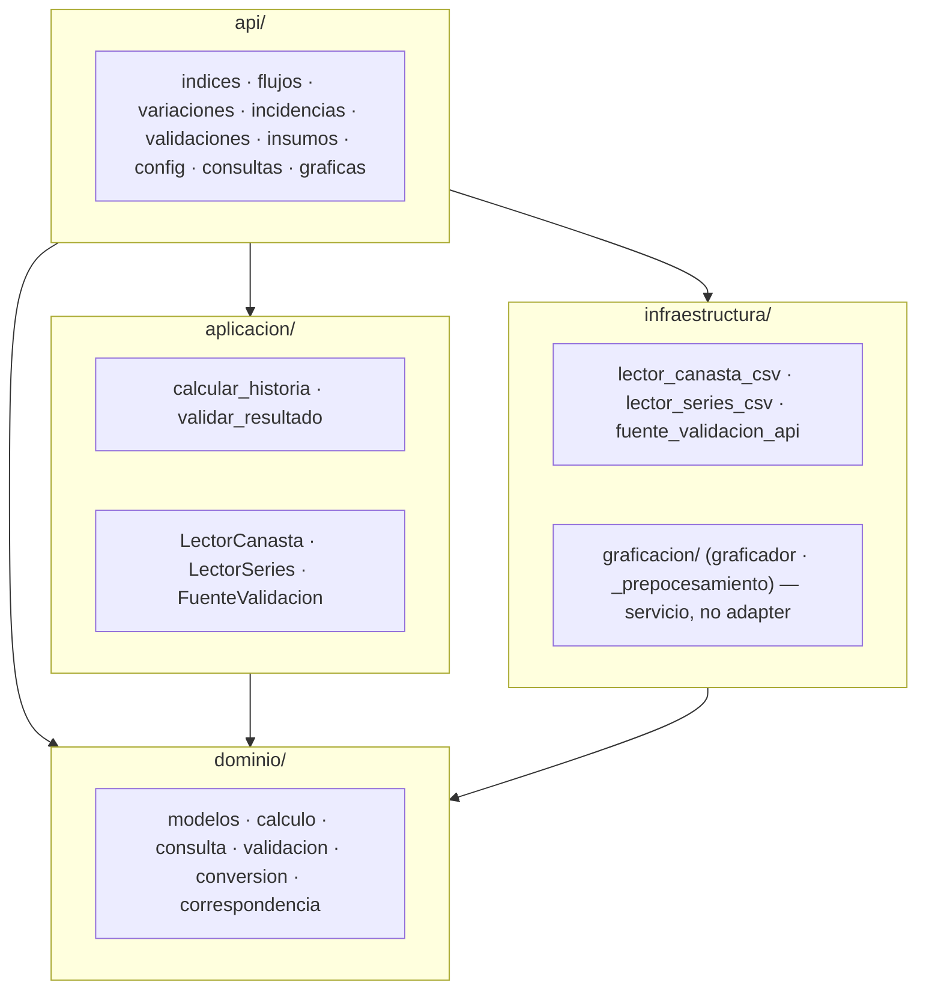
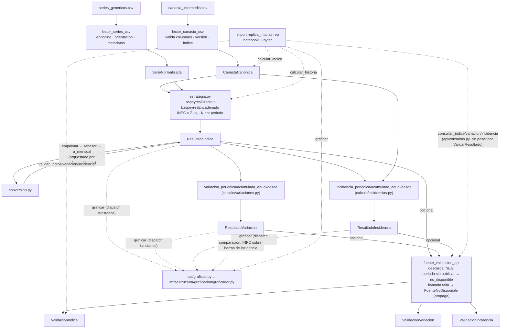

# Diseño del sistema — replica-inpc-mx

Documento vivo. Refleja el estado actual de las decisiones de diseño del sistema.
El historial de cambios vive en git.

---

## Índice

- [Diseño del sistema — replica-inpc-mx](#diseño-del-sistema--replica-inpc-mx)
  - [Índice](#índice)
  - [1. Arquitectura](#1-arquitectura)
    - [1.1 Patrón principal: Hexagonal (Ports \& Adapters)](#11-patrón-principal-hexagonal-ports--adapters)
    - [1.2 Patrones de diseño](#12-patrones-de-diseño)
      - [Strategy — cálculo del INPC](#strategy--cálculo-del-inpc)
      - [Facade — api/](#facade--api)
      - [Adapter — infraestructura](#adapter--infraestructura)
    - [1.3 Dirección de dependencias](#13-dirección-de-dependencias)
    - [1.4 Convenciones de código](#14-convenciones-de-código)
  - [2. Estructura del proyecto](#2-estructura-del-proyecto)
  - [3. Stack técnico](#3-stack-técnico)
  - [4. Flujo de datos](#4-flujo-de-datos)
  - [5. Dominio](#5-dominio)
    - [5.0 Mapa del dominio](#50-mapa-del-dominio)
    - [5.1 Semántica compartida](#51-semántica-compartida)
    - [5.2 Tipos compartidos](#52-tipos-compartidos)
    - [5.3 Periodos](#53-periodos)
    - [5.4 Modelos de entrada](#54-modelos-de-entrada)
    - [5.5 Modelo base](#55-modelo-base)
    - [5.6 Calculadores de índice](#56-calculadores-de-índice)
    - [5.7 ResultadoIndice](#57-resultadoindice)
    - [5.8 Resultados derivados](#58-resultados-derivados)
    - [5.9 Modelos de validación](#59-modelos-de-validación)
    - [5.10 Conversión y combinación](#510-conversión-y-combinación)
    - [5.11 Cálculo de variaciones e incidencias](#511-cálculo-de-variaciones-e-incidencias)
    - [5.12 Funciones de consulta](#512-funciones-de-consulta)
    - [5.13 Correspondencia](#513-correspondencia)
    - [5.14 Validación — validacion/](#514-validación--validacion)
    - [5.15 Errores](#515-errores)
  - [6. Fachada — api/](#6-fachada--api)
    - [6.1 config.py](#61-configpy)
    - [6.2 insumos.py](#62-insumospy)
    - [6.3 indices.py](#63-indicespy)
    - [6.4 variaciones.py](#64-variacionespy)
    - [6.5 incidencias.py](#65-incidenciaspy)
    - [6.6 validaciones.py](#66-validacionespy)
    - [6.7 flujos.py](#67-flujospy)
    - [6.8 consultas.py](#68-consultaspy)
  - [7. Aplicación](#7-aplicación)
    - [7.1 Puertos](#71-puertos)
    - [7.2 Casos de uso](#72-casos-de-uso)
  - [8. Infraestructura](#8-infraestructura)
    - [8.1 lector\_canasta\_csv](#81-lector_canasta_csv)
    - [8.2 lector\_series\_csv](#82-lector_series_csv)
    - [8.3 fuente\_validacion\_api](#83-fuente_validacion_api)
  - [9. Estrategia de errores](#9-estrategia-de-errores)
    - [9.1 Jerarquía de excepciones](#91-jerarquía-de-excepciones)
    - [9.2 Propagación](#92-propagación)
    - [9.3 Traducción en adaptadores](#93-traducción-en-adaptadores)
  - [10. Estrategia de testing](#10-estrategia-de-testing)
    - [10.1 Tipos de test](#101-tipos-de-test)
    - [10.2 Fixtures](#102-fixtures)
    - [10.3 Mock de la API del INEGI](#103-mock-de-la-api-del-inegi)
    - [10.4 Criterio de suficiencia](#104-criterio-de-suficiencia)
  - [11. Decisiones de diseño](#11-decisiones-de-diseño)
    - [11.1 `SerieNormalizada` en formato ancho](#111-serienormalizada-en-formato-ancho)
    - [11.2 pandas en el dominio](#112-pandas-en-el-dominio)
    - [11.3 `ponderador` y `encadenamiento` como `str`](#113-ponderador-y-encadenamiento-como-str)
    - [11.4 `Periodo` como tipo propio](#114-periodo-como-tipo-propio)
    - [11.5 Categorías de clasificación version-específicas](#115-categorías-de-clasificación-version-específicas)
    - [11.6 Tolerancia numérica por versión](#116-tolerancia-numérica-por-versión)
    - [11.7 Reglas de `estado_calculo`](#117-reglas-de-estado_calculo)
    - [11.8 Validación desacoplada del I/O — firma del comparador y ubicación del puerto](#118-validación-desacoplada-del-io--firma-del-comparador-y-ubicación-del-puerto)
    - [11.9 `id_corrida` eliminado (`ManifestCalculo` y `ManifestDerivado`)](#119-id_corrida-eliminado-manifestcalculo-y-manifestderivado)
    - [11.10 `INDICES_VALIDABLES` en el dominio](#1110-indices_validables-en-el-dominio)
    - [11.11 Cache de clase en `FuenteValidacionApi`](#1111-cache-de-clase-en-fuentevalidacionapi)
    - [11.12 UTF-8 como primer encoding en `LectorSeriesCsv`](#1112-utf-8-como-primer-encoding-en-lectorseriescsv)
    - [11.13 Dispatch interno en `CalculadorBase`](#1113-dispatch-interno-en-calculadorbase)
    - [11.14 Vectorización del loop interno de `validacion/indices.py`](#1114-vectorización-del-loop-interno-de-validacionindicespy)
    - [11.15 `LaspeyresEncadenado` — derivación de `f_h`](#1115-laspeyresencadenado--derivación-de-f_h)
      - [Primer enfoque (descartado): media ponderada con ponderadores nuevos](#primer-enfoque-descartado-media-ponderada-con-ponderadores-nuevos)
      - [Enfoque final: empalme desde el resultado de la versión anterior](#enfoque-final-empalme-desde-el-resultado-de-la-versión-anterior)
    - [11.16 Imputación de faltantes en series (`bfill→ffill`, estado `"rellenado"`)](#1116-imputación-de-faltantes-en-series-bfillffill-estado-rellenado)
    - [11.17 `empalmar` — combinación histórica y topología PATH](#1117-empalmar--combinación-histórica-y-topología-path)
    - [11.18 `RENOMBRES_INDICES` y normalización cross-versión](#1118-renombres_indices-y-normalización-cross-versión)
    - [11.19 `rebasar` — huérfanos con `UserWarning`](#1119-rebasar--huérfanos-con-userwarning)
    - [11.20 Re-export de errores y tipos en `replica_inpc/__init__.py`](#1120-re-export-de-errores-y-tipos-en-replica_inpc__init__py)
    - [11.21 `a_mensual` — filtrado de manifiestos huérfanos](#1121-a_mensual--filtrado-de-manifiestos-huérfanos)
    - [11.22 `ManifestCalculo` — proveniencia vía `DataFrame.attrs`, rutas y fecha](#1122-manifestcalculo--proveniencia-vía-dataframeattrs-rutas-y-fecha)
    - [11.23 `indice_incidencia` y de-encadenamiento de incidencias](#1123-indice_incidencia-y-de-encadenamiento-de-incidencias)
    - [11.24 Columnas de clasificación y `tipo` normalizados a mayúsculas](#1124-columnas-de-clasificación-y-tipo-normalizados-a-mayúsculas)
  - [12. Gaps conocidos](#12-gaps-conocidos)
    - [12.1 Validación por niveles en `LectorCanastaCsv`](#121-validación-por-niveles-en-lectorcanastacsv)
    - [12.2 Detección dinámica del header en `LectorSeriesCsv`](#122-detección-dinámica-del-header-en-lectorseriescsv)
    - [12.3 Catalogación incompleta de `RENOMBRES_INDICES` para 2010 y 2013](#123-catalogación-incompleta-de-renombres_indices-para-2010-y-2013)
    - [12.4 Tool de ponderadores — bugs propios pendientes](#124-tool-de-ponderadores--bugs-propios-pendientes)

---

## 1. Arquitectura

### 1.1 Patrón principal: Hexagonal (Ports & Adapters)

El dominio y los casos de uso no conocen CSV, filesystem ni APIs.
Solo conocen contratos (puertos). La infraestructura implementa esos contratos mediante adaptadores.

Esto permite agregar nuevas fuentes de entrada o formatos de salida sin modificar la lógica de negocio.

**Capas:**

| Capa               | Responsabilidad                                     |
| ------------------ | --------------------------------------------------- |
| `api/`             | Fachada pública — punto de entrada desde notebooks  |
| `dominio/`         | Lógica de negocio pura, sin dependencias externas   |
| `aplicacion/`      | Casos de uso y contratos de puertos (Protocols)     |
| `infraestructura/` | Adaptadores concretos (CSV, API INEGI)              |


```mermaid
graph TD
    subgraph API["api/"]
        A["indices · flujos · variaciones · incidencias · validaciones · insumos · config · consultas · graficas"]
    end
    subgraph APP["aplicacion/"]
        B["calcular_historia · validar_resultado"]
        C["LectorCanasta · LectorSeries · FuenteValidacion"]
    end
    subgraph DOM["dominio/"]
        D["modelos · calculo · consulta · validacion · conversion · correspondencia"]
    end
    subgraph INFRA["infraestructura/"]
        E["lector_canasta_csv · lector_series_csv · fuente_validacion_api"]
        F["graficacion/ (graficador · _prepocesamiento) — servicio, no adapter"]
    end

    API --> DOM
    API --> APP
    API --> INFRA
    APP --> DOM
    INFRA --> DOM
```

### 1.2 Patrones de diseño

#### Strategy — cálculo del INPC

`laspeyres_directo.py` y `laspeyres_encadenado.py` implementan la misma interfaz `CalculadorBase`.
`estrategia.py` selecciona el calculador exclusivamente por `canasta.version`:

| Versión | Calculador |
| ------- | ---------- |
| 2010, 2018 | `LaspeyresDirecto` |
| 2013 | `LaspeyresEncadenadoT1` |
| 2024 | `LaspeyresEncadenadoT2` |

Las versiones encadenadas normalizan cada índice por `f_k` (columna `encadenamiento` de la canasta) y aplican un `factor_h` de empalme al resultado. Las fórmulas exactas y la derivación de `f_k` están en §5.6 y §11.16.

Agregar una nueva variante de cálculo no requiere modificar el código existente.

#### Facade — api/

`api/` expone funciones flat estilo pandas. Toda la superficie pública se importa
directamente desde `replica_inpc` — los submódulos (`api/indices.py`, etc.) son
implementación interna:

```python
import replica_inpc as rep

canasta   = rep.cargar_canasta("data/canasta_2018.csv", version=2018)
serie     = rep.cargar_serie("data/series_2018.csv", version=2018)
resultado = rep.calcular_indice(canasta, serie, tipo="INPC")
```

#### Adapter — infraestructura

Los adaptadores propiamente dichos implementan cada uno un puerto de `aplicacion/puertos/`:

- `lector_canasta_csv.py` implementa `LectorCanasta`
- `lector_series_csv.py` implementa `LectorSeries`
- `fuente_validacion_api.py` implementa `FuenteValidacion`

`infraestructura/graficacion/` (`graficador.py`, `_prepocesamiento.py`) no es un adapter: no
existe puerto `Graficador` en `aplicacion/puertos/`. Es un servicio concreto que `api/graficas.py`
consume directamente. `infraestructura/filesystem/` existe y está vacío.

### 1.3 Dirección de dependencias

Las dependencias apuntan siempre hacia el dominio. El dominio nunca importa de capas externas.

| Capa               | Puede importar de                              |
| ------------------ | ---------------------------------------------- |
| `dominio/`         | stdlib, pandas, numpy — nada más               |
| `aplicacion/`      | `dominio/`                                     |
| `infraestructura/` | `dominio/`                                     |
| `api/`             | `dominio/`, `aplicacion/`, `infraestructura/`  |

Violar esta regla rompe el aislamiento del dominio y hace que los contratos dependan de detalles de implementación.

### 1.4 Convenciones de código

| Convención | Regla |
| --- | --- |
| Errores de dominio | `InvarianteViolado`, nunca `ValueError` |
| `ponderador`, `encadenamiento` | `str` en `CanastaCanonica`; `astype(float)` solo al calcular |
| `_repr_html_` | siempre `# type: ignore[operator]` (bug en stubs de pandas) |
| Warnings al usuario | `warnings.warn(msg, UserWarning, stacklevel=2)` (§5.10: `empalmar`/`rebasar`); nunca `print` |
| Módulos privados (`_*.py`) | internos a su paquete; no importar desde fuera — excepción: `dominio/calculo/_temporal.py::es_mensual`, consumido desde `infraestructura/graficacion/graficador.py` y `api/graficas.py` |

---

## 2. Estructura del proyecto

```text
replica-inpc-mx/
├── src/
│   └── replica_inpc/
│       ├── __init__.py
│       ├── api/
│       │   ├── __init__.py
│       │   ├── config.py
│       │   ├── consultas.py
│       │   ├── flujos.py
│       │   ├── graficas.py
│       │   ├── incidencias.py
│       │   ├── indices.py
│       │   ├── insumos.py
│       │   ├── validaciones.py
│       │   └── variaciones.py
│       ├── aplicacion/
│       │   ├── __init__.py
│       │   ├── casos_uso/
│       │   │   ├── __init__.py
│       │   │   ├── calcular_historia.py
│       │   │   └── validar_resultado.py
│       │   └── puertos/
│       │       ├── __init__.py
│       │       ├── fuente_validacion.py
│       │       ├── lector_canasta.py
│       │       └── lector_series.py
│       ├── dominio/
│       │   ├── __init__.py
│       │   ├── calculo/
│       │   │   ├── __init__.py
│       │   │   ├── _temporal.py
│       │   │   ├── base.py
│       │   │   ├── estrategia.py
│       │   │   ├── incidencias.py
│       │   │   ├── laspeyres_directo.py
│       │   │   ├── laspeyres_encadenado.py
│       │   │   └── variaciones.py
│       │   ├── consulta/
│       │   │   ├── __init__.py
│       │   │   ├── _comun.py
│       │   │   ├── incidencias.py
│       │   │   └── variaciones.py
│       │   ├── conversion.py
│       │   ├── correspondencia_canastas.py
│       │   ├── errores.py
│       │   ├── modelos/
│       │   │   ├── __init__.py
│       │   │   ├── base.py
│       │   │   ├── canasta.py
│       │   │   ├── incidencia.py
│       │   │   ├── indice.py
│       │   │   ├── serie.py
│       │   │   ├── validacion.py
│       │   │   └── variacion.py
│       │   ├── periodos.py
│       │   ├── tipos.py
│       │   └── validacion/
│       │       ├── __init__.py
│       │       ├── _comun.py
│       │       ├── incidencias.py
│       │       ├── indices.py
│       │       └── variaciones.py
│       └── infraestructura/
│           ├── __init__.py
│           ├── csv/
│           │   ├── __init__.py
│           │   ├── _utils.py
│           │   ├── lector_canasta_csv.py
│           │   └── lector_series_csv.py
│           ├── filesystem/         # vacío
│           ├── graficacion/
│           │   ├── __init__.py
│           │   ├── graficador.py
│           │   └── _prepocesamiento.py
│           └── inegi/
│               ├── __init__.py
│               └── fuente_validacion_api.py
├── demo/                   # Archivos de Preview de como funciona el proyecto
├── guias/                  # Archivos de como descargar los insumos del INEGI
├── tools/                  # Capeta que contiene la herramietna de extraccion de ponderadorres
│   ├── canasta_inpc/
│   ├── generar_canasta.py
│   └── uso_generar_canasta.md
├── tests/
│   ├── unit/
│   ├── integration/
│   └── fixtures/
├── docs/
├── pyproject.toml
└── README.md
```

---

## 3. Stack técnico

| Componente      | Decisión                    | Razón                                                        |
| --------------- | --------------------------- | ------------------------------------------------------------ |
| Python          | >=3.10                      | Union syntax `X \| Y` en type hints requiere 3.10            |
| DataFrames      | pandas                      | Notebook-first, display automático en Jupyter                |
| Numérico        | numpy                       | Operaciones vectorizadas en el cálculo                       |
| Correspondencia | re (stdlib)                 | Normalización exacta genérico↔genérico (tablas `RENOMBRES_*` + patrón de código) |
| HTTP            | requests                    | Simple, sin necesidad de async                               |
| Testing         | pytest                      | Estándar de facto en Python                                  |
| Linting         | ruff                        | Rápido, reemplaza flake8 + isort + pyupgrade en un solo tool |
| Tipos           | mypy + pandas-stubs         | Type checking estático; stubs cubren la API de pandas        |
| Visualización   | plotnine                    | Presente en el proyecto de referencia                        |
| Columnar        | pyarrow                     | Presente en el proyecto de referencia                        |
| Empaquetado     | setuptools + pyproject.toml | Estándar moderno, src layout                                 |

**Dependencias runtime** (`[project.dependencies]` en `pyproject.toml`):
pandas, numpy, requests, python-dateutil, plotnine, mizani, pyarrow, ipython, jupyter, ipykernel

**Dependencias de desarrollo** (`[project.optional-dependencies.dev]`):
pytest, pytest-mock, ruff, mypy, pandas-stubs, types-requests

**Dependencias de ponderadores** (`[project.optional-dependencies.ponderadores]`):
openpyxl

**Dependencia nativa** (extracción de pdf, instalada vía `conda-forge`, no vía pip):
pdftotext

---

## 4. Flujo de datos


```mermaid
flowchart TD
    CSV1[canasta_intermedia.csv]
    CSV2[series_genericos.csv]

    CSV1 --> LCC["lector_canasta_csv<br/>valida columnas · versión · índice"]
    CSV2 --> LSC["lector_series_csv<br/>encoding · orientación · metadatos"]

    LCC --> CC[CanastaCanonica]
    LSC --> SN[SerieNormalizada]

    CC & SN --> EST["estrategia.py<br/>LaspeyresDirecto o LaspeyresEncadenado<br/>INPC = Σ ωₖ · Iₖ por periodo"]

    EST --> RI[ResultadoIndice]

    RI -->|"empalmar → rebasar → a_mensual<br/>(orquestado por calcular_historia)"| CONV[conversion.py]
    CONV --> RI

    RI --> VARF["variacion_periodica/acumulada_anual/desde<br/>(calculo/variaciones.py)"]
    VARF --> RV[ResultadoVariacion]

    RI & CC --> INCF["incidencia_periodica/acumulada_anual/desde<br/>(calculo/incidencias.py)"]
    INCF --> RIC[ResultadoIncidencia]

    RI -->|opcional| FVAPI["fuente_validacion_api<br/>descarga INEGI<br/>periodo sin publicar → no_disponible<br/>llamada falla → FuenteNoDisponible (propaga)"]
    RV -->|opcional| FVAPI
    RIC -->|opcional| FVAPI

    FVAPI --> VAL[ValidacionIndice]
    FVAPI --> VALV[ValidacionVariacion]
    FVAPI --> VALI[ValidacionIncidencia]

    RI & RV & RIC -.->|"graficar (dispatch isinstance)"| GRAF["api/graficas.py →<br/>infraestructura/graficacion/graficador.py"]
    RV -.->|"comparación: INPC sobre barras de incidencia"| GRAF

    NB["import replica_inpc as rep<br/>notebook Jupyter"]
    NB -.->|calcular_indice| CC
    NB -.->|calcular_historia| EST
    NB -.->|validar_indice/variacion/incidencia| VAL
    NB -.->|"consultar_indice/variacion/incidencia<br/>(api/consultas.py, sin pasar por ValidarResultado)"| FVAPI
    NB -.->|graficar| GRAF
```

`calcular_historia` orquesta internamente carga → cálculo por versión → empalme → rebase → conversión de frecuencia en una sola llamada (`conversion.py`, nodo `CONV`). `calcular_indice` expone cada paso por separado, sin pasar por `conversion.py`.

Validación no es exclusiva de índices: `ResultadoVariacion` y `ResultadoIncidencia` se validan contra INEGI por el mismo `FuenteValidacionApi`, vía `ValidarResultado`. `api/consultas.py` es un camino aparte que llama a `FuenteValidacionApi` directo, sin pasar por el caso de uso ni por ningún cálculo propio — consulta la serie oficial de INEGI, no la réplica.

---

## 5. Dominio

`dominio/` contiene lógica de negocio pura: sin IO, sin infraestructura, sin orquestación. El dominio recibe `Periodo*` — nunca strings de periodo.

Dos jerarquías de contratos: `Resultado` (cálculo) y `Validacion` (comparación contra INEGI). `ValidacionX` compone un `ResultadoX`; no hereda de `Resultado`. Invariantes lanzan `InvarianteViolado`, nunca `ValueError`.

---

### 5.0 Mapa del dominio

| Módulo | Exporta |
| ------ | ------- |
| `periodos.py` | `PeriodoQuincenal`, `PeriodoMensual`, `periodo_desde_str` |
| `errores.py` | jerarquía de excepciones; `InvarianteViolado` |
| `tipos.py` | `VersionCanasta`, `TIPO_INPC`, `COLUMNAS_CLASIFICACION`, `INDICES_VALIDABLES`, `RANGOS_CANASTAS`, `ManifestCalculo`, `ManifestDerivado` |
| `correspondencia_canastas.py` | `RENOMBRES_GENERICOS`, `RENOMBRES_INDICES`, `ORDEN_VERSIONES`, `construir_mapa_renombre`, `renombrar_valor` |
| `conversion.py` | `empalmar`, `rebasar`, `a_mensual` |
| `modelos/base.py` | `Resultado` (ABC), `Validacion` (ABC), `Vista` |
| `modelos/canasta.py` | `CanastaCanonica` |
| `modelos/serie.py` | `SerieNormalizada` |
| `modelos/indice.py` | `ResultadoIndice` |
| `modelos/variacion.py` | `ResultadoVariacion` |
| `modelos/incidencia.py` | `ResultadoIncidencia` |
| `modelos/validacion.py` | `ValidacionIndice`, `ValidacionVariacion`, `ValidacionIncidencia` |
| `calculo/base.py` | `CalculadorBase` |
| `calculo/estrategia.py` | `para_canasta` |
| `calculo/laspeyres_directo.py` | `LaspeyresDirecto` |
| `calculo/laspeyres_encadenado.py` | `LaspeyresEncadenadoT1`, `LaspeyresEncadenadoT2` |
| `calculo/variaciones.py` | `variacion_periodica`, `variacion_acumulada_anual`, `variacion_desde` |
| `calculo/incidencias.py` | `incidencia_periodica`, `incidencia_acumulada_anual`, `incidencia_desde` |
| `consulta/variaciones.py` | `inflacion_en`, `inflacion_acumulada`, `inflacion_promedio`, `inflacion_maxima`, `inflacion_minima` |
| `consulta/incidencias.py` | `incidencia_en`, `incidencia_acumulada`, `incidencia_promedio`, `mayor_incidencia`, `menor_incidencia` |
| `validacion/indices.py` | `validar_indices` — llamada desde `aplicacion/casos_uso/validar_resultado.py` |
| `validacion/variaciones.py` | `validar_variaciones`, `resolver_tipo_variacion_inegi` — llamadas desde `aplicacion/casos_uso/validar_resultado.py` |
| `validacion/incidencias.py` | `validar_incidencias`, `resolver_tipo_incidencia_inegi` — llamadas desde `aplicacion/casos_uso/validar_resultado.py` |

---

### 5.1 Semántica compartida

**Propiedades compartidas por `Resultado*` y `Validacion*`**

| Propiedad | Semántica |
| --------- | --------- |
| `.resumen` | vista agregada; inspección rápida del estado del contrato |
| `.reporte` | detalle de la unidad de análisis relevante |
| `.diagnostico` | anomalías, faltantes o combinaciones no verificables |

**Propiedades de `Resultado`**

| Propiedad | Tipo | Semántica |
| --------- | ---- | --------- |
| `.df` | `pd.DataFrame` | resultado mínimo; solo columna calculada en formato largo |
| `.resultado` | `Vista` | resultado completo con metadata; expone `.largo` y `.ancho` |
| `.resultado.largo` | `pd.DataFrame` | DataFrame completo con metadata en formato largo |
| `.resultado.ancho` | `pd.DataFrame` | columna calculada pivoteada por periodo; filas = índice, columnas = periodo |
| `.pipe(fn, *args, **kwargs)` | callable | encadenamiento estilo pandas sobre el objeto resultado |
| `_repr_html_()` | HTML | representación rica en notebooks |

`Vista` envuelve un DataFrame con MultiIndex `(periodo, indice)` y materializa `.largo` y `.ancho` bajo demanda. `.resultado.ancho` usa `unstack("periodo")`.

**Propiedades de `Validacion`**

Sin `.df` y sin `.pipe()` — validaciones son terminales; no se encadenan.

| Propiedad | Tipo | Semántica |
| --------- | ---- | --------- |
| `.resultado` | `Vista` | comparación replicado vs INEGI; columnas covariantes por subclase |
| `.resultado.ancho` | `pd.DataFrame` | filas = MultiIndex `(indice, <métrica>)` (segundo nivel sin nombre — `columns.name` no se setea en el código), columnas = periodo |

**Catálogo `estado_calculo` — `ResultadoIndice`**

| Valor | Significado |
| ----- | ----------- |
| `ok` | todas las quincenas disponibles; cálculo completo |
| `rellenado` | ≥1 genérico con NaN sustituido por bfill→ffill; cálculo procede con dato aproximado |
| `parcial` | solo una quincena disponible en el mes; cálculo procede con calidad reducida |
| `sin_datos` | sin datos de entrada para `(periodo, indice)`; columna calculada = NaN |
| `fallida` | cálculo intentado y fallido por error interno; columna calculada = NaN |

Severidad en `.resumen`: `fallida` > `sin_datos` > `parcial` > `rellenado` > `ok`.

**Catálogo `estado_calculo` — derivados (`ResultadoVariacion`, `ResultadoIncidencia`)**

| Valor | Significado |
| ----- | ----------- |
| `ok` | todos los periodos fuente tenían `estado_calculo != parcial` |
| `parcial` | ≥1 periodo fuente tenía `estado_calculo = parcial` |

Fuentes con `sin_datos` o `fallida` producen combinaciones **ausentes** del derivado — NaN implícito en `.resultado.ancho`. Fuentes con `rellenado` producen `ok` en el derivado (la degradación queda trazada en el fuente, no propagada).

**Contrato NaN**

| Clase | Filas con `sin_datos`/`fallida` en `.df` | NaN en columna calculada |
| ----- | ---------------------------------------- | ------------------------ |
| `ResultadoIndice` | sí — todas las combinaciones intentadas | explícito |
| `ResultadoVariacion`, `ResultadoIncidencia` | no — solo combinaciones computables | implícito en `.resultado.ancho` |

`ResultadoIndice` conserva trazabilidad de intentos fallidos. Los derivados no tienen fila para combinaciones no computables.

---

### 5.2 Tipos compartidos

Definidos en `tipos.py`. Sin lógica de negocio — estructuras puras compartidas entre dominio, aplicación y API.

**`VersionCanasta`**

```python
VersionCanasta = Literal[2010, 2013, 2018, 2024]
```

Alias de tipo. Reemplaza `int` en todos los contratos que aceptan versión de canasta.

**`TIPO_INPC`**

```python
TIPO_INPC: str = "INPC"
```

Constante para el valor de `tipo` que representa el índice agregado (no una columna de clasificación). `tipo` se normaliza a mayúsculas en el boundary de entrada (`api/`), así que `TIPO_INPC` y las entradas de `COLUMNAS_CLASIFICACION` comparten un único vocabulario, todo en mayúsculas. El string `"INPC"` es el valor que aparece en `.df.index.get_level_values("indice")`.

**`COLUMNAS_CLASIFICACION`**

```python
COLUMNAS_CLASIFICACION: frozenset[str] = frozenset({
    "COG", "CCIF DIVISION", "CCIF GRUPO", "CCIF CLASE",
    "INFLACION COMPONENTE", "INFLACION SUBCOMPONENTE", "INFLACION AGRUPACION",
    "SCIAN SECTOR", "SCIAN RAMA", "DURABILIDAD", "CANASTA BASICA",
    "CANASTA CONSUMO MINIMO",
})
```

Columnas de `CanastaCanonica` válidas como `tipo` para calcular subíndices. Cuando `tipo in COLUMNAS_CLASIFICACION`, el calculador hace split por categoría; el nivel `indice` de cada fila = valor de la categoría (ej. `"subyacente"`).

**`INDICES_VALIDABLES`**

```python
INDICES_VALIDABLES: frozenset[str] = frozenset(
    {"INPC", "INFLACION COMPONENTE", "INFLACION SUBCOMPONENTE"}
)
```

Tipos con series publicadas por el INEGI comparables directamente. Solo estos pueden pasarse a `validar_indices`, `validar_variaciones`, `validar_incidencias`.

**`RANGOS_CANASTAS`**

```python
RANGOS_CANASTAS: dict[VersionCanasta, tuple[PeriodoQuincenal, PeriodoQuincenal | None]] = {
    2010: (PeriodoQuincenal(2010, 12, 2), PeriodoQuincenal(2013, 3, 2)),
    2013: (PeriodoQuincenal(2013, 3, 2), PeriodoQuincenal(2018, 7, 2)),
    2018: (PeriodoQuincenal(2018, 7, 2), PeriodoQuincenal(2024, 7, 2)),
    2024: (PeriodoQuincenal(2024, 7, 2), None),
}
```

Periodos válidos por versión de canasta. `None` como fin = hasta el último periodo disponible. Usado en `calculo/base.py` para recortar `SerieNormalizada` antes del cálculo.

**`ManifestCalculo`**

Trazabilidad de una corrida elemental sobre una sola canasta. `empalmar` concatena listas de `ManifestCalculo` sin colapsarlas.

| Campo | Tipo | Notas |
| ----- | ---- | ----- |
| `version` | `VersionCanasta` | versión de canasta usada en el tramo |
| `tipo` | `str` | tipo de índice calculado |
| `calculador` | `Literal[...]` | `"LaspeyresDirecto"`, `"LaspeyresEncadenadoT1"`, `"LaspeyresEncadenadoT2"` |
| `ruta_canasta` | `Path \| None` | origen físico, leído de `canasta.df.attrs.get("origen")`; `None` cuando la canasta se construyó en memoria (sin pasar por un loader) |
| `ruta_series` | `Path \| None` | origen físico, leído de `serie.df.attrs.get("origen")`; `None` cuando la serie se construyó en memoria |
| `fecha` | `datetime` | marca temporal; capturada al inicio de `calcular()`, no al construir el manifiesto |

Sin invariantes en construcción.

**`ManifestDerivado`**

Trazabilidad de un resultado derivado. Terminal — no combinable vía `empalmar`.

| Campo | Tipo | Notas |
| ----- | ---- | ----- |
| `versiones` | `list[VersionCanasta]` | versiones de canasta que contribuyeron al derivado |
| `tipo` | `str` | tipo de índice derivado |
| `clase` | `str` | clase del derivado; ver catálogo en secciones 5.8 y 5.9 |
| `descripcion` | `str` | no vacío cuando `clase = "desde"`; vacío en otros casos |
| `fecha` | `datetime` | marca temporal; default `datetime.now()` |

Invariantes:
- `clase` no vacío → `InvarianteViolado` si no

---

### 5.3 Periodos

Definidos en `periodos.py`. Value objects sortables, hashables y convertibles a `pd.Timestamp`. Usados como claves del MultiIndex en `ResultadoIndice`, como columnas de `SerieNormalizada` y como argumentos en funciones de variación e incidencia.

El dominio recibe siempre objetos `Periodo*` — nunca strings. La conversión de strings a periodos ocurre en la API pública, que delega en `desde_str`/`periodo_desde_str` (dominio) — insensibles a mayúsculas de forma nativa, no por normalización externa.

**`PeriodoQuincenal`**

Tripleta `(año, mes, quincena)`. Orden natural: `(año, mes, quincena)`.

```python
PeriodoQuincenal(2024, 7, 2)  # → "2Q Jul 2024"
```

| Atributo / método | Tipo | Notas |
| --- | --- | --- |
| `año`, `mes`, `quincena` | `int` | atributos de instancia |
| `__str__` | `str` | `"1Q Ene 2024"` |
| `__repr__` | `str` | `"PeriodoQuincenal(2024, 1, 1)"` |
| `.desde_str(texto)` | classmethod → `PeriodoQuincenal` | texto en formato `"1Q Mes AAAA"`, insensible a mayúsculas; lanza `PeriodoNoInterpretable` si el texto no es interpretable, `InvarianteViolado` si es interpretable pero algún componente está fuera de rango |
| `.to_timestamp()` | `pd.Timestamp` | 1Q → día 15 del mes; 2Q → último día del mes |

Constructor lanza `InvarianteViolado` si `quincena ∉ {1, 2}`, `mes ∉ 1–12` o `año ≤ 0` (ver §1.4).

**`PeriodoMensual`**

Par `(año, mes)`. Orden natural: `(año, mes)`. Producido exclusivamente por `a_mensual()` — nunca es input del calculador ni de `LectorSeriesCsv`.

```python
PeriodoMensual(2024, 7)  # → "Jul 2024"
```

| Atributo / método | Tipo | Notas |
| --- | --- | --- |
| `año`, `mes` | `int` | atributos de instancia |
| `__str__` | `str` | `"Jul 2024"` |
| `__repr__` | `str` | `"PeriodoMensual(2024, 7)"` |
| `.desde_str(texto)` | classmethod → `PeriodoMensual` | texto en formato `"Mes AAAA"`, insensible a mayúsculas; lanza `PeriodoNoInterpretable` si el texto no es interpretable, `InvarianteViolado` si es interpretable pero algún componente está fuera de rango |
| `.to_timestamp()` | `pd.Timestamp` | último día del mes |

Constructor lanza `InvarianteViolado` si `mes ∉ 1–12` o `año ≤ 0` (ver §1.4).

Comparación de orden cross-type (`PeriodoQuincenal` vs `PeriodoMensual`, `<`/`<=`/`>`/`>=`) → `NotImplemented` → `TypeError` en runtime; `==` entre tipos distintos → `False` (sin excepción). Un `ResultadoIndice` nunca mezcla los dos tipos en su índice — por construcción (calculadores y `a_mensual` producen un solo tipo) y por la guardia de `empalmar` (`InvarianteViolado` si mezcla quincenal y mensual), no por un invariante del propio constructor de `ResultadoIndice`.

**`periodo_desde_str`**

```python
def periodo_desde_str(texto: str) -> PeriodoQuincenal | PeriodoMensual: ...
```

Detecta el formato por número de palabras: 3 palabras → `PeriodoQuincenal`; 2 palabras → `PeriodoMensual`. Lanza `PeriodoNoInterpretable` si el texto no encaja en ninguno; `InvarianteViolado` propaga sin envolver si el texto encaja pero algún componente está fuera de rango.

```python
periodo_desde_str("1Q Ene 2024")  # → PeriodoQuincenal(2024, 1, 1)
periodo_desde_str("Ene 2024")     # → PeriodoMensual(2024, 1)
```

**Convención `to_timestamp()`**

| Tipo | Regla | Ejemplo |
| ---- | ----- | ------- |
| `PeriodoQuincenal(año, mes, 1)` | día 15 del mes | `1Q Ene 2024` → 15 Ene 2024 |
| `PeriodoQuincenal(año, mes, 2)` | último día del mes | `2Q Ene 2024` → 31 Ene 2024 |
| `PeriodoMensual(año, mes)` | último día del mes | `Ene 2024` → 31 Ene 2024 |

Regla unificada: "último día del periodo". Que `2Q` y mensual del mismo mes coincidan en timestamp no es problema — `ResultadoIndice` es siempre homogéneo y nunca mezcla los dos tipos (por construcción y por la guardia de `empalmar`, no por invariante propio).

---

### 5.4 Modelos de entrada

Contratos de datos que alimentan el calculador. Sin lógica de cálculo — solo representación y validación estructural.

**`CanastaCanonica`**

DataFrame-backed. Índice: `generico` (str). Encapsula la tabla de genéricos con sus ponderadores y metadatos de clasificación. `ponderador` y `encadenamiento` se conservan como `str` — se convierten con `astype(float)` solo al calcular (ver §1.4).

```python
CanastaCanonica(df, version=2018)
```

Propiedades:

| Propiedad | Tipo | Notas |
| --- | --- | --- |
| `.df` | `pd.DataFrame` | DataFrame interno; índice = `generico` |
| `.version` | `VersionCanasta` | solo lectura |
| `_repr_html_()` | HTML | display automático en Jupyter |

Esquema del DataFrame (índice: `generico`):

| Columna | dtype | Notas |
| --- | --- | --- |
| `ponderador` | `object` (str) | texto decimal exacto del archivo fuente |
| `encadenamiento` | `object` (str / NaN) | texto decimal exacto; NaN cuando no aplica |
| `COG` | `object` (str) | |
| `CCIF DIVISION` | `object` (str) | |
| `CCIF GRUPO` | `object` (str) | |
| `CCIF CLASE` | `object` (str) | |
| `INFLACION COMPONENTE` | `object` (str) | |
| `INFLACION SUBCOMPONENTE` | `object` (str) | |
| `INFLACION AGRUPACION` | `object` (str) | |
| `SCIAN SECTOR` | `object` (str) | número + nombre, ej. `"32 Industrias manufactureras"` |
| `SCIAN RAMA` | `object` (str) | código + nombre, ej. `"3241 Fabricación de..."` |
| `DURABILIDAD` | `object` (str) | vacío cuando no aplica a la versión |
| `CANASTA BASICA` | `object` (str) | `"X"` si pertenece; `"-"` si no; nunca vacío — disponible en las 4 versiones |
| `CANASTA CONSUMO MINIMO` | `object` (str / NaN) | `"X"` si pertenece; `"-"` si no (solo en 2024, la única versión donde existe la clasificación); `NaN` en 2010/2013/2018, donde no aplica |

Invariantes — validados al construir (lanza `InvarianteViolado`):

| Invariante | Regla |
| --- | --- |
| Versión válida | `version in {2010, 2013, 2018, 2024}` |
| Sin duplicados | índice sin valores repetidos |
| Genérico no vacío | ningún valor del índice es `""` |
| Ponderador positivo | `float(ponderador) > 0` para cada fila |
| Suma de ponderadores | `abs(sum(ponderadores) - 100) <= 1e-5` |
| Encadenamiento positivo | cuando no nulo: `float(encadenamiento) > 0` |
| Columnas core no vacías | `COG`, `INFLACION COMPONENTE`, `INFLACION SUBCOMPONENTE`, `INFLACION AGRUPACION`, `CANASTA BASICA` sin NaN ni `""` en ninguna fila — a diferencia de las clasificaciones finas (`CCIF GRUPO`/`CLASE`, `SCIAN SECTOR`/`RAMA`, `DURABILIDAD`, `CANASTA CONSUMO MINIMO`), que pueden faltar según versión o fuente de generación (ver `tools/canasta_inpc/esquema.py::FUENTES_POSIBLES`) |

**`SerieNormalizada`**

DataFrame-backed, formato ancho. Índice: `generico` (str). Columnas: objetos `PeriodoQuincenal`. Valores: `float64` o NaN. Las series de entrada son siempre quincenales — datos mensuales se obtienen solo vía `a_mensual(resultado)`, nunca cargando CSVs mensuales.

El constructor reordena las columnas cronológicamente (`sort_index(axis=1)`) aunque no lo pidan como argumento: el relleno bfill/ffill de `calculo/base.py::_rellenar_faltantes` opera por posición física de columna, no por valor de periodo — columnas fuera de orden propagarían el dato del vecino físico equivocado en vez del cronológico.

```python
SerieNormalizada(df)
```

Propiedades:

| Propiedad | Tipo | Notas |
| --- | --- | --- |
| `.df` | `pd.DataFrame` | DataFrame interno |
| `_repr_html_()` | HTML | display automático en Jupyter |

Esquema del DataFrame:

| Dimensión | Tipo | Notas |
| --- | --- | --- |
| Índice | `str` | `generico` |
| Columnas | `PeriodoQuincenal` | una columna por quincena |
| Valores | `float64` / NaN | NaN cuando falta el índice del genérico en ese periodo |

Invariantes — validados al construir (lanza `InvarianteViolado`):

| Invariante | Regla |
| --- | --- |
| Sin duplicados | índice sin valores repetidos |
| Genérico no vacío | ningún valor del índice es `""` |
| Al menos un periodo | al menos una columna |
| Columnas son `PeriodoQuincenal` | todas las columnas son instancias de `PeriodoQuincenal` |
| Sin periodos duplicados | columnas sin valores repetidos |
| Valores no negativos | todo valor numérico es ≥ 0 |
| Valores finitos | ningún valor es `inf`/`-inf` (NaN sí permitido) |

---

### 5.5 Modelo base

Clases abstractas en `modelos/base.py`. Definen el contrato compartido por todos los contratos de resultado y validación.

**`Vista`**

Envuelve un `pd.DataFrame` con MultiIndex `(periodo, indice)` y expone formato largo y ancho bajo demanda.

```python
Vista(df, ["indice_replicado"])  # columnas es obligatoria, sin default
```

| Propiedad | Tipo | Comportamiento |
| --- | --- | --- |
| `.largo` | `pd.DataFrame` | DataFrame completo con metadata |
| `.ancho` | `pd.DataFrame` | columna(s) pivoteadas por `periodo`; filas = `indice` si 1 columna; filas = MultiIndex `(indice, <métrica>)` (segundo nivel sin nombre) si N columnas |
| `_repr_html_()` | HTML | muestra `.largo` |

Sin invariantes en construcción.

**`Resultado` (ABC)**

Base de `ResultadoIndice`, `ResultadoVariacion` y `ResultadoIncidencia`. El constructor valida la estructura mínima del `df`; la subclase pasa solo la columna calculada.

```python
class MiResultado(Resultado):
    def __init__(self, df_completo, ...):
        super().__init__(df_completo[["columna_calculada"]])
        ...
```

Invariantes del constructor (lanza `InvarianteViolado`):

| Invariante | Regla |
| --- | --- |
| No vacío | `df` no puede estar vacío |
| MultiIndex exacto | `df.index` es MultiIndex de 2 niveles con nombres `["periodo", "indice"]` |
| Una sola columna | `df.shape[1] == 1` |
| Sin duplicados | `df.index` sin combinaciones repetidas |

Propiedades y métodos concretos:

| Miembro | Tipo | Notas |
| --- | --- | --- |
| `.df` | `pd.DataFrame` | resultado mínimo; solo columna calculada |
| `.pipe(fn, *args, **kwargs)` | `Any` | llama `fn(self, *args, **kwargs)`; encadenamiento estilo pandas |

Propiedades abstractas (cada subclase define su esquema):

| Miembro | Tipo |
| --- | --- |
| `.resultado` | `Vista` |
| `.resumen` | `pd.DataFrame` |
| `.reporte` | `pd.DataFrame` |
| `.diagnostico` | `pd.DataFrame` |
| `_repr_html_()` | `str` |

**`Validacion` (ABC)**

Base de `ValidacionIndice`, `ValidacionVariacion` y `ValidacionIncidencia`. Sin constructor propio — no hay invariantes de base.

Sin `.df` y sin `.pipe()` — validaciones son terminales; no se encadenan.

Propiedades abstractas (cada subclase define su esquema):

| Miembro | Tipo |
| --- | --- |
| `.resultado` | `Vista` |
| `.resumen` | `pd.DataFrame` |
| `.reporte` | `pd.DataFrame` |
| `.diagnostico` | `pd.DataFrame` |
| `_repr_html_()` | `str` |

---

### 5.6 Calculadores de índice

`calculo/` produce `ResultadoIndice`. Las implementaciones concretas son privadas a `calculo/`; el punto de entrada público es `para_canasta`.

**`CalculadorBase`**

Clase abstracta. Contrato único:

```python
def calcular(
    self,
    canasta: CanastaCanonica,
    serie: SerieNormalizada,
    tipo: str,
) -> ResultadoIndice:
```

`ruta_canasta`/`ruta_series` del `ManifestCalculo` resultante se leen de `canasta.df.attrs.get("origen")` y `serie.df.attrs.get("origen")` — no son parámetros; solo los loaders (`LectorCanastaCsv`, `LectorSeriesCsv`) los setean. `fecha` se captura con `datetime.now()` al inicio de `calcular()`, antes del cómputo.

`tipo` debe ser `TIPO_INPC` o estar en `COLUMNAS_CLASIFICACION` → `InvarianteViolado` si no. Cuando `tipo in COLUMNAS_CLASIFICACION`, el calculador divide la canasta por categoría y produce una fila por categoría; el nivel `indice` = valor de la categoría (ej. `"subyacente"`). Si `tipo in COLUMNAS_CLASIFICACION` pero la columna está 100% vacía en `canasta.df` (categoría fina sin fuente para esa versión — ver `FUENTES_POSIBLES` en `tools/canasta_inpc/esquema.py`) → `InvarianteViolado` también, en vez de agrupar en silencio sobre `NaN`.

**`para_canasta`**

Factory. Selecciona calculador según `canasta.version`:

| `version` | Calculador | Requiere `referencia_empalme_por_indice` |
| --- | --- | --- |
| 2010 | `LaspeyresDirecto` | no |
| 2013 | `LaspeyresEncadenadoT1` | sí — tramo anterior = 2010 |
| 2018 | `LaspeyresDirecto` | no |
| 2024 | `LaspeyresEncadenadoT2` | sí — tramo anterior = 2018 |

```python
para_canasta(canasta, referencia_empalme_por_indice={"INPC": 100.0, ...})
```

`referencia_empalme_por_indice` mapea nombre de índice → valor en el periodo de traslape. `None` = sin escalado (escala natural del cálculo).

**`LaspeyresDirecto`** (versiones 2010 y 2018)

Media ponderada simple por periodo:

```
resultado[t] = Σ(serie[t] · ponderador) / Σ(ponderador)
```

Si hay referencia de empalme:

```
factor_h = referencia / resultado[traslape]
resultado_final = resultado * factor_h
```

`traslape` = `RANGOS_CANASTAS[version][0]`, el inicio del rango de la versión (no un valor fijo por función).

**`LaspeyresEncadenadoT1`** (versión 2013)

`f_k[i]`: factor de encadenamiento del genérico `i` — normaliza su serie al periodo de traslape. Fuente: columna `encadenamiento` de la canasta. Si `encadenamiento[i]` es NaN, se deriva de la propia serie: `serie[i, 2Q Mar 2013] / 100`.

```
i_tramo  = Σ(serie[t] / f_k · ponderador) / Σ(ponderador)
factor_h = referencia / i_tramo[2Q Mar 2013]   si hay referencia
         = 1.0                                  si no
resultado = i_tramo * factor_h
```

**`LaspeyresEncadenadoT2`** (versión 2024)

`f_k[i]`: igual que T1 pero con traslape 2Q Jul 2024. La columna `encadenamiento` de la canasta 2024 ya contiene `I_k^{2Q Jul 2024} / 100`. Fallback si NaN: `serie[i, 2Q Jul 2024] / 100`.

```
i_tramo  = Σ(serie[t] / f_k · ponderador) / Σ(ponderador)   [igual a T1]
factor_h = referencia / 100                                   si hay referencia
         = Σ(ponderador · f_k) / Σ(ponderador)               si no
resultado = i_tramo * factor_h
```

**Preparación de la serie (compartida entre calculadores)**

Antes del cálculo cada calculador aplica en orden:

1. Recorta la `SerieNormalizada` al rango válido de la versión (`RANGOS_CANASTAS`).
2. Rellena NaN via `bfill→ffill` por fila; periodos afectados → `estado_calculo = "rellenado"`.
3. Periodos con NaN irrellenable → `estado_calculo = "sin_datos"`, `indice_replicado = NaN`.

Catálogo `estado_calculo` completo en [5.1](#51-semántica-compartida).

**Columna `indice_incidencia`.** Junto a `indice_replicado`, cada calculador puebla la columna interna `indice_incidencia` (no expuesta en ninguna vista pública; ver [5.7](#57-resultadoindice)) en la escala compatible con Laspeyres que usan las incidencias ([11.23](#1123-indice_incidencia-y-de-encadenamiento-de-incidencias)): los encadenados (T1/T2) guardan `i_tramo` — el nivel **antes** de multiplicar por `factor_h`; los directos guardan el nivel crudo, que coincide con `indice_replicado` salvo cuando el directo actúa como T0 de un encadenado, donde también es el nivel antes de `factor_h`. Periodos `sin_datos`/`fallida` → `NaN`.

---

### 5.7 ResultadoIndice

Resultado de un cálculo elemental sobre una sola canasta, o de un empalme entre tramos. Hereda de `Resultado` (ver [5.5](#55-modelo-base)).

**Constructor**

```python
ResultadoIndice(
    df_resultado: pd.DataFrame,
    manifiesto: list[ManifestCalculo],
    df_reporte: pd.DataFrame,
    df_diagnostico: pd.DataFrame,
    periodo_referencia: PeriodoQuincenal | PeriodoMensual | None = None,
    frontera: pd.DataFrame | None = None,  # anclas de junta; lo pasa empalmar, lo crea a_mensual — ver _frontera abajo
)
```

Invariantes adicionales a los de `Resultado` (ver [5.5](#55-modelo-base)):

| Invariante | Condición | Error |
| --- | --- | --- |
| `manifiesto` no vacío | `len(manifiesto) >= 1` | `InvarianteViolado` |
| Columnas mínimas | `df_resultado` contiene `version`, `tipo`, `indice_replicado`, `estado_calculo` | `InvarianteViolado` |
| `estado_calculo` válido | valores ⊆ `{"ok", "rellenado", "parcial", "sin_datos", "fallida"}` | `InvarianteViolado` |
| Coherencia manifiesto↔df_resultado | cada `ManifestCalculo` tiene ≥1 fila en `df_resultado` con su `version` y `tipo` | `InvarianteViolado` |

**`.manifiesto`**

`list[ManifestCalculo]`. Un elemento por corrida elemental; `empalmar` concatena listas sin colapsar. Ver campos de `ManifestCalculo` en [5.2](#52-tipos-compartidos).

**`.periodo_referencia`**

`PeriodoQuincenal | PeriodoMensual | None`. **Ancla de escala**: el periodo cuyo valor se fijó en `valor_base` (default 100) al rebasar, y respecto del cual está expresada toda la serie. `None` = resultado en escala natural del cálculo. `rebasar()` devuelve un nuevo `ResultadoIndice` con este campo seteado.

No es necesariamente un periodo presente en el índice: `a_mensual` lo propaga sin convertir ([5.10](#510-conversión-y-combinación)), así que una serie mensual rebasada en quincenal conserva la quincena como ancla — igual que el INPC mensual publicado por INEGI conserva la base "2Q jul 2018 = 100". El ancla describe la escala de la serie; no promete que exista una fila con ese periodo ni que valga 100 el periodo que lo contiene.

**`.resultado.largo` — columnas**

| Columna | Tipo | NaN cuando |
| --- | --- | --- |
| `version` | `int` | nunca |
| `tipo` | `str` | nunca |
| `indice_replicado` | `float` | `estado_calculo` = `sin_datos` o `fallida` |
| `estado_calculo` | `str` | nunca |
| `motivo_error` | `str` | `estado_calculo` = `ok`, `parcial` o `rellenado` |

**Columna interna `indice_incidencia`.** El `_df_resultado` subyacente carga, además de las columnas de arriba, una columna interna `indice_incidencia` — el índice de-encadenado que el motor de incidencias usa para preservar la aditividad (ver [5.11](#511-cálculo-de-variaciones-e-incidencias) y [11.23](#1123-indice_incidencia-y-de-encadenamiento-de-incidencias)). **No se expone en ninguna vista pública**: `.resultado` (`Vista`) la excluye explícitamente, y `.df`/`.resumen`/`.reporte` tampoco la traen. El motor la lee por un accesor interno (`._completo`). La pueblan los calculadores ([5.6](#56-calculadores-de-índice)); `empalmar`/`rebasar` la preservan sin reescalarla (el rebase NO la toca) y `a_mensual` la promedia explícito ([5.10](#510-conversión-y-combinación)).

**Campo interno `_frontera`.** `ResultadoIndice` lleva un campo interno opcional `_frontera` (`None` por defecto y en resultados quincenales), creado por `a_mensual` para preservar las anclas de junta de canasta que el promedio mensual destruiría. Es una tabla con índice `(periodo_junta, indice)` y columnas `version_old`, `version_new`, `indice_incidencia_old`, `indice_replicado_old`; el motor de incidencias la usa para la descomposición cross-canasta mensual. Contenido por tipo de resultado y propagación en [11.23](#1123-indice_incidencia-y-de-encadenamiento-de-incidencias).

**`.resumen` — esquema**

Índice: `version_tipo` (string, formato `"{version}:{tipo}"`, ej. `"2018:INPC"`). Una fila por `ManifestCalculo`. `estado_calculo` = peor estado del tramo. Índice plano en vez de MultiIndex por decisión de legibilidad en notebook — solo existen 4 versiones de canasta, no hay filtrado por nivel que justifique el MultiIndex.

| Columna | Tipo |
| --- | --- |
| `estado_calculo` | `str` |
| `periodo_inicio` | `PeriodoQuincenal \| PeriodoMensual` |
| `periodo_fin` | `PeriodoQuincenal \| PeriodoMensual` |
| `fecha` | `datetime` |

**`.reporte` — esquema**

Índice: MultiIndex `(periodo, indice)`. Cobertura de genéricos por periodo.

| Columna | Tipo | Descripción |
| --- | --- | --- |
| `version` | `int` | |
| `estado_calculo` | `str` | |
| `motivo_error` | `str/NaN` | |
| `genericos_esperados` | `int` | total de genéricos en la canasta (o subgrupo) |
| `genericos_con_indice` | `int` | genéricos con valor no-NaN en el periodo |
| `genericos_sin_indice` | `int` | genéricos con NaN |
| `cobertura_genericos_pct` | `float` | `genericos_con_indice / genericos_esperados * 100` |
| `ponderador_esperado` | `float` | suma de ponderadores del grupo |
| `ponderador_cubierto` | `float` | suma de ponderadores de genéricos con valor |

**`.diagnostico` — esquema**

Índice: entero. Una fila por celda NaN o por celda rellenada en la serie.

| Columna | Tipo |
| --- | --- |
| `version` | `int` |
| `tipo` | `str` |
| `periodo` | `PeriodoQuincenal` |
| `generico` | `str` |
| `nivel_faltante` | `str` |
| `tipo_faltante` | `str` (`"indice"` o `"rellenado"`) |
| `detalle` | `str` |

---

### 5.8 Resultados derivados

`ResultadoVariacion` y `ResultadoIncidencia` encapsulan variaciones e incidencias calculadas sobre un `ResultadoIndice`. Ambos heredan de `Resultado` ([5.5](#55-modelo-base)). Estructura simétrica; las diferencias están en el nombre de la columna calculada y el nombre del campo de clase.

**Constructores**

```python
ResultadoVariacion(
    df_resultado: pd.DataFrame,
    manifiesto: ManifestDerivado,
    df_reporte: pd.DataFrame,
    df_diagnostico: pd.DataFrame,
    indices_parciales: pd.DataFrame | None = None,
)

ResultadoIncidencia(
    df_resultado: pd.DataFrame,
    manifiesto: ManifestDerivado,
    df_reporte: pd.DataFrame,
    df_diagnostico: pd.DataFrame,
    indices_parciales: pd.DataFrame | None = None,
)
```

Invariantes adicionales a los de `Resultado`:

| Invariante | Condición | Error |
| --- | --- | --- |
| Columnas mínimas | `df_resultado` contiene `tipo`, `clase_X`, columna calculada, `estado_calculo` | `InvarianteViolado` |
| `clase_X` homogénea | todas las filas tienen el mismo valor de `clase_variacion`/`clase_incidencia` | `InvarianteViolado` |
| `clase_X` en catálogo | ver catálogo abajo | `InvarianteViolado` |
| `tipo` homogéneo | todas las filas tienen el mismo `tipo` | `InvarianteViolado` |
| Coherencia manifiesto | `manifiesto.clase == clase` y `manifiesto.tipo == tipo` | `InvarianteViolado` |
| `estado_calculo` válido | valores ⊆ `{"ok", "parcial"}` | `InvarianteViolado` |
| `indices_parciales` ↔ `clase` | `indices_parciales is not None` si y solo si `clase == "desde"` | `InvarianteViolado` |

**Diferencias entre subclases**

| Aspecto | `ResultadoVariacion` | `ResultadoIncidencia` |
| --- | --- | --- |
| Columna calculada | `variacion_pp` | `incidencia_pp` |
| Campo de clase | `clase_variacion` | `clase_incidencia` |

**Catálogo de clases** (compartido por ambas):

`"periodica_quincenal"`, `"periodica_mensual"`, `"periodica_bimestral"`, `"periodica_trimestral"`, `"periodica_cuatrimestral"`, `"periodica_semestral"`, `"periodica_anual"`, `"acumulada_anual"`, `"desde"`.

`estado_calculo` y contrato NaN en [5.1](#51-semántica-compartida). `ManifestDerivado` en [5.2](#52-tipos-compartidos).

**`.resultado.largo` — columnas**

| Columna | `ResultadoVariacion` | `ResultadoIncidencia` |
| --- | --- | --- |
| `tipo` | `str` | `str` |
| `clase_variacion` | `str` | — |
| `clase_incidencia` | — | `str` |
| `variacion_pp` / `incidencia_pp` | `float` | `float` |
| `estado_calculo` | `str` (`ok`, `parcial`) | `str` (`ok`, `parcial`) |
| `version_t` | `int` | `int` |

Solo filas computables — sin filas `sin_datos`/`fallida`.

**`.resumen` — esquema**

Índice: entero (una sola fila).

| Columna | `ResultadoVariacion` | `ResultadoIncidencia` |
| --- | --- | --- |
| `tipo` | `str` | `str` |
| `clase_variacion` | `str` | — |
| `clase_incidencia` | — | `str` |
| `descripcion` | `str` | `str` |
| `estado_calculo` | `str` | `str` |
| `periodo_inicio` | `Periodo*` | `Periodo*` |
| `periodo_fin` | `Periodo*` | `Periodo*` |
| `fecha` | `datetime` | `datetime` |

**`.reporte` — esquema**

Índice: MultiIndex `(periodo, indice)`. Incluye combinaciones computables y no computables (contrario a `.diagnostico`).

| Columna | Variacion | Incidencia |
| --- | --- | --- |
| `estado_calculo` | ✓ | ✓ |
| `motivo_error` | ✓ | ✓ |
| `metodo_incidencia` | — | ✓ (marcador de 4 estados — ver §11.23) |
| `periodo_lag` | ✓ | ✓ |
| `indice_t` | ✓ | ✓ |
| `indice_lag` | ✓ | ✓ |
| `ponderador_t` | — | ✓ |
| `ponderador_lag` | — | ✓ |
| `version_t` | ✓ | ✓ |
| `version_lag` | ✓ | ✓ |
| `cobertura_pct_t` | ✓ | ✓ |
| `cobertura_pct_lag` | ✓ | ✓ |

**`.diagnostico` — esquema**

Índice: entero. Solo combinaciones no computables.

| Columna | Variacion | Incidencia |
| --- | --- | --- |
| `versiones` | ✓ | ✓ |
| `tipo` | ✓ | ✓ |
| `clase_variacion` | ✓ | — |
| `clase_incidencia` | — | ✓ |
| `periodo` | ✓ | ✓ |
| `indice` | ✓ | ✓ |
| `estado_calculo` | ✓ | ✓ |
| `motivo_error` | ✓ | ✓ |
| `metodo_incidencia` | — | ✓ (marcador de 4 estados — ver §11.23) |
| `periodo_lag` | ✓ | ✓ |
| `version_t` | ✓ | ✓ |
| `version_lag` | ✓ | ✓ |

**`.indices_parciales`**

`pd.DataFrame | None`. Existe solo cuando `clase == "desde"`. Índice: `indice`.

| Columna | Tipo | Descripción |
| --- | --- | --- |
| `periodo_desde_real` | `Periodo*` | primer periodo válido usado como base |
| `periodo_hasta_real` | `Periodo*` | último periodo válido usado como tope |

DataFrame vacío si todos los índices tuvieron dato exacto en ambos extremos; de lo contrario, una fila por índice ajustado.

---

### 5.9 Modelos de validación

`ValidacionIndice`, `ValidacionVariacion` y `ValidacionIncidencia` encapsulan la comparación entre un resultado replicado y las series publicadas por INEGI. Todas heredan de `Validacion` (ver [5.5](#55-modelo-base)).

Sin `.df` ni `.pipe()` — las validaciones son terminales. `_repr_html_()` expone `.resumen` en notebooks. El `Resultado*` subyacente no tiene acceso externo; toda la información está expuesta vía `.resultado`, `.resumen`, `.reporte` y `.diagnostico`. `INDICES_VALIDABLES` en [5.2](#52-tipos-compartidos). `estado_validacion` en [5.1](#51-semántica-compartida).

**ValidacionIndice — constructor**

Compara un `ResultadoIndice` contra series de nivel publicadas por INEGI.

```python
ValidacionIndice(
    resultado: ResultadoIndice,
    resultado_largo_df: pd.DataFrame,
    resumen_df: pd.DataFrame,
    reporte_df: pd.DataFrame,
    diagnostico_df: pd.DataFrame,
)
```

| Invariante | Condición | Error |
| --- | --- | --- |
| Tipos validables | todos `manifiesto[i].tipo` ∈ `INDICES_VALIDABLES` | `InvarianteViolado` |
| Columnas Vista | `resultado_largo_df` contiene `indice_replicado`, `indice_inegi`, `error_absoluto`, `estado_validacion` | `InvarianteViolado` |

**`.resultado`** — `Vista(resultado_largo_df, ["indice_replicado", "indice_inegi", "error_absoluto", "estado_validacion"])`.

**`.resultado.largo` — columnas**

Hereda columnas de `ResultadoIndice.resultado.largo` y agrega columnas de comparación INEGI:

| Columna | Tipo | NaN cuando |
| --- | --- | --- |
| `version` | `int` | nunca |
| `tipo` | `str` | nunca |
| `indice_replicado` | `float` | `estado_calculo` = `sin_datos` o `fallida` |
| `estado_calculo` | `str` | nunca |
| `motivo_error` | `str` | `estado_calculo` = `ok`, `parcial` o `rellenado` |
| `indice_inegi` | `float` | `estado_validacion` ∈ `{no_disponible, fuera_rango_inegi}`; en `sin_calculo` conserva el valor INEGI si existe |
| `error_absoluto` | `float` | `estado_validacion` ∈ `{no_disponible, fuera_rango_inegi, sin_calculo}` |
| `estado_validacion` | `str` | nunca |

**`.resultado.ancho`** — pivota las cuatro columnas de Vista por periodo. Índice: MultiIndex `(indice, <métrica>)` (segundo nivel sin nombre — `columns.name` no se setea en el código). Columnas: periodos.

**`.resumen` — esquema**

Extiende `ResultadoIndice.resumen`. Índice: MultiIndex `(version, tipo)`. Una fila por `ManifestCalculo`. Agrega columnas de validación:

| Columna | Tipo | Descripción |
| --- | --- | --- |
| `n_comparables` | `int` | filas con comparación INEGI disponible (`ok`, `diferencia_detectada`, `diferencia_por_parcial`) |
| `n_fuera_rango_inegi` | `int` | periodos sin publicación INEGI para ese indicador |
| `n_no_disponibles` | `int` | periodos en rango publicado pero sin valor |
| `n_diferencia_por_parcial` | `int` | diferencias atribuibles a datos parciales; `0` para resultados quincenales |
| `n_sin_calculo` | `int` | filas con `estado_calculo` = `sin_datos` o `fallida`; comparación imposible desde el lado replicado |
| `error_absoluto_max` | `float` | `NaN` si `n_comparables == 0` |
| `estado_validacion_global` | `str` | `ok`, `diferencia_detectada`, `sin_calculo`, `diferencia_por_parcial`, `no_disponible`; `fuera_rango_inegi` no afecta el estado global |

**`.reporte` — esquema**

Extiende `ResultadoIndice.reporte`. Índice: MultiIndex `(periodo, indice)`. Agrega:

| Columna | Tipo | NaN cuando |
| --- | --- | --- |
| `indice_replicado` | `float` | `estado_calculo` = `sin_datos` o `fallida` |
| `indice_inegi` | `float` | `estado_validacion` ∈ `{fuera_rango_inegi, no_disponible}` |
| `error_absoluto` | `float` | `estado_validacion` ∈ `{fuera_rango_inegi, no_disponible, sin_calculo}` |
| `estado_validacion` | `str` | nunca |

**`.diagnostico` — esquema**

Índice: entero. Filas donde `estado_validacion != ok` (`diferencia_detectada`, `diferencia_por_parcial`, `sin_calculo`, `no_disponible`, `fuera_rango_inegi`).

| Columna | Tipo | NaN cuando |
| --- | --- | --- |
| `version` | `int` | nunca |
| `tipo` | `str` | nunca |
| `periodo` | `PeriodoQuincenal \| PeriodoMensual` | nunca |
| `indice` | `str` | nunca |
| `estado_validacion` | `str` | nunca |
| `estado_calculo` | `str` | nunca |
| `indice_replicado` | `float` | `estado_calculo` = `sin_datos` o `fallida` |
| `indice_inegi` | `float` | `estado_validacion` ∈ `{no_disponible, fuera_rango_inegi}` |
| `error_absoluto` | `float` | `estado_validacion` ∈ `{no_disponible, fuera_rango_inegi, sin_calculo}` |

`estado_calculo` da contexto adicional para filas `diferencia_detectada`: si `estado_calculo = ok`, la diferencia no tiene causa conocida y merece mayor atención.

**ValidacionVariacion y ValidacionIncidencia**

Misma estructura que `ValidacionIndice`. Diferencias:

| Aspecto | `ValidacionVariacion` | `ValidacionIncidencia` |
| --- | --- | --- |
| Input | `ResultadoVariacion` | `ResultadoIncidencia` |
| Columnas Vista | `variacion_pp`, `variacion_inegi_pp`, `error_absoluto_pp`, `estado_validacion` | `incidencia_pp`, `incidencia_inegi_pp`, `error_absoluto_pp`, `estado_validacion` |
| Invariante de tipo | `manifiesto.tipo` ∈ `INDICES_VALIDABLES` | idem |
| `.resumen` base | extiende `ResultadoVariacion.resumen` (índice `0`, una fila) | extiende `ResultadoIncidencia.resumen` (índice `0`, una fila) |

**Asimetría respecto a `ValidacionIndice`:** el `.resultado.largo` de derivados solo contiene filas computables — sin filas `sin_datos`/`fallida`. Las combinaciones no computables aparecen en `.reporte`/`.diagnostico` con `estado_validacion = sin_calculo`, pero no en `.resultado.largo`. Por esto, el `.resumen` de derivados no incluye `n_sin_calculo` y `estado_validacion_global` nunca vale `sin_calculo`.

**`.resultado.largo` de derivados — columnas adicionales sobre la base derivada**

| Columna | `ValidacionVariacion` | `ValidacionIncidencia` |
| --- | --- | --- |
| `variacion_pp` / `incidencia_pp` | `float` (nunca NaN en filas presentes) | `float` (nunca NaN en filas presentes) |
| `variacion_inegi_pp` / `incidencia_inegi_pp` | `float` / NaN cuando `estado_validacion` ∈ `{no_disponible, fuera_rango_inegi}` | idem |
| `error_absoluto_pp` | `float` / NaN cuando `estado_validacion` ∈ `{no_disponible, fuera_rango_inegi, sin_calculo}` | idem |
| `estado_validacion` | `str`, nunca NaN | idem |

**`.resumen` de derivados — columnas de validación**

| Columna | Tipo | Descripción |
| --- | --- | --- |
| `n_comparables` | `int` | filas con comparación INEGI disponible |
| `n_fuera_rango_inegi` | `int` | filas sin publicación INEGI para ese indicador/periodo |
| `n_no_disponibles` | `int` | filas en rango pero sin valor INEGI |
| `n_diferencia_por_parcial` | `int` | diferencias atribuibles a datos parciales; `0` para quincenales |
| `error_absoluto_max_pp` | `float` | `NaN` si `n_comparables == 0` |
| `estado_validacion_global` | `str` | `ok`, `diferencia_detectada`, `diferencia_por_parcial`, `no_disponible` |

**`.reporte` de derivados — columnas adicionales**

Extiende `ResultadoVariacion.reporte` / `ResultadoIncidencia.reporte`. Índice: MultiIndex `(periodo, indice)`. Agrega:

| Columna | `ValidacionVariacion` | `ValidacionIncidencia` | NaN cuando |
| --- | --- | --- | --- |
| `variacion_pp` / `incidencia_pp` | `float` | `float` | `estado_validacion = sin_calculo` |
| `variacion_inegi_pp` / `incidencia_inegi_pp` | `float` | `float` | `estado_validacion` ∈ `{no_disponible, fuera_rango_inegi}` |
| `error_absoluto_pp` | `float` | `float` | `estado_validacion` ∈ `{no_disponible, fuera_rango_inegi, sin_calculo}` |
| `estado_validacion` | `str` | `str` | nunca |

`sin_calculo` aparece solo en filas no computables — presentes en `.reporte`/`.diagnostico` pero ausentes de `.resultado.largo`.

**`.diagnostico` de derivados — columnas**

| Columna | `ValidacionVariacion` | `ValidacionIncidencia` |
| --- | --- | --- |
| `tipo` | `str` | `str` |
| `clase_variacion` | `str` | — |
| `clase_incidencia` | — | `str` |
| `periodo` | `PeriodoX` | `PeriodoX` |
| `indice` | `str` | `str` |
| `version_t` | `int` | `int` |
| `estado_validacion` | `str` | `str` |
| `estado_calculo` | `str` | `str` |
| `variacion_pp` / `incidencia_pp` | `float` / NaN en `sin_calculo` | `float` / NaN en `sin_calculo` |
| `variacion_inegi_pp` / `incidencia_inegi_pp` | `float` / NaN | idem |
| `error_absoluto_pp` | `float` / NaN | idem |

---

### 5.10 Conversión y combinación

Funciones puras en `dominio/conversion.py`. Sin IO; sin infraestructura; entradas no mutadas.

**empalmar**

```python
empalmar(
    resultados: list[ResultadoIndice],
    forzar: bool = False,
    version_nombres: VersionCanasta | None = None,
) -> ResultadoIndice
```

Concatena tramos del mismo `tipo` en un único `ResultadoIndice`, resolviendo la propiedad de la frontera por `(periodo, indice)` y normalizando nomenclatura de categorías entre versiones. Los tramos se ordenan automáticamente por periodo mínimo; no es necesario pasarlos en orden.

| Condición | Error |
| --- | --- |
| `len(resultados) < 2` | `InvarianteViolado` |
| `tipo` distinto entre inputs | `InvarianteViolado` |
| par consecutivo sin periodo compartido | `InvarianteViolado` |
| par consecutivo con más de 1 periodo compartido | `InvarianteViolado` |
| par no-consecutivo con periodos compartidos | `InvarianteViolado` |
| `version_nombres` fuera del rango `[min_version_inputs, max_version_inputs]` | `InvarianteViolado` |
| `tramo_i.periodo_referencia ∉ {None, frontera}` con `forzar=False` | `InvarianteViolado` |
| `tramo_i.periodo_referencia ∉ {None, frontera}` con `forzar=True` | `UserWarning` |
| inputs con periodos mensuales | `UserWarning` |

**Regla de propiedad de la frontera:**

| Periodo | Índice | Quién aporta |
| --- | --- | --- |
| antes de frontera | cualquiera | tramo anterior |
| frontera | existe en tramo anterior | tramo anterior |
| frontera | solo existe en tramo posterior | tramo posterior |
| después de frontera | cualquiera | tramo posterior |

Garantiza cobertura completa de índices versión-específicos desde su primer periodo.

Retorno: `ResultadoIndice` con `.manifiesto` = concatenación de todos los inputs; `.periodo_referencia` = del último tramo con ref explícita, o `None` si todos son `None`; nombres de categorías normalizados según `version_nombres` (default: `max(versions)` de inputs) vía `RENOMBRES_INDICES` ([5.13](#513-correspondencia)). Si el renombre colapsa dos variantes del mismo índice, se preserva la primera aparición (dedup silencioso, `keep="first"`).

Solo opera sobre `ResultadoIndice`. No existe `empalmar` para derivados — siempre empalmar el índice fuente antes de calcular variaciones o incidencias.

```python
hist = empalmar([indice_2018, indice_2024])
hist = empalmar([indice_2010, indice_2013, indice_2018, indice_2024], forzar=True)
```

---

**rebasar**

```python
rebasar(
    resultado: ResultadoIndice,
    periodo_referencia: PeriodoQuincenal | PeriodoMensual,
    valor_base: float = 100.0,
) -> ResultadoIndice
```

Reexpresa cada índice como `valor / valor_en_ref × valor_base`. Endógeno: el denominador es el valor replicado propio del resultado en `periodo_referencia`.

Comportamiento por índice:

| Condición | Resultado |
| --- | --- |
| `(periodo_referencia, indice)` no existe en el df | `UserWarning` + skip (huérfano; conserva escala original, incluida su ancla en `_frontera` si tiene una) |
| NINGÚN índice tiene dato en `periodo_referencia` (periodo inexistente, o periodicidad de `periodo_referencia` distinta a la del resultado) | `InvarianteViolado` — la operación entera falla, nunca devuelve un resultado sin reescalar con `periodo_referencia` seteado |
| `estado_calculo ∉ {ok, parcial, rellenado}` en `periodo_referencia` | `InvarianteViolado` |
| `indice_replicado` es NaN en `periodo_referencia` | `InvarianteViolado` |
| `indice_replicado == 0` en `periodo_referencia` | `InvarianteViolado` |
| `valor_base` no es finito y positivo (`NaN`, `inf`, `-inf`, `0`, negativo) | `InvarianteViolado` |

`indice_replicado` en `periodo_referencia` NO se valida `inf`/negativo — a diferencia de `valor_base` (parámetro de usuario, límite de sistema real), es dato ya calculado por `dominio/calculo/`, garantizado finito y positivo en su origen (`SerieNormalizada` valida finitud; `_laspeyres_por_grupo` valida desbordamiento). Auditado y descartado agregar la guardia duplicada aquí (2026-08-03): no hay ruta de producción real que produzca un `indice_replicado` no finito o negativo llegando a `rebasar`.

Solo reescala filas con `estado_calculo ∈ {ok, parcial, rellenado}`; filas `sin_datos`/`fallida` en otros periodos no se modifican.

Retorno: nuevo `ResultadoIndice` con `.periodo_referencia` seteado al periodo indicado. Mismo mecanismo para rebase intra-canasta y cross-canasta.

```python
rebased = rebasar(hist, periodo_referencia=PeriodoQuincenal(2018, 7, 2))
```

---

**a_mensual**

```python
a_mensual(resultado: ResultadoIndice) -> ResultadoIndice
```

Convierte un resultado quincenal a mensual promediando 1Q y 2Q de cada mes.

| Condición | Error |
| --- | --- |
| `resultado` con periodos mensuales | `InvarianteViolado` |

Reglas de agregación por `(mes, indice)` (prioridad descendente):

| Condición | `indice_replicado` | `estado_calculo` |
| --- | --- | --- |
| alguna quincena es `fallida` | `NaN` | `fallida` |
| ninguna `fallida`, ambas con valor, alguna `rellenado` | promedio simple 1Q + 2Q | `rellenado` |
| ninguna `fallida`, ambas con valor, ninguna `rellenado` | promedio simple 1Q + 2Q | `ok` |
| ninguna `fallida`, solo una con valor | valor de la quincena disponible | `parcial` |
| ninguna `fallida`, ninguna con valor | `NaN` | `sin_datos` |

`motivo_error` entre dos quincenas del mismo estado irregular: para `sin_datos`, prioriza 2Q (mismo criterio que `version`/`tipo`); para `fallida`, prioriza la quincena que realmente falló (1Q si ambas fallaron) — asimetría intencional entre los dos estados, no un descuido. `version`/`genericos_esperados`/`genericos_con_indice`/`genericos_sin_indice` se restauran a `int` explícito tras la agregación — `reindex`/`fillna`/`min`/`max` sobre un mes con una sola quincena disponible los sube a `float64` de forma transitoria (NaN del lado ausente), aunque el resultado final nunca tiene NaN real.

`.reporte` agrega columnas de cobertura por `(mes, indice)`: `genericos_esperados`/`ponderador_esperado` toman 2Q con fallback a 1Q; `genericos_con_indice`/`cobertura_genericos_pct`/`ponderador_cubierto` toman el mínimo entre 1Q/2Q (peor caso); `genericos_sin_indice` toma el máximo (peor caso). Ver `_COLS_REPORTE_STRUCT`/`_MIN`/`_MAX` en `conversion.py`.

La columna interna `indice_incidencia` ([5.7](#57-resultadoindice)) se promedia con las **mismas** máscaras que `indice_replicado`. Como `a_mensual` reconstruye el `df_result`, debe agregarla de forma explícita — a diferencia de `empalmar`/`rebasar`, que la arrastran/preservan sin tocarla (el rebase NO la reescala, así la incidencia queda invariante al rebase; ver [11.23](#1123-indice_incidencia-y-de-encadenamiento-de-incidencias)).

`a_mensual` también **crea** el campo interno `_frontera` ([5.7](#57-resultadoindice)): por cada junta de canasta presente en el input quincenal (detectada por `RANGOS_CANASTAS` + presencia del periodo de enlace, no por "cambio de versión dentro del mes"), captura los valores del tramo viejo en la quincena de enlace antes de promediar. `rebasar` reescala su campo visible (`indice_replicado_old`) por el mismo `k` y preserva `indice_incidencia_old`; `empalmar` lo renombra con el mismo mapa `RENOMBRES_INDICES`. Detalle en [11.23](#1123-indice_incidencia-y-de-encadenamiento-de-incidencias).

Retorno: `ResultadoIndice` con periodos `PeriodoMensual`. `.periodo_referencia` se propaga **tal cual**, sin convertir: promediar 1Q y 2Q no mueve la base. Una serie mensual rebasada en quincenal conserva la quincena como ancla, igual que el INPC mensual publicado conserva "2Q jul 2018 = 100"; el ancla describe la escala de la serie, no promete un valor presente en el eje ([5.7](#57-resultadoindice)).

Los dos órdenes siguen siendo válidos y anclan cosas distintas. `a_mensual` → `rebasar` (referencia mensual) deja el promedio 1Q+2Q exacto en 100, y ahí el ancla sí es un periodo del índice. `rebasar` (referencia quincenal) → `a_mensual` — el que usa `CalcularHistoria` ([7.2](#72-casos-de-uso)) — deja exacta la quincena oficial de base, y entonces **no se garantiza que el mes que contiene al ancla valga 100**: es el promedio de sus dos quincenas. Coincide con 100 solo en dos casos, ambos accidentales respecto del anclaje: si la otra quincena también vale 100, o si el mes aporta una sola quincena al tramo (como julio 2018 en un cálculo que arranca en 2Q jul 2018 por `RANGOS_CANASTAS`). Elegir entre ambos órdenes es elegir qué queda exacto, no si la referencia sobrevive.

Hasta 2026-08-11 este orden convertía el ancla a `PeriodoMensual`, con lo que el campo podía nombrar un mes cuyo valor no era 100 — contradecía el contrato de `.periodo_referencia` y hacía falsa la etiqueta del eje Y en las gráficas mensuales.

Único mecanismo para obtener datos mensuales — nunca cargar CSV mensuales directamente.

```python
mensual = a_mensual(indice)
mensual_rebased = rebasar(mensual, periodo_referencia=PeriodoMensual(2018, 7))
```

---

### 5.11 Cálculo de variaciones e incidencias

Funciones puras en `dominio/calculo/variaciones.py` y `dominio/calculo/incidencias.py`. Sin IO; sin infraestructura; entradas no mutadas.

**Frecuencia**

```python
Frecuencia = Literal[
    "quincenal", "mensual", "bimestral", "trimestral",
    "cuatrimestral", "semestral", "anual",
]
```

Lags válidos por tipo de periodo. `—` = no aplica a esa periodicidad, no ausencia de definición (`periodos_atras_por_frecuencia` elige el dict `LAG_QUINCENAL`/`LAG_MENSUAL` según la periodicidad del `Resultado`; ambos definen `1` para su propia frecuencia homónima):

| Frecuencia | Lag quincenal | Lag mensual |
| --- | --- | --- |
| quincenal | 1 | — |
| mensual | 2 | 1 |
| bimestral | 4 | 2 |
| trimestral | 6 | 3 |
| cuatrimestral | 8 | 4 |
| semestral | 12 | 6 |
| anual | 24 | 12 |

---

**Variaciones** (`dominio/calculo/variaciones.py`)

```python
variacion_periodica(
    resultado: ResultadoIndice,
    frecuencia: Frecuencia,
) -> ResultadoVariacion

variacion_acumulada_anual(
    resultado: ResultadoIndice,
) -> ResultadoVariacion

variacion_desde(
    resultado: ResultadoIndice,
    desde: PeriodoQuincenal | PeriodoMensual,
    hasta: PeriodoQuincenal | PeriodoMensual | None = None,
    incluir_parciales: bool = True,
) -> ResultadoVariacion
```

`variacion_periodica` — variación `(I_t / I_base − 1) × 100` de cada `(periodo, indice)` contra N periodos anteriores según `frecuencia`. `clase_variacion = "periodica_<frecuencia>"`.

`variacion_acumulada_anual` — variación de cada periodo contra el cierre del año anterior: `PeriodoQuincenal(año − 1, 12, 2)` o `PeriodoMensual(año − 1, 12)`. `clase_variacion = "acumulada_anual"`.

`variacion_desde` — variación total del rango `[desde, hasta]`; una fila por índice. `hasta = None` usa el último periodo disponible. `clase_variacion = "desde"`.

Con `incluir_parciales = True`, un índice sin dato exacto en `desde`/`hasta` usa el primer/último periodo válido del rango; el periodo real utilizado queda en `ResultadoVariacion.indices_parciales`. Con `incluir_parciales = False`, los índices con estado derivado `parcial` se descartan de `.df`.

`estado_calculo` en `ResultadoVariacion.df` solo puede ser `ok` o `parcial`. El estado `rellenado` del fuente se absorbe como `ok` en derivados — variaciones no propagan `rellenado`.

| Condición | Función | Error |
| --- | --- | --- |
| `frecuencia` inválida para el tipo de periodo | `variacion_periodica` | `InvarianteViolado` |
| `desde` no existe en el resultado | `variacion_desde` | `InvarianteViolado` |
| `hasta` no existe en el resultado | `variacion_desde` | `InvarianteViolado` |
| `hasta < desde` | `variacion_desde` | `InvarianteViolado` |
| sin periodos computables | todas | `InvarianteViolado` |
| en fila computable, `indice_replicado` en `t`/`base` (o en ambos extremos de `variacion_desde`) no finito | todas | `InvarianteViolado` |
| base = 0 (`variacion_periodica`/`variacion_acumulada_anual`) o extremo `desde` = 0 (`variacion_desde`) | todas | `InvarianteViolado` |
| `variacion_pp` resultante no finita (overflow con extremos finitos) | todas | `InvarianteViolado` |

El extremo `hasta`/`t` sí puede ser 0 — produce `variacion_pp = −100`, caso válido (deflación total), no un error. La finitud y la condición base=0 solo se validan en filas computables (con dato en ambos extremos); una fila NO computable puede conservar un valor no finito en `.reporte` (columnas `indice_t`/`indice_lag`) sin disparar `InvarianteViolado` — `.diagnostico` no lo hereda porque no trae esas columnas de valor. No afecta `variacion_pp`, que ya excluye las filas no computables.

---

**Incidencias** (`dominio/calculo/incidencias.py`)

```python
incidencia_periodica(
    inpc: ResultadoIndice,
    clasificacion: ResultadoIndice,
    canastas: dict[int, CanastaCanonica],
    frecuencia: Frecuencia,
) -> ResultadoIncidencia

incidencia_acumulada_anual(
    inpc: ResultadoIndice,
    clasificacion: ResultadoIndice,
    canastas: dict[int, CanastaCanonica],
) -> ResultadoIncidencia

incidencia_desde(
    inpc: ResultadoIndice,
    clasificacion: ResultadoIndice,
    canastas: dict[int, CanastaCanonica],
    desde: PeriodoQuincenal | PeriodoMensual | None = None,
    hasta: PeriodoQuincenal | PeriodoMensual | None = None,
    incluir_parciales: bool = True,
) -> ResultadoIncidencia
```

Combinan un resultado `tipo = "INPC"` con un resultado de clasificación (`COG`, `CCIF DIVISION`, etc.) para calcular la contribución de cada categoría a la variación del INPC. Propiedad clave de `incidencia_acumulada_anual`: la suma de `incidencia_pp` de todos los genéricos en un periodo es igual a la variación acumulada anual del INPC en ese periodo.

Fórmula: `inc_i = w_i × (J_i(t) − J_i(base)) / J_INPC(base)`, donde `J` es la escala **seleccionada por fila**, 3 casos (detalle abajo): `indice_incidencia` de-encadenado en filas within-canasta; descomposición exacta por segmentos en filas cross_clas (clasificación cruza versión) de tipos con clasificación estable; `indice_replicado` visible sin garantía en el resto de filas cross (tipos finos sin clasificación estable, o discordancia exclusiva de versión del INPC). La selección por fila es el contrato, no una excepción.

Dos correcciones vs. la fórmula naive:

- **Ponderador del periodo base.** `w_i` usa los ponderadores de la canasta del **periodo base**, no del periodo `t`.
- **De-encadenamiento vía `indice_incidencia`.** Las incidencias comparan diferencias de nivel, así que un factor de escala propio de cada subíndice (encadenamiento o rebase) rompe la aditividad `Σ_i inc_i = var_INPC`. Para evitarlo, en filas **within-canasta** el cálculo evita el `indice_replicado` visible y usa la columna interna `indice_incidencia`, materializada en la fuente (`= i_tramo` en calculadores encadenados, `= nivel crudo` en directos; ver [5.6](#56-calculadores-de-índice) y [5.7](#57-resultadoindice)). En esa escala `Σ_i w_i · J_i = 100 · J_INPC` se cumple exacta, independiente de `factor_h` y del rebase. En filas **cross_clas** (clasificación cruza versión) de tipos con clasificación estable usa la descomposición exacta por segmentos, no el visible en crudo; en el resto de filas cross (tipos finos sin clasificación estable, o discordancia exclusiva de versión del INPC) usa el `indice_replicado` visible deliberadamente, sin garantía, para no cruzar escalas internas discontinuas (detalle de los 3 casos abajo).

**Selección de escala por fila** `(periodo, indice)` — clave: la detección es por fila, no por periodo (en la frontera coexisten índices de dos versiones):

Tres casos, no dos — la condición `version_t == version_base` no basta:

- **within** (`version_t == version_base`, y sin discordancia de versión del INPC — ver caso 3) → usa `indice_incidencia`. Exacto e invariante al rebase. T1 (2013) y T2 (2024) son ambos exactos: al materializar `i_tramo` ya no se reconstruye `factor_h`, no hay aproximación `/100`.
- **cross_clas** (`version_t != version_base`, clasificación cruza versión) → `i_tramo` directo es escala interna discontinua en la junta (cruzarla daría incidencias de ~−29 pp). Para tipos con **clasificación estable** la fila se calcula **exacta por segmentos**: `Σ_m f_INPC^(m) · w_K · ΔJ_K / INPC_visible(b)`, marcada `cross_segmentado`/`cross_sin_frontera` en `metodo_incidencia`. Aplica a las 3 juntas, T1 incluida: el ancla del lado nuevo se deriva por continuidad del visible, no se supone igual a 100. Para tipos finos sin clasificación estable cae al `indice_replicado` visible sin garantía (`cross_visible`, pospuesto).
- **discordancia exclusiva del INPC** (`version_t == version_base` de clasificación, pero la versión del INPC en `t` o en `base` no coincide — típico en la fila de la junta, `_detectar_discordancia_inpc`) → siempre `cross_visible`, sin intentar segmentar: no hay tramo de clasificación que partir, aunque el tipo sea de clasificación estable — **`INFLACION COMPONENTE` incluido**. `version_t == version_base` no distingue este caso de `within`; solo `metodo_incidencia` lo hace.

El método por fila se publica en `.reporte`/`.diagnostico` (`metodo_incidencia`), no en `.resultado.largo`; `version_t != version_lag` detecta solo el caso cross_clas, no la discordancia exclusiva del INPC. Detalle en [11.23](#1123-indice_incidencia-y-de-encadenamiento-de-incidencias).

| Condición | Función | Error |
| --- | --- | --- |
| `inpc.periodo_referencia ≠ clasificacion.periodo_referencia` | todas | `InvarianteViolado` |
| `inpc.tipo ≠ "INPC"` | todas | `ErrorConfiguracion` |
| `clasificacion.tipo ∉ COLUMNAS_CLASIFICACION` | todas | `ErrorConfiguracion` |
| falta `canastas[v]` para alguna versión en `clasificacion` | todas | `ErrorConfiguracion` |
| `frecuencia` inválida para el tipo de periodo | `incidencia_periodica` | `InvarianteViolado` |
| `desde` o `hasta` no existen en el resultado | `incidencia_desde` | `InvarianteViolado` |
| `hasta < desde` | `incidencia_desde` | `InvarianteViolado` |
| sin genéricos computables | todas | `InvarianteViolado` |

`incidencia_desde` con `desde = None` usa el primer periodo de `clasificacion`; con `hasta = None` usa el último. Comportamiento de `incluir_parciales` análogo a `variacion_desde`; el periodo real queda en `ResultadoIncidencia.indices_parciales`. Estado `rellenado` del fuente se absorbe como `ok` en derivados.

```python
inc = incidencia_periodica(inpc_hist, cog, {2018: c2018, 2024: c2024}, "mensual")
inc = incidencia_desde(inpc, cog, canastas, desde=PeriodoMensual(2024, 1))
```

---

### 5.12 Funciones de consulta

Funciones thin en `dominio/consulta/variaciones.py` y `dominio/consulta/incidencias.py`. Sin estado ni IO. Devuelven escalares, tuplas o `DataFrame` — nunca un `ResultadoX`. La lógica común vive en `dominio/consulta/_comun.py`; los módulos son envoltorios parametrizados por columna (`variacion_pp` / `incidencia_pp`).

Todas lanzan `InvarianteViolado` si `periodo`, `desde`, `hasta` o `indice` no existen en el resultado, o si `hasta < desde`.

**Variaciones** (`consulta/variaciones.py`)

```python
inflacion_en(resultado: ResultadoVariacion, periodo: Periodo) -> pd.DataFrame
```
Todas las categorías en `periodo`; índice del DataFrame = `indice`.

```python
inflacion_acumulada(resultado, desde, hasta=None, *, indice) -> float
```
Suma de `variacion_pp` en `[desde, hasta]` para `indice`.

```python
inflacion_promedio(resultado, desde=None, hasta=None, *, indice, metodo="tcac") -> float
```
`metodo = "simple"` → media aritmética. `metodo = "tcac"` → tasa de crecimiento anual compuesta: `Π(1 + v/100)` anualizado con `ppy = 24` (quincenal) o `12` (mensual). Lanza `InvarianteViolado` para `metodo` distinto de `"tcac"` o `"simple"`.

```python
inflacion_maxima(resultado, desde=None, hasta=None, indice=None) -> tuple[Periodo, str, float]
inflacion_minima(resultado, desde=None, hasta=None, indice=None) -> tuple[Periodo, str, float]
```
`(periodo, indice, variacion_pp)` del máximo/mínimo en el rango. `indice = None` busca entre todos. Desempate: primer `(periodo, indice)` en orden del índice.

---

**Incidencias** (`consulta/incidencias.py`)

```python
incidencia_en(resultado: ResultadoIncidencia, periodo: Periodo) -> pd.DataFrame
incidencia_acumulada(resultado, desde, hasta=None, *, indice) -> float
incidencia_promedio(resultado, desde=None, hasta=None, *, indice) -> float
mayor_incidencia(resultado, desde=None, hasta=None, indice=None) -> tuple[Periodo, str, float]
menor_incidencia(resultado, desde=None, hasta=None, indice=None) -> tuple[Periodo, str, float]
```

Análogas a las de variaciones sobre `incidencia_pp`. `incidencia_promedio` no tiene parámetro `metodo` — siempre media aritmética; TCAC no aplica a incidencias.

---

### 5.13 Correspondencia

**RENOMBRES_INDICES** (`dominio/correspondencia_canastas.py`)

```python
RENOMBRES_INDICES: dict[str, dict[int, dict[str, str]]]
# tipo → version_origen → {nombre_viejo: nombre_canonico}
```

Mapas de renombre 1:1 validados para `"CCIF DIVISION"`, `"CCIF GRUPO"`, `"CCIF CLASE"`, `"SCIAN SECTOR"`, `"SCIAN RAMA"` e `"INFLACION AGRUPACION"`. `empalmar` los consume para normalizar nomenclatura entre versiones ([5.10](#510-conversión-y-combinación)).

El mismo archivo contiene tablas de cambios de cobertura entre versiones de canasta (`RENOMBRES_GENERICOS`, `DESAGREGACIONES_GENERICOS`, `FUSIONES_GENERICOS`, `NUEVOS_GENERICOS`, `ELIMINADOS_GENERICOS`). `DESAGREGACIONES_GENERICOS`, `FUSIONES_GENERICOS`, `NUEVOS_GENERICOS` y `ELIMINADOS_GENERICOS` son datos de referencia — ninguna función del dominio las consume en tiempo de ejecución. `RENOMBRES_GENERICOS` sí se consume: `calculo/incidencias.py::_construir_mapa_generico` la usa para alinear nombres de genéricos entre versiones al decidir `_es_clasificacion_estable`.

---

### 5.14 Validación — validacion/

Tres funciones en `dominio/validacion/`. Comparan resultados replicados contra datos publicados por INEGI. **No conocen el puerto ni hacen I/O**: reciben las series ya obtenidas, en el alias `SeriesInegi` de `validacion/_comun.py` (`Mapping[str, Mapping[Periodo, float | None]]`, genérico en el periodo). Quien decide qué periodos pedir y consulta la fuente es el caso de uso `ValidarResultado` ([7.2](#72-casos-de-uso)); `api/validaciones.py` solo le pasa la fábrica del adaptador.

Cada comparador revalida tipo y clase aunque el caso de uso ya lo haya hecho: son reglas de negocio y deben proteger también a quien invoque la función directa.

**validar_indices** (`validacion/indices.py`)

```python
validar_indices(
    resultado: ResultadoIndice,
    inegi: SeriesInegi[PeriodoT],
    tolerancia: float = 0.0009,
) -> ValidacionIndice
```

Solo admite tipos en `INDICES_VALIDABLES` ([5.2](#52-tipos-compartidos)). Lanza `InvarianteViolado` para otros tipos.

---

**validar_variaciones** (`validacion/variaciones.py`)

```python
validar_variaciones(
    resultado: ResultadoVariacion,
    inegi: SeriesInegi[PeriodoT],
    tolerancia_pp: float = 0.009,
) -> ValidacionVariacion
```

Solo admite `resultado.manifiesto.tipo ∈ INDICES_VALIDABLES`. Solo las clases siguientes son comparables contra INEGI:

Traducidas por `resolver_tipo_variacion_inegi` (pública, la usan el comparador y el caso de uso), que devuelve `TipoVariacionInegi = Literal["periodica", "interanual", "acumulada_anual"]` — el mismo alias que tipa el parámetro del puerto, para que la traducción no necesite un `cast` en la frontera:

| `clase_variacion` | `tipo_variacion` en `FuenteValidacion` |
| --- | --- |
| `periodica_quincenal` | `periodica` |
| `periodica_mensual` | `periodica` |
| `periodica_anual` | `interanual` |
| `acumulada_anual` | `acumulada_anual` |

Cualquier otra clase lanza `ErrorConfiguracion`.

---

**validar_incidencias** (`validacion/incidencias.py`)

```python
validar_incidencias(
    resultado: ResultadoIncidencia,
    inegi: SeriesInegi[PeriodoT],
    tolerancia_pp: float = 0.009,
) -> ValidacionIncidencia
```

Solo admite `resultado.manifiesto.tipo ∈ INDICES_VALIDABLES`. Solo `clase_incidencia = "periodica_mensual"` es comparable: INEGI no publica otras. Cualquier otra clase lanza `ErrorConfiguracion`, vía `resolver_tipo_incidencia_inegi` (pública, la usan el comparador y el caso de uso), que devuelve `TipoIncidenciaInegi = Literal["periodica"]`.

`aplicacion/puertos/fuente_validacion.py` importa ambos alias desde `dominio/validacion/` — es la dirección permitida (`aplicacion → dominio`) y evita que los `Literal` del puerto y los de las resolutoras diverjan.

---

**Estados de validación y rollup**

La clasificación es una cascada, no un conjunto de reglas independientes: se evalúa **en el orden de la tabla** y la primera que aplica gana. El orden importa porque las condiciones se solapan — una fila `sin_datos` cuyo periodo INEGI no cubre sale `fuera_rango_inegi`, no `sin_calculo`, porque la ausencia del lado oficial se decide antes de mirar el estado del cálculo.

| # | `estado_validacion` | Cuando |
| --- | --- | --- |
| 1 | `fuera_rango_inegi` | el periodo no está en el mapa de la fuente: fuera del histórico publicado por cualquiera de los dos extremos |
| 2 | `no_disponible` | el periodo está en el mapa con valor `None`: INEGI lo cubre pero no publicó valor |
| 3 | `sin_calculo` | hay valor oficial pero `estado_calculo ∈ {sin_datos, fallida}` — no hay valor replicado que comparar |
| 4 | `ok` | error ≤ tolerancia (frontera **inclusiva**) |
| 5 | `diferencia_por_parcial` | error > tolerancia y `estado_calculo = parcial` |
| 6 | `diferencia_detectada` | error > tolerancia y `estado_calculo ∈ {ok, rellenado}` |

`error_absoluto[_pp]` queda en `NaN` en los casos 1, 2 y 3: sin ambos operandos no hay diferencia que reportar.

La `tolerancia` debe ser un número finito y no negativo; `verificar_tolerancia` (en `validacion/_comun.py`) rechaza lo demás desde los tres comparadores. Una tolerancia negativa o `NaN` no fallaría sola — haría falso el caso 4 en toda fila y reportaría series idénticas como `diferencia_detectada` con error `0.0`.

`rollup_global` por prioridad descendente: `diferencia_detectada` > `diferencia_por_parcial` > `sin_calculo` > `no_disponible` (solo cuando no hay ninguna fila comparable) > `ok`. `fuera_rango_inegi` nunca afecta el estado global.

`estado_validacion_global` en `.resumen` de `ValidacionVariacion` y `ValidacionIncidencia` nunca toma el valor `sin_calculo` — su `.resumen` se calcula solo sobre filas computables de `.resultado.largo`. Las filas `sin_calculo` aparecen en `.reporte` y `.diagnostico`, pero no afectan el resumen de derivados.

---

**Modelos de salida**

`ValidacionIndice`, `ValidacionVariacion` y `ValidacionIncidencia` heredan de `Validacion` (abstract). Exponen `.resultado`, `.resumen`, `.reporte` y `.diagnostico`; sin `.df` ni `.pipe()`.

| Propiedad | Contenido |
| --- | --- |
| `.resultado.largo` | DataFrame con columna calculada, valor INEGI, `error_absoluto[_pp]` y `estado_validacion` |
| `.resultado.ancho` | mismo transpuesto, columnas = periodo |
| `.resumen` | una fila por corrida (`ValidacionIndice`, índice MultiIndex `(version, tipo)`) o una fila global (variación/incidencia) |
| `.reporte` | todas las filas, incluyendo no computables (`fuera_rango_inegi`, `no_disponible`, `sin_calculo`) |
| `.diagnostico` | solo filas con `estado_validacion ≠ ok` |

---

### 5.15 Errores

Jerarquía completa en `dominio/errores.py`. Todas heredan de `ReplicaInpcError`; las capas internas nunca importan excepciones de librerías externas.

```
ReplicaInpcError
├── ErrorImportacion          # falla la corrida inmediatamente al leer datos
│   ├── ArchivoNoEncontrado
│   ├── ArchivoVacio
│   ├── ArchivoCorrupto
│   ├── EncodingNoLegible
│   ├── OrientacionNoDetectable
│   ├── ColumnasMinFaltantes
│   ├── CanastaNoSoportada
│   ├── PeriodoNoInterpretable
│   ├── VersionNoCoincide
│   ├── SerieVacia
│   └── PeriodosInsuficientes
├── ErrorDominio              # contrato interno del dominio violado
│   ├── InvarianteViolado
│   └── PeriodoNoDisponible
├── ErrorCalculo              # falla el cálculo de la corrida
│   ├── PonderadorFaltante
│   └── CanastaSinGenericos
├── ErrorValidacion           # no falla la corrida
│   ├── FuenteNoDisponible
│   └── RespuestaInvalida
└── ErrorConfiguracion        # ensamblado o invocación inválida
```

Excepciones conscientes documentadas en §1.4:
- `periodos.py` usa `ValueError` internamente en el parseo de `.desde_str` y lo re-envuelve como `PeriodoNoInterpretable` — nunca escapa. El constructor lanza `InvarianteViolado`, no `ValueError` (ver §5.3), consistente con §1.4.
- `conversion.py` usa `warnings.warn` (no excepciones) para huérfanos en `rebasar` y para inputs mensuales en `empalmar`.
- `api/graficas.py` lanza `PeriodoNoDisponible` cuando `desde`/`hasta` son de periodicidad correcta pero no existen en el resultado a graficar.

---

## 6. Fachada — api/

Capa de acceso público. Estilo flat: `import replica_inpc as rep` → `rep.<func>(...)`. Sin clases fachada; funciones libres son la API principal. Los tipos `Resultado*` exponen `.pipe(fn, *args, **kwargs)` para encadenamiento estilo pandas.

**Estructura de módulos**

| Archivo | Tema |
| --- | --- |
| `config.py` | Configuración global (token, tolerancias, timeout) |
| `insumos.py` | IO de inputs: canastas y series |
| `indices.py` | Cálculo y transformaciones de índices |
| `variaciones.py` | Análisis de variaciones |
| `incidencias.py` | Análisis de incidencias |
| `validaciones.py` | Validaciones contra INEGI |
| `flujos.py` | Flujos orquestados completos |
| `consultas.py` | Consulta directa a la serie oficial de INEGI (sin pasar por `ValidarResultado`) |
| `graficas.py` | Graficación de resultados |
| `__init__.py` | Vacío — re-export y proxy de módulo en paquete raíz |

**Convenciones de naming**

Funciones públicas en español. Prohibido: `obtener_*`, `crear_*`, `procesar_*`, inglés, sufijo `_csv` en pública. Excepción real, no documentada aparte: `set_token`/`reset_config` (§6.1) son los únicos nombres en inglés de toda la superficie pública — `config.py` no sigue esta regla.

| Patrón | Ejemplos |
| --- | --- |
| `verbo_objeto` | `cargar_canasta`, `calcular_indice`, `cargar_serie` |
| `objeto_modificador` | `variacion_periodica`, `incidencia_desde` |
| verbo solo (transformaciones) | `empalmar`, `rebasar`, `a_mensual` |
| `validar_*` + qué | `validar_indice`, `validar_variacion` |

**Manejo de periodos**

Funciones públicas aceptan `str` en parámetros de periodo; nunca `Periodo*` en la superficie pública. `api/` convierte con `periodo_desde_str` antes de pasar al dominio. Insensible a mayúsculas.

| Formato | Ejemplo | Tipo resultante |
| --- | --- | --- |
| `"NQ Mmm AAAA"` | `"1Q ene 2015"`, `"2Q JUL 2018"` | `PeriodoQuincenal` |
| `"Mmm AAAA"` | `"ene 2015"`, `"DIC 2024"` | `PeriodoMensual` |

**Decisiones de diseño**

**§D1 — Acoplamiento api/ → infraestructura/:** `api/` instancia directamente `LectorCanastaCsv`, `LectorSeriesCsv` y `FuenteValidacionApi` sin inyección de dependencias. En validación el acoplamiento ya se redujo: `api/validaciones.py` pasa una **fábrica** del adaptador a `ValidarResultado`, que lo construye recién cuando necesita datos; el caso de uso solo conoce el puerto. Pragmático y suficiente para v2: solo existe una fuente de cada tipo. La migración a puertos + DI se difiere a cuando se agreguen fuentes alternativas (SQL, HTTP, etc.); entonces `config.py` inyectará el adaptador concreto al arrancar. Los modelos de dominio no cambian — solo se suma el adaptador nuevo.

**§D2 — Token híbrido en config.py:** `get_token()` busca la env var `INEGI_TOKEN` primero y solo después el valor de `set_token`. El orden no es arbitrario: en CI y en CLI el token se fija por entorno sin escribir código, y ese contexto debe ganar sobre un `set_token` dejado por error en una celda de notebook. En un notebook interactivo, donde no hay env var, `set_token` sigue siendo el único mecanismo. Si ninguno está disponible, `get_token()` lanza `ErrorConfiguracion`.

**§D3 — Versión explícita en insumos:** `version` es obligatorio en `cargar_canasta` y `cargar_serie`, por razones distintas en cada una.

En `cargar_canasta` no es inferible: las canastas 2010 y 2013 tienen genéricos idénticos, el CSV no trae marca de versión, y de ella dependen el mapa de renombres entre canastas y la elección de calculador (directo o encadenado). Un auto-detect elegiría mal en silencio y produciría un cálculo erróneo sin error visible.

En `cargar_serie` no cambia cómo se lee el archivo: se usa para verificar que el tramo de periodos de la serie **toque** el de esa canasta (`RANGOS_CANASTAS`). La comprobación es deliberadamente parcial. No se puede exigir contención —las series del BIE traen histórico previo a su propia canasta: la serie 2018 arranca en 1Q Ene 2018 y el tramo de la canasta 2018 empieza en 2Q Jul 2018— así que solo se exige intersección no vacía. Eso atrapa confusiones lejanas (una serie de 2024 declarada 2010) pero no vecinas, porque los tramos de canastas contiguas comparten frontera. Ambos extremos del toque son inclusivos: una serie que empieza exactamente donde termina la canasta, o termina exactamente donde la canasta empieza, se acepta. Matriz medida el 2026-08-12 sobre `data/inputs/series{2010,2018,2024}_vertical_metadata.CSV`:

| serie \ canasta | 2010 | 2013 | 2018 | 2024 |
| --- | --- | --- | --- | --- |
| 2010 | OK | OK | OK | rechaza |
| 2018 | rechaza | OK | OK | OK |
| 2024 | rechaza | rechaza | OK | OK |

La diagonal nunca rechaza: cero falsos positivos sobre datos reales. Los cinco archivos de serie 2024 de `data/inputs/` no terminan todos en el mismo periodo (`horizontal_metadata` llega a 1Q Jul 2026, los `_nometadata` y `vertical_metadata` a 2Q Mar 2026, la copia a 1Q Oct 2025) — el extremo derecho depende de cuándo se descargó cada uno. La matriz no cambia por eso: ninguno de esos extremos cruza una frontera de canasta.

**§D4 — Re-export en `replica_inpc/__init__.py`:** el paquete raíz re-exporta en `__all__` los tipos de error de `dominio/errores.py` (`rep.ArchivoNoEncontrado`, `rep.InvarianteViolado`, etc.), los tipos de periodo (`rep.PeriodoMensual`, `rep.PeriodoQuincenal`, `rep.periodo_desde_str`), `rep.VersionCanasta` y `rep.INDICES_VALIDABLES`. El usuario no necesita importar desde rutas internas. **Excepción real, no cubierta:** `PeriodoNoDisponible` (§5.15, lanzada por `api/graficas.py`) no está en `__all__` ni se importa — no hay forma de capturarla como `rep.PeriodoNoDisponible`; solo con `from replica_inpc.dominio.errores import PeriodoNoDisponible`. `api/__init__.py` es vacío — el ensamblado ocurre solo en el paquete raíz.

---

### 6.1 config.py

Configuración global de la sesión.

**set_token**

```python
def set_token(token: str) -> None:
```

Almacena el token INEGI en memoria para la sesión. Cualquier string es aceptado aquí — la validez recién se pone a prueba cuando una llamada de `validar_*`/`consultar_*` dispara una petición real a la API. Si el indicador ya está en cache (`FuenteValidacionApi._cache`), ni siquiera entonces: la respuesta se sirve desde ahí sin tocar la red. En CLI usar env var `INEGI_TOKEN`; `set_token` no aplica en CLI.

| Parámetro | Tipo | Contrato |
| --- | --- | --- |
| `token` | `str` | token INEGI; almacenado en memoria de sesión |

```python
rep.set_token("mi-token-inegi")
```

```bash
export INEGI_TOKEN="mi-token-inegi"
```

**limpiar_cache**

```python
def limpiar_cache() -> None:
```

Limpia el cache de respuestas INEGI (`FuenteValidacionApi._cache`). Es un cache de clase, compartido por todas las instancias — la siguiente llamada a `validar_*` o a `consultar_*` vuelve a descargar el indicador, no solo la primera de las dos familias. Útil en notebooks de larga duración donde los datos INEGI pueden haber cambiado.

```python
rep.limpiar_cache()
```

**Variables configurables**

| Variable | Tipo | Default | Descripción |
| --- | --- | --- | --- |
| `tolerancia_indice` | `float` | `0.0009` | diferencia absoluta máxima aceptable en validación de índices |
| `tolerancia_derivados` | `float` | `0.009` | diferencia absoluta máxima aceptable en validación de variaciones e incidencias (pp) |
| `timeout_api` | `int` | `10` | timeout en segundos para llamadas a la API INEGI |

Las tres variables viven en `api/config.py`. `replica_inpc/__init__.py` instala un proxy de módulo (`_ReplicaModule`) que redirige `rep.tolerancia_indice = X` a `config.tolerancia_indice`; sin el proxy, la reasignación solo actualizaría el nombre en el paquete raíz y las funciones de validación leerían el valor anterior.

```python
rep.tolerancia_indice = 0.001
rep.tolerancia_derivados = 0.01
rep.timeout_api = 30
```

**reset_config**

```python
def reset_config() -> None:
```

Restaura `tolerancia_indice`, `tolerancia_derivados` y `timeout_api` a sus valores por defecto. No toca el token — para ese, usar `set_token` de nuevo.

```python
rep.tolerancia_indice = 0.999
rep.reset_config()
assert rep.tolerancia_indice == 0.0009  # restaurado
```

**mostrar_config**

```python
def mostrar_config() -> None:
```

Imprime el estado actual de la configuración en stdout. No expone el valor del token — solo indica si está configurado y por qué mecanismo (`INEGI_TOKEN` o `set_token`).

```python
rep.mostrar_config()
# tolerancia_indice:    0.0009
# tolerancia_derivados: 0.009
# timeout_api:          10
# token INEGI:          no configurado
# cache:                0 indicadores
```

---

### 6.2 insumos.py

IO de inputs. Sin transformaciones de dominio; solo carga y normalización de CSV.

**cargar_canasta**

```python
def cargar_canasta(
    ruta: str,
    version: Literal[2010, 2013, 2018, 2024],
    resumen: bool = True,
) -> CanastaCanonica:
```

| Parámetro | Tipo | Contrato |
| --- | --- | --- |
| `ruta` | `str` | ruta al CSV; relativa o absoluta |
| `version` | `Literal[2010, 2013, 2018, 2024]` | versión de la canasta; explícita siempre — sin auto-detect (ver §D3) |
| `resumen` | `bool` | si imprime la tabla resumen a stdout; `True` por defecto |

Devuelve `CanastaCanonica` — índice = `generico`; columnas `ponderador` y `encadenamiento` como `str`.

Imprime a stdout una tabla con el conteo de genéricos, encadenamientos y categorías por columna de clasificación, salvo que se pase `resumen=False`. Es un efecto de la ruta manual únicamente: `calcular_historia` usa `LectorCanastaCsv` directo y no imprime nada.

| Condición | Error |
| --- | --- |
| `ruta` no existe | `ArchivoNoEncontrado` |
| archivo existe pero vacío | `ArchivoVacio` |
| CSV no parseable | `ArchivoCorrupto` |
| archivo no legible como texto | `EncodingNoLegible` |
| columnas requeridas ausentes | `ColumnasMinFaltantes` |
| `version` fuera de `[2010, 2013, 2018, 2024]` | `InvarianteViolado` |

```python
canasta = rep.cargar_canasta("data/canasta_2018.csv", version=2018)
```

**cargar_serie**

```python
def cargar_serie(
    ruta: str,
    version: Literal[2010, 2013, 2018, 2024],
) -> SerieNormalizada:
```

| Parámetro | Tipo | Contrato |
| --- | --- | --- |
| `ruta` | `str` | ruta al CSV; relativa o absoluta |
| `version` | `Literal[2010, 2013, 2018, 2024]` | versión de la canasta a la que se aplicará la serie; no cambia cómo se lee el archivo, se usa para verificar cobertura (ver §D3) |

Devuelve `SerieNormalizada` — índice = `generico`; columnas = `PeriodoQuincenal`.

| Condición | Error |
| --- | --- |
| `ruta` no existe | `ArchivoNoEncontrado` |
| archivo existe pero vacío | `ArchivoVacio` |
| CSV no parseable | `ArchivoCorrupto` |
| orientación de columnas no detectable | `OrientacionNoDetectable` |
| ninguna fila útil tras normalización | `SerieVacia` |
| `version` fuera de `[2010, 2013, 2018, 2024]` | `InvarianteViolado` |
| el tramo de la serie no toca el de la canasta declarada | `InvarianteViolado` |

Siempre quincenal — datos mensuales se obtienen vía `a_mensual(resultado)`, nunca cargando CSV mensuales. `LectorSeriesCsv.leer` no ramifica por versión — un solo camino de detección (orientación/encoding/metadatos) para las 4 versiones (ver §8.2). Lo único específico de 2010 es `_ALIASES_BIE_2010`, una tabla de 2 erratas del archivo fuente (`niña`/`niñas`, `deshechables`/`desechables`) que el loader corrige al nombre canónico.

```python
serie = rep.cargar_serie("data/serie_2018.csv", version=2018)
```

**Funciones diferidas**

- `normalizar_ponderadores(canasta)` — diferida por baja prioridad en v2

---

### 6.3 indices.py

Cálculo de índices y transformaciones sobre `ResultadoIndice`.

**calcular_indice**

```python
def calcular_indice(
    canasta: CanastaCanonica,
    serie: SerieNormalizada,
    tipo: str,
    referencia: ResultadoIndice | None = None,
) -> ResultadoIndice:
```

| Parámetro | Tipo | Contrato |
| --- | --- | --- |
| `canasta` | `CanastaCanonica` | canasta ya cargada; versión determinada por el objeto |
| `serie` | `SerieNormalizada` | serie ya cargada; misma versión que `canasta` |
| `tipo` | `str` | tipo de índice a calcular; se normaliza con `tipo.upper()` al inicio de la función; valores válidos en `TIPO_INPC ∪ COLUMNAS_CLASIFICACION` (ej. `"INPC"`, `"INFLACION COMPONENTE"`, `"DURABILIDAD"`) |
| `referencia` | `ResultadoIndice \| None` | resultado del tramo anterior; obligatorio para versiones encadenadas (2013 → base 2010, 2024 → base 2018); **opcional pero no inerte** en versiones base (2010, 2018) |

Devuelve `ResultadoIndice` para el tramo de la canasta; `periodo_referencia = None`.

| Condición | Error |
| --- | --- |
| `referencia=None` cuando la versión requiere encadenamiento | `InvarianteViolado` |
| a `serie` le falta algún genérico que `tipo` necesita | `ErrorCalculo` |
| `tipo` no en `TIPO_INPC ∪ COLUMNAS_CLASIFICACION` | `InvarianteViolado` |

`CanastaSinGenericos`/`PonderadorFaltante` (Raises del docstring de `calcular_indice`) son vestigiales: cero `raise` en todo `src/` hoy. `CanastaCanonica` hace ambos casos imposibles por construcción (suma de ponderadores = 100 exige ≥1 fila; `ponderador` es columna con invariante, no puede faltar) — ver §5.4.
| `tipo in COLUMNAS_CLASIFICACION` con columna 100% vacía en `canasta.df` | `InvarianteViolado` |

**`referencia` en versiones base afecta el número.** `LaspeyresDirecto` consume `referencia_empalme_por_indice` igual que los encadenados: con referencia, el tramo se reexpresa en la escala del resultado anterior; sin ella, se ancla en 100 en su propio periodo de traslape. Medido sobre datos reales el 2026-08-12, canasta 2018 con y sin referencia de la cadena 2010-2013: las 145 filas cambian, diferencia máxima **45.06**, y `2Q Jul 2018` pasa de `100.000000` a `133.111710`. `CalcularHistoria.ejecutar` cuenta con ese comportamiento —pasa referencias a toda versión tras la primera, 2018 incluida— y por eso no necesita rebasar el bloque previo por separado. El flujo manual de `docs/uso.md` toma el otro camino: calcula cada bloque en su escala propia y rebasa a mano antes de empalmar. Ambos llegan al mismo sitio; lo que no es cierto es que el argumento se ignore.

**Cobertura de la serie.** El cruce de canasta y serie de versiones distintas salía como `KeyError` crudo de pandas (`"['alfombras y otros materiales para pisos', ...] not in index"`), incumpliendo la convención de que todo error hacia el usuario es `ReplicaInpcError`. Ahora `base._validar_serie_cubre_grupo` lo convierte en `ErrorCalculo`.

La guardia vive en `dominio/calculo/base.py` y la llaman los dos calculadores —`laspeyres_directo.py` y `laspeyres_encadenado.py`— justo después de resolver el grupo. Las dos decisiones importan:

- **En el dominio, no en `api/`.** `CalcularHistoria.ejecutar` entra directo a `para_canasta(...).calcular(...)`: una guardia puesta solo en la fachada dejaba escapar el `KeyError` por el flujo automático, que es la ruta principal.
- **Sobre el grupo, no sobre la canasta entera.** Exige `genericos_del_grupo ⊆ serie.df.index`, y `genericos_del_grupo` ya trae aplicado el `dropna()` del tipo. Comprobar la canasta completa rechazaría cálculos válidos: con `tipo="DURABILIDAD"` sobre una canasta donde solo un genérico tiene valor en esa columna, el calculador produce el índice correcto usando únicamente ese genérico.

Una canasta a la vez; historia completa = varias llamadas + `empalmar`.

```python
canasta = rep.cargar_canasta("canasta_2018.csv", version=2018)
serie   = rep.cargar_serie("serie_2018.csv", version=2018)
indice  = rep.calcular_indice(canasta, serie, tipo="INPC")
```

**empalmar**

```python
def empalmar(
    resultados: list[ResultadoIndice],
    forzar: bool = False,
    version_nombres: Literal[2010, 2013, 2018, 2024] | None = None,
) -> ResultadoIndice:
```

Concatena tramos del mismo `tipo` en un único `ResultadoIndice`, resolviendo propiedad de la frontera por `(periodo, indice)` y normalizando nomenclatura de categorías entre versiones. Los tramos se ordenan automáticamente por periodo mínimo.

| Parámetro | Tipo | Contrato |
| --- | --- | --- |
| `resultados` | `list[ResultadoIndice]` | al menos dos elementos; mismo `tipo` |
| `forzar` | `bool` | si `True`, permite junturas desalineadas emitiendo `UserWarning` |
| `version_nombres` | `Literal[2010, 2013, 2018, 2024] \| None` | vocabulario de nombres de categorías en el output; `None` = `max(versions)` de los inputs |

Devuelve `ResultadoIndice` unificado — `manifiesto` concatenado, `reporte` y `diagnostico` mergeados, nombres normalizados según `version_nombres`.

| Condición | Error |
| --- | --- |
| lista vacía o con un solo elemento | `InvarianteViolado` |
| `tipo` distinto entre resultados | `InvarianteViolado` |
| par consecutivo sin periodo compartido | `InvarianteViolado` |
| par no-consecutivo con periodos compartidos | `InvarianteViolado` |
| `version_nombres` fuera del rango `[min_version_inputs, max_version_inputs]` | `InvarianteViolado` |
| `tramo_i.periodo_referencia ∉ {None, periodo_frontera}` con `forzar=False` | `InvarianteViolado` |
| `tramo_i.periodo_referencia ∉ {None, periodo_frontera}` con `forzar=True` | `UserWarning` |
| inputs con periodos mensuales | `UserWarning` |

**Topología PATH:** ordenados cronológicamente, cada par consecutivo comparte exactamente 1 periodo (la frontera); ningún par no-consecutivo comparte periodos.

**Propiedad de la frontera:** el tramo anterior posee `(frontera, indice)` si ese índice existe en él; si no existe, el tramo posterior lo aporta — garantiza cobertura completa de índices versión-específicos.

**Semántica de `forzar`:** `forzar=False` requiere que `tramo_i.periodo_referencia ∈ {None, periodo_frontera}` — el tramo precedente fue rebasado exactamente en la juntura o no tiene base explícita. `forzar=True` omite esa verificación, permitiendo junturas con escala discontinua.

Renombrado de categorías vía `RENOMBRES_INDICES` en `correspondencia_canastas.py`; si no existe mapa para `(tipo, version_origen)`, los índices de ese tramo no se renombran.

```python
# par básico 2018+2024
hist = rep.empalmar([indice_2018, indice_2024])

# historia completa en una sola llamada
hist = rep.empalmar([indice_2010, indice_2013, indice_2018, indice_2024], forzar=True)

# FALLA: par no-consecutivo sin periodo compartido
rep.empalmar([indice_2010, indice_2018])  # InvarianteViolado
```

**rebasar**

```python
def rebasar(
    resultado: ResultadoIndice,
    periodo_referencia: str,
    valor_referencia: float = 100.0,
) -> ResultadoIndice:
```

| Parámetro | Tipo | Contrato |
| --- | --- | --- |
| `resultado` | `ResultadoIndice` | resultado a reexpresar |
| `periodo_referencia` | `str` | periodo en que los índices valdrán `valor_referencia`; ver §Manejo de periodos |
| `valor_referencia` | `float` | valor al que se normaliza el periodo de referencia; default `100.0` |

Devuelve `ResultadoIndice` reescalado; `.periodo_referencia` seteado al periodo indicado.

| Condición | Error |
| --- | --- |
| `periodo_referencia` con formato inválido | `PeriodoNoInterpretable` |
| `periodo_referencia` interpretable pero fuera de rango | `InvarianteViolado` |
| periodo no existe en `resultado` | `InvarianteViolado` |
| índice en `periodo_referencia` es NaN (`sin_datos` o `fallida`) | `InvarianteViolado` |

Mecánica: `valor / valor_en_periodo_referencia × valor_referencia`. Misma función para rebase intra-canasta y cross-canasta.

```python
rebased = rep.rebasar(hist, periodo_referencia="2Q Jul 2018")
```

**a_mensual**

```python
def a_mensual(resultado: ResultadoIndice) -> ResultadoIndice:
```

Devuelve `ResultadoIndice` mensual — periodos = `PeriodoMensual`; valor = promedio simple 1Q y 2Q.

| Condición | Error |
| --- | --- |
| `resultado` ya tiene periodos mensuales | `InvarianteViolado` |

Si solo hay una quincena disponible en el mes, `estado_calculo = parcial`. Único mecanismo para obtener datos mensuales — nunca cargar CSV mensuales directamente.

```python
mensual = rep.a_mensual(indice)
```

**Funciones diferidas**

- `desencadenar(resultado)` — remoción de factores de encadenamiento para recuperar Laspeyres crudo; diferida por baja prioridad en v2
- `normalizar_categorias(resultado, version_nombres)` — diferida; `empalmar` lo hace internamente vía `version_nombres`

---

### 6.4 variaciones.py

Cálculo y análisis de variaciones (inflación). Dos grupos: funciones de serie (devuelven `ResultadoVariacion`) y funciones de análisis (devuelven escalares o `pd.DataFrame`).

**variacion_periodica**

```python
def variacion_periodica(resultado: ResultadoIndice, frecuencia: str) -> ResultadoVariacion:
```

Variación de cada periodo contra N periodos anteriores según `frecuencia`.

| Parámetro | Tipo | Contrato |
| --- | --- | --- |
| `resultado` | `ResultadoIndice` | resultado de índices; quincenal o mensual |
| `frecuencia` | `str` | `"quincenal"` (1Q), `"mensual"` (1M), `"bimestral"` (2M), `"trimestral"` (3M), `"cuatrimestral"` (4M), `"semestral"` (6M), `"anual"` (12M) |

| Condición | Error |
| --- | --- |
| `frecuencia` fuera del conjunto válido | `InvarianteViolado` |
| `frecuencia="quincenal"` con resultado mensual | `InvarianteViolado` |

**variacion_acumulada_anual**

```python
def variacion_acumulada_anual(resultado: ResultadoIndice) -> ResultadoVariacion:
```

Variación acumulada del año en curso: ene → periodo actual vs dic del año anterior. Una fila por periodo.

**variacion_desde**

```python
def variacion_desde(
    resultado: ResultadoIndice,
    desde: str,
    hasta: str | None = None,
    incluir_parciales: bool = True,
) -> ResultadoVariacion:
```

Variación total del rango `[desde, hasta]`; una fila por índice.

| Parámetro | Tipo | Contrato |
| --- | --- | --- |
| `resultado` | `ResultadoIndice` | resultado de índices |
| `desde` | `str` | periodo inicial; ver §Manejo de periodos |
| `hasta` | `str \| None` | periodo final; `None` = último disponible |
| `incluir_parciales` | `bool` | si `False`, excluye periodos con `estado_calculo = parcial`; default `True` |

| Condición | Error |
| --- | --- |
| `desde`/`hasta` con formato inválido | `PeriodoNoInterpretable` |
| `desde`/`hasta` interpretable pero fuera de rango | `InvarianteViolado` |
| `desde` o `hasta` no existe en resultado | `InvarianteViolado` |
| `desde` posterior a `hasta` | `InvarianteViolado` |

```python
vars_mensual = rep.variacion_periodica(indice, frecuencia="mensual")
acum_anual   = rep.variacion_acumulada_anual(indice)
rango        = rep.variacion_desde(indice, desde="Ene 2015", hasta="Dic 2024")
```

Las funciones de análisis toman `resultado: ResultadoVariacion` como primer parámetro (omitido de tablas).

**inflacion_en**

```python
def inflacion_en(resultado: ResultadoVariacion, periodo: str) -> pd.DataFrame:
```

Variación de todas las categorías en `periodo`. Índice = `indice`, columna = `variacion_pp`.

| Parámetro | Tipo | Contrato |
| --- | --- | --- |
| `periodo` | `str` | ver §Manejo de periodos |

| Condición | Error |
| --- | --- |
| `periodo` con formato inválido | `PeriodoNoInterpretable` |
| `periodo` interpretable pero fuera de rango | `InvarianteViolado` |
| `periodo` no existe en resultado | `InvarianteViolado` |

**inflacion_acumulada**

```python
def inflacion_acumulada(
    resultado: ResultadoVariacion,
    desde: str,
    hasta: str | None = None,
    *,
    indice: str,
) -> float:
```

Variación total del rango para `indice`. `indice` es keyword-only.

| Parámetro | Tipo | Contrato |
| --- | --- | --- |
| `desde` | `str` | periodo inicial; ver §Manejo de periodos |
| `hasta` | `str \| None` | `None` = último disponible |
| `indice` | `str` | índice a consultar; debe existir en resultado |

| Condición | Error |
| --- | --- |
| `desde`/`hasta` con formato inválido | `PeriodoNoInterpretable` |
| `desde`/`hasta` interpretable pero fuera de rango | `InvarianteViolado` |
| `desde` o `hasta` no existe en resultado | `InvarianteViolado` |
| `desde` posterior a `hasta` | `InvarianteViolado` |
| `indice` no existe en resultado | `InvarianteViolado` |

Solo tiene sentido si `resultado` proviene de `variacion_periodica` — con `variacion_desde` o `variacion_acumulada_anual` los valores ya son totales y sumarlos sería incorrecto.

**inflacion_promedio**

```python
def inflacion_promedio(
    resultado: ResultadoVariacion,
    desde: str | None = None,
    hasta: str | None = None,
    *,
    indice: str,
    metodo: Literal["tcac", "simple"] = "tcac",
) -> float:
```

Inflación promedio del rango para `indice`. `indice` es keyword-only. `tcac` = tasa de crecimiento anual compuesta; `simple` = media aritmética.

| Parámetro | Tipo | Contrato |
| --- | --- | --- |
| `desde` | `str \| None` | `None` = primer disponible |
| `hasta` | `str \| None` | `None` = último disponible |
| `indice` | `str` | índice a consultar |
| `metodo` | `Literal["tcac", "simple"]` | default `"tcac"` |

| Condición | Error |
| --- | --- |
| `desde`/`hasta` con formato inválido | `PeriodoNoInterpretable` |
| `desde`/`hasta` interpretable pero fuera de rango | `InvarianteViolado` |
| `desde` o `hasta` no existe en resultado | `InvarianteViolado` |
| `indice` no existe en resultado | `InvarianteViolado` |

Solo tiene sentido con `variacion_periodica` como fuente (ver nota en `inflacion_acumulada`).

**inflacion_maxima / inflacion_minima**

```python
def inflacion_maxima(
    resultado: ResultadoVariacion,
    desde: str | None = None,
    hasta: str | None = None,
    indice: str | None = None,
) -> tuple[str, str, float]:

def inflacion_minima(
    resultado: ResultadoVariacion,
    desde: str | None = None,
    hasta: str | None = None,
    indice: str | None = None,
) -> tuple[str, str, float]:
```

`(periodo, indice, variacion_pp)` del máximo/mínimo en el rango. `periodo` se devuelve como `str`. `indice=None` = máximo/mínimo global entre todos los índices y periodos.

| Parámetro | Tipo | Contrato |
| --- | --- | --- |
| `desde` | `str \| None` | `None` = sin límite inferior |
| `hasta` | `str \| None` | `None` = sin límite superior |
| `indice` | `str \| None` | `None` = busca en todos los índices |

| Condición | Error |
| --- | --- |
| `desde`/`hasta` con formato inválido | `PeriodoNoInterpretable` |
| `desde`/`hasta` interpretable pero fuera de rango | `InvarianteViolado` |
| `desde` o `hasta` no existe en resultado | `InvarianteViolado` |
| `indice` no existe en resultado | `InvarianteViolado` |

```python
variaciones = rep.variacion_periodica(indice, frecuencia="mensual")

en      = rep.inflacion_en(variaciones, periodo="Dic 2024")
acum    = rep.inflacion_acumulada(variaciones, "Ene 2015", "Dic 2024", indice="INPC")
prom    = rep.inflacion_promedio(variaciones, "Ene 2015", "Dic 2024", indice="INPC")
p, i, v = rep.inflacion_maxima(variaciones)
p, i, v = rep.inflacion_maxima(variaciones, indice="alimentos bebidas y tabaco")
```

---

### 6.5 incidencias.py

Cálculo y análisis de incidencias. Misma estructura que §6.4: funciones de serie (devuelven `ResultadoIncidencia`) y funciones de análisis (escalares o `pd.DataFrame`).

Las funciones de serie consumen la columna interna `indice_incidencia` (de-encadenada, vía `ResultadoIndice._completo`) y eligen la escala por fila `(periodo, indice)` en 3 casos: within-canasta usa `indice_incidencia` (exacto); cross_clas (clasificación cruza versión) de tipos con clasificación estable usa la descomposición exacta por segmentos, y de tipos finos cae al índice visible (sin garantía, `cross_visible`); discordancia exclusiva de versión del INPC (`_detectar_discordancia_inpc`) cae siempre al índice visible, incluso para tipos con clasificación estable — no hay tramo de clasificación que partir. El método por fila se marca en `metodo_incidencia` (`.reporte`/`.diagnostico`); `version_t != version_lag` detecta el cruce por versión de clasificación, no el cruce por discordancia de versión del INPC (`_detectar_discordancia_inpc`). No se agrega ninguna columna nueva a `.resultado`. Detalle del contrato de de-encadenamiento en [5.11](#511-cálculo-de-variaciones-e-incidencias) y la decisión en [11.23](#1123-indice_incidencia-y-de-encadenamiento-de-incidencias).

**Parámetros comunes a las funciones de serie**

| Parámetro | Tipo | Contrato |
| --- | --- | --- |
| `inpc` | `ResultadoIndice` | resultado de índice INPC global |
| `clasificacion` | `ResultadoIndice` | resultado de clasificación (componentes o subcomponentes); mismo `periodo_referencia` que `inpc` |
| `canastas` | `dict[int, CanastaCanonica]` | canastas por versión; claves = `VersionCanasta` |

**incidencia_periodica**

```python
def incidencia_periodica(
    inpc: ResultadoIndice,
    clasificacion: ResultadoIndice,
    canastas: dict[int, CanastaCanonica],
    frecuencia: str,
) -> ResultadoIncidencia:
```

Incidencia de cada periodo contra N periodos anteriores según `frecuencia`.

| Parámetro | Tipo | Contrato |
| --- | --- | --- |
| `frecuencia` | `str` | `"quincenal"` (1Q), `"mensual"` (1M), `"bimestral"` (2M), `"trimestral"` (3M), `"cuatrimestral"` (4M), `"semestral"` (6M), `"anual"` (12M) |

| Condición | Error |
| --- | --- |
| `inpc.periodo_referencia != clasificacion.periodo_referencia` | `InvarianteViolado` |
| `frecuencia` fuera del conjunto válido | `InvarianteViolado` |
| `frecuencia="quincenal"` con resultado mensual | `InvarianteViolado` |

**incidencia_acumulada_anual**

```python
def incidencia_acumulada_anual(
    inpc: ResultadoIndice,
    clasificacion: ResultadoIndice,
    canastas: dict[int, CanastaCanonica],
) -> ResultadoIncidencia:
```

Incidencia acumulada del año en curso por genérico: ene → periodo actual. Propiedad: suma de genéricos = variación anual acumulada del INPC.

| Condición | Error |
| --- | --- |
| `inpc.periodo_referencia != clasificacion.periodo_referencia` | `InvarianteViolado` |

**incidencia_desde**

```python
def incidencia_desde(
    inpc: ResultadoIndice,
    clasificacion: ResultadoIndice,
    canastas: dict[int, CanastaCanonica],
    desde: str | None = None,
    hasta: str | None = None,
    incluir_parciales: bool = True,
) -> ResultadoIncidencia:
```

Incidencia total del rango `[desde, hasta]`; una fila por genérico. A diferencia de `variacion_desde`, `desde` también es opcional.

| Parámetro | Tipo | Contrato |
| --- | --- | --- |
| `desde` | `str \| None` | `None` = primer disponible; ver §Manejo de periodos |
| `hasta` | `str \| None` | `None` = último disponible |
| `incluir_parciales` | `bool` | si `False`, excluye genéricos con `estado_calculo = parcial`; default `True` |

| Condición | Error |
| --- | --- |
| `inpc.periodo_referencia != clasificacion.periodo_referencia` | `InvarianteViolado` |
| `desde`/`hasta` con formato inválido | `PeriodoNoInterpretable` |
| `desde`/`hasta` interpretable pero fuera de rango | `InvarianteViolado` |
| `desde` o `hasta` no existe en resultado | `InvarianteViolado` |
| `desde` posterior a `hasta` | `InvarianteViolado` |

```python
inc_mensual = rep.incidencia_periodica(inpc, clasificacion, canastas, frecuencia="mensual")
inc_anual   = rep.incidencia_acumulada_anual(inpc, clasificacion, canastas)
rango       = rep.incidencia_desde(inpc, clasificacion, canastas, desde="Ene 2015", hasta="Dic 2024")
```

Las funciones de análisis toman `resultado: ResultadoIncidencia` como primer parámetro (omitido de tablas).

**incidencia_en**

```python
def incidencia_en(resultado: ResultadoIncidencia, periodo: str) -> pd.DataFrame:
```

Incidencia de todas las categorías en `periodo`. Índice = `indice`, columna = `incidencia_pp`.

| Parámetro | Tipo | Contrato |
| --- | --- | --- |
| `periodo` | `str` | ver §Manejo de periodos |

| Condición | Error |
| --- | --- |
| `periodo` con formato inválido | `PeriodoNoInterpretable` |
| `periodo` interpretable pero fuera de rango | `InvarianteViolado` |
| `periodo` no existe en resultado | `InvarianteViolado` |

**incidencia_acumulada**

```python
def incidencia_acumulada(
    resultado: ResultadoIncidencia,
    desde: str,
    hasta: str | None = None,
    *,
    indice: str,
) -> float:
```

Incidencia acumulada del rango para `indice`. `indice` es keyword-only.

| Parámetro | Tipo | Contrato |
| --- | --- | --- |
| `desde` | `str` | periodo inicial; ver §Manejo de periodos |
| `hasta` | `str \| None` | `None` = último disponible |
| `indice` | `str` | índice a consultar; debe existir en resultado |

| Condición | Error |
| --- | --- |
| `desde`/`hasta` con formato inválido | `PeriodoNoInterpretable` |
| `desde`/`hasta` interpretable pero fuera de rango | `InvarianteViolado` |
| `desde` o `hasta` no existe en resultado | `InvarianteViolado` |
| `desde` posterior a `hasta` | `InvarianteViolado` |
| `indice` no existe en resultado | `InvarianteViolado` |

Solo tiene sentido con `incidencia_periodica` como fuente — con `incidencia_desde` o `incidencia_acumulada_anual` los valores ya son totales y sumarlos sería incorrecto.

**incidencia_promedio**

```python
def incidencia_promedio(
    resultado: ResultadoIncidencia,
    desde: str | None = None,
    hasta: str | None = None,
    *,
    indice: str,
) -> float:
```

Media aritmética de `incidencia_pp` en el rango para `indice`. `indice` es keyword-only. Sin parámetro `metodo` — siempre promedio simple (a diferencia de `inflacion_promedio`).

| Parámetro | Tipo | Contrato |
| --- | --- | --- |
| `desde` | `str \| None` | `None` = primer disponible |
| `hasta` | `str \| None` | `None` = último disponible |
| `indice` | `str` | índice a consultar |

| Condición | Error |
| --- | --- |
| `desde`/`hasta` con formato inválido | `PeriodoNoInterpretable` |
| `desde`/`hasta` interpretable pero fuera de rango | `InvarianteViolado` |
| `desde` o `hasta` no existe en resultado | `InvarianteViolado` |
| `indice` no existe en resultado | `InvarianteViolado` |

**mayor_incidencia / menor_incidencia**

```python
def mayor_incidencia(
    resultado: ResultadoIncidencia,
    desde: str | None = None,
    hasta: str | None = None,
    indice: str | None = None,
) -> tuple[str, str, float]:

def menor_incidencia(
    resultado: ResultadoIncidencia,
    desde: str | None = None,
    hasta: str | None = None,
    indice: str | None = None,
) -> tuple[str, str, float]:
```

`(periodo, indice, incidencia_pp)` del máximo/mínimo en el rango. `periodo` se devuelve como `str`. `indice=None` = máximo/mínimo global entre todos los índices y periodos.

| Parámetro | Tipo | Contrato |
| --- | --- | --- |
| `desde` | `str \| None` | `None` = sin límite inferior |
| `hasta` | `str \| None` | `None` = sin límite superior |
| `indice` | `str \| None` | `None` = busca en todos los índices |

| Condición | Error |
| --- | --- |
| `desde`/`hasta` con formato inválido | `PeriodoNoInterpretable` |
| `desde`/`hasta` interpretable pero fuera de rango | `InvarianteViolado` |
| `desde` o `hasta` no existe en resultado | `InvarianteViolado` |
| `indice` no existe en resultado | `InvarianteViolado` |

```python
en      = rep.incidencia_en(inc_mensual, periodo="Dic 2024")
acum    = rep.incidencia_acumulada(inc_mensual, "Ene 2024", "Dic 2024", indice="alimentos bebidas y tabaco")
prom    = rep.incidencia_promedio(inc_mensual, "Ene 2024", "Dic 2024", indice="alimentos bebidas y tabaco")
p, i, v = rep.mayor_incidencia(inc_mensual)
p, i, v = rep.mayor_incidencia(inc_mensual, indice="alimentos bebidas y tabaco")
```

---

### 6.6 validaciones.py

Comparación de resultados replicados contra series publicadas por INEGI. Las tres funciones usan las tolerancias configuradas en `config.py` (§6.1) y obtienen el token vía `get_token()`.

`INDICES_VALIDABLES = {"INPC", "INFLACION COMPONENTE", "INFLACION SUBCOMPONENTE"}` — re-exportado como `rep.INDICES_VALIDABLES`.

**validar_indice**

```python
def validar_indice(resultado: ResultadoIndice) -> ValidacionIndice:
```

| Parámetro | Tipo | Contrato |
| --- | --- | --- |
| `resultado` | `ResultadoIndice` | resultado a validar; todos los `manifiesto[i].tipo` deben ser iguales y pertenecer a `INDICES_VALIDABLES` |

| Condición | Error |
| --- | --- |
| `resultado.manifiesto` mezcla varios tipos | `ErrorConfiguracion` |
| `tipo` no en `INDICES_VALIDABLES` | `ErrorConfiguracion` |
| token INEGI no configurado | `ErrorConfiguracion` |
| API INEGI no responde / HTTP error | `FuenteNoDisponible` |
| respuesta INEGI con formato inesperado | `RespuestaInvalida` |

Tolerancia aplicada: `config.tolerancia_indice` (default `0.0009`). Frecuencia auto-detectada por tipo de periodo en el resultado: `PeriodoQuincenal` → quincenal; `PeriodoMensual` → mensual.

**validar_variacion**

```python
def validar_variacion(resultado: ResultadoVariacion) -> ValidacionVariacion:
```

| Parámetro | Tipo | Contrato |
| --- | --- | --- |
| `resultado` | `ResultadoVariacion` | resultado a validar; `manifiesto.tipo` ∈ `INDICES_VALIDABLES`; `manifiesto.clase` comparable |

| Condición | Error |
| --- | --- |
| `manifiesto.tipo` no en `INDICES_VALIDABLES` | `ErrorConfiguracion` |
| `manifiesto.clase` no comparable contra INEGI | `ErrorConfiguracion` |
| token INEGI no configurado | `ErrorConfiguracion` |
| API INEGI no responde / HTTP error | `FuenteNoDisponible` |
| respuesta INEGI con formato inesperado | `RespuestaInvalida` |

Clases comparables: `"periodica_quincenal"`, `"periodica_mensual"`, `"periodica_anual"`, `"acumulada_anual"`. `"desde"` y cualquier otro valor lanzan `ErrorConfiguracion`.

Tolerancia aplicada: `config.tolerancia_derivados` (default `0.009` pp).

**validar_incidencia**

```python
def validar_incidencia(resultado: ResultadoIncidencia) -> ValidacionIncidencia:
```

| Parámetro | Tipo | Contrato |
| --- | --- | --- |
| `resultado` | `ResultadoIncidencia` | resultado a validar; `manifiesto.tipo` ∈ `INDICES_VALIDABLES`; `manifiesto.clase = "periodica_mensual"` |

| Condición | Error |
| --- | --- |
| `manifiesto.tipo` no en `INDICES_VALIDABLES` | `ErrorConfiguracion` |
| `manifiesto.clase ≠ "periodica_mensual"` | `ErrorConfiguracion` |
| token INEGI no configurado | `ErrorConfiguracion` |
| API INEGI no responde / HTTP error | `FuenteNoDisponible` |
| respuesta INEGI con formato inesperado | `RespuestaInvalida` |

La fuente BIE y el adaptador actual solo soportan incidencias periódicas mensuales; cualquier otra clase no tiene contraparte comparable por esa vía.

Tolerancia aplicada: `config.tolerancia_derivados` (default `0.009` pp).

```python
import replica_inpc as rep

rep.set_token("mi-token-inegi")

val_indice     = rep.validar_indice(indice)
val_variacion  = rep.validar_variacion(variacion_periodica_mensual)
val_incidencia = rep.validar_incidencia(incidencia_periodica_mensual)
```

---

### 6.7 flujos.py

Flujo orquestado completo. Para control granular sobre cualquier paso usar las funciones de `insumos.py` e `indices.py` directamente.

**calcular_historia**

```python
def calcular_historia(
    insumos: list[tuple[VersionCanasta, str, str]],
    tipo: str = "INPC",
    periodicidad: Literal["quincenal", "mensual"] = "mensual",
    referencia: str = "2Q Jul 2018",
) -> ResultadoIndice:
```

| Parámetro | Tipo | Contrato |
| --- | --- | --- |
| `insumos` | `list[tuple[VersionCanasta, str, str]]` | orden cronológico; cada elemento = `(version, ruta_canasta, ruta_series)`; mínimo 1 elemento; sin versiones duplicadas; si contiene 2013 → debe contener 2010; si contiene 2024 → debe contener 2018 |
| `tipo` | `str` | clasificación a calcular; se normaliza con `tipo.upper()`; debe existir en todas las canastas; default `"INPC"` |
| `periodicidad` | `Literal["quincenal", "mensual"]` | frecuencia del resultado final; default `"mensual"`. Decide únicamente si se aplica `a_mensual` al final; **no altera la base** |
| `referencia` | `str` | periodo base para `rebasar`; solo formato quincenal `"NQ Mmm AAAA"`, también con `periodicidad="mensual"`; default `"2Q Jul 2018"` |

El orden de los dos últimos parámetros es `(..., tipo, periodicidad, referencia)` desde 2026-08-11 — antes era `(..., tipo, referencia, periodicidad)`. Una llamada posicional de cuatro argumentos escrita contra la firma anterior ahora interpreta la referencia como periodicidad; todas las llamadas del repo y de la documentación usan argumentos nombrados, así que el cambio no las afecta.

Devuelve `ResultadoIndice` empalmado, rebased a `referencia`, en `periodicidad` indicada; nombres de categorías de la versión más reciente en `insumos`.

| Condición | Error |
| --- | --- |
| `insumos` vacío | `InvarianteViolado` |
| versión duplicada en `insumos` | `InvarianteViolado` |
| versión encadenada (2013 o 2024) sin su versión base | `InvarianteViolado` |
| `tipo` no presente en alguna canasta | `InvarianteViolado` |
| path no encontrado | `ArchivoNoEncontrado` |
| archivo vacío | `ArchivoVacio` |
| archivo corrupto / formato inválido | `ArchivoCorrupto` |
| encoding no legible | `EncodingNoLegible` |
| columnas requeridas faltantes en canasta | `ColumnasMinFaltantes` |
| orientación no detectable en serie | `OrientacionNoDetectable` |
| sin genéricos útiles en serie | `SerieVacia` |
| `referencia` no parseable | `ErrorConfiguracion` |
| `referencia` en formato mensual | `ErrorConfiguracion` |

**Orquestación interna** (el usuario no tiene acceso a resultados intermedios):

1. Por cada `(version, ruta_canasta, ruta_series)` en `insumos`: `cargar_canasta` + `cargar_serie`
2. `calcular_indice` por versión con encadenamiento automático entre versiones consecutivas
3. Si `len(insumos) > 1`: `empalmar` encadenado por pares vecinos en orden cronológico; nomenclatura final = versión más reciente
4. `rebasar` al periodo `referencia` (siempre quincenal: lo garantizan el `ErrorConfiguracion` de la fachada y, por si se invoca el caso de uso directo, un `InvarianteViolado` de `CalcularHistoria`)
5. Si `periodicidad="mensual"`: `a_mensual`

`rebasar` precede a `a_mensual`: el periodo base oficial del INPC siempre es una quincena (`data/glosario.md`), así que se ancla ahí antes de mensualizar. `a_mensual` propaga `periodo_referencia` **sin convertir**: la base de una serie mensual sigue siendo la quincena, igual que el INPC mensual publicado conserva "2Q jul 2018 = 100". Consecuencia esperada: **no se garantiza que el mes que contiene al ancla valga 100** — es el promedio de sus dos quincenas ([5.10](#510-conversión-y-combinación) detalla los dos casos en que coincide igual). Quien necesite un mes anclado en 100 (por ejemplo para comparar contra un índice de periodicidad mensual) mensualiza y después rebasa con un `PeriodoMensual`.

**Funciones diferidas**

- `calcular_variacion` — diferida; `calcular_historia` + `variacion_periodica` cubre el caso con una línea adicional
- `calcular_incidencia` — diferida; mismo argumento
- `verificar` — diferida; firma compleja por `clasificacion`
- `exportar` — diferida; pandas ya expone `to_csv`/`to_excel`

```python
import replica_inpc as rep

insumos = [
    (2010, "ponderadores_2010.csv", "series_2010.csv"),
    (2018, "ponderadores_2018.csv", "series_2018.csv"),
    (2024, "ponderadores_2024.csv", "series_2024.csv"),
]
historico = rep.calcular_historia(insumos)
```

---

### 6.8 consultas.py

Consulta directa de series publicadas por INEGI. Sin comparación contra resultado replicado — devuelve el dato oficial como `pd.DataFrame`. Requiere token configurado (ver §6.1).

**consultar_indice**

```python
def consultar_indice(
    tipo: str,
    periodicidad: Literal["mensual", "quincenal"] = "mensual",
) -> pd.DataFrame:
```

| Parámetro | Tipo | Contrato |
| --- | --- | --- |
| `tipo` | `str` | se normaliza con `tipo.upper()`; `"INPC"`, `"INFLACION COMPONENTE"`, `"INFLACION SUBCOMPONENTE"` |
| `periodicidad` | `Literal["mensual", "quincenal"]` | frecuencia del histórico a devolver; default `"mensual"` |

Devuelve DataFrame indexado por `periodo` (`PeriodoMensual` o `PeriodoQuincenal`), columnas = nombres publicados por INEGI según `tipo` (`"INPC"`, `"subyacente"`, etc.). El índice cubre el rango completo desde el primer hasta el último periodo que INEGI tiene en su serie; periodos intermedios sin dato aparecen como `NaN` (gap visible). Periodos anteriores al inicio de la serie simplemente no existen en el resultado.

| Condición | Error |
| --- | --- |
| `tipo` sin indicador INEGI | `ErrorConfiguracion` |
| `periodicidad` inválida | `ErrorConfiguracion` |
| token no configurado | `ErrorConfiguracion` |
| API no responde / HTTP error | `FuenteNoDisponible` |
| respuesta inesperada INEGI | `RespuestaInvalida` |

```python
rep.consultar_indice("INPC")                               # mensual, columna "INPC"
rep.consultar_indice("INFLACION COMPONENTE", "quincenal")  # cols "subyacente", "no subyacente"
```

---

**consultar_variacion**

```python
def consultar_variacion(
    tipo: str,
    periodicidad: Literal["mensual", "quincenal"] = "mensual",
    frecuencia: Literal["mensual", "quincenal", "anual", "acumulada_anual"] = "mensual",
) -> pd.DataFrame:
```

| Parámetro | Tipo | Contrato |
| --- | --- | --- |
| `tipo` | `str` | se normaliza con `tipo.upper()`; `"INPC"`, `"INFLACION COMPONENTE"`, `"INFLACION SUBCOMPONENTE"` |
| `periodicidad` | `Literal["mensual", "quincenal"]` | frecuencia del histórico; default `"mensual"` |
| `frecuencia` | `Literal["mensual", "quincenal", "anual", "acumulada_anual"]` | tipo de variación; default `"mensual"` — ver tabla de mapeo |

**Mapeo `frecuencia` → serie BIE**

| `frecuencia` | `periodicidad` requerida | Serie BIE | Significado |
| --- | --- | --- | --- |
| `"mensual"` | `"mensual"` | `periodica` | vs mes anterior |
| `"quincenal"` | `"quincenal"` | `periodica` | vs quincena anterior |
| `"anual"` | cualquiera | `interanual` | vs mismo periodo año anterior |
| `"acumulada_anual"` | cualquiera | `acumulada_anual` | vs diciembre año anterior |

Devuelve DataFrame indexado por `periodo`, columnas = nombres según `tipo`. Mismo comportamiento de rango completo que `consultar_indice`: gaps internos visibles como `NaN`, pre-historia ausente.

| Condición | Error |
| --- | --- |
| `frecuencia="mensual"` con `periodicidad="quincenal"` | `ErrorConfiguracion` |
| `frecuencia="quincenal"` con `periodicidad="mensual"` | `ErrorConfiguracion` |
| `tipo` sin indicador INEGI | `ErrorConfiguracion` |
| token no configurado | `ErrorConfiguracion` |
| API no responde / HTTP error | `FuenteNoDisponible` |
| respuesta inesperada INEGI | `RespuestaInvalida` |

```python
rep.consultar_variacion("INPC")                                # mensual, vs mes anterior
rep.consultar_variacion("INPC", "quincenal", "quincenal")      # quincenal, vs quincena anterior
rep.consultar_variacion("INPC", "mensual", "anual")            # mensual, vs mismo mes año anterior
rep.consultar_variacion("INPC", "mensual", "acumulada_anual")  # mensual, vs dic año anterior
```

---

**consultar_incidencia**

```python
def consultar_incidencia(
    tipo: str,
) -> pd.DataFrame:
```

| Parámetro | Tipo | Contrato |
| --- | --- | --- |
| `tipo` | `str` | se normaliza con `tipo.upper()`; `"INPC"`, `"INFLACION COMPONENTE"`, `"INFLACION SUBCOMPONENTE"` |

El BIE solo expone incidencias mensuales y de tipo `"periodica"` — no hay parámetros adicionales.

Devuelve DataFrame indexado por `PeriodoMensual`, columnas = nombres según `tipo` (`"INPC"`, `"subyacente"`, etc.). Rango completo desde el primer hasta el último periodo publicado; gaps internos visibles como `NaN`.

| Condición | Error |
| --- | --- |
| `tipo` sin indicador INEGI | `ErrorConfiguracion` |
| token no configurado | `ErrorConfiguracion` |
| API no responde / HTTP error | `FuenteNoDisponible` |
| respuesta inesperada INEGI | `RespuestaInvalida` |

```python
rep.consultar_incidencia("INPC")                  # columna "INPC"
rep.consultar_incidencia("INFLACION COMPONENTE")  # cols "subyacente", "no subyacente"
```

---

## 7. Aplicación

Capa de contratos e intermediación. `aplicacion/` define los puertos (`Protocol`) que el dominio y `api/` requieren, y los casos de uso que orquestan la lógica de negocio. El acoplamiento real vive solo en `api/` — dominio y casos de uso reciben interfaces, nunca adaptadores concretos.

**Estructura de archivos**

| Archivo | Contenido |
| --- | --- |
| `puertos/lector_canasta.py` | `LectorCanasta` — sin cambio vs v1 |
| `puertos/lector_series.py` | `LectorSeries` — sin cambio vs v1 |
| `aplicacion/puertos/fuente_validacion.py` | `FuenteValidacion` — agrega `obtener_variaciones` y `obtener_incidencias` |
| `casos_uso/calcular_historia.py` | `CalcularHistoria` — nuevo; reemplaza `EjecutarCorrida` |
| `casos_uso/validar_resultado.py` | `ValidarResultado` — nuevo; resuelve el I/O que antes hacía `dominio/validacion/` |

> `FuenteValidacion` vive en `aplicacion/puertos/`, junto a `LectorCanasta` y `LectorSeries`. Vivió en `dominio/` mientras el propio comparador consumía el puerto; desde que el fetch subió al caso de uso, el dominio ya no lo conoce y la excepción dejó de tener sentido. Ver [11.8](#118-validación-desacoplada-del-io--firma-del-comparador-y-ubicación-del-puerto).

**Puertos eliminados vs v1**

| Puerto eliminado | Razón |
| --- | --- |
| `AlmacenArtefactos` | Solo lo consumía `EjecutarCorrida`; la persistencia es responsabilidad del notebook o del usuario |
| `EscritorResultados` | Tipos v1 eliminados |
| `RepositorioCorridas` | `ManifestCorrida` eliminado en v2 |

---

### 7.1 Puertos

Cada puerto es un `Protocol` de Python — el dominio depende de la interfaz, no de la implementación. Un adaptador nuevo (xlsx, SQL, HTTP, etc.) solo necesita implementar el puerto correspondiente sin tocar el dominio.

**LectorCanasta**

Carga un CSV de canasta y devuelve una `CanastaCanonica` validada. La versión es siempre explícita — las canastas 2010 y 2013 tienen genéricos idénticos y no son distinguibles por auto-detect.

```python
class LectorCanasta(Protocol):
    def leer(self, ruta: Path, version: VersionCanasta) -> CanastaCanonica: ...
```

| Parámetro | Tipo | Contrato |
| --- | --- | --- |
| `ruta` | `Path` | ruta al CSV; existencia no garantizada por el puerto |
| `version` | `VersionCanasta` | versión de canasta; requerida para validar e interpretar el CSV |

| Condición | Lanza |
| --- | --- |
| `ruta` no existe | `ArchivoNoEncontrado` |
| archivo vacío | `ArchivoVacio` |
| CSV no parseable | `ArchivoCorrupto` |
| columnas requeridas ausentes | `ColumnasMinFaltantes` |
| `version` inválida | `InvarianteViolado` |

Implementado por `infraestructura/csv/lector_canasta_csv.py` — `LectorCanastaCsv`.

---

**LectorSeries**

Carga un CSV de series de genéricos y devuelve una `SerieNormalizada`. Resuelve internamente orientación, metadatos y encoding. `version` no es parámetro del puerto — el filtrado por rango válido de periodos lo hace `CalcularHistoria`, no el lector.

```python
class LectorSeries(Protocol):
    def leer(self, ruta: Path) -> SerieNormalizada: ...
```

| Parámetro | Tipo | Contrato |
| --- | --- | --- |
| `ruta` | `Path` | ruta al CSV; existencia no garantizada por el puerto |

| Condición | Lanza |
| --- | --- |
| `ruta` no existe | `ArchivoNoEncontrado` |
| archivo vacío | `ArchivoVacio` |
| CSV no parseable | `ArchivoCorrupto` |
| orientación no detectable | `OrientacionNoDetectable` |
| ninguna fila útil tras normalización | `SerieVacia` |

Implementado por `infraestructura/csv/lector_series_csv.py` — `LectorSeriesCsv`.

---

**FuenteValidacion**

Obtiene series publicadas por INEGI para tres tipos de dato: niveles de índice, variaciones e incidencias. El `tipo` se fija en el constructor del implementador, no en el método.

```python
class FuenteValidacion(Protocol):
    def obtener_indices(
        self,
        periodos: list[PeriodoQuincenal | PeriodoMensual],
    ) -> dict[str, dict[PeriodoQuincenal | PeriodoMensual, float | None]]: ...

    def obtener_variaciones(
        self,
        periodos: list[PeriodoQuincenal | PeriodoMensual],
        tipo_variacion: Literal["periodica", "interanual", "acumulada_anual"],
    ) -> dict[str, dict[PeriodoQuincenal | PeriodoMensual, float | None]]: ...

    def obtener_incidencias(
        self,
        periodos: list[PeriodoMensual],
        tipo_incidencia: Literal["periodica"],
    ) -> dict[str, dict[PeriodoMensual, float | None]]: ...
```

> **Modificación vs v1:** v1 solo declaraba `obtener`. v2 agrega `obtener_variaciones` y `obtener_incidencias` para soportar `dominio/validacion/variaciones.py` y `dominio/validacion/incidencias.py`.

**Esquema de retorno compartido**

Todos los métodos devuelven `dict[str, dict[Periodo, float | None]]`:

| Nivel | Clave | Significado |
| --- | --- | --- |
| exterior | nombre del índice | ej. `"INPC"`, `"subyacente"`, `"mercancias"` |
| interior | `Periodo` | el periodo consultado |
| interior valor | `float` | valor publicado por INEGI |
| interior valor | `None` | INEGI tiene el periodo en rango pero sin dato (`no_disponible`) |
| interior ausente | — | periodo fuera del histórico INEGI por cualquiera de sus dos extremos (`fuera_rango_inegi`) |

**Claves de retorno por tipo**

| `tipo` | Claves devueltas |
| --- | --- |
| `"INPC"` | `"INPC"` |
| `"INFLACION COMPONENTE"` | `"subyacente"`, `"no subyacente"` |
| `"INFLACION SUBCOMPONENTE"` | `"mercancias"`, `"servicios"`, `"agropecuarios"`, `"energeticos y tarifas autorizadas por el gobierno"` |

`obtener_variaciones` y `obtener_incidencias` devuelven las mismas claves que `obtener_indices` según `tipo`.

**obtener_indices**

Niveles de índice publicados por INEGI (series BIE de nivel). Frecuencias soportadas: quincenal y mensual. Detección por `type(periodos[0])`.

| Condición | Lanza |
| --- | --- |
| `len(periodos) == 0` | `InvarianteViolado` |
| `tipo` sin indicador INEGI disponible | `ErrorConfiguracion` |
| API no responde / HTTP error | `FuenteNoDisponible` |
| respuesta INEGI con formato inesperado | `RespuestaInvalida` |

**obtener_variaciones**

Series de variación publicadas por INEGI. Frecuencias soportadas: quincenal y mensual para los tres `tipo_variacion`.

| `tipo_variacion` | Significado |
| --- | --- |
| `"periodica"` | variación periodo a periodo |
| `"interanual"` | variación respecto al mismo periodo del año anterior |
| `"acumulada_anual"` | variación acumulada en el año calendario |

| Condición | Lanza |
| --- | --- |
| `len(periodos) == 0` | `InvarianteViolado` |
| `tipo_variacion` inválido | `ErrorConfiguracion` |
| `tipo` sin indicadores de variación para `tipo_variacion` | `ErrorConfiguracion` |
| API no responde / HTTP error | `FuenteNoDisponible` |
| respuesta INEGI con formato inesperado | `RespuestaInvalida` |

**obtener_incidencias**

Series de incidencia publicadas por INEGI en el BIE. Solo mensual: **el BIE no expone incidencias quincenales** — el árbol bajo *Quincenal* no tiene nodo *Incidencias* y el sondeo de la familia de indicadores (909276-909299) solo devuelve las 7 mensuales conocidas. INEGI **sí** publica incidencia quincenal y anual, pero en sus comunicados, no como serie del BIE. `tipo_incidencia="periodica"` es el único tipo disponible por esta vía.

| Condición | Lanza |
| --- | --- |
| `len(periodos) == 0` | `InvarianteViolado` |
| `tipo_incidencia` inválido | `ErrorConfiguracion` |
| `tipo` sin indicadores de incidencia | `ErrorConfiguracion` |
| API no responde / HTTP error | `FuenteNoDisponible` |
| respuesta INEGI con formato inesperado | `RespuestaInvalida` |

**Mapeo desde contratos de dominio**

`dominio/validacion/` traduce `clase_variacion`/`clase_incidencia` a los parámetros del puerto antes de llamar.

| `clase_variacion` | `tipo_variacion` | Notas |
| --- | --- | --- |
| `"periodica_quincenal"` | `"periodica"` | `periodos` son `PeriodoQuincenal` |
| `"periodica_mensual"` | `"periodica"` | `periodos` son `PeriodoMensual` |
| `"periodica_bimestral"`, `"periodica_trimestral"`, `"periodica_cuatrimestral"`, `"periodica_semestral"` | — | INEGI no publica → `ErrorConfiguracion` |
| `"periodica_anual"` | `"interanual"` | `periodos` mensuales o quincenales, pero homogéneos |
| `"acumulada_anual"` | `"acumulada_anual"` | `periodos` mensuales o quincenales, pero homogéneos |
| `"desde"` | — | no comparable → `ErrorConfiguracion` |

| `clase_incidencia` | `tipo_incidencia` | Notas |
| --- | --- | --- |
| `"periodica_mensual"` | `"periodica"` | único caso comparable; `periodos` son `PeriodoMensual` |
| cualquier otro | — | INEGI no publica → `ErrorConfiguracion` |

**Invariantes del implementador**

- cache de clase compartido entre instancias — primera llamada descarga histórico completo; siguientes reutilizan sin requests adicionales
- detección de frecuencia por `type(periodos[0])`; lista vacía → `InvarianteViolado`, antes de tocar caché o red. Los periodos deben ser homogéneos: el implementador no lo comprueba, lo garantiza `ValidarResultado` ([7.2](#72-casos-de-uso))
- `tipo` fijo en constructor; no cambia entre llamadas

Implementado por `infraestructura/inegi/fuente_validacion_api.py` — `FuenteValidacionApi`.

---

### 7.2 Casos de uso

**CalcularHistoria**

Orquesta carga, cálculo, empalme, rebase y conversión de frecuencia para producir un `ResultadoIndice` histórico a partir de una lista de insumos por versión de canasta. Reemplaza `EjecutarCorrida` de v1.

```python
class CalcularHistoria:
    def __init__(
        self,
        lector_canasta: LectorCanasta,
        lector_series: LectorSeries,
    ) -> None:
```

```python
def ejecutar(
    self,
    insumos: list[tuple[VersionCanasta, Path, Path]],
    tipo: str,
    periodicidad: Literal["quincenal", "mensual"],
    periodo_referencia: PeriodoQuincenal,
) -> ResultadoIndice:
```

| Parámetro | Tipo | Contrato |
| --- | --- | --- |
| `insumos` | `list[tuple[VersionCanasta, Path, Path]]` | cada elemento = `(version, ruta_canasta, ruta_series)`; mínimo 1; sin versiones duplicadas; versiones contiguas en `(2010, 2013, 2018, 2024)`; el orden no importa — se ordena internamente |
| `tipo` | `str` | tipo de índice a calcular; debe existir en todas las canastas; **en mayúsculas** — la fachada normaliza, y acá se exige para que un tipo sin normalizar falle antes de leer el primer archivo |
| `periodicidad` | `Literal["quincenal", "mensual"]` | frecuencia del resultado final; decide solo si se aplica `a_mensual` al final |
| `periodo_referencia` | `PeriodoQuincenal` | quincena para `rebasar`; debe existir en el resultado empalmado. **Solo quincenal**: el INPC se calcula por quincena y su base oficial siempre es una quincena (2Q dic 2010 para las canastas 2010/2013, 2Q jul 2018 para 2018/2024). Un `PeriodoMensual` lanza `InvarianteViolado` |

Devuelve `ResultadoIndice` — resultado empalmado, rebased, en `periodicidad` indicada; `.periodo_referencia` seteado.

**Pasos de orquestación**

Pasos en orden; el llamador no tiene acceso a resultados intermedios:

1. Por cada `(version, ruta_canasta, ruta_series)` en `insumos`: `lector_canasta.leer` + `lector_series.leer`
2. `calcular_indice` por versión con encadenamiento automático entre versiones consecutivas
3. Si `len(insumos) > 1`: `empalmar` por pares vecinos (fold-left), `version_nombres` de la versión más reciente de cada par. **Sin `forzar`**: los tramos recién calculados llegan con `periodo_referencia=None`, así que la guardia de juntura discontinua de `empalmar` no aplica acá; pasarla forzada la dejaría desarmada si algún día llegara un tramo ya rebasado
4. `rebasar` sobre el resultado empalmado, todavía quincenal
5. Si `periodicidad="mensual"`: `a_mensual` — propaga `periodo_referencia` sin convertir

> **Orden `rebasar` → `a_mensual`:** ancla exacto en 100 la quincena oficial de base antes de promediar — coincide con la definición metodológica del INEGI (el periodo base nunca es un promedio mensual). El precio es que no se garantiza que el mes que contiene al ancla valga 100, y `.periodo_referencia` lo refleja nombrando la quincena. Invertir el orden con una referencia mensual real (`a_mensual` → `rebasar`) también es válido y deja el mes exacto, pero es composición manual (`docs/uso.md`), no lo que hace este orquestador. Para admitirlo acá haría falta ensanchar el tipo de `periodo_referencia` y ramificar el paso 4; el código lleva anotado el punto exacto.

**Errores**

| Condición | Lanza |
| --- | --- |
| `insumos` vacío | `InvarianteViolado` |
| `periodicidad` inválida | `InvarianteViolado` |
| versión duplicada en `insumos` | `InvarianteViolado` |
| versión desconocida (fuera de `(2010, 2013, 2018, 2024)`) | `InvarianteViolado` |
| versiones no contiguas en `(2010, 2013, 2018, 2024)` | `InvarianteViolado` |
| versión encadenada sin su versión base en `insumos` | `InvarianteViolado` |
| `periodo_referencia` no existe en resultado empalmado | `InvarianteViolado` (desde `rebasar`) |
| error de IO en carga | propaga errores de `LectorCanasta` / `LectorSeries` |

Usado por `api/flujos.py` — `calcular_historia` instancia `CalcularHistoria(LectorCanastaCsv(), LectorSeriesCsv())` y llama `ejecutar`.

---

**ValidarResultado**

Resuelve el I/O de la validación: decide qué periodos consultar, pide la serie a la fuente una sola vez y le entrega el mapa ya obtenido a `dominio/validacion/` ([5.14](#514-validación--validacion)).

```python
class ValidarResultado:
    def __init__(self, crear_fuente: Callable[[str], FuenteValidacion]) -> None:
```

```python
def validar_indice(self, resultado: ResultadoIndice, tolerancia: float = 0.0009) -> ValidacionIndice
def validar_variacion(self, resultado: ResultadoVariacion, tolerancia_pp: float = 0.009) -> ValidacionVariacion
def validar_incidencia(self, resultado: ResultadoIncidencia, tolerancia_pp: float = 0.009) -> ValidacionIncidencia
```

Recibe una **fábrica** del puerto, no una fuente ya construida. El adaptador exige el token del INEGI al construirse, así que crearlo antes de validar haría que un tipo o una clase inválidos fallaran por credencial ausente en vez de por su motivo real.

Orden obligatorio en cada método, y el motivo de que sea ese:

| Paso | Falla con |
| --- | --- |
| rechazar un `ResultadoIndice` con más de un tipo | `ErrorConfiguracion` |
| tipo fuera de `INDICES_VALIDABLES` | `ErrorConfiguracion` |
| clase que INEGI no publica (`resolver_tipo_*_inegi`) | `ErrorConfiguracion` |
| extraer periodos — `.resultado.largo` para índices, `.reporte` para derivados | — |
| `.reporte` vacío (solo derivados) | `InvarianteViolado` |
| construir la fuente y consultar una vez | errores del adaptador |
| delegar en el comparador de dominio | — |

La guardia de reporte vacío comprueba `.empty` **antes** de `get_level_values`: los modelos aceptan un reporte vacío con `RangeIndex`, y ahí pedir el nivel `periodo` lanzaría un `KeyError` de pandas en vez de un error de dominio. En índices no existe esa guardia — `Resultado` ya prohíbe un `df` vacío ([5.5](#55-modelo-base)), así que el caso es inalcanzable y añadirla sería código muerto.

Usado por `api/validaciones.py`, que le pasa una fábrica construida con `config` (token y timeout).

**§D1 — Eliminación de puertos de persistencia**

`AlmacenArtefactos`, `EscritorResultados` y `RepositorioCorridas` se eliminan en v2 porque `EjecutarCorrida` era su único consumidor y se reemplaza por `calcular_historia`. La persistencia de artefactos es responsabilidad del notebook o del usuario — `ResultadoIndice` expone `.df` como DataFrame de pandas, exportable con `.df.to_csv(...)` o `.df.to_parquet(...)` sin intermediarios.

**§D2 — FuenteValidacion con tres métodos**

El puerto expone `obtener_indices`, `obtener_variaciones` y `obtener_incidencias` por separado en lugar de un método genérico unificado. Unificar requeriría un parámetro `clase` con semántica variable y dispatch interno en el puerto — la separación hace explícita la diferencia de frecuencia (`obtener_incidencias` solo acepta `PeriodoMensual`) y de parámetros adicionales, sin romper el Liskov Substitution Principle en los implementadores.

---

## 8. Infraestructura

Adaptadores concretos que implementan los puertos de §7.1. El dominio y la capa de aplicación no conocen estos detalles — solo operan con los contratos.

**Archivos eliminados vs v1**

| Archivo | Puerto | Razón |
| --- | --- | --- |
| `infraestructura/fs/repositorio_corridas_fs.py` | `RepositorioCorridas` | `ManifestCorrida` eliminado |
| `infraestructura/fs/almacen_artefactos_fs.py` | `AlmacenArtefactos` | Puerto eliminado |
| `infraestructura/csv/escritor_resultados_csv.py` | `EscritorResultados` | Puerto eliminado |

---

### 8.1 lector_canasta_csv

`LectorCanastaCsv` implementa `LectorCanasta`. Carga un CSV canónico de ponderadores y devuelve `CanastaCanonica`.

**Formato del CSV**

Todas las versiones (2010, 2013, 2018, 2024) comparten el mismo esquema de CSV intermedio. Este archivo se genera en preparación de datos (fuera del pipeline) a partir de los archivos fuente (.xlsx, .pdf).

`COLUMNAS_REQUERIDAS` (14, `lector_canasta_csv.py`):

| Columna | Tipo | Notas |
| --- | --- | --- |
| `generico` | `str` | Índice — nombre del genérico |
| `ponderador` | `str` | texto decimal exacto; conservado como `str` (§1.4, §5.4) |
| `encadenamiento` | `str` / NaN | texto decimal exacto; vacío en 2010 y 2018 |
| `COG` | `str` | Clasificación por objeto del gasto |
| `CCIF division` | `str` | Clasificación del consumo por finalidades — división |
| `CCIF grupo` | `str` | Clasificación del consumo por finalidades — grupo |
| `CCIF clase` | `str` | Clasificación del consumo por finalidades — clase |
| `inflacion componente` | `str` | Componente de inflación |
| `inflacion subcomponente` | `str` | Subcomponente de inflación |
| `inflacion agrupacion` | `str` | Agrupación de inflación |
| `SCIAN sector` | `str` | Número + nombre del sector |
| `SCIAN rama` | `str` | Código + nombre de la rama |
| `durabilidad` | `str` | Vacío cuando no aplica a la versión |
| `canasta basica` | `str` | `"X"` si pertenece, `"-"` si no; nunca vacío |
| `canasta consumo minimo` | `str` / NaN | `"X"`/`"-"` solo en 2024; `NaN` en 2010/2013/2018 |

**Normalización del índice**

`LectorCanastaCsv` lee `generico` como índice y convierte `ponderador` y `encadenamiento` a `str` antes de construir `CanastaCanonica`. Los **nombres** de las columnas de clasificación (las que están en `COLUMNAS_CLASIFICACION`) se renombran a MAYÚSCULAS al cargar — los **valores** no se tocan.

El índice `generico` se normaliza con la misma función que `LectorSeriesCsv` aplica sobre su propio índice `generico`: eliminar tildes vocálicas (`á`→`a`, etc.), conservar `ñ`, eliminar puntuación, colapsar espacios múltiples, convertir a minúsculas. Normalización simétrica garantiza comparabilidad directa por igualdad de índice al momento del cálculo (`CalculadorBase` y subclases). Verificado: 299 genéricos de la canasta 2018 coinciden exactamente con los 299 extraídos de las series BIE.

Función de normalización en `infraestructura/csv/_utils.py`, compartida con `LectorSeriesCsv`.

**Adaptador**

```python
class LectorCanastaCsv:
    def leer(self, ruta: Path, version: VersionCanasta) -> CanastaCanonica: ...
```

| Condición | Lanza |
| --- | --- |
| `ruta` no existe | `ArchivoNoEncontrado` |
| archivo vacío | `ArchivoVacio` |
| CSV no parseable | `ArchivoCorrupto` |
| encoding no decodificable | `EncodingNoLegible` |
| columnas requeridas ausentes | `ColumnasMinFaltantes` |

---

### 8.2 lector_series_csv

`LectorSeriesCsv` implementa `LectorSeries`. Carga un CSV exportado del BIE del INEGI y devuelve `SerieNormalizada`. Resuelve internamente orientación, metadatos y encoding.

**Formato del CSV**

Archivo descargado del BIE del INEGI. Todas las versiones comparten el mismo formato de exportación con dos variantes: con columnas de metadatos o sin ellas.

**Encabezado INEGI:** siempre 5 líneas a saltar (`skiprows=5`): 4 líneas de metadatos institucionales + 1 línea vacía.

**Encoding:** intenta `utf-8` → `cp1252` → `latin-1` en ese orden. `latin-1` decodifica cualquier secuencia de bytes sin error, así que el intento final nunca falla — no existe condición de encoding no decodificable para esta clase (a diferencia de `LectorCanastaCsv`, que no tiene fallback).

**Orientación horizontal** (filas = genéricos, columnas = periodos):

| Columna | Notas |
| --- | --- |
| `Título` (posición 0) | Descripción larga del genérico o agregado |
| Metadatos opcionales | `Periodicidad`, `Unidad`, `Base`, `Aviso`, etc. |
| `Cifra`, `Serie` | Presentes en ambas variantes; se descartan |
| `1Q Ene 2018`, `2Q Ene 2018`, … | Columnas de periodo; formato `[12]Q Mes YYYY` |

**Orientación vertical** (filas = periodos, columnas = genéricos): el `Título` en posición 0 contiene cadenas de periodo; el resto de columnas son títulos largos de series. Se normaliza a horizontal transponiendo.

**Detección de orientación:**

1. Leer con `skiprows=5`. Si `df.columns[0] != 'Título'` → `ArchivoCorrupto`.
2. Si `'Cifra' in df.columns` → horizontal.
3. Si `'Cifra' in df.iloc[:, 0].values` → vertical.
4. Si ninguno → `OrientacionNoDetectable`.

El metadata se descarta implícitamente: en horizontal se conservan solo columnas cuyo nombre coincide con el patrón de periodo; en vertical, solo filas cuyo `Título` coincide con ese patrón.

**Extracción del genérico desde `Título`**

Dos estrategias determinísticas, elegidas por heurística sobre el resultado de la primera pasada (`_requiere_extraccion_jerarquica`: sin extracciones, o los primeros 10 genéricos limpios empiezan todos con `"quincenal "`) — no por versión, aunque en la práctica coincide con 2018/2024 vs 2010/2013:

1. **Formato con clave de 3 dígitos** (típico de 2018/2024): regex `\b\d{3}\b\s*(.*)` sobre cada fila. Solo las filas con código de 3 dígitos son genéricos — el resto son agregados CCIF y se descartan.
2. **Formato jerárquico BIE sin clave terminal** (típico de 2010/2013): se identifican filas terminales del árbol BIE (títulos sin hijos cuyo título empiece con `titulo + ","`). En esas filas, el extractor busca el prefijo (por coma) más largo que YA existe como título propio en el archivo — ese es el padre inmediato publicado por INEGI; el resto es el nombre del genérico, sin ambigüedad. Esto resuelve tanto genéricos con coma propia en su nombre (`Leche evaporada, condensada y maternizada`) como clases con coma propia en su nombre oficial (`01.1.4 Leche, quesos y huevos`), sin generar candidatos especulativos por sufijo. Aplica tabla mínima de aliases para diferencias reales verificadas (`niña`/`niñas`, `deshechables`/`desechables`). Sin fuzzy matching.

**Normalización de nombres:** eliminar tildes vocálicas, conservar `ñ`, eliminar puntuación, minúsculas. El nombre original se extrae junto al limpio pero se descarta al construir el DataFrame — `SerieNormalizada` solo lleva el índice `generico` normalizado; no existe columna `generico_original` (vestigio de una versión anterior, ausente de `src/` hoy). Implementada en `infraestructura/csv/_utils.py`.

**Parseo de periodos:** `"1Q Ene 2018"` → `PeriodoQuincenal(2018, 1, 1)`. Mes en español abreviado (`Ene`…`Dic`), insensible a mayúsculas. Internamente usa `periodo_desde_str`; si el string no puede parsearse lanza `PeriodoNoInterpretable`; si es interpretable pero algún componente está fuera de rango lanza `InvarianteViolado`.

**Adaptador**

```python
class LectorSeriesCsv:
    def leer(self, ruta: Path) -> SerieNormalizada: ...
```

| Condición | Lanza |
| --- | --- |
| `ruta` no existe | `ArchivoNoEncontrado` |
| archivo vacío | `ArchivoVacio` |
| CSV no parseable o `df.columns[0] != 'Título'` | `ArchivoCorrupto` |
| orientación no detectable | `OrientacionNoDetectable` |
| columna de periodo no parseable | `PeriodoNoInterpretable` |
| columna de periodo interpretable pero fuera de rango | `InvarianteViolado` |
| ninguna estrategia produce genéricos válidos | `SerieVacia` |

---

### 8.3 fuente_validacion_api

`FuenteValidacionApi` implementa `FuenteValidacion`. Consulta la API de indicadores del INEGI BIE-BISE y devuelve históricos completos con cache de clase.

**Constructor**

```python
class FuenteValidacionApi:
    def __init__(self, token: str, tipo: str, timeout: int = 10) -> None: ...
```

Lanza `ErrorConfiguracion` si `tipo not in _INDICADORES_QUINCENALES`.

**URL de la API**

```
https://www.inegi.org.mx/app/api/indicadores/desarrolladores/jsonxml/INDICATOR/{indicador}/es/00/false/BIE-BISE/2.0/{token}?type=json
```

Una sola llamada devuelve todo el histórico disponible (~917 observaciones para INPC quincenal). El token no es validado por la API (cualquier string funciona para acceso; credenciales incorrectas → HTTP 4xx → `FuenteNoDisponible`).

**Formato de respuesta**

```json
{
  "Series": [{
    "OBSERVATIONS": [
      {"TIME_PERIOD": "2026/03/01", "OBS_VALUE": "145.44600000000000000000"},
      ...
    ]
  }]
}
```

Las observaciones vienen en orden cronológico descendente. `OBS_STATUS` siempre es `"3"` — no se filtra.

**Mapeo `TIME_PERIOD` → periodo**

`_fetch()` detecta el tipo por conteo de partes (`split("/")`):

| Formato | Partes | Tipo | Construcción |
| --- | --- | --- | --- |
| `"YYYY/MM/QQ"` | 3 | quincenal | `PeriodoQuincenal(YYYY, MM, QQ)` |
| `"YYYY/MM"` | 2 | mensual | `PeriodoMensual(YYYY, MM)` |

`OBS_VALUE` es string con decimales. Se convierte con `float()`. Si es JSON `null` → `None` para ese periodo.

**Mapeo tipo → indicador — niveles quincenales**

| `tipo` | índice | BIE |
| --- | --- | --- |
| `"INPC"` | `"INPC"` | `910420` |
| `"INFLACION COMPONENTE"` | `"subyacente"` | `910421` |
| `"INFLACION COMPONENTE"` | `"no subyacente"` | `910424` |
| `"INFLACION SUBCOMPONENTE"` | `"mercancias"` | `910422` |
| `"INFLACION SUBCOMPONENTE"` | `"servicios"` | `910423` |
| `"INFLACION SUBCOMPONENTE"` | `"agropecuarios"` | `910425` |
| `"INFLACION SUBCOMPONENTE"` | `"energeticos y tarifas autorizadas por el gobierno"` | `910426` |

**Mapeo tipo → indicador — niveles mensuales**

| `tipo` | índice | BIE |
| --- | --- | --- |
| `"INPC"` | `"INPC"` | `910392` |
| `"INFLACION COMPONENTE"` | `"subyacente"` | `910393` |
| `"INFLACION COMPONENTE"` | `"no subyacente"` | `910396` |
| `"INFLACION SUBCOMPONENTE"` | `"mercancias"` | `910394` |
| `"INFLACION SUBCOMPONENTE"` | `"servicios"` | `910395` |
| `"INFLACION SUBCOMPONENTE"` | `"agropecuarios"` | `910397` |
| `"INFLACION SUBCOMPONENTE"` | `"energeticos y tarifas autorizadas por el gobierno"` | `910398` |

**Mapeo tipo → indicador — variaciones mensuales**

| `tipo_variacion` | `tipo` | índice | BIE |
| --- | --- | --- | --- |
| `"periodica"` | `"INPC"` | `"INPC"` | `910399` |
| `"periodica"` | `"INFLACION COMPONENTE"` | `"subyacente"` | `910400` |
| `"periodica"` | `"INFLACION COMPONENTE"` | `"no subyacente"` | `910403` |
| `"periodica"` | `"INFLACION SUBCOMPONENTE"` | `"mercancias"` | `910401` |
| `"periodica"` | `"INFLACION SUBCOMPONENTE"` | `"servicios"` | `910402` |
| `"periodica"` | `"INFLACION SUBCOMPONENTE"` | `"agropecuarios"` | `910404` |
| `"periodica"` | `"INFLACION SUBCOMPONENTE"` | `"energeticos y tarifas autorizadas por el gobierno"` | `910405` |
| `"interanual"` | `"INPC"` | `"INPC"` | `910406` |
| `"interanual"` | `"INFLACION COMPONENTE"` | `"subyacente"` | `910407` |
| `"interanual"` | `"INFLACION COMPONENTE"` | `"no subyacente"` | `910410` |
| `"interanual"` | `"INFLACION SUBCOMPONENTE"` | `"mercancias"` | `910408` |
| `"interanual"` | `"INFLACION SUBCOMPONENTE"` | `"servicios"` | `910409` |
| `"interanual"` | `"INFLACION SUBCOMPONENTE"` | `"agropecuarios"` | `910411` |
| `"interanual"` | `"INFLACION SUBCOMPONENTE"` | `"energeticos y tarifas autorizadas por el gobierno"` | `910412` |
| `"acumulada_anual"` | `"INPC"` | `"INPC"` | `910413` |
| `"acumulada_anual"` | `"INFLACION COMPONENTE"` | `"subyacente"` | `910414` |
| `"acumulada_anual"` | `"INFLACION COMPONENTE"` | `"no subyacente"` | `910417` |
| `"acumulada_anual"` | `"INFLACION SUBCOMPONENTE"` | `"mercancias"` | `910415` |
| `"acumulada_anual"` | `"INFLACION SUBCOMPONENTE"` | `"servicios"` | `910416` |
| `"acumulada_anual"` | `"INFLACION SUBCOMPONENTE"` | `"agropecuarios"` | `910418` |
| `"acumulada_anual"` | `"INFLACION SUBCOMPONENTE"` | `"energeticos y tarifas autorizadas por el gobierno"` | `910419` |

**Mapeo tipo → indicador — variaciones quincenales**

| `tipo_variacion` | `tipo` | índice | BIE |
| --- | --- | --- | --- |
| `"periodica"` | `"INPC"` | `"INPC"` | `910427` |
| `"periodica"` | `"INFLACION COMPONENTE"` | `"subyacente"` | `910428` |
| `"periodica"` | `"INFLACION COMPONENTE"` | `"no subyacente"` | `910431` |
| `"periodica"` | `"INFLACION SUBCOMPONENTE"` | `"mercancias"` | `910429` |
| `"periodica"` | `"INFLACION SUBCOMPONENTE"` | `"servicios"` | `910430` |
| `"periodica"` | `"INFLACION SUBCOMPONENTE"` | `"agropecuarios"` | `910432` |
| `"periodica"` | `"INFLACION SUBCOMPONENTE"` | `"energeticos y tarifas autorizadas por el gobierno"` | `910433` |
| `"interanual"` | `"INPC"` | `"INPC"` | `910438` |
| `"interanual"` | `"INFLACION COMPONENTE"` | `"subyacente"` | `910439` |
| `"interanual"` | `"INFLACION COMPONENTE"` | `"no subyacente"` | `910442` |
| `"interanual"` | `"INFLACION SUBCOMPONENTE"` | `"mercancias"` | `910440` |
| `"interanual"` | `"INFLACION SUBCOMPONENTE"` | `"servicios"` | `910441` |
| `"interanual"` | `"INFLACION SUBCOMPONENTE"` | `"agropecuarios"` | `910443` |
| `"interanual"` | `"INFLACION SUBCOMPONENTE"` | `"energeticos y tarifas autorizadas por el gobierno"` | `910444` |
| `"acumulada_anual"` | `"INPC"` | `"INPC"` | `910445` |
| `"acumulada_anual"` | `"INFLACION COMPONENTE"` | `"subyacente"` | `910446` |
| `"acumulada_anual"` | `"INFLACION COMPONENTE"` | `"no subyacente"` | `910449` |
| `"acumulada_anual"` | `"INFLACION SUBCOMPONENTE"` | `"mercancias"` | `910447` |
| `"acumulada_anual"` | `"INFLACION SUBCOMPONENTE"` | `"servicios"` | `910448` |
| `"acumulada_anual"` | `"INFLACION SUBCOMPONENTE"` | `"agropecuarios"` | `910450` |
| `"acumulada_anual"` | `"INFLACION SUBCOMPONENTE"` | `"energeticos y tarifas autorizadas por el gobierno"` | `910451` |

**Mapeo tipo → indicador — incidencias mensuales**

| `tipo_incidencia` | `tipo` | índice | BIE |
| --- | --- | --- | --- |
| `"periodica"` | `"INPC"` | `"INPC"` | `909281` |
| `"periodica"` | `"INFLACION COMPONENTE"` | `"subyacente"` | `909282` |
| `"periodica"` | `"INFLACION COMPONENTE"` | `"no subyacente"` | `909290` |
| `"periodica"` | `"INFLACION SUBCOMPONENTE"` | `"mercancias"` | `909283` |
| `"periodica"` | `"INFLACION SUBCOMPONENTE"` | `"servicios"` | `909286` |
| `"periodica"` | `"INFLACION SUBCOMPONENTE"` | `"agropecuarios"` | `909291` |
| `"periodica"` | `"INFLACION SUBCOMPONENTE"` | `"energeticos y tarifas autorizadas por el gobierno"` | `909294` |

**Cache de clase**

`_cache: dict[str, dict[_Periodo, float | None]]` es variable de clase — compartida entre instancias. Primera llamada por indicador descarga histórico completo; siguientes reutilizan sin requests adicionales. Para limpiar en tests: `FuenteValidacionApi._cache.clear()`.

**Errores**

| Condición | Lanza |
| --- | --- |
| `tipo not in _INDICADORES_QUINCENALES` en constructor | `ErrorConfiguracion` |
| red / timeout (`requests.exceptions.RequestException`) | `FuenteNoDisponible` |
| HTTP 4xx / 5xx | `FuenteNoDisponible` |
| respuesta no es JSON válido | `RespuestaInvalida` |
| sin clave `Series` / `OBSERVATIONS`, o `Series` vacío | `RespuestaInvalida` |
| `TIME_PERIOD` o `OBS_VALUE` con formato inesperado | `RespuestaInvalida` |

---

## 9. Estrategia de errores

Todas las excepciones del sistema heredan de `ReplicaInpcError` y se definen en `dominio/errores.py`. Los adaptadores traducen errores externos antes de que lleguen al dominio; las capas intermedias no capturan ni envuelven — dejan pasar.

---

### 9.1 Jerarquía de excepciones

```python
# Base
class ReplicaInpcError(Exception): ...

# Errores de importación — fallan la corrida inmediatamente
class ErrorImportacion(ReplicaInpcError): ...
class ArchivoNoEncontrado(ErrorImportacion): ...
class ArchivoVacio(ErrorImportacion): ...
class ArchivoCorrupto(ErrorImportacion): ...
class EncodingNoLegible(ErrorImportacion): ...
class OrientacionNoDetectable(ErrorImportacion): ...
class ColumnasMinFaltantes(ErrorImportacion): ...
class CanastaNoSoportada(ErrorImportacion): ...
class PeriodoNoInterpretable(ErrorImportacion): ...
class VersionNoCoincide(ErrorImportacion): ...
class SerieVacia(ErrorImportacion): ...
class PeriodosInsuficientes(ErrorImportacion): ...

# Errores de dominio — invariante violado al construir un contrato
class ErrorDominio(ReplicaInpcError): ...
class InvarianteViolado(ErrorDominio): ...
class PeriodoNoDisponible(ErrorDominio): ...

# Errores de cálculo — fallan la corrida inmediatamente
class ErrorCalculo(ReplicaInpcError): ...
class PonderadorFaltante(ErrorCalculo): ...
class CanastaSinGenericos(ErrorCalculo): ...

# Errores de validación — no fallan la corrida
class ErrorValidacion(ReplicaInpcError): ...
class FuenteNoDisponible(ErrorValidacion): ...
class RespuestaInvalida(ErrorValidacion): ...

# Errores de configuración — el sistema fue ensamblado o invocado incorrectamente
class ErrorConfiguracion(ReplicaInpcError): ...
```

Casi todos los tipos de error se re-exportan en `replica_inpc/__init__.py` — el usuario los importa como `rep.ArchivoNoEncontrado`, `rep.InvarianteViolado`, etc., sin rutas internas. Excepción: `PeriodoNoDisponible` no está en `__all__` (ver §6 §D4).

### 9.2 Propagación

Los errores se lanzan lo más cerca posible de donde ocurren. Las capas intermedias no capturan ni envuelven — dejan pasar.

| Error | Dónde se lanza | Quién lo ve / dónde falla | Efecto |
| --- | --- | --- | --- |
| `ErrorImportacion` | adaptador (infraestructura) | llamador final (notebook, vía `CalcularHistoria`/`api/`) | falla la operación |
| `ErrorDominio` | constructor del contrato (dominio) | llamador final | falla la operación |
| `ErrorCalculo` | dominio (cálculo) | llamador final | falla la operación |
| `ErrorValidacion` | adaptador (infraestructura) | llamador final, vía `ValidarResultado` | falla la operación |
| `ErrorConfiguracion` | constructor de adaptador | llamador directo | error de ensamblado |

Ninguna capa intermedia captura `ErrorValidacion`. `dominio/validacion/` recibe `SeriesInegi` ya resueltas (§5.14, §7.1) — nunca toca el adaptador ni ve sus excepciones. `ValidarResultado` no tiene ningún `try`/`except`: un fallo de red, token o respuesta malformada propaga `FuenteNoDisponible`/`RespuestaInvalida` tal cual al llamador. El estado `no_disponible` de una validación **no nace de capturar una excepción** — nace de la semántica de datos del mapa `SeriesInegi` (`None` = periodo dentro del histórico de INEGI sin valor publicado), evaluada en el clasificador de `validacion/*.py` (§5.14). Esta fila describía el diseño de v1, previo al desacoplamiento de la validación (2026-08-09, ver Estado reciente en CLAUDE.md) — no se actualizó entonces.

### 9.3 Traducción en adaptadores

Los adaptadores traducen excepciones externas a errores propios del sistema antes de que lleguen al dominio. El dominio nunca ve `FileNotFoundError`, `UnicodeDecodeError` ni excepciones de librerías externas.

```python
# Ejemplo en lector_series_csv.py
try:
    df = pd.read_csv(ruta, encoding="cp1252")
except FileNotFoundError:
    raise ArchivoNoEncontrado(ruta)
except UnicodeDecodeError:
    raise EncodingNoLegible(ruta)
```

Esto mantiene los casos de uso independientes de las librerías concretas y hace que los errores sean predecibles desde cualquier adaptador.

---

## 10. Estrategia de testing

### 10.1 Tipos de test

| Componente | Tipo | Archivo |
| --- | --- | --- |
| `PeriodoQuincenal`, `PeriodoMensual`, `periodo_desde_str` (incl. insensibilidad a mayúsculas y espacios) | Unit | `test_periodos.py` |
| `VersionCanasta`, `ManifestCalculo`, `ManifestDerivado`, etc. | Unit | `test_tipos.py` |
| `LaspeyresDirecto` | Unit | `test_calculo_laspeyres_directo.py` |
| `LaspeyresEncadenado` | Unit | `test_calculo_laspeyres_encadenado.py` |
| Estrategia de cálculo (`para_canasta`) | Unit | `test_calculo_estrategia.py` |
| Preparación de serie compartida (recorte, relleno bfill/ffill) | Unit | `test_calculo_base.py` |
| `Frecuencia`, lags (`_temporal.py`) | Unit | `test_calculo_temporal.py` |
| `a_mensual`, `empalmar`, `rebasar` | Unit | `test_conversion.py` |
| Modelos de entrada (`CanastaCanonica`, `SerieNormalizada`) | Unit | `test_modelos_canasta.py`, `test_modelos_serie.py` |
| Modelo base (`Resultado`, `Validacion`, `Vista`) | Unit | `test_modelos_base.py` |
| `ResultadoIndice` | Unit | `test_modelos_indice.py` |
| `ResultadoVariacion` | Unit | `test_modelos_variacion.py` |
| `ResultadoIncidencia` | Unit | `test_modelos_incidencia.py` |
| Modelos de validación | Unit | `test_modelos_validacion.py` |
| `variacion_periodica`/`acumulada_anual`/`desde` (motor) | Unit | `test_calculo_variaciones.py` |
| `incidencia_periodica`/`acumulada_anual`/`desde` (motor) | Unit | `test_calculo_incidencias.py` |
| Funciones de consulta de variación | Unit | `test_consulta_variaciones.py` |
| Funciones de consulta de incidencia | Unit | `test_consulta_incidencias.py` |
| `verificar_tolerancia`, `rollup_global`, `contar` | Unit | `test_validar_comun.py` |
| `validar_indices` | Unit | `test_validar_indices.py` |
| `validar_variaciones` | Unit | `test_validar_variaciones.py` |
| `validar_incidencias` | Unit | `test_validar_incidencias.py` |
| `CalcularHistoria` | Unit | `test_calcular_historia.py` |
| `ValidarResultado` | Unit | `test_validar_resultado.py` |
| `api/config.py` | Unit | `test_api_config.py` |
| `api/insumos.py` | Unit | `test_api_insumos.py` |
| `api/indices.py` | Unit | `test_api_indices.py` |
| `api/variaciones.py` | Unit | `test_api_variaciones.py` |
| `api/incidencias.py` | Unit | `test_api_incidencias.py` |
| `api/validaciones.py` | Unit | `test_api_validaciones.py` |
| `api/consultas.py` | Unit | `test_api_consultas.py` |
| `api/graficas.py`, `graficador.py`, `_prepocesamiento.py` | Unit | `test_api_graficas.py`, `test_graficador.py`, `test_prepocesamiento.py` |
| Re-exports de `api/` | Unit | `test_api_exports.py` |
| `LectorCanastaCsv` | Integration | `test_lector_canasta_csv.py` — archivos reales |
| `LectorSeriesCsv` | Integration | `test_lector_series_csv.py` — archivos reales |
| `FuenteValidacionApi` | Integration | `test_fuente_validacion_api.py` — mockeada (ver §10.3) |
| `api/flujos.py` | Unit + Integration | `test_api_flujos.py` (existe en ambas capas) |

`tools/` (standalone, fuera de esta arquitectura) tiene su propia suite en `tests/unit/tools/` y `tests/integration/tools/` — ver `tools/uso_generar_canasta.md`.

---

### 10.2 Fixtures

Fixtures viven en `tests/fixtures/` (vacío; cada test construye sus datos sintéticos inline) y en `data/inputs/` para tests de integración con archivos reales.

**Sintéticos** — construidos con 5-10 genéricos ficticios dentro de cada archivo de test. Cubren las variantes de CSV de series:

| Orientación | Metadatos | Ruido |
| --- | --- | --- |
| Horizontal | Con | Sin |
| Horizontal | Sin | Sin |
| Vertical | Con | Sin |
| Vertical | Sin | Sin |
| Horizontal | Con | Con ruido (subclasificaciones, índices adicionales) |

Un CSV de canasta sintético por versión soportada.

**Integración con datos reales** — archivos reales de `data/inputs/` para verificar que el sistema procesa insumos INEGI sin errores y produce resultados dentro de tolerancia. `test_lector_series_csv.py` verifica las cuatro variantes `series2010_*` (283 genéricos únicos, 283/283 alineados contra `ponderadores_2010.csv`).

---

### 10.3 Mock de la API del INEGI

Los comparadores de `dominio/validacion/` ya no reciben una fuente: sus tests les pasan el mapa literal (`SeriesInegi`). Donde sí se mockea `FuenteValidacion` es en `test_validar_resultado.py` (caso de uso) y en `test_fuente_validacion_api.py` (adaptador, con `mocker` sobre `requests`) — nunca se llama a la API real. El patrón vivo es una clase mínima que implementa los tres métodos del protocolo:

```python
class _FuenteEspia:
    def __init__(self, mapa: dict) -> None:
        self._mapa = mapa

    def obtener_indices(self, periodos: list) -> dict:
        return self._mapa

    ...  # obtener_variaciones/obtener_incidencias análogos
```

Para probar el fail-fast de las guardias (tipo/clase inválidos antes de construir la fuente), la **fábrica** (`Callable[[str], FuenteValidacion]`, no una fuente ya construida) es la que se instrumenta — una fuente que falla en el método solo probaría que no se llamó el método, ya construida la dependencia.

Escenarios cubiertos:

| Escenario | Comportamiento |
| --- | --- |
| Respuesta normal | Devuelve valores para todos los periodos |
| Periodo sin dato | El mapa trae `None` para ese periodo → validación `no_disponible` (semántica de datos, no excepción — §9.2) |
| API no disponible | `test_fuente_validacion_api.py` prueba que `FuenteNoDisponible` **propaga** (`pytest.raises`), no que degrada a `no_disponible` — ningún test de `test_validar_resultado.py` produce `no_disponible` desde una excepción |
| Respuesta inválida | Análogo: `RespuestaInvalida` propaga, no degrada |

---

### 10.4 Criterio de suficiencia

El suite es suficiente cuando cubre:

- Corrida completa exitosa — canasta única (2018), series completas
- Corrida histórica completa — `CalcularHistoria` con insumos 2018+2024, `empalmar` correcto
- Corrida con faltantes en series → periodos en `estado_calculo = "parcial"` o `"sin_datos"`
- Corrida con API no disponible → falla con `FuenteNoDisponible` (propaga; ver §9.2, §10.3 — no degrada a `no_disponible`)
- Corrida con respuesta inválida de API → falla con `RespuestaInvalida` (propaga, igual que arriba)
- `LaspeyresEncadenado` con `referencias` → `f_h` exacto, `error_absoluto ≤ 0.0009`
- `LaspeyresEncadenado` sin `referencias` → fallback media ponderada
- `empalmar` de dos `ResultadoIndice` → serie continua, sin duplicados, `version_nombres` correcto
- `rebasar` → índice de referencia = 100.0 en el periodo base
- `a_mensual` → promedio simple 1Q/2Q, `estado_calculo` correcto
- Variaciones e incidencias: periódica, interanual, acumulada anual — valores dentro de tolerancia
- Validación cruzada contra INEGI — `error_absoluto ≤ tolerancia_indice`, `error_pp ≤ tolerancia_derivados`
- Invariantes de todos los contratos del dominio
- Las 4 variantes de CSV de series (con/sin metadatos × horizontal/vertical)
- Test de integración con datos reales — canasta 2018 y 2024

---

## 11. Decisiones de diseño

### 11.1 `SerieNormalizada` en formato ancho

**Decisión:** DataFrame con `generico` como índice y objetos `PeriodoQuincenal` como columnas.

**Alternativa considerada:** formato largo — columnas `generico`, `periodo`, `indice`.

**Razón:** el cálculo Laspeyres sobre todos los periodos es una multiplicación matricial directa entre el vector de ponderadores y la matriz de índices. El formato ancho lo hace eficiente y legible. El formato largo requeriría un pivot antes de cada cálculo.

---

### 11.2 pandas en el dominio

**Decisión:** los contratos del dominio usan DataFrames de pandas directamente.

**Alternativa considerada:** dominio sin dependencias externas, pandas solo en infraestructura.

**Razón:** el proyecto es notebook-first. Aislar pandas del dominio agregaría una capa de conversión sin beneficio real — el dominio siempre va a operar sobre estructuras tabulares. El hexágono aísla formato y fuente de datos, no librerías de procesamiento.

---

### 11.3 `ponderador` y `encadenamiento` como `str`

**Decisión:** se almacenan como `str` en `CanastaCanonica`. La conversión a `float` ocurre solo en el momento del cálculo.

**Alternativa considerada:** almacenar directamente como `float`.

**Razón:** los archivos fuente tienen precisión decimal que puede perderse en la conversión binaria a `float`. Almacenar como `str` preserva el valor exacto extraído del CSV oficial. La conversión a `float` en el cálculo no acumula error adicional porque se aplica una sola vez por operación.

---

### 11.4 `Periodo` como tipo propio

**Decisión:** value objects `PeriodoQuincenal(año, mes, quincena)` y `PeriodoMensual(año, mes)`. La función `periodo_desde_str` detecta el formato automáticamente.

**Alternativa considerada:** `str` con formato `"1Q Ene 2020"` o `pd.Timestamp`.

**Razón:** una quincena no tiene representación natural en Python ni en pandas. `str` no permite sorting natural ni uso como clave hashable confiable. `pd.Timestamp` requiere una convención arbitraria para el día (día 1 o día 16) que no es un dato real. `PeriodoQuincenal` encapsula esa convención en `to_timestamp()` y expone sorting, hash e igualdad de forma explícita. `PeriodoMensual` cubre el caso de uso de `a_mensual` sin requerir quincena.

---

### 11.5 Categorías de clasificación version-específicas

**Decisión:** las columnas de clasificación en `CanastaCanonica` almacenan texto tal como viene del CSV intermedio. No se usan `pd.Categorical`. El mapeo cross-versión de nombres no vive en `CanastaCanonica` sino en `RENOMBRES_INDICES` en `correspondencia_canastas.py` — se aplica al combinar resultados, no al leer la canasta (ver §11.18).

**Columnas con categorías en canasta 2018** (`encadenamiento` y `CANASTA CONSUMO MINIMO` están vacías para esta versión):

| Columna | N categorías | Valores |
| ------- | -----------: | ------- |
| `COG` | 8 | `alimentos, bebidas y tabaco` · `educacion y esparcimiento` · `muebles, aparatos y accesorios domesticos` · `otros servicios` · `ropa, calzado y accesorios` · `salud y cuidado personal` · `transporte` · `vivienda` |
| `CCIF DIVISION` | 12 | `alimentos y bebidas no alcoholicas` · `bebidas alcoholicas y tabaco` · `bienes y servicios diversos` · `comunicaciones` · `educacion` · `muebles, articulos para el hogar y para su conservacion` · `prendas de vestir y calzado` · `recreacion y cultura` · `restaurantes y hoteles` · `salud` · `transporte` · `vivienda, agua, electricidad, gas y otros combustibles` |
| `CCIF GRUPO` | 44 | (ver CSV `ponderadores_2018.csv`) |
| `CCIF CLASE` | 87 | (ver CSV `ponderadores_2018.csv`) |
| `INFLACION COMPONENTE` | 2 | `no subyacente` · `subyacente` |
| `INFLACION SUBCOMPONENTE` | 4 | `agropecuarios` · `energeticos y tarifas autorizadas por el gobierno` · `mercancias` · `servicios` |
| `INFLACION AGRUPACION` | 9 | `alimentos, bebidas y tabaco` · `educacion (colegiaturas)` · `energeticos` · `frutas y verduras` · `mercancias no alimenticias` · `otros servicios` · `pecuarios` · `tarifas autorizadas por el gobierno` · `vivienda` |
| `SCIAN SECTOR` | 18 | (ver CSV `ponderadores_2018.csv`) |
| `SCIAN RAMA` | 91 | (ver CSV `ponderadores_2018.csv`) |
| `DURABILIDAD` | 4 | `duradero` · `no duradero` · `semiduradero` · `servicio` |
| `CANASTA BASICA` | 1 | `X` si pertenece, `-` si no; nunca vacía (§5.4) |

**Nota cross-versión:** ver [11.18](#1118-renombres_indices-y-normalización-cross-versión) — mismo mecanismo (`_construir_mapa_renombre`/`_aplicar_renombre`), no se repite aquí.

---

### 11.6 Tolerancia numérica por versión

**Decisión:** tolerancias fijas para marcar diferencias:

| Tipo | Tolerancia | Condición |
| ---- | ---------- | --------- |
| Índices | `error_absoluto ≤ 0.0009` | todas las versiones |
| Derivados (variaciones, incidencias) | `error_pp ≤ 0.009` | todas las versiones |

**Razón:** la validación histórica completa queda en el orden de milésimas de punto de índice. La tolerancia homogénea `0.0009` cubre los tramos 2010, 2013 y 2018; el peor error observado pertenece al empalme 2024 y es esperado por redondeo/encadenamiento. Los derivados tienen un orden de magnitud más de tolerancia (`0.009 pp`) porque acumulan el error de dos índices.

---

### 11.7 Reglas de `estado_calculo`

**Decisión:** `estado_calculo` en `ResultadoIndice` es una columna por fila `(periodo, indice)` con cinco estados ordenados por severidad:

| Estado | Severidad | Significado |
| ------ | --------: | ----------- |
| `ok` | 0 | Periodo calculado con datos completos |
| `rellenado` | 1 | Algún genérico del periodo fue imputado por bfill/ffill (ver §11.16) |
| `parcial` | 2 | Mes mensual calculado con solo una quincena disponible |
| `sin_datos` | 3 | Hay NaN irrellenables; `indice_replicado = NaN` |
| `fallida` | 4 | Cálculo fallido; `indice_replicado = NaN` |

El orden de severidad (`_ORDEN_SEVERIDAD` en `modelos/indice.py`) se usa en `ResultadoIndice.resumen` para reportar el peor estado de una corrida: `max(estados, key=_ORDEN_SEVERIDAD)`. En `a_mensual`, el estado del mes se determina con lógica específica — no con max-severidad: si ambas quincenas son computables → `"ok"` o `"rellenado"` según si alguna fue imputada; si solo una quincena disponible → `"parcial"`; si alguna es `"fallida"` → `"fallida"`; si ninguna computable → `"sin_datos"`.

**Propagación a derivados:** al calcular variaciones e incidencias, `"rellenado"` se propaga como `"ok"` — la imputación ya quedó registrada en el `ResultadoIndice` subyacente. Solo `"parcial"` se propaga como `"parcial"` hacia los derivados, porque indica cobertura incompleta en el periodo base del cálculo. `"sin_datos"` y `"fallida"` producen `NaN` en el derivado (no hay valor que derivar).

**Alternativa considerada:** un único campo booleano `calculo_completo` por periodo.

**Razón:** el campo booleano no distingue entre imputación (advertencia de calidad) y datos faltantes sin solución (fallo real). El estado de 5 niveles permite que el usuario evalúe la calidad del resultado con granularidad suficiente sin necesidad de consultar el diagnóstico.

---

### 11.8 Validación desacoplada del I/O — firma del comparador y ubicación del puerto

**Decisión:** el dominio recibe las series **ya obtenidas**, no el puerto — `validar_indices(resultado: ResultadoIndice, inegi: SeriesInegi[PeriodoT]) -> ValidacionIndice`. El caso de uso `ValidarResultado` decide qué periodos pedir, consulta la fuente una sola vez y le pasa el mapa al comparador. La detección de valores faltantes en la serie (para marcar `estado_calculo = "sin_datos"`) sigue siendo responsabilidad del calculador (`LaspeyresDirecto`/`LaspeyresEncadenado`), no de `validacion/indices.py` — el comparador solo valida, no recalcula ni inspecciona la serie cruda.

**Razón:** `data/reglas_codigo/dominio.md` fija que el código de dominio nunca hace llamadas de red, y el flujo de cálculo ya lo cumple — `CalcularHistoria` lee los archivos y entrega objetos materializados. La validación era el único flujo donde el dominio orquestaba I/O: decidía cuántas consultas hacer y sobre qué periodos, dentro de una función de comparación.

**Estructura del mapa:** `Mapping[str, Mapping[Periodo, float | None]]` — clave exterior = nombre del índice (ej. `"INPC"`), que unifica el acceso para índice único y para subíndices sin condicionales. Es `Mapping` y no `dict` porque el comparador solo lee, y **genérico en el periodo** (`SeriesInegi[PeriodoT]`, alias en `validacion/_comun.py`): la clave de `Mapping` es invariante, así que un alias fijado a `PeriodoQuincenal | PeriodoMensual` rechazaría el `dict[str, dict[PeriodoMensual, ...]]` que devuelve `obtener_incidencias`.

**De dónde salen los periodos:** del `.resultado.largo` para índices y del `.reporte` para derivados. La asimetría es deliberada — el reporte de derivados es superconjunto del largo, con las filas no computables que se marcan `sin_calculo` (ver [5.14](#514-validación--validacion)). Antes vivía enterrada en el dominio; ahora es explícita en el caso de uso.

**Dónde vive el puerto:** el Protocol `FuenteValidacion` vive en `aplicacion/puertos/fuente_validacion.py`, junto a `LectorCanasta` y `LectorSeries` — es la ubicación de todos los puertos del proyecto, y quien lo consume es `ValidarResultado`, no el dominio. `infraestructura/inegi/fuente_validacion_api.py` lo implementa de forma estructural (no lo importa para declararlo como base), así que el movimiento no tocó infraestructura.

**Decisión anterior (superada):** el dominio recibía `fuente: FuenteValidacion` y llamaba `fuente.obtener_indices(periodos)` él mismo, con el argumento de que "el dominio sabe qué periodos necesita y los solicita él mismo". Saber qué periodos necesita no obliga a que sea él quien los pida. Esto también forzaba al Protocol a vivir en `dominio/` — ponerlo en `aplicacion/` habría creado un import `dominio → aplicacion`, prohibido. El argumento era válido pero circular: solo se sostenía mientras el comparador hiciera el fetch. Al mover esa responsabilidad al caso de uso, el dominio dejó de conocer el puerto y la excepción perdió su razón de ser.

---

### 11.9 `id_corrida` eliminado (`ManifestCalculo` y `ManifestDerivado`)

**Decisión original (superada):** `CalcularHistoria` armaba `id_corrida` como `f"{tipo}:{version}"` (determinista, no UUID) y lo pasaba como parámetro `id_corrida: str` a `CalculadorBase.calcular()`. El calculador creaba un `ManifestCalculo(id_corrida, version, tipo, ...)` por corrida.

**Decisión final:** `id_corrida` se elimina por completo de `CalculadorBase.calcular()` y de `ManifestCalculo` — sin reemplazo, `.resumen` pasa a indexar por `(version, tipo)` directamente. En `ManifestDerivado` se reemplaza por `versiones: list[VersionCanasta]`.

**Razón:** los dos casos tienen semántica distinta. En `ManifestCalculo`, `id_corrida` era 100% redundante — `f"{tipo}:{version}"` no decía nada que `version`+`tipo` (ya campos propios) no dijeran. En `ManifestDerivado`, en cambio, `id_corrida: list[str]` era la única fuente real de "qué versiones contribuyeron al derivado" — `ManifestDerivado` no tiene un campo `version` propio (es terminal, no de una sola canasta) — así que no es una eliminación limpia sino un reemplazo: `versiones: list[VersionCanasta]` expresa la misma información sin pasar por una serialización a string que había que parsear para recuperarla. El `ManifestCalculo` como unidad de manifiesto (en lugar de un solo string) sigue siendo lo que permite que un `ResultadoIndice` empalmado registre la procedencia de cada tramo — eso no cambió, solo se quitó el campo redundante.

---

### 11.10 `INDICES_VALIDABLES` en el dominio

**Decisión:** `INDICES_VALIDABLES` vive en `dominio/tipos.py`, aunque `INDICADORES_INEGI` (que mapea tipo → indicador concreto) vive en `infraestructura/inegi/fuente_validacion_api.py`.

**Alternativa considerada:** derivar `INDICES_VALIDABLES` dinámicamente desde `INDICADORES_INEGI` en infraestructura.

**Razón:** qué tipos admiten comparación contra una fuente oficial es una propiedad del dominio — afecta el esquema de `ValidacionIndice.reporte` y la lógica de `validacion/indices.py`, ambos en el dominio. Que el indicador concreto sea `910420` es un detalle del adaptador INEGI. Si se agrega un adaptador distinto (ej. CSV con datos oficiales), `INDICES_VALIDABLES` no debería cambiar.

---

### 11.11 Cache de clase en `FuenteValidacionApi`

**Decisión y razón:** `_cache` es atributo de **clase**, no de instancia (§8.3) — la API del INEGI devuelve el histórico completo en una sola llamada, sin paginación por rango de fechas. Un cache de instancia no evitaría llamadas redundantes entre corridas distintas que instancian objetos separados; el de clase garantiza que el histórico de un indicador se descarga una sola vez por sesión sin importar cuántas instancias o corridas se ejecuten.

---

### 11.12 UTF-8 como primer encoding en `LectorSeriesCsv`

**Decisión:** el orden de encodings a intentar es `["utf-8", "cp1252", "latin-1"]` (§8.2), no solo `["cp1252", "latin-1"]`.

**Razón:** los archivos del demo (`demo/series_demo.csv`) se generan en UTF-8. Un archivo UTF-8 con caracteres no-ASCII leído con cp1252 produce texto corrupto sin lanzar `UnicodeDecodeError`, por lo que el fallback nunca se activaría. Agregar UTF-8 primero es seguro: los archivos cp1252 del INEGI contienen bytes no-ASCII que forman secuencias UTF-8 inválidas, lo que sí lanza `UnicodeDecodeError` y activa el fallback a cp1252 — el comportamiento con archivos reales no cambia.

---

### 11.13 Dispatch interno en `CalculadorBase`

**Decisión:** el dispatch entre INPC y subíndices vive dentro de cada implementación de `CalculadorBase` (no en `CalcularHistoria`). El split por categoría es **inline** en cada calculador: `categoria_por_generico = canasta.df[tipo].dropna()` (una `pd.Series` genérico→categoría), seguido de operaciones `.groupby(categoria_por_generico)` de pandas — no hay generador ni módulo compartido. Los ponderadores no se renormalizan: la fórmula usa $\sum w_j$ como denominador, válido tanto para la canasta completa ($\sum w_j = 100$) como para subgrupos ($\sum w_j < 100$). La firma de `CalculadorBase.calcular()` incluye `tipo` como parámetro — cuando `tipo == TIPO_INPC` el nombre del índice es directamente `tipo`; en otro caso el nombre del índice es la categoría dentro de la columna de clasificación.

**Razón:** `CalcularHistoria` queda con una sola llamada `calculador.calcular(canasta, serie, tipo)` sin conocer el tipo de cálculo. La renormalización desaparece — el denominador correcto es siempre $\sum w_j$.

---

### 11.14 Vectorización del loop interno de `validacion/indices.py`

**Decisión:** operaciones vectorizadas de pandas en lugar de loops Python escalares en `validar_indices()`. Profiling (SCIAN RAMA, 91 categorías × 158 periodos) mostró el loop ingenuo consumiendo el 96% del tiempo de la corrida por overhead de dispatch de pandas en accesos escalares (`.loc` con tupla sobre MultiIndex, `notna()` por iteración).

**Alternativa descartada:** `numba`/`cython`. La causa raíz es el overhead de dispatch de pandas por acceso escalar, no el costo aritmético — la vectorización lo elimina directamente sin dependencia nueva.

---

### 11.15 `LaspeyresEncadenado` — derivación de `f_h`

#### Primer enfoque (descartado): media ponderada con ponderadores nuevos

El diseño original computaba $f_h$ como media ponderada de los $f_k$ individuales usando los ponderadores de la canasta nueva:

$$f_h^{\text{nuevo}} = \frac{\sum_{k \in h} w_k^{\text{nueva}} \cdot f_k}{\sum_{k \in h} w_k^{\text{nueva}}}$$

**Por qué falló con datos reales en 2024:** el INEGI calcula $f_h$ con los 299
ponderadores de la canasta 2018, no con los 292 de la canasta 2024. Las dos
estructuras son diferentes tanto en número de genéricos como en los pesos
relativos. El error resultante:

- `error_absoluto` ≈ 0.716–0.737 puntos de índice (creciente conforme sube el INPC)
- `error_relativo` ≈ 0.53% sistemático en todos los periodos post-traslape
- Estado de validación: `diferencia_detectada` en todos los periodos

#### Enfoque final: empalme desde el resultado de la versión anterior

**Decisión:** `LaspeyresEncadenado` recibe un diccionario de valores de referencia
por índice, extraídos del `ResultadoIndice` de la canasta anterior en el periodo
de traslape. La forma de convertir esa referencia a factor de empalme depende de
la versión:

- **2024:** la referencia 2018 se divide entre 100:

$$f_h^{\text{INEGI}} = \frac{I_h^{(2018)}[t_{\text{traslape}}]}{100}$$

  donde $I_h^{(2018)}[t_{\text{traslape}}]$ es el índice calculado con
  `LaspeyresDirecto` sobre la canasta 2018 en `2Q Jul 2024`.

- **2013:** la referencia 2010 está en la misma escala vieja (`2Q Dic 2010 = 100`).
  El factor de empalme se calcula como:

$$f_h^{2013} = \frac{I_h^{(2010)}[2Q\,Mar\,2013]}{I_h^{\text{base 2013}}[2Q\,Mar\,2013]}$$

  Esto garantiza continuidad en el empalme real `2Q Mar 2013`.

**Por qué funciona para 2024:** en el traslape $I_k^{\text{pub}} = f_k \times 100$, por lo que $I_h^{(2018)}[t] = 100 \cdot f_h^{\text{INEGI}}$.

**Por qué funciona para 2013:** el campo `encadenamiento` de `ponderadores_2013.csv`
actúa como factor de alineación por genérico. La variante verificada con datos
reales fue $I_k^{\text{alineado}}[t] = I_k^{\text{pub}}[t] / f_k$.

**Fallback:** si `resultado_referencia` es `None` o el índice no está en el dict,
2013 usa `factor_h = 1.0` y 2024 usa la media ponderada con ponderadores nuevos.
El fallback de 2024 introduce el error sistemático descrito arriba.

**No-aditividad:** cada agregado $h$ tiene su propio $f_h$. Los subíndices encadenados no suman al INPC encadenado post-traslape. Propiedad esperada y documentada por el INEGI.

---

### 11.16 Imputación de faltantes en series (`bfill→ffill`, estado `"rellenado"`)

Las series del INEGI ocasionalmente contienen `NaN` para un genérico en un periodo específico, incluso cuando ese genérico tiene datos en periodos adyacentes.

**Algoritmo:** `df.bfill(axis=1).ffill(axis=1)` sobre el DataFrame de la serie (columnas = periodos ordenados ascendente) — primero hacia adelante (siguiente periodo disponible), luego hacia atrás para los NaN al final del rango. Los periodos que recibieron al menos un genérico imputado quedan marcados `estado_calculo = "rellenado"`; los que quedan con NaN irrellenable (genérico sin datos en toda la serie) quedan `"sin_datos"` con `indice_replicado = NaN` (un periodo puede tener ambos — el estado más severo gana).

**Mecánica:** `mask_antes = df_serie.isna()` → `df_rel = df_serie.bfill(axis=1).ffill(axis=1)` → `mask_rel = mask_antes & df_rel.notna()` identifica qué NaN fueron resueltos → `periodos_rellenados = set(df_rel.columns[mask_rel.any(axis=0)])`.

**Implementación:** función privada `_rellenar_faltantes(df_serie, version, tipo)` en `dominio/calculo/base.py`. Se llama dentro de cada calculador (`LaspeyresDirecto`, `LaspeyresEncadenado`) antes del cálculo Laspeyres — es responsabilidad del calculador, no de `validacion/indices.py` (que solo valida, no inspecciona la serie cruda). El `df_corr_relleno` que devuelve — columnas `(version, tipo, periodo, generico, nivel_faltante, tipo_faltante, detalle)` — se concatena con el diagnóstico de faltantes de la corrida (`_construir_diagnostico`).

**Por qué en el dominio y no en aplicación:** el calculador es quien conoce la serie cruda y puede registrar exactamente qué genérico fue imputado y desde qué periodo. Delegar la imputación a `CalcularHistoria` requeriría pasar información interna del calculador hacia afuera.

**Por qué `bfill` antes que `ffill`:** el caso real observado en datos INEGI es un NaN aislado en el interior de la serie (no al inicio ni al final). `bfill` primero refleja mejor la práctica de imputación puntual que el INEGI documenta — usar el dato más próximo hacia adelante.

**Propagación a derivados:** `"rellenado"` se propaga como `"ok"` al calcular variaciones e incidencias — la imputación ya quedó registrada en el índice base; el derivado se calcula sobre el valor imputado como si fuera real.

**Limitación:** el valor fuente (el periodo desde el que se tomó el dato) queda en el campo `detalle` como texto. Consultas programáticas sobre qué valor se usó requieren parsear `detalle`.

---

### 11.17 `empalmar` — combinación histórica y topología PATH

**Problema:** cada corrida cubre un solo rango de canasta. Para construir la serie histórica continua del INPC (ej. 2010–hoy) el usuario necesita combinar resultados de múltiples corridas.

**Decisión:** función suelta `empalmar(resultados: list[ResultadoIndice]) -> ResultadoIndice` en `dominio/conversion.py`. Exportada desde `replica_inpc/__init__.py`.

**Por qué función suelta y no método de `CalcularHistoria`:** no requiere puertos ni infraestructura — es lógica pura sobre modelos de dominio. Vive en el dominio.

**Algoritmo:**

1. Ordenar cronológicamente por el mínimo de periodos de cada resultado.
2. Validar **topología PATH**: cada par consecutivo comparte exactamente 1 periodo (el periodo frontera), y ningún par no-consecutivo comparte periodos. Implementación: `_validar_topologia(ordenados)`, `InvarianteViolado` en tres casos — par consecutivo sin periodo compartido (no hay frontera válida); par consecutivo con más de 1 periodo compartido (frontera ambigua); par no-consecutivo con periodos compartidos (grafo con ciclo o bifurcación). Alternativas descartadas: permitir múltiples periodos compartidos y truncar al último (ambigüedad sobre qué valor usar como referencia de escala); no validar y dejar que `pd.concat` produzca duplicados (rompería el invariante de índice único del resultado). `forzar=True` omite la validación de `periodo_referencia` coincidente entre tramos (necesario cuando `rebasar` cambió la escala de un tramo antes de empalmar), pero **no** omite la validación de topología.
3. Aplicar `_construir_mapa_renombre` + dedup defensivo por tramo (ver §11.18). Dedup con `keep="first"` — el tramo anterior prevalece cuando un renombre colapsa dos variantes en el mismo índice.
4. Concatenar los tramos ya renombrados, en orden cronológico.
5. Deduplicar filas EXACTAS por `(periodo, indice)` con `keep="first"` — el tramo anterior prevalece únicamente cuando comparte esa fila exacta con el tramo posterior (la frontera validada en el paso 2). Fuera de la frontera, `_validar_topologia` garantiza que no hay otros duplicados posibles, así que el dedup nunca descarta nada fuera de ese punto. A diferencia de una versión anterior del algoritmo (que acumulaba el conjunto de índices vistos en TODA la historia y excluía cualquier reaparición futura en una frontera posterior, perdiendo filas válidas), esta versión solo compara contra la frontera inmediata de cada par.
6. El `manifiesto` del resultado combinado agrega las entradas `ManifestCalculo` de todos los tramos.

**Invariantes que se preservan:** el df combinado cumple todos los invariantes de `ResultadoIndice`. Un df con filas de versión 2018 y 2024 es válido porque `version` es columna por fila.

**Rebase histórico:** para empalmar el bloque 2010+2013 con la base actual `2Q Jul 2018 = 100`, el dominio expone `rebasar(resultado, periodo_referencia, valor_base=100.0)` en `dominio/conversion.py`. El denominador es endógeno: usa el valor replicado propio del `ResultadoIndice` en `periodo_referencia`. En `CalcularHistoria`, el flujo es:

```python
acc_2010 = empalmar([r2010, r2013], forzar=True)
acc_rebased = rebasar(acc_2010, PeriodoQuincenal(2018, 7, 2))
resultado = empalmar([acc_rebased, r2018, r2024], forzar=True)
```

---

### 11.18 `RENOMBRES_INDICES` y normalización cross-versión

**Problema:** al combinar `ResultadoIndice` de canastas distintas, el nivel `indice` del MultiIndex contiene el nombre de la categoría tal como lo generó cada corrida. Para `CCIF DIVISION`, los nombres cambiaron entre 2018 y 2024 (ej. `"comunicaciones"` → `"informacion y comunicacion"`). Sin normalización, `empalmar` produce dos filas separadas para lo que conceptualmente es la misma serie.

**Decisión:** constante `RENOMBRES_INDICES` y funciones privadas `_construir_mapa_renombre(tipo, version_origen, version_canonica)`/`_aplicar_renombre(df, mapa)`, todas en `dominio/correspondencia_canastas.py` — junto a las tablas que consumen, ya que `empalmar` (`conversion.py`), `incidencias.py` y `calcular_historia.py` las comparten por igual. `empalmar` las invoca por tramo antes de acumular.

**Determinación de `version_origen` por tramo:** `empalmar` usa `max(manifest.versions)` del tramo input como `version_origen` al llamar `_construir_mapa_renombre` — NO la columna `version` por fila del df. Razón: tras un `empalmar` previo, todas las filas del resultado quedan en la nomenclatura de la versión más reciente del tramo; la columna `version` por fila solo registra el origen del cálculo de cada fila, no la nomenclatura vigente del tramo.

**Estructura de `RENOMBRES_INDICES`:**

```python
RENOMBRES_INDICES: dict[str, dict[int, dict[str, str]]]
# tipo → version_origen → {nombre_viejo: nombre_canonico}
```

**Tabla de correspondencia CCIF DIVISION (2018 → 2024):**

| 2018 | 2024 (canónico) |
| ---- | --------------- |
| `bienes y servicios diversos` | `cuidado personal, proteccion social y bienes diversos` |
| `comunicaciones` | `informacion y comunicacion` |
| `educacion` | `servicios educativos` |
| `muebles, articulos para el hogar y para su conservacion` | `mobiliario, equipo domestico y mantenimiento rutinario del hogar` |
| `prendas de vestir y calzado` | `ropa y calzado` |
| `recreacion y cultura` | `recreacion, deporte y cultura` |
| `restaurantes y hoteles` | `restaurantes y servicios de alojamiento` |
| `vivienda, agua, electricidad, gas y otros combustibles` | `vivienda, agua, electricidad y gas` |

Sin cambio (4): `alimentos y bebidas no alcoholicas`, `bebidas alcoholicas y tabaco`, `salud`, `transporte`.

Nueva solo en 2024: `seguros y servicios financieros` — sin equivalente en 2018.

**Algoritmo de `_construir_mapa_renombre(tipo, version_origen, version_canonica)`:**

1. Si `tipo` no está en `RENOMBRES_INDICES`, o `version_origen == version_canonica`: retorna `{}`.
2. Si `version_origen < version_canonica` (forward): `mapa = RENOMBRES_INDICES[tipo].get(version_origen, {})` — nombres de la versión antigua al canónico.
3. Si `version_origen > version_canonica` (backward): `mapa_forward = RENOMBRES_INDICES[tipo].get(version_canonica, {})`, luego invierte: `{v: k for k, v in mapa_forward.items()}` — del nombre canónico de vuelta a la versión más antigua.

`_aplicar_renombre(df, mapa)` mapea la columna `"indice"` del MultiIndex usando `mapa.get(x, x)` (sin-mapeo → identidad).

**CCIF GRUPO — versión preliminar:** 19 renombres 1:1 (2018 → 2024). La selección usa reciprocidad estricta sobre genéricos comunes en los CSVs de ponderadores. Ver tabla completa en `dominio/correspondencia_canastas.py`.

**CCIF CLASE:** 52 renombres 1:1 (2018 → 2024). Con esta normalización, las clases comunes pasan de 25 a 77. Ver tabla en `dominio/correspondencia_canastas.py`.

**SCIAN RAMA:** 4 renombres 1:1 (2018 → 2024). Ramas comunes pasan de 82 a 86. `SCIAN SECTOR` sin mapeo — `49 transportes...` aparece solo en 2018.

**Validación:** todos los renombres de `CCIF GRUPO` y `CCIF CLASE` fueron verificados contra los CSVs de ponderadores (reciprocidad estricta) y contra COICOP 2018 (UN Statistics Division). Los cambios de nombre son oficiales de la revisión COICOP 2018.

**Consistencia con el dato.** `RENOMBRES_INDICES` es conocimiento mantenido a mano y carga estructural: tanto `empalmar` como el motor de incidencias dependen de él. Un renombre cuyo origen no existe como nombre nativo de `canasta[version_origen]`, o cuyo destino no existe en la versión siguiente, queda obsoleto y corrompe en silencio — `empalmar` no aplica el renombre (categorías que debían unirse quedan separadas) o emite nombres fantasma, y las incidencias buscan el ponderador con el nombre equivocado ("sin ponderador"). Una entrada con `origen == destino` (renombre identidad) es residuo equivalente: el nombre ya coincide entre versiones y el mapa sobra. Origen del caso real: la herramienta de extracción exportaba las ramas `SCIAN` con punto final; el loader lo normaliza (`rstrip('.')`) y el bug se corrigió en la herramienta, así que las 6 entradas `SCIAN RAMA` 2010→2013 (puro artefacto de punto, nombres ya idénticos) se eliminaron y los 7 orígenes con punto del paso 2013→2018 se des-puntearon (2211/2221 son renombres reales; el resto eran identidad).

---

### 11.19 `rebasar` — huérfanos con `UserWarning`

**Decisión:** `rebasar(resultado, periodo_referencia, valor_base=100.0)` emite `UserWarning` y deja sin rebasar los índices que no tienen dato en `periodo_referencia`, en vez de lanzar `InvarianteViolado`. Tabla exacta de comportamiento y de las 3 excepciones que sí siguen lanzando (`estado_calculo` sin valor, `indice_replicado` NaN o `== 0.0`) en §5.10.

**Razón:** en el flujo histórico (`CalcularHistoria`), el tramo 2010+2013 puede tener índices de subcomponentes que no están presentes en el periodo de traslape `2Q Jul 2018 = 100` (p. ej. subíndices de inflación que el INEGI no publicaba en 2018). Esos índices son válidos en sus propios periodos; convertirlos en error terminaría la corrida. El `UserWarning` alerta al usuario sin interrumpir el flujo. Alternativa descartada: lanzar `InvarianteViolado` ante cualquier huérfano.

---

### 11.20 Re-export de errores y tipos en `replica_inpc/__init__.py`

**Decisión:** `replica_inpc/__init__.py` re-exporta explícitamente en `__all__` los tipos de error (`ArchivoNoEncontrado`, `InvarianteViolado`, etc. — salvo `PeriodoNoDisponible`, ver §6 §D4), los tipos de periodo (`PeriodoQuincenal`, `PeriodoMensual`, `periodo_desde_str`), `VersionCanasta` y `INDICES_VALIDABLES`. `api/__init__.py` es vacío.

**Razón:** la API es flat — `import replica_inpc as rep` es el único import necesario; sin el re-export, el usuario tendría que conocer rutas internas sujetas a cambio.

**Consecuencia:** si en el futuro se agrega un módulo nuevo a `api/`, sus funciones se re-exportan en `replica_inpc/__init__.py`, no en `api/__init__.py`.

---

### 11.21 `a_mensual` — filtrado de manifiestos huérfanos

**Problema:** cuando dos quincenas consecutivas de un periodo mensual tienen `version` distinta (frontera del empalme), la quincena de `version` menor puede quedar sin filas en el df mensual — violando el invariante de `ResultadoIndice` (cada `ManifestCalculo` exige ≥1 fila con su `version`/`tipo`).

**Decisión y razón:** `a_mensual` filtra la lista de manifiestos al subconjunto de pares `(version, tipo)` con ≥1 fila en el df mensual resultante — ajusta solo la lista de provenance, no el cálculo. Si el filtrado dejaría la lista vacía (caso extremo: un solo periodo mensual en la frontera), se preserva la lista original como fallback.

---

### 11.22 `ManifestCalculo` — proveniencia vía `DataFrame.attrs`, rutas y fecha

**Decisión:** `CalculadorBase.calcular(self, canasta, serie, tipo) -> ResultadoIndice` — sin `fecha`, sin rutas como parámetros. `ruta_canasta: Path | None = None`/`ruta_series: Path | None = None` del `ManifestCalculo` resultante se leen de `canasta.df.attrs.get("origen")`/`serie.df.attrs.get("origen")` — `pandas.DataFrame.attrs` (verificado empíricamente en pandas 2.3.3) es metadata no computacional adjunta al DataFrame. Solo `LectorCanastaCsv`/`LectorSeriesCsv` setean `attrs["origen"] = ruta` al cargar; código que construye `CanastaCanonica`/`SerieNormalizada` en memoria (tests, notebooks) deja `attrs` vacío → `origen` resuelve a `None`. `fecha` se captura con `datetime.now()` al inicio del cuerpo de `calcular()` — antes de cualquier cómputo — y se pasa explícita al `ManifestCalculo`.

**Razón:** los calculadores son funciones puras que transforman objetos de dominio; inyectarles rutas de filesystem como parámetro viola la separación de capas — el dominio no debe conocer infraestructura, y duplicaría información que ya vive en el objeto que las originó. Con los campos opcionales, el manifiesto puede construirse tanto desde la capa I/O (con ruta) como desde código que genera datos directamente (sin ruta). `fecha` como parámetro de entrada no la pasaba ningún caller real — siempre quedaba en su default. `SerieNormalizada` pierde su parámetro `mapeo` (ver `SerieNormalizada(df)` en [5.4](#54-modelos-de-entrada)) por la misma razón: era información de proveniencia, no de dominio.

---

### 11.23 `indice_incidencia` y de-encadenamiento de incidencias

**Decisión:** la incidencia se calcula con `inc_i = w_i × (J_i(t) − J_i(base)) / J_INPC(base)`, donde `J` es la escala **seleccionada por fila** `(periodo, indice)` — ese es el contrato, no una excepción: en filas within-canasta `J = indice_incidencia` (de-encadenado); en filas cross_clas de tipos con clasificación estable, la descomposición exacta por segmentos (ver más abajo); en el resto de filas cross, `J = indice_replicado` visible sin garantía. `indice_incidencia` se materializa en la fuente: `= i_tramo` en los calculadores encadenados (antes de `factor_h`), `= nivel crudo` en los directos. Vive en `ResultadoIndice._df_resultado`, **fuera de toda vista pública** (`.resultado`/`.df`/`.resumen`/`.reporte` no la exponen); el motor de incidencias la lee por un accesor interno (`ResultadoIndice._completo`).

**Razón — por qué hace falta.** La incidencia compara diferencias de nivel (`I_i(t) − I_i(base)`), no cocientes. El rebase multiplica cada subíndice por un factor propio `k_i = valor_base / I_i(R)`; el encadenamiento lo multiplica por `factor_h_i`. Ambos rompen la identidad de aditividad:

```text
inc'_i = (s_i / s_INPC) · inc_i      con  s_i = factor de escala propio de i
Σ_i inc'_i ≠ var_INPC                cuando  s_i ≠ s_INPC
```

Las variaciones sobreviven (el factor se cancela en el cociente); las incidencias no. Llevar cada índice a la escala interna del tramo `J_i = I_visible_i / s_i` restaura `Σ_i w_i · J_i = 100 · J_INPC` exacta.

**Razón — por qué materializar en la fuente y no leer `factor_h` tarde.** El atajo de "leer `f_h = I(traslape)/100` al consumir" tiene dos defectos: (1) es exacto solo para T2 (2024); para T1 (2013) el factor real es `referencia / i_tramo(2Q Mar 2013)`, no `/100`; (2) hace un lookup quincenal del traslape que lanza `KeyError` sobre resultados mensuales (`a_mensual` reindexar a `PeriodoMensual`) y caería en silencio a `f_h = 1`, justo el bug que pretendía resolver. Materializar `i_tramo` en el calculador es exacto para T1 y T2 por igual y no requiere lookup posterior. Con `i_tramo` materializado, **la distinción T1/T2 deja de importar para incidencias** (sigue importando solo para construir el índice visible).

**Invariancia al rebase.** `rebasar` reescala `indice_replicado` pero **no** toca `indice_incidencia`. Como `J` ya está en la escala compatible, queda invariante al rebase por construcción — sin depender de leer ningún factor. `empalmar` arrastra la columna por fila; `a_mensual` la promedia explícito ([5.10](#510-conversión-y-combinación)).

**Cross-canasta: prohibido `i_tramo` directo, exacto por segmentos.** `i_tramo` es una escala interna de cada tramo, discontinua en la junta de canastas (`J_INPC ≈ 142` en el último periodo de 2018 vs `≈ 100.7` en el primero de 2024). Calcular una incidencia que cruce la junta comparando esos dos `J` directo daría un total implícito de `100.7/142 − 1 ≈ −0.29` — catastróficamente erróneo. La solución exacta (ver subsección abajo) **parte el rango en segmentos por junta**, descompone cada segmento within-canasta con su propio `i_tramo` (exacto) y encadena las contribuciones con `S_m = INPC_visible(inicio_m)/INPC_visible(b)`. La **selección de escala sigue siendo por fila** `(periodo, indice)`, 3 casos: within-canasta usa `indice_incidencia` directo; cross_clas (clasificación cruza versión) de tipos con **clasificación estable** (criterio `_es_clasificacion_estable`: `INFLACION COMPONENTE`, `INFLACION SUBCOMPONENTE`, `COG`, `CANASTA BASICA`) usa el encadenado por segmentos, y de tipos finos sin clasificación estable (`SCIAN RAMA`, `CCIF *`) cae al `indice_replicado` visible sin garantía (pospuesto, ver más abajo); discordancia exclusiva de versión del INPC (`_detectar_discordancia_inpc`, típica en la fila de la junta) cae siempre al visible, aunque el tipo sea de clasificación estable — no hay tramo de clasificación que partir. Solo `componente`/`subcomponente` tienen indicador BIE; los demás tipos con clasificación estable son exactos algebraicamente pero sin validación contra INEGI.

**Marcador `metodo_incidencia` (interno).** Cada fila lleva un marcador del método usado, en `{within, cross_segmentado, cross_visible, cross_sin_frontera}`. Vive **solo en `.reporte`** (todas las filas; fuente operativa de auditoría) y se repite en `.diagnostico` (que conserva su semántica: solo filas no computables). **No** se agrega a `df_out`/`.resultado.largo`: `ResultadoIncidencia.resultado` pasa `_df_resultado` a `Vista` y `Vista.largo` devuelve el DataFrame completo, así que cualquier columna en `df_out` se filtraría a la vista pública; mantener el marcador fuera de `df_out` preserva la API pública (`incidencia_pp`). El cruce por versión de clasificación sigue siendo detectable además por `version_t != version_lag` en `.reporte`; el cruce por discordancia de versión del INPC (`_detectar_discordancia_inpc`) no lo es — solo aparece en `metodo_incidencia`. No se reusa `estado_calculo = "parcial"` (ya significa "una sola quincena disponible", [11.7](#117-reglas-de-estado_calculo)).

**Versión por fila, no por periodo.** `version_t`/`version_lag` (y el `cross` que selecciona la escala, y la versión de canasta de la que se toma el ponderador base) se derivan **por fila** `(periodo, indice)`: `version_t` de `df_emitir["version"]`, `version_lag` de `df_lookup["version"].reindex(base_idx)` (con fallback a `version_t` cuando el periodo base no existe). Nunca por periodo: usar `groupby("periodo").first()` clasificaría mal las filas en un periodo frontera donde coexisten índices de dos versiones — daría una etiqueta falsa y, peor, buscaría el ponderador base en la canasta equivocada, tirando como no computable una alta within-canasta que sí tiene ponderador en su propia versión. `version_t != version_lag` coincide con la decisión real de escala salvo por la discordancia de versión del INPC (`_detectar_discordancia_inpc`): en la fila de la junta el INPC puede llevar la versión vieja mientras clasificación (una categoría nueva sin predecesor) ya lleva la nueva, en cuyo caso `cross` es `True` aunque `version_t == version_lag`.

**Vocabulario del ponderador alineado al del resultado.** El resultado de clasificación ya viene normalizado al vocabulario canónico que usó `empalmar` (`version_nombres`, default = versión más alta presente; ver [11.18](#1118-renombres_indices-y-normalización-cross-versión)), pero las canastas que recibe el cálculo de incidencias mantienen el nombre **nativo** de cada versión. Antes de buscar el ponderador base, `pond_por_version[v]` se renombra al vocabulario canónico con `_construir_mapa_renombre(tipo, v, vc)`. Sin esto, una categoría **renombrada** entre canastas (ej. `comunicaciones` 2018 → `informacion y comunicacion` 2024) se buscaría con el nombre canónico contra un índice nativo y la fila cross caería como "sin ponderador". `vc` no se infiere como `max(version)` (eso fallaría con `empalmar(version_nombres=...)` custom), sino como la versión `v` cuyos nombres de índice (filas versión `v`) están **todos** contenidos en los nombres nativos de `canasta[v]`: una versión con categorías renombradas no cumple (sus nombres ya están en otro vocabulario). Cuando dos versiones comparten nombres idénticos (no hubo renombre real), ambas son candidatas y se toma `max`; eso es **inocuo siempre que el mapa de renombre entre ellas sea vacío** — es decir, que `RENOMBRES_INDICES` sea consistente con el dato: un renombre declarado debe corresponder a nombres realmente distintos. Esa invariante (no la unicidad de la inferencia) es la que sostiene el alineamiento, ver [11.18](#1118-renombres_indices-y-normalización-cross-versión). Un mapa obsoleto la rompe: el artefacto de punto en `SCIAN RAMA` 2010→2013 —ya normalizado por el loader (`rstrip('.')`) pero aún declarado— renombraba el ponderador a un nombre inexistente y tiraba ~330 filas como "sin ponderador"; se eliminó.

**Cross-canasta exacto por segmentos.** Para toda fila cross_clas (clasificación cruza versión) de un tipo con clasificación estable (mismo conjunto de categorías y ningún genérico cruza de bucket en las 3 juntas) la fila se calcula exacta. No aplica a la discordancia exclusiva de versión del INPC (ver arriba) — ahí no hay tramo de clasificación que partir, sea o no el tipo de clasificación estable:

```text
f_INPC^(m) = INPC_visible(fin_m) / J_INPC(fin_m)
f_K^(m)    = I_K_visible(fin_m)  / J_K(fin_m)

J_K(inicio_m) = I_K_visible(junta) / f_K^(m)    si el segmento empieza en junta
              = J_K(b)                          en el primer segmento

contribucion_K(b,t) = Σ_m  f_INPC^(m) · w_K^(version_m) · (J_K(fin_m) − J_K(inicio_m)) / INPC_visible(b)
```

con `J = indice_incidencia` de-encadenado en la escala interna de cada segmento. Es una reagrupación algebraica de la forma con `S_m = INPC_visible(inicio_m)/INPC_visible(b)`: `S_m / J_INPC(inicio_m)` equivale a `f_INPC^(m) / INPC_visible(b)`; con esta forma **desaparece la división por `J_INPC(inicio_m)`**, que era la que obligaba a suponer un valor para el lado nuevo de la junta.

**El ancla del lado nuevo NO se supone igual a 100: se deriva.** La fila del lado nuevo en la junta no sobrevive al empalme (el tramo anterior posee la frontera), pero el **visible es continuo en el enlace** por construcción del encadenamiento, así que `J_K(e)_new = I_K_visible(e) / f_K^(m)`, con `f_K^(m)` leído de un periodo **real** de la versión `m` — `fin_m`, que es `t` en el último segmento y la junta que cierra el segmento en los demás (esa fila pertenece al tramo viejo, o sea a la versión `m`). Eso hace exactas por igual las tres juntas. Donde el contrato `=100` sí valía, el resultado es idéntico salvo punto flotante: en T2 `factor_h = referencia_empalme/100` (literal, `laspeyres_encadenado.py`), así que `J_K(e)_new = ref/(ref/100) = 100` exacto — **el contrato valía por esa fijación, no porque el `i_tramo` crudo valga 100** (vale `100.0007`, solo cerca). En T1/2013 no hay tal fijación: `i_tramo_2013(2Q Mar 2013) = 108.81` (corroborado por el Anexo XIV del documento metodológico base 2Q Dic 2010, que documenta la junta con los niveles `107.163`, `114.475`, `108.813`), y suponer 100 daba un error de hasta `0.21` pp en incidencia anual — 23× la tolerancia.

Los insumos (`J_K_old(e)`, `I_K_visible(e)`, `INPC_visible(e)`) en **quincenal** están en `_df_resultado`; en **mensual** `a_mensual` promedia la quincena de enlace, así que se preservan en el campo interno `_frontera` ([5.7](#57-resultadoindice), [5.10](#510-conversión-y-combinación)). Componentes: `_partir_en_segmentos`, `_calcular_incidencia_cross_encadenada`, `_construir_lector_ancla`, `_verificar_operandos`, `_es_clasificacion_estable` (`incidencias.py`); `_construir_frontera` y la propagación de `_frontera` por `a_mensual`/`rebasar`/`empalmar` (`conversion.py`). Estados: `cross_segmentado` (exacto), `cross_sin_frontera` (falta un ancla → el llamador conserva el valor visible ya calculado, sin garantía). El alcance de clasificación estable NO se limita a componente/subcomponente: `_es_clasificacion_estable` también da `True` para `COG` y `CANASTA BASICA`, que reciben segmentación (algebraicamente exacta, sin indicador BIE mensual).

**Frontera por tipo de resultado.** `_frontera` guarda siempre **el visible del propio índice** en `indice_replicado_old`, más su `J_old(e)` de-encadenado: para el INPC eso es `INPC_visible(e)` y `J_INPC_old(e)`; para clasificación es `I_K_visible(e)` y `J_K_old(e)` **por categoría**. Lo que la frontera de clasificación **no** guarda es `INPC_visible(e)` — ese es un valor ajeno a ese resultado (no hay fila INPC en un df de clasificación) y `rebasar(clasificacion)` no conoce `k_INPC`, así que vive solo en `inpc._frontera` y `_calcular_incidencia_cross_encadenada` lo lee de ahí. `I_K_visible(e)` sí es propio de la categoría, `rebasar` sí conoce su `k_K`, y el reescalado por índice ya existente lo cubre sin cambio de mecanismo. Es el insumo con el que la incidencia cross deriva el ancla del lado nuevo de la junta (`J_K(e)_new = I_K_visible(e)/f_K`) sin suponer que vale 100. `rebasar` reescala el campo visible por el mismo `k` por índice que `indice_replicado` y preserva los `indice_incidencia_old`; así la escala de cada segmento queda consistente y la incidencia cross sigue invariante al rebase.

**Alcance y validación actuales.** (1) **T1 exacto (2010→2013): hecho.** No hizo falta retener el ancla del tramo nuevo — se deriva por continuidad del visible (ver arriba); `cross_t1_diferido` se eliminó. Medido sobre dato real: los 12 periodos anuales que cruzan la junta 2013 pasaron de residuo de aditividad `0.078`–`0.211` pp a `< 1e-12`, y los 24 que ya eran `cross_segmentado` no se movieron (delta máx. `2.2e-14`). (2) **Clasificaciones finas sin clasificación estable (`SCIAN RAMA`, `CCIF *`): pospuesto**, sigue en `cross_visible`. Requeriría ledger por genérico + matriz de asignación `A_{h,g,m}` (`Σ_h A = 1` ⟹ total exacto) que operacionalice las tablas hoy inertes (`DESAGREGACIONES_GENERICOS`, `FUSIONES_GENERICOS`, `NUEVOS_GENERICOS`, `ELIMINADOS_GENERICOS`) + bucket "reclasificación" para splits/fusiones. Razón para posponerlo: **no hay referencia externa que valide la distribución semántica** entre categorías — INEGI no publica incidencias de esas clasificaciones en ningún producto. Conservación, invariancia al rebase y aditividad siguen siendo criterios internos verificables, pero insuficientes para decidir cómo repartir. (3) **Validación contra INEGI: BIE mensual implementada** (`periodica` mensual, 370/740 comparaciones, 0 `diferencia_detectada`); **anual T1 validada contra el comunicado de marzo 2014** — INEGI sí publicó incidencia anual cruzando la junta 2013 (`subyacente 2.204`, `no subyacente 1.554`, suman `3.758` exacto), práctica que abandonó a partir de 2018.

---

### 11.24 Columnas de clasificación y `tipo` normalizados a mayúsculas

**Decisión:** todo valor de `tipo` (el parámetro de `CalculadorBase.calcular()` y de las funciones públicas de `api/`) se normaliza a mayúsculas en el boundary de entrada — `api/indices.py::calcular_indice`, `api/flujos.py::calcular_historia`, y las 3 funciones de `api/consultas.py` (`consultar_indice`, `consultar_variacion`, `consultar_incidencia`) hacen `tipo = tipo.upper()` antes de usarlo. `COLUMNAS_CLASIFICACION` (`dominio/tipos.py`) pasa a contener sus 12 valores en mayúsculas (`"CCIF DIVISION"`, `"SCIAN RAMA"`, etc. — `"COG"` no cambia, ya era mayúscula). `LectorCanastaCsv` renombra las columnas de clasificación del CSV crudo a mayúsculas justo después de leerlo (antes de construir `CanastaCanonica`) — el pipeline de generación (`tools/canasta_inpc/`) no se toca, sigue produciendo CSVs con el casing mixto de siempre; la canonización ocurre solo al cargar. `INDICE_POR_TIPO` (diccionario de 1 entrada `{"inpc": "INPC"}`) se elimina, reemplazado por `TIPO_INPC = "INPC"` (constante) — con `tipo` ya normalizado, `"INPC"` deja de ser un caso especial de traducción, es una entrada más de un único vocabulario en mayúsculas.

**Razón:** `tipo` podía valer 2 especies distintas de string (palabra clave `"inpc"` vs. nombre de columna real) sin ninguna marca que las distinguiera — mismo tipo estático (`str`), sin garantía de mypy contra typos de casing. La asimetría concreta: `"inpc"` necesitaba traducción de salida (`INDICE_POR_TIPO["inpc"] == "INPC"`), las columnas de clasificación no (entraban y salían igual). Normalizar todo a mayúsculas en el boundary hace que la transformación sea uniforme para cualquier `tipo` válido — elimina la asimetría que justificaba el diccionario de 1 entrada, sin resolver (porque no es resoluble por renombre) la dualidad real de significado agregado-vs-desglose. Se optó por normalizar en el boundary de carga (`LectorCanastaCsv`) y no en `tools/canasta_inpc/` para no reabrir un pipeline de generación recién cerrado y verificado ("0 diferencias reales").

**Hallazgo adicional:** `"canasta consumo minimo"` faltaba en `COLUMNAS_CLASIFICACION` — tiene el mismo patrón `"X"`/`"-"` que `"canasta basica"` (vacía en 2010/2013/2018, poblada en 2024 con 170/122 filas, verificado contra `data/inputs/{pdf,xlsx}/ponderadores_2024.csv`). Se agrega junto con el resto de la migración.

---

## 12. Gaps conocidos

Decisiones que se tomaron con limitaciones conocidas. Cada entrada registra el comportamiento actual, el problema identificado y la mejora propuesta para cuando el trigger se cumpla. Las entradas marcadas RESUELTO no aparecen — sus soluciones están en las secciones correspondientes del documento.

---

### 12.1 Validación por niveles en `LectorCanastaCsv`

**Comportamiento actual:** `LectorCanastaCsv` valida todas las columnas del esquema canónico o falla. No hay distinción entre "mínimo para calcular INPC" y "completo para calcular subíndices".

**Problema:** puede haber CSVs que solo tengan `ponderador` y `encadenamiento` (suficientes para INPC) pero sin clasificaciones (COG, CCIF, etc.). Con el validador actual, ese CSV falla aunque el cálculo sea posible.

**Mejora propuesta:** agregar un parámetro `nivel` al método `leer` y actualizar el Protocol `LectorCanasta`. Tres niveles: `"inpc"` (solo ponderador), `"subindices"` (+ clasificaciones), `"completo"` (todas las columnas).

**Cuándo implementar:** cuando se requiera calcular sobre canastas simplificadas.

---

### 12.2 Detección dinámica del header en `LectorSeriesCsv`

**Comportamiento actual:** `LectorSeriesCsv` usa `skiprows=5` fijo para saltar el encabezado de INEGI, asumiendo que siempre son exactamente 5 líneas.

**Problema:** si INEGI cambia el formato de exportación, el fallo es ruidoso en casi todos los casos — la guardia `serie.columns[0] != "Título"` (`lector_series_csv.py`) se dispara ante casi cualquier deriva del layout, porque más o menos líneas de metadatos mueven el header a otra fila. El caso realmente silencioso es más estrecho: un cambio de formato que conserve `"Título"` como primera columna exactamente en la fila 6.

**Mejora propuesta:** detectar dinámicamente la fila del header contando la moda de separadores en las primeras 25 líneas y usando la primera fila que alcanza ese conteo como header.

**Cuándo implementar:** si se detecta que INEGI cambia su formato de exportación.

---

### 12.3 Catalogación incompleta de `RENOMBRES_INDICES` para 2010 y 2013

**Situación actual:** `RENOMBRES_INDICES` en `dominio/correspondencia_canastas.py` tiene cobertura parcial para versiones anteriores a 2018. Estado por tipo de clasificación:

| Tipo | Versiones cubiertas |
|---|---|
| `CCIF DIVISION` | 2018 only |
| `CCIF GRUPO` | 2018 only |
| `CCIF CLASE` | 2013 + 2018 |
| `SCIAN SECTOR` | 2013 |
| `SCIAN RAMA` | 2013 + 2018 |
| `INFLACION AGRUPACION` | 2013 |

El paso `SCIAN RAMA` 2010→2013 no aparece: tras la normalización del punto en el loader (`rstrip('.')`) los nombres de rama 2010 y 2013 son idénticos, así que no requiere mapa (ver §11.18).

**Problema:** `CCIF DIVISION` y `CCIF GRUPO` no tienen entradas para 2010/2013. Para análisis cross-versión completo por subíndice CCIF que incluya esas versiones, los nombres de categorías de `division` y `grupo` no se normalizan automáticamente entre versiones.

**Mejora propuesta:** extender `RENOMBRES_INDICES["CCIF DIVISION"]` y `RENOMBRES_INDICES["CCIF GRUPO"]` con entradas para `version_origen ∈ {2010, 2013}` usando el mismo criterio de reciprocidad estricta sobre genéricos comunes.

**Cuándo implementar:** cuando el análisis histórico completo 2010–2024 por subíndice CCIF requiera series continuas de clasificación.

---

### 12.4 Tool de ponderadores — bugs propios pendientes

**Situación actual:** el módulo de generación de archivos intermedios de ponderadores (CSVs canónicos) tiene bugs propios no relacionados con el cálculo del INPC. Los bugs no afectan el cálculo ni los tests de la suite principal — los CSVs canónicos actuales son correctos.

**Problema:** regenerar los CSVs canónicos desde cero (ante un cambio en la canasta oficial) requeriría corregir esos bugs primero.

**Mejora propuesta:** identificar y corregir los bugs del tool en una iteración post-v2.0.

**Cuándo implementar:** cuando se publique una nueva canasta oficial del INEGI que requiera regenerar los archivos intermedios.
