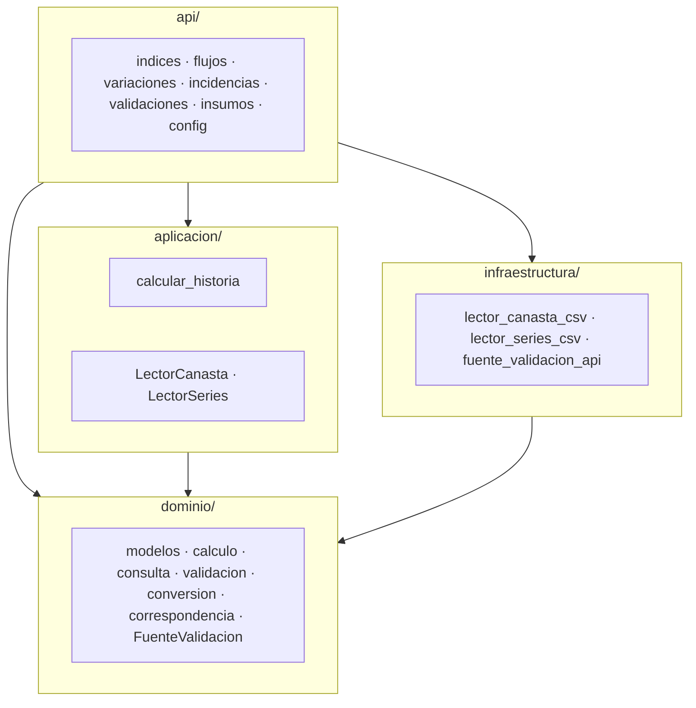
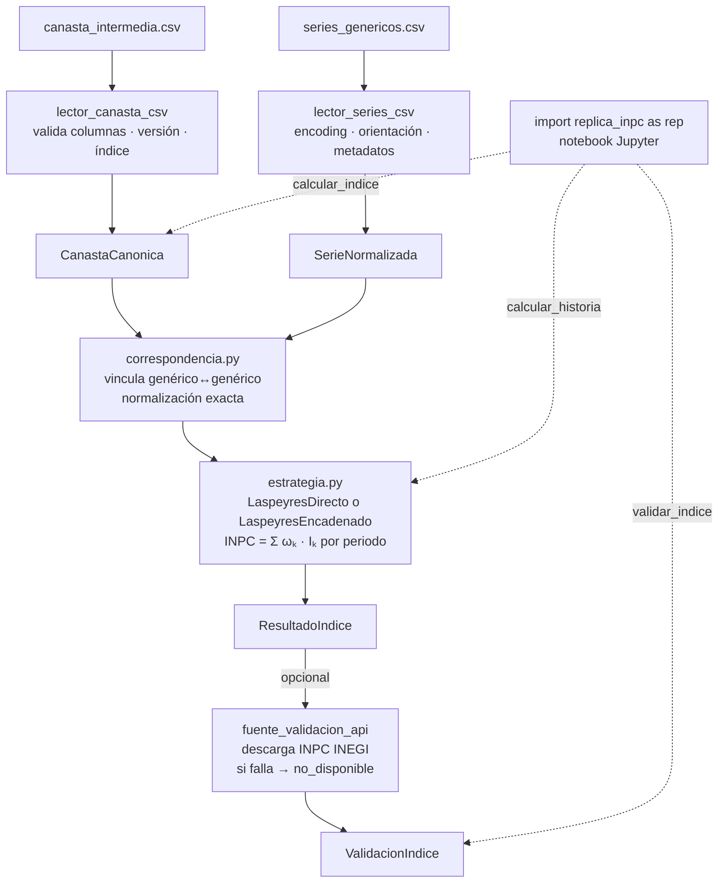

# Diseño del sistema — replica-inpc-mx

Documento vivo. Refleja el estado actual de las decisiones de diseño del sistema.
El historial de cambios vive en git.

---

## Índice

- [1. Arquitectura](#1-arquitectura)
  - [1.1 Patrón principal: Hexagonal (Ports & Adapters)](#11-patrón-principal-hexagonal-ports--adapters)
  - [1.2 Patrones de diseño](#12-patrones-de-diseño)
  - [1.3 Dirección de dependencias](#13-dirección-de-dependencias)
  - [1.4 Convenciones de código](#14-convenciones-de-código)
- [2. Estructura del proyecto](#2-estructura-del-proyecto)
- [3. Stack técnico](#3-stack-técnico)
- [4. Flujo de datos](#4-flujo-de-datos)
- [5. Dominio](#5-dominio)
  - [5.0 Mapa del dominio](#50-mapa-del-dominio)
  - [5.1 Semántica compartida](#51-semántica-compartida)
  - [5.2 Tipos compartidos](#52-tipos-compartidos)
  - [5.3 Periodos](#53-periodos)
  - [5.4 Modelos de entrada](#54-modelos-de-entrada)
  - [5.5 Modelo base](#55-modelo-base)
  - [5.6 Calculadores de índice](#56-calculadores-de-índice)
  - [5.7 ResultadoIndice](#57-resultadoindice)
  - [5.8 Resultados derivados](#58-resultados-derivados)
  - [5.9 Modelos de validación](#59-modelos-de-validación)
  - [5.10 Conversión y combinación](#510-conversión-y-combinación)
  - [5.11 Cálculo de variaciones e incidencias](#511-cálculo-de-variaciones-e-incidencias)
  - [5.12 Funciones de consulta](#512-funciones-de-consulta)
  - [5.13 Correspondencia](#513-correspondencia)
  - [5.14 Validación — validacion/](#514-validación--validacion)
  - [5.15 Errores](#515-errores)
- [6. API pública](#6-api-pública)
  - [6.0 Diseño de la API](#60-diseño-de-la-api)
  - [6.1 config.py](#61-configpy)
  - [6.2 insumos.py](#62-insumospy)
  - [6.3 indices.py](#63-indicespy)
  - [6.4 flujos.py](#64-flujospy)
  - [6.5 variaciones.py](#65-variacionespy)
  - [6.6 incidencias.py](#66-incidenciaspy)
  - [6.7 validaciones.py](#67-validacionespy)
- [7. Aplicación](#7-aplicación)
  - [7.1 Puertos](#71-puertos)
  - [7.2 Casos de uso](#72-casos-de-uso)
- [8. Infraestructura](#8-infraestructura)
  - [8.1 lector_canasta_csv](#81-lector_canasta_csv)
  - [8.2 lector_series_csv](#82-lector_series_csv)
  - [8.3 fuente_validacion_api](#83-fuente_validacion_api)
- [9. Estrategia de errores](#9-estrategia-de-errores)
  - [9.1 Jerarquía de excepciones](#91-jerarquía-de-excepciones)
  - [9.2 Propagación](#92-propagación)
  - [9.3 Traducción en adaptadores](#93-traducción-en-adaptadores)
- [10. Estrategia de testing](#10-estrategia-de-testing)
  - [10.1 Tipos de test](#101-tipos-de-test)
  - [10.2 Fixtures](#102-fixtures)
  - [10.3 Mock de la API del INEGI](#103-mock-de-la-api-del-inegi)
  - [10.4 Criterio de suficiencia](#104-criterio-de-suficiencia)
- [11. Decisiones de diseño](#11-decisiones-de-diseño)
  - [11.1 SerieNormalizada en formato ancho](#111-serienormalizada-en-formato-ancho)
  - [11.2 generico_original como diccionario](#112-generico_original-como-diccionario)
  - [11.3 Correspondencia por normalización exacta](#113-correspondencia-por-normalización-exacta)
  - [11.4 pandas en el dominio](#114-pandas-en-el-dominio)
  - [11.5 ponderador y encadenamiento como str](#115-ponderador-y-encadenamiento-como-str)
  - [11.6 Periodo como tipo propio](#116-periodo-como-tipo-propio)
  - [11.7 Categorías de clasificación version-específicas](#117-categorías-de-clasificación-version-específicas)
  - [11.8 Tolerancia numérica por versión](#118-tolerancia-numérica-por-versión)
  - [11.9 Reglas de estado_calculo](#119-reglas-de-estado_calculo)
  - [11.10 Detección de null_por_faltantes](#1110-detección-de-null_por_faltantes)
  - [11.11 Firma de validacion/indices.py](#1111-firma-de-validacionindicespy)
  - [11.12 id_corrida en ResultadoIndice](#1112-id_corrida-en-resultadoindice)
  - [11.13 Schema condicional en ReporteDetalladoValidacion](#1113-schema-condicional-en-reportedetalladovalidacion)
  - [11.14 TIPOS_CON_VALIDACION en el dominio](#1114-tipos_con_validacion-en-el-dominio)
  - [11.15 Cache de clase en FuenteValidacionApi](#1115-cache-de-clase-en-fuentevalidacionapi)
  - [11.16 UTF-8 como primer encoding en LectorSeriesCsv](#1116-utf-8-como-primer-encoding-en-lectorseriescsv)
  - [11.17 Dispatch interno en CalculadorBase](#1117-dispatch-interno-en-calculadorbase)
  - [11.18 Vectorización del loop de validar_inpc](#1118-vectorización-del-loop-de-validar_inpc)
  - [11.19 LaspeyresEncadenado — derivación de f_h](#1119-laspeyresencadenado--derivación-de-f_h)
  - [11.20 Imputación de faltantes en series](#1120-imputación-de-faltantes-en-series)
  - [11.21 empalmar — combinación histórica](#1121-empalmar--combinación-histórica)
  - [11.22 RENOMBRES_INDICES y normalización cross-versión](#1122-renombres_indices-y-normalización-cross-versión)
  - [11.23 empalmar — topología PATH](#1123-empalmar--topología-path)
  - [11.24 rebasar — huérfanos con UserWarning](#1124-rebasar--huérfanos-con-userwarning)
  - [11.25 bfill→ffill y estado "rellenado"](#1125-bfillffill-y-estado-rellenado)
  - [11.26 Autoreload IPython — type(self)._PROXY](#1126-autoreload-ipython--typeself_proxy)
  - [11.27 FuenteValidacion en dominio/, no en aplicacion/](#1127-fuentevalidacion-en-dominio-no-en-aplicacion)
- [12. Gaps conocidos](#12-gaps-conocidos)

---

## 1. Arquitectura

### 1.1 Patrón principal: Hexagonal (Ports & Adapters)

El dominio y los casos de uso no conocen CSV, filesystem ni APIs.
Solo conocen contratos (puertos). La infraestructura implementa esos contratos mediante adaptadores.

Esto permite agregar nuevas fuentes de entrada o formatos de salida sin modificar la lógica de negocio.

**Capas:**

| Capa               | Responsabilidad                                     |
| ------------------ | --------------------------------------------------- |
| `api/`             | Fachada pública — punto de entrada desde notebooks  |
| `dominio/`         | Lógica de negocio pura, sin dependencias externas   |
| `aplicacion/`      | Casos de uso y contratos de puertos (Protocols)     |
| `infraestructura/` | Adaptadores concretos (CSV, API INEGI)              |



### 1.2 Patrones de diseño

#### Strategy — cálculo del INPC

`laspeyres_directo.py` y `laspeyres_encadenado.py` implementan la misma interfaz `CalculadorBase`.
`estrategia.py` selecciona el calculador exclusivamente por `canasta.version`:

| Versión | Calculador |
| ------- | ---------- |
| 2010, 2018 | `LaspeyresDirecto` |
| 2013 | `LaspeyresEncadenadoT1` |
| 2024 | `LaspeyresEncadenadoT2` |

Las versiones encadenadas normalizan cada índice por `f_k` (columna `encadenamiento` de la canasta) y aplican un `factor_h` de empalme al resultado. Las fórmulas exactas y la derivación de `f_k` están en §5.6 y §11.20.

Agregar una nueva variante de cálculo no requiere modificar el código existente.

#### Facade — api/

`api/` expone funciones flat estilo pandas. Toda la superficie pública se importa
directamente desde `replica_inpc` — los submódulos (`api/indices.py`, etc.) son
implementación interna:

```python
import replica_inpc as rep

canasta   = rep.cargar_canasta("data/canasta_2018.csv", version=2018)
serie     = rep.cargar_serie("data/series_2018.csv", version=2018)
resultado = rep.calcular_indice(canasta, serie, tipo="INPC")
```

#### Adapter — infraestructura

Cada módulo en `infraestructura/` adapta una tecnología concreta al contrato del puerto correspondiente:

- `lector_canasta_csv.py` implementa `LectorCanasta`
- `lector_series_csv.py` implementa `LectorSeries`
- `fuente_validacion_api.py` implementa `FuenteValidacion`

### 1.3 Dirección de dependencias

Las dependencias apuntan siempre hacia el dominio. El dominio nunca importa de capas externas.

| Capa               | Puede importar de                              |
| ------------------ | ---------------------------------------------- |
| `dominio/`         | stdlib, pandas, numpy — nada más               |
| `aplicacion/`      | `dominio/`                                     |
| `infraestructura/` | `dominio/`                                     |
| `api/`             | `dominio/`, `aplicacion/`, `infraestructura/`  |

Violar esta regla rompe el aislamiento del dominio y hace que los contratos dependan de detalles de implementación.

### 1.4 Convenciones de código

| Convención | Regla |
| --- | --- |
| Errores de dominio | `InvarianteViolado`, nunca `ValueError` |
| `ponderador`, `encadenamiento` | `str` en `CanastaCanonica`; `astype(float)` solo al calcular |
| `_repr_html_` | siempre `# type: ignore[operator]` (bug en stubs de pandas) |
| Warnings al usuario | `print(f"[replica_inpc] ...")`, nunca `warnings.warn` (rompe Jupyter con `filterwarnings("error")`) |
| Módulos privados (`_*.py`) | internos a su paquete; no importar desde fuera |

---

## 2. Estructura del proyecto

```text
replica-inpc-mx/
├── src/
│   └── replica_inpc/
│       ├── __init__.py
│       ├── api/
│       │   ├── __init__.py
│       │   ├── _periodos.py
│       │   ├── config.py
│       │   ├── flujos.py
│       │   ├── incidencias.py
│       │   ├── indices.py
│       │   ├── insumos.py
│       │   ├── validaciones.py
│       │   └── variaciones.py
│       ├── aplicacion/
│       │   ├── __init__.py
│       │   ├── casos_uso/
│       │   │   ├── __init__.py
│       │   │   └── calcular_historia.py
│       │   └── puertos/
│       │       ├── __init__.py
│       │       ├── lector_canasta.py
│       │       └── lector_series.py
│       ├── dominio/
│       │   ├── __init__.py
│       │   ├── calculo/
│       │   │   ├── __init__.py
│       │   │   ├── _subindices.py
│       │   │   ├── _temporal.py
│       │   │   ├── base.py
│       │   │   ├── estrategia.py
│       │   │   ├── incidencias.py
│       │   │   ├── laspeyres_directo.py
│       │   │   ├── laspeyres_encadenado.py
│       │   │   └── variaciones.py
│       │   ├── consulta/
│       │   │   ├── __init__.py
│       │   │   ├── _comun.py
│       │   │   ├── incidencias.py
│       │   │   └── variaciones.py
│       │   ├── conversion.py
│       │   ├── correspondencia.py
│       │   ├── correspondencia_canastas.py
│       │   ├── errores.py
│       │   ├── fuente_validacion.py
│       │   ├── modelos/
│       │   │   ├── __init__.py
│       │   │   ├── base.py
│       │   │   ├── canasta.py
│       │   │   ├── incidencia.py
│       │   │   ├── indice.py
│       │   │   ├── serie.py
│       │   │   ├── validacion.py
│       │   │   └── variacion.py
│       │   ├── periodos.py
│       │   ├── tipos.py
│       │   └── validacion/
│       │       ├── __init__.py
│       │       ├── _comun.py
│       │       ├── incidencias.py
│       │       ├── indices.py
│       │       └── variaciones.py
│       └── infraestructura/
│           ├── __init__.py
│           ├── csv/
│           │   ├── __init__.py
│           │   ├── _utils.py
│           │   ├── lector_canasta_csv.py
│           │   └── lector_series_csv.py
│           └── inegi/
│               ├── __init__.py
│               └── fuente_validacion_api.py
├── notebooks/
├── tests/
│   ├── unit/
│   ├── integration/
│   └── fixtures/
├── data/                   # gitignored
│   ├── inputs/
│   │   ├── series/
│   │   └── canastas/
├── output/                 # gitignored
├── docs/
├── pyproject.toml
└── README.md
```

---

## 3. Stack técnico

| Componente      | Decisión                    | Razón                                                        |
| --------------- | --------------------------- | ------------------------------------------------------------ |
| Python          | >=3.10                      | Union syntax `X \| Y` en type hints requiere 3.10            |
| DataFrames      | pandas                      | Notebook-first, display automático en Jupyter                |
| Numérico        | numpy                       | Operaciones vectorizadas en el cálculo                       |
| Correspondencia | unicodedata (stdlib)        | Normalización exacta genérico↔genérico                       |
| HTTP            | requests                    | Simple, sin necesidad de async                               |
| Testing         | pytest                      | Estándar de facto en Python                                  |
| Linting         | ruff                        | Rápido, reemplaza flake8 + isort + pyupgrade en un solo tool |
| Tipos           | mypy + pandas-stubs         | Type checking estático; stubs cubren la API de pandas        |
| Visualización   | plotnine                    | Presente en el proyecto de referencia                        |
| Columnar        | pyarrow                     | Presente en el proyecto de referencia                        |
| Empaquetado     | setuptools + pyproject.toml | Estándar moderno, src layout                                 |

**Dependencias runtime** (`[project.dependencies]` en `pyproject.toml`):
pandas, numpy, requests, python-dateutil, plotnine, pyarrow, ipython, jupyter, ipykernel

**Dependencias de desarrollo** (`[project.optional-dependencies.dev]`):
pytest, pytest-mock, ruff, mypy, pandas-stubs, types-requests

**Dependencias de ponderadores** (`[project.optional-dependencies.ponderadores]`):
openpyxl, pdfplumber

---

## 4. Flujo de datos



`calcular_historia` orquesta internamente carga → cálculo por versión → empalme → conversión de frecuencia → rebase en una sola llamada. `calcular_indice` expone cada paso por separado.

---

## 5. Dominio

`dominio/` contiene lógica de negocio pura: sin IO, sin infraestructura, sin orquestación. El dominio recibe `Periodo*` — nunca strings de periodo.

Dos jerarquías de contratos: `Resultado` (cálculo) y `Validacion` (comparación contra INEGI). `ValidacionX` compone un `ResultadoX`; no hereda de `Resultado`. Invariantes lanzan `InvarianteViolado`, nunca `ValueError`.

---

## 5.0 Mapa del dominio

| Módulo | Exporta |
| ------ | ------- |
| `periodos.py` | `PeriodoQuincenal`, `PeriodoMensual`, `periodo_desde_str` |
| `errores.py` | jerarquía de excepciones; `InvarianteViolado` |
| `tipos.py` | `VersionCanasta`, `INDICE_POR_TIPO`, `RANGOS_VALIDOS`, `ManifestUnidad`, `ManifestDerivado` |
| `fuente_validacion.py` | `FuenteValidacion` (Protocol) |
| `correspondencia.py` | `alinear_genericos` |
| `correspondencia_canastas.py` | `RENOMBRES_GENERICOS`, `RENOMBRES_INDICES` |
| `conversion.py` | `empalmar`, `rebasar`, `a_mensual` |
| `modelos/base.py` | `Resultado` (ABC), `Validacion` (ABC), `Vista` |
| `modelos/canasta.py` | `CanastaCanonica` |
| `modelos/serie.py` | `SerieNormalizada` |
| `modelos/indice.py` | `ResultadoIndice` |
| `modelos/variacion.py` | `ResultadoVariacion` |
| `modelos/incidencia.py` | `ResultadoIncidencia` |
| `modelos/validacion.py` | `ValidacionIndice`, `ValidacionVariacion`, `ValidacionIncidencia` |
| `calculo/base.py` | `CalculadorBase` |
| `calculo/estrategia.py` | `para_canasta` |
| `calculo/laspeyres_directo.py` | `LaspeyresDirecto` |
| `calculo/laspeyres_encadenado.py` | `LaspeyresEncadenadoT1`, `LaspeyresEncadenadoT2` |
| `calculo/variaciones.py` | `variacion_periodica`, `variacion_acumulada_anual`, `variacion_desde` |
| `calculo/incidencias.py` | `incidencia_periodica`, `incidencia_acumulada_anual`, `incidencia_desde` |
| `consulta/variaciones.py` | `inflacion_en`, `inflacion_acumulada`, `inflacion_promedio`, `inflacion_maxima`, `inflacion_minima` |
| `consulta/incidencias.py` | `incidencia_en`, `incidencia_acumulada`, `incidencia_promedio`, `mayor_incidencia`, `menor_incidencia` |
| `validacion/indices.py` | `validar_indices` — privada; llamada desde `api/validaciones.py` |
| `validacion/variaciones.py` | `validar_variaciones` — privada; llamada desde `api/validaciones.py` |
| `validacion/incidencias.py` | `validar_incidencias` — privada; llamada desde `api/validaciones.py` |

---

## 5.1 Semántica compartida

**Propiedades compartidas por `Resultado*` y `Validacion*`**

| Propiedad | Semántica |
| --------- | --------- |
| `.resumen` | vista agregada; inspección rápida del estado del contrato |
| `.reporte` | detalle de la unidad de análisis relevante |
| `.diagnostico` | anomalías, faltantes o combinaciones no verificables |

**Propiedades de `Resultado`**

| Propiedad | Tipo | Semántica |
| --------- | ---- | --------- |
| `.df` | `pd.DataFrame` | resultado mínimo; solo columna calculada en formato largo |
| `.resultado` | `Vista` | resultado completo con metadata; expone `.largo` y `.ancho` |
| `.resultado.largo` | `pd.DataFrame` | DataFrame completo con metadata en formato largo |
| `.resultado.ancho` | `pd.DataFrame` | columna calculada pivoteada por periodo; filas = índice, columnas = periodo |
| `.pipe(fn, *args, **kwargs)` | callable | encadenamiento estilo pandas sobre el objeto resultado |
| `_repr_html_()` | HTML | representación rica en notebooks |

`Vista` envuelve un DataFrame con MultiIndex `(periodo, indice)` y materializa `.largo` y `.ancho` bajo demanda. `.resultado.ancho` usa `unstack("periodo")`.

**Propiedades de `Validacion`**

Sin `.df` y sin `.pipe()` — validaciones son terminales; no se encadenan.

| Propiedad | Tipo | Semántica |
| --------- | ---- | --------- |
| `.resultado` | `Vista` | comparación replicado vs INEGI; columnas covariantes por subclase |
| `.resultado.ancho` | `pd.DataFrame` | filas = MultiIndex `(indice, metrica)`, columnas = periodo |

**Catálogo `estado_calculo` — `ResultadoIndice`**

| Valor | Significado |
| ----- | ----------- |
| `ok` | todas las quincenas disponibles; cálculo completo |
| `rellenado` | ≥1 genérico con NaN sustituido por bfill→ffill; cálculo procede con dato aproximado |
| `parcial` | solo una quincena disponible en el mes; cálculo procede con calidad reducida |
| `sin_datos` | sin datos de entrada para `(periodo, indice)`; columna calculada = NaN |
| `fallida` | cálculo intentado y fallido por error interno; columna calculada = NaN |

Severidad en `.resumen`: `fallida` > `sin_datos` > `parcial` > `rellenado` > `ok`.

**Catálogo `estado_calculo` — derivados (`ResultadoVariacion`, `ResultadoIncidencia`)**

| Valor | Significado |
| ----- | ----------- |
| `ok` | todos los periodos fuente tenían `estado_calculo != parcial` |
| `parcial` | ≥1 periodo fuente tenía `estado_calculo = parcial` |

Fuentes con `sin_datos` o `fallida` producen combinaciones **ausentes** del derivado — NaN implícito en `.resultado.ancho`. Fuentes con `rellenado` producen `ok` en el derivado (la degradación queda trazada en el fuente, no propagada).

**Contrato NaN**

| Clase | Filas con `sin_datos`/`fallida` en `.df` | NaN en columna calculada |
| ----- | ---------------------------------------- | ------------------------ |
| `ResultadoIndice` | sí — todas las combinaciones intentadas | explícito |
| `ResultadoVariacion`, `ResultadoIncidencia` | no — solo combinaciones computables | implícito en `.resultado.ancho` |

`ResultadoIndice` conserva trazabilidad de intentos fallidos. Los derivados no tienen fila para combinaciones no computables.

---
