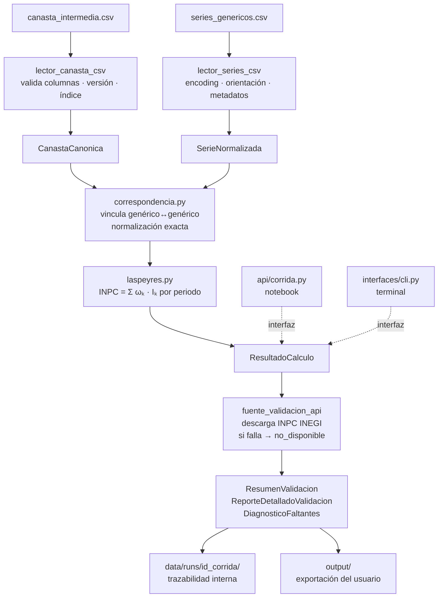

# Diseño del sistema — replica-inpc-mx

Documento vivo. Refleja el estado actual de las decisiones de diseño del sistema.
El historial de cambios vive en git.

---

## Índice

- [1. Arquitectura](#1-arquitectura)
  - [1.1 Patrón principal: Hexagonal (Ports & Adapters)](#11-patrón-principal-hexagonal-ports--adapters)
  - [1.2 Patrones de diseño](#12-patrones-de-diseño)
  - [1.3 Dirección de dependencias](#13-dirección-de-dependencias)
  - [1.4 Convenciones de código](#14-convenciones-de-código)
- [2. Estructura del proyecto](#2-estructura-del-proyecto)
- [3. Stack técnico](#3-stack-técnico)
- [4. Flujo de datos](#4-flujo-de-datos)
- [5. Dominio](#5-dominio)
  - [5.0 Mapa del dominio](#50-mapa-del-dominio)
  - [5.1 Semántica compartida](#51-semántica-compartida)
  - [5.2 Tipos compartidos](#52-tipos-compartidos)
  - [5.3 Periodos](#53-periodos)
  - [5.4 Modelos de entrada](#54-modelos-de-entrada)
  - [5.5 Modelo base](#55-modelo-base)
  - [5.6 Calculadores](#56-calculadores)
  - [5.7 Modelos de resultado](#57-modelos-de-resultado)
  - [5.8 Conversión y combinación](#58-conversión-y-combinación)
  - [5.9 Correspondencia](#59-correspondencia)
  - [5.10 Derivados — consulta/](#510-derivados--consulta)
  - [5.11 Validación — validacion/](#511-validación--validacion)
  - [5.12 Errores](#512-errores)
- [6. API pública](#6-api-pública)
  - [6.0 Diseño de la API](#60-diseño-de-la-api)
  - [6.1 config.py](#61-configpy)
  - [6.2 insumos.py](#62-insumospy)
  - [6.3 indices.py](#63-indicespy)
  - [6.4 flujos.py](#64-flujospy)
  - [6.5 variaciones.py](#65-variacionespy)
  - [6.6 incidencias.py](#66-incidenciaspy)
  - [6.7 validaciones.py](#67-validacionespy)
- [7. Aplicación](#7-aplicación)
  - [7.1 Puertos](#71-puertos)
  - [7.2 Casos de uso](#72-casos-de-uso)
- [8. Infraestructura](#8-infraestructura)
  - [8.1 lector_canasta_csv](#81-lector_canasta_csv)
  - [8.2 lector_series_csv](#82-lector_series_csv)
  - [8.3 fuente_validacion_api](#83-fuente_validacion_api)
- [9. Estrategia de errores](#9-estrategia-de-errores)
  - [9.1 Jerarquía de excepciones](#91-jerarquía-de-excepciones)
  - [9.2 Propagación](#92-propagación)
  - [9.3 Traducción en adaptadores](#93-traducción-en-adaptadores)
- [10. Estrategia de testing](#10-estrategia-de-testing)
  - [10.1 Tipos de test](#101-tipos-de-test)
  - [10.2 Fixtures](#102-fixtures)
  - [10.3 Mock de la API del INEGI](#103-mock-de-la-api-del-inegi)
  - [10.4 Criterio de suficiencia](#104-criterio-de-suficiencia)
- [11. Decisiones de diseño](#11-decisiones-de-diseño)
  - [11.1 SerieNormalizada en formato ancho](#111-serienormalizada-en-formato-ancho)
  - [11.2 generico_original como diccionario](#112-generico_original-como-diccionario)
  - [11.3 Correspondencia por normalización exacta](#113-correspondencia-por-normalización-exacta)
  - [11.4 pandas en el dominio](#114-pandas-en-el-dominio)
  - [11.5 ponderador y encadenamiento como str](#115-ponderador-y-encadenamiento-como-str)
  - [11.6 Periodo como tipo propio](#116-periodo-como-tipo-propio)
  - [11.7 Categorías de clasificación version-específicas](#117-categorías-de-clasificación-version-específicas)
  - [11.8 Tolerancia numérica por versión](#118-tolerancia-numérica-por-versión)
  - [11.9 Reglas de estado_calculo](#119-reglas-de-estado_calculo)
  - [11.10 Detección de null_por_faltantes](#1110-detección-de-null_por_faltantes)
  - [11.11 Firma de validacion/indices.py](#1111-firma-de-validacionindicespy)
  - [11.12 id_corrida en ResultadoIndice](#1112-id_corrida-en-resultadoindice)
  - [11.13 Loop de subíndices — OBSOLETA v2](#1113-loop-de-subíndices--obsoleta-v2)
  - [11.14 Schema condicional en ReporteDetalladoValidacion](#1114-schema-condicional-en-reportedetalladovalidacion)
  - [11.15 TIPOS_CON_VALIDACION en el dominio](#1115-tipos_con_validacion-en-el-dominio)
  - [11.16 Cache de clase en FuenteValidacionApi](#1116-cache-de-clase-en-fuentevalidacionapi)
  - [11.17 UTF-8 como primer encoding en LectorSeriesCsv](#1117-utf-8-como-primer-encoding-en-lectorseriescsv)
  - [11.18 Dispatch interno en CalculadorBase](#1118-dispatch-interno-en-calculadorbase)
  - [11.19 Vectorización del loop de validar_inpc](#1119-vectorización-del-loop-de-validar_inpc)
  - [11.20 LaspeyresEncadenado — derivación de f_h](#1120-laspeyresencadenado--derivación-de-f_h)
  - [11.21 Imputación de faltantes en series](#1121-imputación-de-faltantes-en-series)
  - [11.22 empalmar — combinación histórica](#1122-empalmar--combinación-histórica)
  - [11.23 RENOMBRES_INDICES y normalización cross-versión](#1123-renombres_indices-y-normalización-cross-versión)
  - [11.24 empalmar — topología PATH](#1124-empalmar--topología-path)
  - [11.25 rebasar — huérfanos con UserWarning](#1125-rebasar--huérfanos-con-userwarning)
  - [11.26 bfill→ffill y estado "rellenado"](#1126-bfillffill-y-estado-rellenado)
  - [11.27 Autoreload IPython — type(self)._PROXY](#1127-autoreload-ipython--typeself_proxy)
- [12. Gaps conocidos](#12-gaps-conocidos)

---

## 1. Arquitectura

### 1.1 Patrón principal: Hexagonal (Ports & Adapters)

El dominio y los casos de uso no conocen CSV, filesystem, APIs ni bases de datos.
Solo conocen contratos (puertos). La infraestructura implementa esos contratos mediante adaptadores.

Esto permite agregar nuevas fuentes de entrada, formatos de salida o interfaces
sin modificar la lógica de negocio.

**Capas:**

| Capa               | Responsabilidad                                         |
| ------------------ | ------------------------------------------------------- |
| `api/`             | Fachada para notebooks — punto de entrada del usuario   |
| `dominio/`         | Lógica de negocio pura, sin dependencias externas       |
| `aplicacion/`      | Casos de uso y contratos de puertos                     |
| `infraestructura/` | Adaptadores concretos (CSV, filesystem, API INEGI, SQL) |
| `interfaces/`      | CLI                                                     |

### 1.2 Patrones de diseño

#### Strategy — cálculo del INPC

`laspeyres.py` y `encadenado.py` implementan la misma interfaz `CalculadorBase`.
El sistema selecciona la estrategia según la versión de canasta:

- versiones 2010 y 2018 → `LaspeyresDirecto` — $INPC = \sum_j w_j \cdot I_j$
- versiones 2013 y 2024 → `LaspeyresEncadenado` — $INPC = f \cdot \sum_j w_j \cdot \theta_j \cdot I_j$

Para 2013 y 2024, $\theta_j = \frac{1}{f_{k,j}}$ donde $f_{k,j}$ es el valor de la
columna `encadenamiento` del genérico $j$: en 2013 actúa como factor de alineación
dentro de la escala vieja `2Q Dic 2010 = 100`; en 2024 equivale a
$I_j^{2Q\,\text{Jul}\,2024} / 100$ (nivel publicado en el traslape dividido entre 100).

La canasta codifica qué estrategia usar: `encadenamiento` vacío → directo,
`encadenamiento` con valores → encadenado.

Agregar una nueva variante de cálculo no requiere modificar el código existente.

#### Facade — api/corrida.py

`api/corrida.py` expone una interfaz simple al usuario del notebook,
ocultando la orquestación interna de casos de uso:

```python
corrida = Corrida(token_inegi="mi_token")
resultado = corrida.ejecutar(canasta="data/canasta_2018.csv", series="data/series_2018.csv", version=2018)
```

#### Repository — persistencia de corridas y artefactos

`RepositorioCorridas` y `AlmacenArtefactos` son puertos que abstraen
dónde y cómo se persiste cada corrida.
En v1 se implementan sobre filesystem. Si se agrega SQL, se implementa
el mismo puerto sin tocar el dominio.

La persistencia es opcional por corrida — ver §7.2. Cuando `persistir=False`,
estos puertos no se invocan y pueden ser `None`.

#### Adapter — infraestructura

Cada módulo en `infraestructura/` adapta una tecnología concreta al contrato
del puerto correspondiente:

- `lector_canasta_csv.py` implementa `LectorCanasta`
- `lector_series_csv.py` implementa `LectorSeries`
- `fuente_validacion_api.py` implementa `FuenteValidacion`

---

## 2. Estructura del proyecto

```text
replica-inpc-mx/
├── src/
│   └── replica_inpc/
│       ├── __init__.py
│       ├── api/
│       │   ├── __init__.py
│       │   ├── _periodos.py
│       │   ├── config.py
│       │   ├── flujos.py
│       │   ├── incidencias.py
│       │   ├── indices.py
│       │   ├── insumos.py
│       │   ├── validaciones.py
│       │   └── variaciones.py
│       ├── aplicacion/
│       │   ├── __init__.py
│       │   ├── casos_uso/
│       │   │   ├── __init__.py
│       │   │   └── calcular_historia.py
│       │   └── puertos/
│       │       ├── __init__.py
│       │       ├── fuente_validacion.py
│       │       ├── lector_canasta.py
│       │       └── lector_series.py
│       ├── dominio/
│       │   ├── __init__.py
│       │   ├── calculo/
│       │   │   ├── __init__.py
│       │   │   ├── _subindices.py
│       │   │   ├── _temporal.py
│       │   │   ├── base.py
│       │   │   ├── estrategia.py
│       │   │   ├── incidencias.py
│       │   │   ├── laspeyres_directo.py
│       │   │   ├── laspeyres_encadenado.py
│       │   │   └── variaciones.py
│       │   ├── consulta/
│       │   │   ├── __init__.py
│       │   │   ├── _comun.py
│       │   │   ├── incidencias.py
│       │   │   └── variaciones.py
│       │   ├── conversion.py
│       │   ├── correspondencia.py
│       │   ├── correspondencia_canastas.py
│       │   ├── errores.py
│       │   ├── modelos/
│       │   │   ├── __init__.py
│       │   │   ├── base.py
│       │   │   ├── canasta.py
│       │   │   ├── incidencia.py
│       │   │   ├── indice.py
│       │   │   ├── serie.py
│       │   │   ├── validacion.py
│       │   │   └── variacion.py
│       │   ├── periodos.py
│       │   ├── tipos.py
│       │   └── validacion/
│       │       ├── __init__.py
│       │       ├── _comun.py
│       │       ├── incidencias.py
│       │       ├── indices.py
│       │       └── variaciones.py
│       └── infraestructura/
│           ├── __init__.py
│           ├── csv/
│           │   ├── __init__.py
│           │   ├── _utils.py
│           │   ├── lector_canasta_csv.py
│           │   └── lector_series_csv.py
│           └── inegi/
│               ├── __init__.py
│               └── fuente_validacion_api.py
├── notebooks/
├── tests/
│   ├── unit/
│   ├── integration/
│   └── fixtures/
├── data/                   # gitignored
│   ├── inputs/
│   │   ├── series/
│   │   └── canastas/
├── output/                 # gitignored
├── docs/
├── pyproject.toml
└── README.md
```

---

## 3. Stack técnico

| Componente      | Decisión                    | Razón                                              |
| --------------- | --------------------------- | -------------------------------------------------- |
| Python          | 3.10                        | `match/case` disponible, compatible con el entorno |
| DataFrames      | pandas                      | Notebook-first, display automático en Jupyter      |
| Numérico        | numpy                       | Operaciones vectorizadas en el cálculo             |
| Correspondencia | unicodedata (stdlib)        | Normalización exacta genérico↔genérico             |
| HTTP            | requests                    | Simple, sin necesidad de async en v1               |
| CLI             | argparse                    | Stdlib, sin dependencia extra para CLI secundario  |
| Testing         | pytest                      | Estándar de facto en Python                        |
| Visualización   | plotnine                    | Presente en el proyecto de referencia              |
| Columnar        | pyarrow                     | Presente en el proyecto de referencia              |
| Empaquetado     | setuptools + pyproject.toml | Estándar moderno, src layout                       |

**Dependencias runtime** (`[project.dependencies]` en `pyproject.toml`):
pandas, numpy, requests, python-dateutil, plotnine, pyarrow

**Dependencias de desarrollo** (`[project.optional-dependencies.dev]`):
pytest, pytest-mock, ipython, jupyter, ipykernel

Instalación:

```bash
pip install -e ".[dev]"
```

---

## 4. Flujo de datos



---
