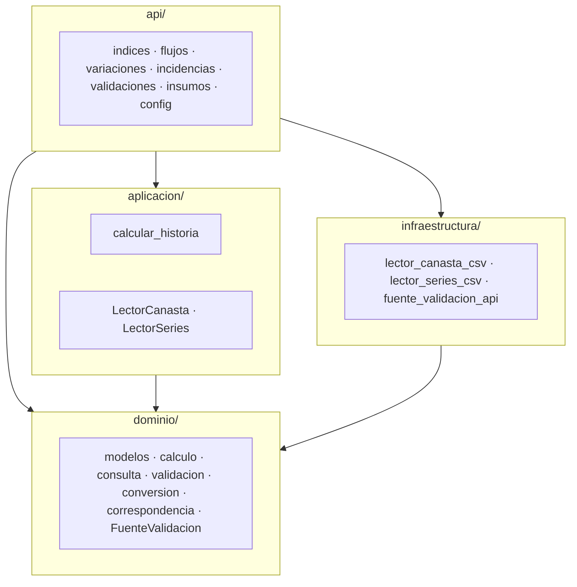
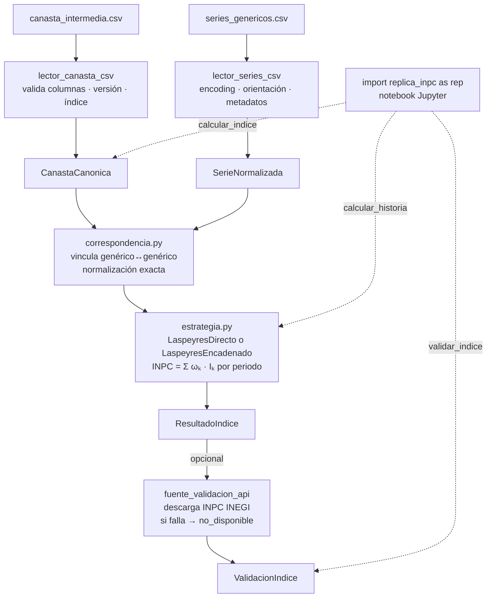

# Diseño del sistema — replica-inpc-mx

Documento vivo. Refleja el estado actual de las decisiones de diseño del sistema.
El historial de cambios vive en git.

---

## Índice

- [1. Arquitectura](#1-arquitectura)
  - [1.1 Patrón principal: Hexagonal (Ports & Adapters)](#11-patrón-principal-hexagonal-ports--adapters)
  - [1.2 Patrones de diseño](#12-patrones-de-diseño)
  - [1.3 Dirección de dependencias](#13-dirección-de-dependencias)
  - [1.4 Convenciones de código](#14-convenciones-de-código)
- [2. Estructura del proyecto](#2-estructura-del-proyecto)
- [3. Stack técnico](#3-stack-técnico)
- [4. Flujo de datos](#4-flujo-de-datos)
- [5. Dominio](#5-dominio)
  - [5.0 Mapa del dominio](#50-mapa-del-dominio)
  - [5.1 Semántica compartida](#51-semántica-compartida)
  - [5.2 Tipos compartidos](#52-tipos-compartidos)
  - [5.3 Periodos](#53-periodos)
  - [5.4 Modelos de entrada](#54-modelos-de-entrada)
  - [5.5 Modelo base](#55-modelo-base)
  - [5.6 Calculadores de índice](#56-calculadores-de-índice)
  - [5.7 ResultadoIndice](#57-resultadoindice)
  - [5.8 Resultados derivados](#58-resultados-derivados)
  - [5.9 Modelos de validación](#59-modelos-de-validación)
  - [5.10 Conversión y combinación](#510-conversión-y-combinación)
  - [5.11 Cálculo de variaciones e incidencias](#511-cálculo-de-variaciones-e-incidencias)
  - [5.12 Funciones de consulta](#512-funciones-de-consulta)
  - [5.13 Correspondencia](#513-correspondencia)
  - [5.14 Validación — validacion/](#514-validación--validacion)
  - [5.15 Errores](#515-errores)
- [6. API pública](#6-api-pública)
  - [6.0 Diseño de la API](#60-diseño-de-la-api)
  - [6.1 config.py](#61-configpy)
  - [6.2 insumos.py](#62-insumospy)
  - [6.3 indices.py](#63-indicespy)
  - [6.4 flujos.py](#64-flujospy)
  - [6.5 variaciones.py](#65-variacionespy)
  - [6.6 incidencias.py](#66-incidenciaspy)
  - [6.7 validaciones.py](#67-validacionespy)
- [7. Aplicación](#7-aplicación)
  - [7.1 Puertos](#71-puertos)
  - [7.2 Casos de uso](#72-casos-de-uso)
- [8. Infraestructura](#8-infraestructura)
  - [8.1 lector_canasta_csv](#81-lector_canasta_csv)
  - [8.2 lector_series_csv](#82-lector_series_csv)
  - [8.3 fuente_validacion_api](#83-fuente_validacion_api)
- [9. Estrategia de errores](#9-estrategia-de-errores)
  - [9.1 Jerarquía de excepciones](#91-jerarquía-de-excepciones)
  - [9.2 Propagación](#92-propagación)
  - [9.3 Traducción en adaptadores](#93-traducción-en-adaptadores)
- [10. Estrategia de testing](#10-estrategia-de-testing)
  - [10.1 Tipos de test](#101-tipos-de-test)
  - [10.2 Fixtures](#102-fixtures)
  - [10.3 Mock de la API del INEGI](#103-mock-de-la-api-del-inegi)
  - [10.4 Criterio de suficiencia](#104-criterio-de-suficiencia)
- [11. Decisiones de diseño](#11-decisiones-de-diseño)
  - [11.1 SerieNormalizada en formato ancho](#111-serienormalizada-en-formato-ancho)
  - [11.2 generico_original como diccionario](#112-generico_original-como-diccionario)
  - [11.3 Correspondencia por normalización exacta](#113-correspondencia-por-normalización-exacta)
  - [11.4 pandas en el dominio](#114-pandas-en-el-dominio)
  - [11.5 ponderador y encadenamiento como str](#115-ponderador-y-encadenamiento-como-str)
  - [11.6 Periodo como tipo propio](#116-periodo-como-tipo-propio)
  - [11.7 Categorías de clasificación version-específicas](#117-categorías-de-clasificación-version-específicas)
  - [11.8 Tolerancia numérica por versión](#118-tolerancia-numérica-por-versión)
  - [11.9 Reglas de estado_calculo](#119-reglas-de-estado_calculo)
  - [11.10 Detección de null_por_faltantes](#1110-detección-de-null_por_faltantes)
  - [11.11 Firma de validacion/indices.py](#1111-firma-de-validacionindicespy)
  - [11.12 id_corrida en ResultadoIndice](#1112-id_corrida-en-resultadoindice)
  - [11.13 Schema condicional en ReporteDetalladoValidacion](#1113-schema-condicional-en-reportedetalladovalidacion)
  - [11.14 TIPOS_CON_VALIDACION en el dominio](#1114-tipos_con_validacion-en-el-dominio)
  - [11.15 Cache de clase en FuenteValidacionApi](#1115-cache-de-clase-en-fuentevalidacionapi)
  - [11.16 UTF-8 como primer encoding en LectorSeriesCsv](#1116-utf-8-como-primer-encoding-en-lectorseriescsv)
  - [11.17 Dispatch interno en CalculadorBase](#1117-dispatch-interno-en-calculadorbase)
  - [11.18 Vectorización del loop de validar_inpc](#1118-vectorización-del-loop-de-validar_inpc)
  - [11.19 LaspeyresEncadenado — derivación de f_h](#1119-laspeyresencadenado--derivación-de-f_h)
  - [11.20 Imputación de faltantes en series](#1120-imputación-de-faltantes-en-series)
  - [11.21 empalmar — combinación histórica](#1121-empalmar--combinación-histórica)
  - [11.22 RENOMBRES_INDICES y normalización cross-versión](#1122-renombres_indices-y-normalización-cross-versión)
  - [11.23 empalmar — topología PATH](#1123-empalmar--topología-path)
  - [11.24 rebasar — huérfanos con UserWarning](#1124-rebasar--huérfanos-con-userwarning)
  - [11.25 bfill→ffill y estado "rellenado"](#1125-bfillffill-y-estado-rellenado)
  - [11.26 Autoreload IPython — type(self)._PROXY](#1126-autoreload-ipython--typeself_proxy)
  - [11.27 FuenteValidacion en dominio/, no en aplicacion/](#1127-fuentevalidacion-en-dominio-no-en-aplicacion)
- [12. Gaps conocidos](#12-gaps-conocidos)

---

## 1. Arquitectura

### 1.1 Patrón principal: Hexagonal (Ports & Adapters)

El dominio y los casos de uso no conocen CSV, filesystem ni APIs.
Solo conocen contratos (puertos). La infraestructura implementa esos contratos mediante adaptadores.

Esto permite agregar nuevas fuentes de entrada o formatos de salida sin modificar la lógica de negocio.

**Capas:**

| Capa               | Responsabilidad                                     |
| ------------------ | --------------------------------------------------- |
| `api/`             | Fachada pública — punto de entrada desde notebooks  |
| `dominio/`         | Lógica de negocio pura, sin dependencias externas   |
| `aplicacion/`      | Casos de uso y contratos de puertos (Protocols)     |
| `infraestructura/` | Adaptadores concretos (CSV, API INEGI)              |



### 1.2 Patrones de diseño

#### Strategy — cálculo del INPC

`laspeyres_directo.py` y `laspeyres_encadenado.py` implementan la misma interfaz `CalculadorBase`.
`estrategia.py` selecciona el calculador exclusivamente por `canasta.version`:

| Versión | Calculador |
| ------- | ---------- |
| 2010, 2018 | `LaspeyresDirecto` |
| 2013 | `LaspeyresEncadenadoT1` |
| 2024 | `LaspeyresEncadenadoT2` |

Las versiones encadenadas normalizan cada índice por `f_k` (columna `encadenamiento` de la canasta) y aplican un `factor_h` de empalme al resultado. Las fórmulas exactas y la derivación de `f_k` están en §5.6 y §11.20.

Agregar una nueva variante de cálculo no requiere modificar el código existente.

#### Facade — api/

`api/` expone funciones flat estilo pandas. Toda la superficie pública se importa
directamente desde `replica_inpc` — los submódulos (`api/indices.py`, etc.) son
implementación interna:

```python
import replica_inpc as rep

canasta   = rep.cargar_canasta("data/canasta_2018.csv", version=2018)
serie     = rep.cargar_serie("data/series_2018.csv", version=2018)
resultado = rep.calcular_indice(canasta, serie, tipo="INPC")
```

#### Adapter — infraestructura

Cada módulo en `infraestructura/` adapta una tecnología concreta al contrato del puerto correspondiente:

- `lector_canasta_csv.py` implementa `LectorCanasta`
- `lector_series_csv.py` implementa `LectorSeries`
- `fuente_validacion_api.py` implementa `FuenteValidacion`

### 1.3 Dirección de dependencias

Las dependencias apuntan siempre hacia el dominio. El dominio nunca importa de capas externas.

| Capa               | Puede importar de                              |
| ------------------ | ---------------------------------------------- |
| `dominio/`         | stdlib, pandas, numpy — nada más               |
| `aplicacion/`      | `dominio/`                                     |
| `infraestructura/` | `dominio/`                                     |
| `api/`             | `dominio/`, `aplicacion/`, `infraestructura/`  |

Violar esta regla rompe el aislamiento del dominio y hace que los contratos dependan de detalles de implementación.

### 1.4 Convenciones de código

| Convención | Regla |
| --- | --- |
| Errores de dominio | `InvarianteViolado`, nunca `ValueError` |
| `ponderador`, `encadenamiento` | `str` en `CanastaCanonica`; `astype(float)` solo al calcular |
| `_repr_html_` | siempre `# type: ignore[operator]` (bug en stubs de pandas) |
| Warnings al usuario | `print(f"[replica_inpc] ...")`, nunca `warnings.warn` (rompe Jupyter con `filterwarnings("error")`) |
| Módulos privados (`_*.py`) | internos a su paquete; no importar desde fuera |

---

## 2. Estructura del proyecto

```text
replica-inpc-mx/
├── src/
│   └── replica_inpc/
│       ├── __init__.py
│       ├── api/
│       │   ├── __init__.py
│       │   ├── _periodos.py
│       │   ├── config.py
│       │   ├── flujos.py
│       │   ├── incidencias.py
│       │   ├── indices.py
│       │   ├── insumos.py
│       │   ├── validaciones.py
│       │   └── variaciones.py
│       ├── aplicacion/
│       │   ├── __init__.py
│       │   ├── casos_uso/
│       │   │   ├── __init__.py
│       │   │   └── calcular_historia.py
│       │   └── puertos/
│       │       ├── __init__.py
│       │       ├── lector_canasta.py
│       │       └── lector_series.py
│       ├── dominio/
│       │   ├── __init__.py
│       │   ├── calculo/
│       │   │   ├── __init__.py
│       │   │   ├── _subindices.py
│       │   │   ├── _temporal.py
│       │   │   ├── base.py
│       │   │   ├── estrategia.py
│       │   │   ├── incidencias.py
│       │   │   ├── laspeyres_directo.py
│       │   │   ├── laspeyres_encadenado.py
│       │   │   └── variaciones.py
│       │   ├── consulta/
│       │   │   ├── __init__.py
│       │   │   ├── _comun.py
│       │   │   ├── incidencias.py
│       │   │   └── variaciones.py
│       │   ├── conversion.py
│       │   ├── correspondencia.py
│       │   ├── correspondencia_canastas.py
│       │   ├── errores.py
│       │   ├── fuente_validacion.py
│       │   ├── modelos/
│       │   │   ├── __init__.py
│       │   │   ├── base.py
│       │   │   ├── canasta.py
│       │   │   ├── incidencia.py
│       │   │   ├── indice.py
│       │   │   ├── serie.py
│       │   │   ├── validacion.py
│       │   │   └── variacion.py
│       │   ├── periodos.py
│       │   ├── tipos.py
│       │   └── validacion/
│       │       ├── __init__.py
│       │       ├── _comun.py
│       │       ├── incidencias.py
│       │       ├── indices.py
│       │       └── variaciones.py
│       └── infraestructura/
│           ├── __init__.py
│           ├── csv/
│           │   ├── __init__.py
│           │   ├── _utils.py
│           │   ├── lector_canasta_csv.py
│           │   └── lector_series_csv.py
│           └── inegi/
│               ├── __init__.py
│               └── fuente_validacion_api.py
├── notebooks/
├── tests/
│   ├── unit/
│   ├── integration/
│   └── fixtures/
├── data/                   # gitignored
│   ├── inputs/
│   │   ├── series/
│   │   └── canastas/
├── output/                 # gitignored
├── docs/
├── pyproject.toml
└── README.md
```

---

## 3. Stack técnico

| Componente      | Decisión                    | Razón                                                        |
| --------------- | --------------------------- | ------------------------------------------------------------ |
| Python          | >=3.10                      | Union syntax `X \| Y` en type hints requiere 3.10            |
| DataFrames      | pandas                      | Notebook-first, display automático en Jupyter                |
| Numérico        | numpy                       | Operaciones vectorizadas en el cálculo                       |
| Correspondencia | unicodedata (stdlib)        | Normalización exacta genérico↔genérico                       |
| HTTP            | requests                    | Simple, sin necesidad de async                               |
| Testing         | pytest                      | Estándar de facto en Python                                  |
| Linting         | ruff                        | Rápido, reemplaza flake8 + isort + pyupgrade en un solo tool |
| Tipos           | mypy + pandas-stubs         | Type checking estático; stubs cubren la API de pandas        |
| Visualización   | plotnine                    | Presente en el proyecto de referencia                        |
| Columnar        | pyarrow                     | Presente en el proyecto de referencia                        |
| Empaquetado     | setuptools + pyproject.toml | Estándar moderno, src layout                                 |

**Dependencias runtime** (`[project.dependencies]` en `pyproject.toml`):
pandas, numpy, requests, python-dateutil, plotnine, pyarrow, ipython, jupyter, ipykernel

**Dependencias de desarrollo** (`[project.optional-dependencies.dev]`):
pytest, pytest-mock, ruff, mypy, pandas-stubs, types-requests

**Dependencias de ponderadores** (`[project.optional-dependencies.ponderadores]`):
openpyxl, pdfplumber

---

## 4. Flujo de datos



`calcular_historia` orquesta internamente carga → cálculo por versión → empalme → conversión de frecuencia → rebase en una sola llamada. `calcular_indice` expone cada paso por separado.

---

## 5. Dominio

`dominio/` contiene lógica de negocio pura: sin IO, sin infraestructura, sin orquestación. El dominio recibe `Periodo*` — nunca strings de periodo.

Dos jerarquías de contratos: `Resultado` (cálculo) y `Validacion` (comparación contra INEGI). `ValidacionX` compone un `ResultadoX`; no hereda de `Resultado`. Invariantes lanzan `InvarianteViolado`, nunca `ValueError`.

---

## 5.0 Mapa del dominio

| Módulo | Exporta |
| ------ | ------- |
| `periodos.py` | `PeriodoQuincenal`, `PeriodoMensual`, `periodo_desde_str` |
| `errores.py` | jerarquía de excepciones; `InvarianteViolado` |
| `tipos.py` | `VersionCanasta`, `INDICE_POR_TIPO`, `COLUMNAS_CLASIFICACION`, `TIPOS_CON_VALIDACION`, `RANGOS_VALIDOS`, `ManifestUnidad`, `ManifestDerivado` |
| `fuente_validacion.py` | `FuenteValidacion` (Protocol) |
| `correspondencia.py` | `alinear_genericos` |
| `correspondencia_canastas.py` | `RENOMBRES_GENERICOS`, `RENOMBRES_INDICES` |
| `conversion.py` | `empalmar`, `rebasar`, `a_mensual` |
| `modelos/base.py` | `Resultado` (ABC), `Validacion` (ABC), `Vista` |
| `modelos/canasta.py` | `CanastaCanonica` |
| `modelos/serie.py` | `SerieNormalizada` |
| `modelos/indice.py` | `ResultadoIndice` |
| `modelos/variacion.py` | `ResultadoVariacion` |
| `modelos/incidencia.py` | `ResultadoIncidencia` |
| `modelos/validacion.py` | `ValidacionIndice`, `ValidacionVariacion`, `ValidacionIncidencia` |
| `calculo/base.py` | `CalculadorBase` |
| `calculo/estrategia.py` | `para_canasta` |
| `calculo/laspeyres_directo.py` | `LaspeyresDirecto` |
| `calculo/laspeyres_encadenado.py` | `LaspeyresEncadenadoT1`, `LaspeyresEncadenadoT2` |
| `calculo/variaciones.py` | `variacion_periodica`, `variacion_acumulada_anual`, `variacion_desde` |
| `calculo/incidencias.py` | `incidencia_periodica`, `incidencia_acumulada_anual`, `incidencia_desde` |
| `consulta/variaciones.py` | `inflacion_en`, `inflacion_acumulada`, `inflacion_promedio`, `inflacion_maxima`, `inflacion_minima` |
| `consulta/incidencias.py` | `incidencia_en`, `incidencia_acumulada`, `incidencia_promedio`, `mayor_incidencia`, `menor_incidencia` |
| `validacion/indices.py` | `validar_indices` — privada; llamada desde `api/validaciones.py` |
| `validacion/variaciones.py` | `validar_variaciones` — privada; llamada desde `api/validaciones.py` |
| `validacion/incidencias.py` | `validar_incidencias` — privada; llamada desde `api/validaciones.py` |

---

## 5.1 Semántica compartida

**Propiedades compartidas por `Resultado*` y `Validacion*`**

| Propiedad | Semántica |
| --------- | --------- |
| `.resumen` | vista agregada; inspección rápida del estado del contrato |
| `.reporte` | detalle de la unidad de análisis relevante |
| `.diagnostico` | anomalías, faltantes o combinaciones no verificables |

**Propiedades de `Resultado`**

| Propiedad | Tipo | Semántica |
| --------- | ---- | --------- |
| `.df` | `pd.DataFrame` | resultado mínimo; solo columna calculada en formato largo |
| `.resultado` | `Vista` | resultado completo con metadata; expone `.largo` y `.ancho` |
| `.resultado.largo` | `pd.DataFrame` | DataFrame completo con metadata en formato largo |
| `.resultado.ancho` | `pd.DataFrame` | columna calculada pivoteada por periodo; filas = índice, columnas = periodo |
| `.pipe(fn, *args, **kwargs)` | callable | encadenamiento estilo pandas sobre el objeto resultado |
| `_repr_html_()` | HTML | representación rica en notebooks |

`Vista` envuelve un DataFrame con MultiIndex `(periodo, indice)` y materializa `.largo` y `.ancho` bajo demanda. `.resultado.ancho` usa `unstack("periodo")`.

**Propiedades de `Validacion`**

Sin `.df` y sin `.pipe()` — validaciones son terminales; no se encadenan.

| Propiedad | Tipo | Semántica |
| --------- | ---- | --------- |
| `.resultado` | `Vista` | comparación replicado vs INEGI; columnas covariantes por subclase |
| `.resultado.ancho` | `pd.DataFrame` | filas = MultiIndex `(indice, metrica)`, columnas = periodo |

**Catálogo `estado_calculo` — `ResultadoIndice`**

| Valor | Significado |
| ----- | ----------- |
| `ok` | todas las quincenas disponibles; cálculo completo |
| `rellenado` | ≥1 genérico con NaN sustituido por bfill→ffill; cálculo procede con dato aproximado |
| `parcial` | solo una quincena disponible en el mes; cálculo procede con calidad reducida |
| `sin_datos` | sin datos de entrada para `(periodo, indice)`; columna calculada = NaN |
| `fallida` | cálculo intentado y fallido por error interno; columna calculada = NaN |

Severidad en `.resumen`: `fallida` > `sin_datos` > `parcial` > `rellenado` > `ok`.

**Catálogo `estado_calculo` — derivados (`ResultadoVariacion`, `ResultadoIncidencia`)**

| Valor | Significado |
| ----- | ----------- |
| `ok` | todos los periodos fuente tenían `estado_calculo != parcial` |
| `parcial` | ≥1 periodo fuente tenía `estado_calculo = parcial` |

Fuentes con `sin_datos` o `fallida` producen combinaciones **ausentes** del derivado — NaN implícito en `.resultado.ancho`. Fuentes con `rellenado` producen `ok` en el derivado (la degradación queda trazada en el fuente, no propagada).

**Contrato NaN**

| Clase | Filas con `sin_datos`/`fallida` en `.df` | NaN en columna calculada |
| ----- | ---------------------------------------- | ------------------------ |
| `ResultadoIndice` | sí — todas las combinaciones intentadas | explícito |
| `ResultadoVariacion`, `ResultadoIncidencia` | no — solo combinaciones computables | implícito en `.resultado.ancho` |

`ResultadoIndice` conserva trazabilidad de intentos fallidos. Los derivados no tienen fila para combinaciones no computables.

---

## 5.2 Tipos compartidos

Definidos en `tipos.py`. Sin lógica de negocio — estructuras puras compartidas entre dominio, aplicación y API.

**`VersionCanasta`**

```python
VersionCanasta = Literal[2010, 2013, 2018, 2024]
```

Alias de tipo. Reemplaza `int` en todos los contratos que aceptan versión de canasta.

**`INDICE_POR_TIPO`**

```python
INDICE_POR_TIPO: dict[str, str] = {"inpc": "INPC"}
```

Mapeo `tipo` → nombre del nivel `indice` en el MultiIndex. Aplica cuando `tipo` representa un índice agregado. El string `"INPC"` es el valor que aparece en `.df.index.get_level_values("indice")`.

**`COLUMNAS_CLASIFICACION`**

```python
COLUMNAS_CLASIFICACION: frozenset[str] = frozenset({
    "COG", "CCIF division", "CCIF grupo", "CCIF clase",
    "inflacion componente", "inflacion subcomponente", "inflacion agrupacion",
    "SCIAN sector", "SCIAN rama", "durabilidad", "canasta basica",
})
```

Columnas de `CanastaCanonica` válidas como `tipo` para calcular subíndices. Cuando `tipo in COLUMNAS_CLASIFICACION`, el calculador hace split por categoría; el nivel `indice` de cada fila = valor de la categoría (ej. `"subyacente"`).

**`TIPOS_CON_VALIDACION`**

```python
TIPOS_CON_VALIDACION: frozenset[str] = frozenset(
    {"inpc", "inflacion componente", "inflacion subcomponente"}
)
```

Tipos con series publicadas por el INEGI comparables directamente. Solo estos pueden pasarse a `validar_indices`, `validar_variaciones`, `validar_incidencias`.

**`RANGOS_VALIDOS`**

```python
RANGOS_VALIDOS: dict[VersionCanasta, tuple[PeriodoQuincenal, PeriodoQuincenal | None]] = {
    2010: (PeriodoQuincenal(2010, 12, 2), PeriodoQuincenal(2013, 3, 2)),
    2013: (PeriodoQuincenal(2013, 3, 2), PeriodoQuincenal(2018, 7, 2)),
    2018: (PeriodoQuincenal(2018, 7, 2), PeriodoQuincenal(2024, 7, 2)),
    2024: (PeriodoQuincenal(2024, 7, 2), None),
}
```

Periodos válidos por versión de canasta. `None` como fin = hasta el último periodo disponible. Usado en `calculo/base.py` para recortar `SerieNormalizada` antes del cálculo.

**`ManifestUnidad`**

Trazabilidad de una corrida elemental sobre una sola canasta. `empalmar` concatena listas de `ManifestUnidad` sin colapsarlas.

| Campo | Tipo | Notas |
| ----- | ---- | ----- |
| `id_corrida` | `str` | identificador único de la corrida elemental |
| `version` | `VersionCanasta` | versión de canasta usada en el tramo |
| `tipo` | `str` | tipo de índice calculado |
| `calculador` | `Literal[...]` | `"LaspeyresDirecto"`, `"LaspeyresEncadenadoT1"`, `"LaspeyresEncadenadoT2"` |
| `ruta_canasta` | `Path \| None` | origen físico; `None` cuando construido desde memoria |
| `ruta_series` | `Path \| None` | origen físico; `None` cuando construido desde memoria |
| `fecha` | `datetime` | marca temporal; default `datetime.now()` |

Sin invariantes en construcción.

**`ManifestDerivado`**

Trazabilidad de un resultado derivado. Terminal — no combinable vía `empalmar`.

| Campo | Tipo | Notas |
| ----- | ---- | ----- |
| `id_corrida` | `list[str]` | IDs de todas las corridas origen |
| `tipo` | `str` | tipo de índice derivado |
| `clase` | `str` | clase del derivado; ver catálogo en secciones 5.8 y 5.9 |
| `descripcion` | `str` | no vacío cuando `clase = "desde"`; vacío en otros casos |
| `fecha` | `datetime` | marca temporal |
| `inpc_ids` | `list[str] \| None` | IDs corridas INPC; solo para `ResultadoIncidencia` |
| `clasificacion_ids` | `list[str] \| None` | IDs corridas clasificación; solo para `ResultadoIncidencia` |

Invariantes:
- `clase` no vacío → `InvarianteViolado` si no
- `(inpc_ids is None) == (clasificacion_ids is None)` → `InvarianteViolado` si no

---

## 5.3 Periodos

Definidos en `periodos.py`. Value objects sortables, hashables y convertibles a `pd.Timestamp`. Usados como claves del MultiIndex en `ResultadoIndice`, como columnas de `SerieNormalizada` y como argumentos en funciones de variación e incidencia.

El dominio recibe siempre objetos `Periodo*` — nunca strings. La conversión de strings a periodos ocurre en la API pública.

**`PeriodoQuincenal`**

Tripleta `(año, mes, quincena)`. Orden natural: `(año, mes, quincena)`.

```python
PeriodoQuincenal(2024, 7, 2)  # → "2Q Jul 2024"
```

| Atributo / método | Tipo | Notas |
| --- | --- | --- |
| `año`, `mes`, `quincena` | `int` | atributos de instancia |
| `__str__` | `str` | `"1Q Ene 2024"` |
| `__repr__` | `str` | `"PeriodoQuincenal(2024, 1, 1)"` |
| `.desde_str(texto)` | classmethod → `PeriodoQuincenal` | texto en formato `"1Q Mes AAAA"`; lanza `PeriodoNoInterpretable` si falla |
| `.to_timestamp()` | `pd.Timestamp` | 1Q → día 15 del mes; 2Q → último día del mes |

Constructor lanza `ValueError` si `quincena ∉ {1, 2}`, `mes ∉ 1–12` o `año ≤ 0`. (Excepción consciente — ver §1.4.)

**`PeriodoMensual`**

Par `(año, mes)`. Orden natural: `(año, mes)`. Producido exclusivamente por `a_mensual()` — nunca es input del calculador ni de `LectorSeriesCsv`.

```python
PeriodoMensual(2024, 7)  # → "Jul 2024"
```

| Atributo / método | Tipo | Notas |
| --- | --- | --- |
| `año`, `mes` | `int` | atributos de instancia |
| `__str__` | `str` | `"Jul 2024"` |
| `__repr__` | `str` | `"PeriodoMensual(2024, 7)"` |
| `.desde_str(texto)` | classmethod → `PeriodoMensual` | texto en formato `"Mes AAAA"`; lanza `PeriodoNoInterpretable` si falla |
| `.to_timestamp()` | `pd.Timestamp` | último día del mes |

Constructor lanza `ValueError` si `mes ∉ 1–12` o `año ≤ 0`.

Comparación cross-type (`PeriodoQuincenal` vs `PeriodoMensual`) → `NotImplemented` → `TypeError` en runtime. Un `ResultadoIndice` nunca mezcla los dos tipos en su índice.

**`periodo_desde_str`**

```python
def periodo_desde_str(texto: str) -> PeriodoQuincenal | PeriodoMensual: ...
```

Detecta el formato por número de palabras: 3 palabras → `PeriodoQuincenal`; 2 palabras → `PeriodoMensual`. Lanza `PeriodoNoInterpretable` si el texto no encaja en ninguno.

```python
periodo_desde_str("1Q Ene 2024")  # → PeriodoQuincenal(2024, 1, 1)
periodo_desde_str("Ene 2024")     # → PeriodoMensual(2024, 1)
```

**Convención `to_timestamp()`**

| Tipo | Regla | Ejemplo |
| ---- | ----- | ------- |
| `PeriodoQuincenal(año, mes, 1)` | día 15 del mes | `1Q Ene 2024` → 15 Ene 2024 |
| `PeriodoQuincenal(año, mes, 2)` | último día del mes | `2Q Ene 2024` → 31 Ene 2024 |
| `PeriodoMensual(año, mes)` | último día del mes | `Ene 2024` → 31 Ene 2024 |

Regla unificada: "último día del periodo". Que `2Q` y mensual del mismo mes coincidan en timestamp no es problema — `ResultadoIndice` es siempre homogéneo y nunca mezcla los dos tipos.

---

## 5.4 Modelos de entrada

Contratos de datos que alimentan el calculador. Sin lógica de cálculo — solo representación y validación estructural.

**`CanastaCanonica`**

DataFrame-backed. Índice: `generico` (str). Encapsula la tabla de genéricos con sus ponderadores y metadatos de clasificación. `ponderador` y `encadenamiento` se conservan como `str` — se convierten con `astype(float)` solo al calcular (ver §1.4).

```python
CanastaCanonica(df, version=2018)
```

Propiedades:

| Propiedad | Tipo | Notas |
| --- | --- | --- |
| `.df` | `pd.DataFrame` | DataFrame interno; índice = `generico` |
| `.version` | `VersionCanasta` | solo lectura |
| `_repr_html_()` | HTML | display automático en Jupyter |

Esquema del DataFrame (índice: `generico`):

| Columna | dtype | Notas |
| --- | --- | --- |
| `ponderador` | `object` (str) | texto decimal exacto del archivo fuente |
| `encadenamiento` | `object` (str / NaN) | texto decimal exacto; NaN cuando no aplica |
| `COG` | `object` (str) | |
| `CCIF division` | `object` (str) | |
| `CCIF grupo` | `object` (str) | |
| `CCIF clase` | `object` (str) | |
| `inflacion componente` | `object` (str) | |
| `inflacion subcomponente` | `object` (str) | |
| `inflacion agrupacion` | `object` (str) | |
| `SCIAN sector` | `object` (str) | número + nombre, ej. `"32 Industrias manufactureras"` |
| `SCIAN rama` | `object` (str) | código + nombre, ej. `"3241 Fabricación de..."` |
| `durabilidad` | `object` (str) | vacío cuando no aplica a la versión |
| `canasta basica` | `object` (str) | `"X"` si pertenece; `""` si no |
| `canasta consumo minimo` | `object` (str) | `"X"` si pertenece; `""` o NaN si no aplica |

Invariantes — validados al construir (lanza `InvarianteViolado`):

| Invariante | Regla |
| --- | --- |
| Versión válida | `version in {2010, 2013, 2018, 2024}` |
| Sin duplicados | índice sin valores repetidos |
| Genérico no vacío | ningún valor del índice es `""` |
| Ponderador positivo | `float(ponderador) > 0` para cada fila |
| Suma de ponderadores | `abs(sum(ponderadores) - 100) <= 1e-5` |
| Encadenamiento positivo | cuando no nulo: `float(encadenamiento) > 0` |

**`SerieNormalizada`**

DataFrame-backed, formato ancho. Índice: `generico_limpio` (str). Columnas: objetos `PeriodoQuincenal`. Valores: `float64` o NaN. Las series de entrada son siempre quincenales — datos mensuales se obtienen solo vía `a_mensual(resultado)`, nunca cargando CSVs mensuales.

```python
SerieNormalizada(df, mapeo={"arroz": "Arroz", ...})
```

Propiedades:

| Propiedad | Tipo | Notas |
| --- | --- | --- |
| `.df` | `pd.DataFrame` | DataFrame interno |
| `.mapeo` | `dict[str, str]` | trazabilidad `generico_limpio → generico_original`; vacío si se omite en construcción |
| `_repr_html_()` | HTML | display automático en Jupyter |

Esquema del DataFrame:

| Dimensión | Tipo | Notas |
| --- | --- | --- |
| Índice | `str` | `generico_limpio` |
| Columnas | `PeriodoQuincenal` | una columna por quincena |
| Valores | `float64` / NaN | NaN cuando falta el índice del genérico en ese periodo |

Invariantes — validados al construir (lanza `InvarianteViolado`):

| Invariante | Regla |
| --- | --- |
| Sin duplicados | índice sin valores repetidos |
| Genérico no vacío | ningún valor del índice es `""` |
| Al menos un periodo | al menos una columna |
| Columnas son `PeriodoQuincenal` | todas las columnas son instancias de `PeriodoQuincenal` |
| Valores no negativos | todo valor numérico es ≥ 0 |

---

## 5.5 Modelo base

Clases abstractas en `modelos/base.py`. Definen el contrato compartido por todos los contratos de resultado y validación.

**`Vista`**

Envuelve un `pd.DataFrame` con MultiIndex `(periodo, indice)` y expone formato largo y ancho bajo demanda.

```python
Vista(df, columnas=["indice_replicado"])
```

| Propiedad | Tipo | Comportamiento |
| --- | --- | --- |
| `.largo` | `pd.DataFrame` | DataFrame completo con metadata |
| `.ancho` | `pd.DataFrame` | columna(s) pivoteadas por `periodo`; filas = `indice` si 1 columna; filas = MultiIndex `(indice, metrica)` si N columnas |
| `_repr_html_()` | HTML | muestra `.largo` |

Sin invariantes en construcción.

**`Resultado` (ABC)**

Base de `ResultadoIndice`, `ResultadoVariacion` y `ResultadoIncidencia`. El constructor valida la estructura mínima del `df`; la subclase pasa solo la columna calculada.

```python
class MiResultado(Resultado):
    def __init__(self, df_completo, ...):
        super().__init__(df_completo[["columna_calculada"]])
        ...
```

Invariantes del constructor (lanza `InvarianteViolado`):

| Invariante | Regla |
| --- | --- |
| No vacío | `df` no puede estar vacío |
| MultiIndex exacto | `df.index` es MultiIndex de 2 niveles con nombres `["periodo", "indice"]` |
| Una sola columna | `df.shape[1] == 1` |
| Sin duplicados | `df.index` sin combinaciones repetidas |

Propiedades y métodos concretos:

| Miembro | Tipo | Notas |
| --- | --- | --- |
| `.df` | `pd.DataFrame` | resultado mínimo; solo columna calculada |
| `.pipe(fn, *args, **kwargs)` | `Any` | llama `fn(self, *args, **kwargs)`; encadenamiento estilo pandas |

Propiedades abstractas (cada subclase define su esquema):

| Miembro | Tipo |
| --- | --- |
| `.resultado` | `Vista` |
| `.resumen` | `pd.DataFrame` |
| `.reporte` | `pd.DataFrame` |
| `.diagnostico` | `pd.DataFrame` |
| `_repr_html_()` | `str` |

**`Validacion` (ABC)**

Base de `ValidacionIndice`, `ValidacionVariacion` y `ValidacionIncidencia`. Sin constructor propio — no hay invariantes de base.

Sin `.df` y sin `.pipe()` — validaciones son terminales; no se encadenan.

Propiedades abstractas (cada subclase define su esquema):

| Miembro | Tipo |
| --- | --- |
| `.resultado` | `Vista` |
| `.resumen` | `pd.DataFrame` |
| `.reporte` | `pd.DataFrame` |
| `.diagnostico` | `pd.DataFrame` |
| `_repr_html_()` | `str` |

---

## 5.6 Calculadores de índice

`calculo/` produce `ResultadoIndice`. Las implementaciones concretas son privadas a `calculo/`; el punto de entrada público es `para_canasta`.

**`CalculadorBase`**

Clase abstracta. Contrato único:

```python
def calcular(
    self,
    canasta: CanastaCanonica,
    serie: SerieNormalizada,
    id_corrida: str,
    tipo: str,
    ruta_canasta: Path | None = None,
    ruta_series: Path | None = None,
    fecha: datetime | None = None,
) -> ResultadoIndice:
```

`tipo` debe estar en `INDICE_POR_TIPO` o `COLUMNAS_CLASIFICACION` → `InvarianteViolado` si no. Cuando `tipo in COLUMNAS_CLASIFICACION`, el calculador divide la canasta por categoría y produce una fila por categoría; el nivel `indice` = valor de la categoría (ej. `"subyacente"`).

**`para_canasta`**

Factory. Selecciona calculador según `canasta.version`:

| `version` | Calculador | Requiere `referencia_empalme_por_indice` |
| --- | --- | --- |
| 2010 | `LaspeyresDirecto` | no |
| 2013 | `LaspeyresEncadenadoT1` | sí — tramo anterior = 2010 |
| 2018 | `LaspeyresDirecto` | no |
| 2024 | `LaspeyresEncadenadoT2` | sí — tramo anterior = 2018 |

```python
para_canasta(canasta, referencia_empalme_por_indice={"INPC": 100.0, ...})
```

`referencia_empalme_por_indice` mapea nombre de índice → valor en el periodo de traslape. `None` = sin escalado (escala natural del cálculo).

**`LaspeyresDirecto`** (versiones 2010 y 2018)

Media ponderada simple por periodo:

```
resultado[t] = Σ(serie[t] · ponderador) / Σ(ponderador)
```

Si hay referencia de empalme:

```
factor_h = referencia / resultado[traslape]
resultado_final = resultado * factor_h
```

**`LaspeyresEncadenadoT1`** (versión 2013)

`f_k[i]`: factor de encadenamiento del genérico `i` — normaliza su serie al periodo de traslape. Fuente: columna `encadenamiento` de la canasta. Si `encadenamiento[i]` es NaN, se deriva de la propia serie: `serie[i, 2Q Mar 2013] / 100`.

```
i_tramo  = Σ(serie[t] / f_k · ponderador) / Σ(ponderador)
factor_h = referencia / i_tramo[2Q Mar 2013]   si hay referencia
         = 1.0                                  si no
resultado = i_tramo * factor_h
```

**`LaspeyresEncadenadoT2`** (versión 2024)

`f_k[i]`: igual que T1 pero con traslape 2Q Jul 2024. La columna `encadenamiento` de la canasta 2024 ya contiene `I_k^{2Q Jul 2024} / 100`. Fallback si NaN: `serie[i, 2Q Jul 2024] / 100`.

```
i_tramo  = Σ(serie[t] / f_k · ponderador) / Σ(ponderador)   [igual a T1]
factor_h = referencia / 100                                   si hay referencia
         = Σ(ponderador · f_k) / Σ(ponderador)               si no
resultado = i_tramo * factor_h
```

**Preparación de la serie (compartida entre calculadores)**

Antes del cálculo cada calculador aplica en orden:

1. Recorta la `SerieNormalizada` al rango válido de la versión (`RANGOS_VALIDOS`).
2. Rellena NaN via `bfill→ffill` por fila; periodos afectados → `estado_calculo = "rellenado"`.
3. Periodos con NaN irrellenable → `estado_calculo = "sin_datos"`, `indice_replicado = NaN`.

Catálogo `estado_calculo` completo en [5.1](#51-semántica-compartida).

---

## 5.7 ResultadoIndice

Resultado de un cálculo elemental sobre una sola canasta, o de un empalme entre tramos. Hereda de `Resultado` (ver [5.5](#55-modelo-base)).

**Constructor**

```python
ResultadoIndice(
    df: pd.DataFrame,
    manifiesto: list[ManifestUnidad],
    reporte_df: pd.DataFrame,
    diagnostico_df: pd.DataFrame,
    periodo_referencia: PeriodoQuincenal | PeriodoMensual | None = None,
)
```

Invariantes adicionales a los de `Resultado` (ver [5.5](#55-modelo-base)):

| Invariante | Condición | Error |
| --- | --- | --- |
| `manifiesto` no vacío | `len(manifiesto) >= 1` | `InvarianteViolado` |
| Columnas mínimas | `df` contiene `version`, `tipo`, `indice_replicado`, `estado_calculo` | `InvarianteViolado` |
| `estado_calculo` válido | valores ⊆ `{"ok", "rellenado", "parcial", "sin_datos", "fallida"}` | `InvarianteViolado` |
| Coherencia manifiesto↔df | cada `ManifestUnidad` tiene ≥1 fila en `df` con su `version` y `tipo` | `InvarianteViolado` |

**`.manifiesto`**

`list[ManifestUnidad]`. Un elemento por corrida elemental; `empalmar` concatena listas sin colapsar. Ver campos de `ManifestUnidad` en [5.2](#52-tipos-compartidos).

**`.periodo_referencia`**

`PeriodoQuincenal | PeriodoMensual | None`. Periodo en el que los valores del índice son `valor_base` (default 100). `None` = resultado en escala natural del cálculo. `rebasar()` devuelve un nuevo `ResultadoIndice` con este campo seteado.

**`.resultado.largo` — columnas**

| Columna | Tipo | NaN cuando |
| --- | --- | --- |
| `version` | `int` | nunca |
| `tipo` | `str` | nunca |
| `indice_replicado` | `float` | `estado_calculo` = `sin_datos` o `fallida` |
| `estado_calculo` | `str` | nunca |
| `motivo_error` | `str` | `estado_calculo` = `ok`, `parcial` o `rellenado` |

**`.resumen` — esquema**

Índice: `id_corrida`. Una fila por `ManifestUnidad`. `estado_calculo` = peor estado del tramo.

| Columna | Tipo |
| --- | --- |
| `version` | `int` |
| `tipo` | `str` |
| `estado_calculo` | `str` |
| `periodo_inicio` | `PeriodoQuincenal \| PeriodoMensual` |
| `periodo_fin` | `PeriodoQuincenal \| PeriodoMensual` |

**`.reporte` — esquema**

Índice: MultiIndex `(periodo, indice)`. Cobertura de genéricos por periodo.

| Columna | Tipo | Descripción |
| --- | --- | --- |
| `version` | `int` | |
| `estado_calculo` | `str` | |
| `motivo_error` | `str/NaN` | |
| `genericos_esperados` | `int` | total de genéricos en la canasta (o subgrupo) |
| `genericos_con_indice` | `int` | genéricos con valor no-NaN en el periodo |
| `genericos_sin_indice` | `int` | genéricos con NaN |
| `cobertura_genericos_pct` | `float` | `genericos_con_indice / genericos_esperados * 100` |
| `ponderador_esperado` | `float` | suma de ponderadores del grupo |
| `ponderador_cubierto` | `float` | suma de ponderadores de genéricos con valor |

**`.diagnostico` — esquema**

Índice: entero. Una fila por celda NaN o por celda rellenada en la serie.

| Columna | Tipo |
| --- | --- |
| `id_corrida` | `str` |
| `version` | `int` |
| `tipo` | `str` |
| `periodo` | `PeriodoQuincenal` |
| `generico` | `str` |
| `nivel_faltante` | `str` |
| `tipo_faltante` | `str` (`"indice"` o `"rellenado"`) |
| `detalle` | `str` |

---

## 5.8 Resultados derivados

`ResultadoVariacion` y `ResultadoIncidencia` encapsulan variaciones e incidencias calculadas sobre un `ResultadoIndice`. Ambos heredan de `Resultado` ([5.5](#55-modelo-base)). Estructura simétrica; las diferencias están en el nombre de la columna calculada y el nombre del campo de clase.

**Constructores**

```python
ResultadoVariacion(
    df: pd.DataFrame,
    manifiesto: ManifestDerivado,
    reporte_df: pd.DataFrame,
    diagnostico_df: pd.DataFrame,
    indices_parciales: pd.DataFrame | None = None,
)

ResultadoIncidencia(
    df: pd.DataFrame,
    manifiesto: ManifestDerivado,
    reporte_df: pd.DataFrame,
    diagnostico_df: pd.DataFrame,
    indices_parciales: pd.DataFrame | None = None,
)
```

Invariantes adicionales a los de `Resultado`:

| Invariante | Condición | Error |
| --- | --- | --- |
| Columnas mínimas | `df` contiene `tipo`, `clase_X`, columna calculada, `estado_calculo` | `InvarianteViolado` |
| `clase_X` homogénea | todas las filas tienen el mismo valor de `clase_variacion`/`clase_incidencia` | `InvarianteViolado` |
| `clase_X` en catálogo | ver catálogo abajo | `InvarianteViolado` |
| `tipo` homogéneo | todas las filas tienen el mismo `tipo` | `InvarianteViolado` |
| Coherencia manifiesto | `manifiesto.clase == clase` y `manifiesto.tipo == tipo` | `InvarianteViolado` |
| `estado_calculo` válido | valores ⊆ `{"ok", "parcial"}` | `InvarianteViolado` |
| `indices_parciales` ↔ `clase` | `indices_parciales is not None` si y solo si `clase == "desde"` | `InvarianteViolado` |

**Diferencias entre subclases**

| Aspecto | `ResultadoVariacion` | `ResultadoIncidencia` |
| --- | --- | --- |
| Columna calculada | `variacion_pp` | `incidencia_pp` |
| Campo de clase | `clase_variacion` | `clase_incidencia` |

**Catálogo de clases** (compartido por ambas):

`"periodica_quincenal"`, `"periodica_mensual"`, `"periodica_bimestral"`, `"periodica_trimestral"`, `"periodica_cuatrimestral"`, `"periodica_semestral"`, `"periodica_anual"`, `"acumulada_anual"`, `"desde"`.

`estado_calculo` y contrato NaN en [5.1](#51-semántica-compartida). `ManifestDerivado` en [5.2](#52-tipos-compartidos).

**`.resultado.largo` — columnas**

| Columna | `ResultadoVariacion` | `ResultadoIncidencia` |
| --- | --- | --- |
| `tipo` | `str` | `str` |
| `clase_variacion` | `str` | — |
| `clase_incidencia` | — | `str` |
| `variacion_pp` / `incidencia_pp` | `float` | `float` |
| `estado_calculo` | `str` (`ok`, `parcial`) | `str` (`ok`, `parcial`) |
| `version_t` | `int` | `int` |

Solo filas computables — sin filas `sin_datos`/`fallida`.

**`.resumen` — esquema**

Índice: entero (una sola fila).

| Columna | `ResultadoVariacion` | `ResultadoIncidencia` |
| --- | --- | --- |
| `tipo` | `str` | `str` |
| `clase_variacion` | `str` | — |
| `clase_incidencia` | — | `str` |
| `descripcion` | `str` | `str` |
| `estado_calculo` | `str` | `str` |
| `periodo_inicio` | `Periodo*` | `Periodo*` |
| `periodo_fin` | `Periodo*` | `Periodo*` |

**`.reporte` — esquema**

Índice: MultiIndex `(periodo, indice)`. Incluye combinaciones computables y no computables (contrario a `.diagnostico`).

| Columna | Variacion | Incidencia |
| --- | --- | --- |
| `estado_calculo` | ✓ | ✓ |
| `motivo_error` | ✓ | ✓ |
| `periodo_lag` | ✓ | ✓ |
| `indice_t` | ✓ | ✓ |
| `indice_lag` | ✓ | ✓ |
| `ponderador_t` | — | ✓ |
| `ponderador_lag` | — | ✓ |
| `version_t` | ✓ | ✓ |
| `version_lag` | ✓ | ✓ |
| `cobertura_pct_t` | ✓ | ✓ |
| `cobertura_pct_lag` | ✓ | ✓ |

**`.diagnostico` — esquema**

Índice: entero. Solo combinaciones no computables.

| Columna | Variacion | Incidencia |
| --- | --- | --- |
| `id_corrida` | ✓ | ✓ |
| `tipo` | ✓ | ✓ |
| `clase_variacion` | ✓ | — |
| `clase_incidencia` | — | ✓ |
| `periodo` | ✓ | ✓ |
| `indice` | ✓ | ✓ |
| `estado_calculo` | ✓ | ✓ |
| `motivo_error` | ✓ | ✓ |
| `periodo_lag` | ✓ | ✓ |
| `version_t` | ✓ | ✓ |
| `version_lag` | ✓ | ✓ |

**`.indices_parciales`**

`pd.DataFrame | None`. Existe solo cuando `clase == "desde"`. Índice: `indice`.

| Columna | Tipo | Descripción |
| --- | --- | --- |
| `periodo_desde_real` | `Periodo*` | primer periodo válido usado como base |
| `periodo_hasta_real` | `Periodo*` | último periodo válido usado como tope |

DataFrame vacío si todos los índices tuvieron dato exacto en ambos extremos; de lo contrario, una fila por índice ajustado.

---
