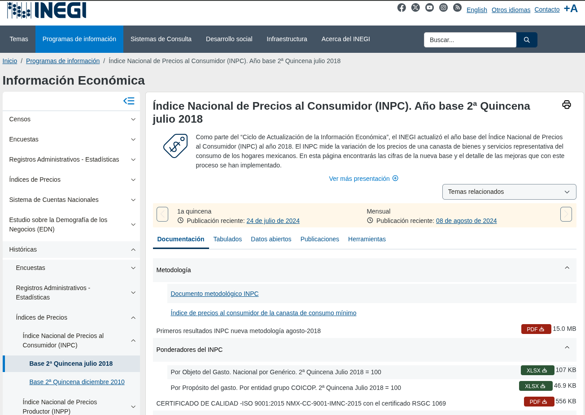
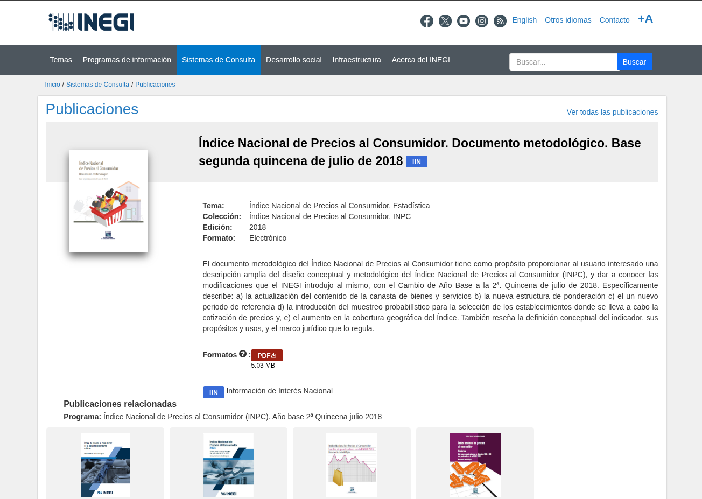
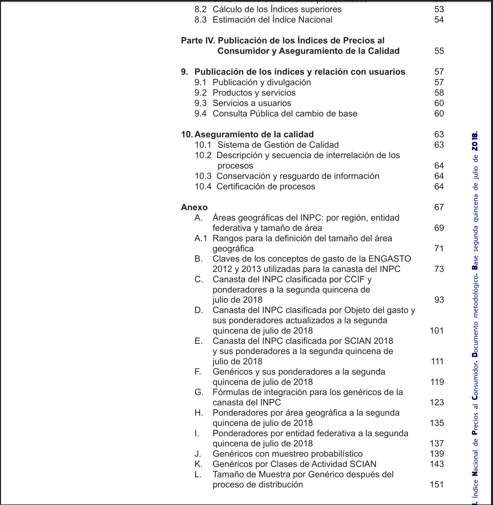
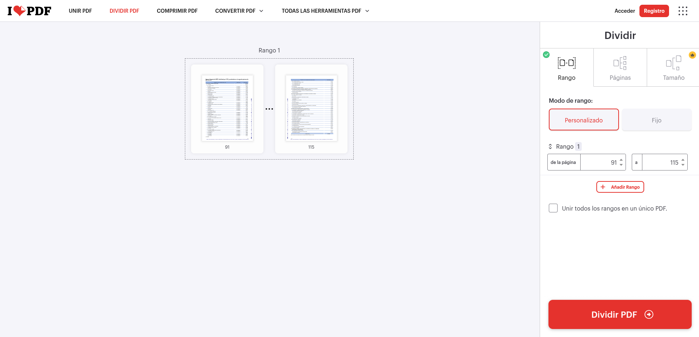
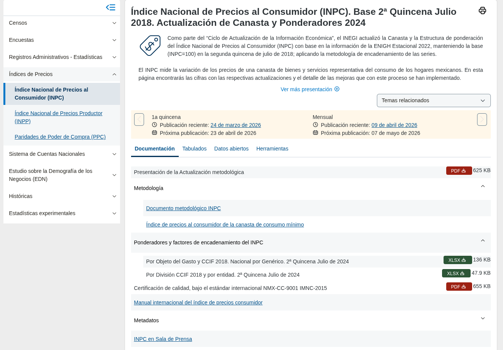
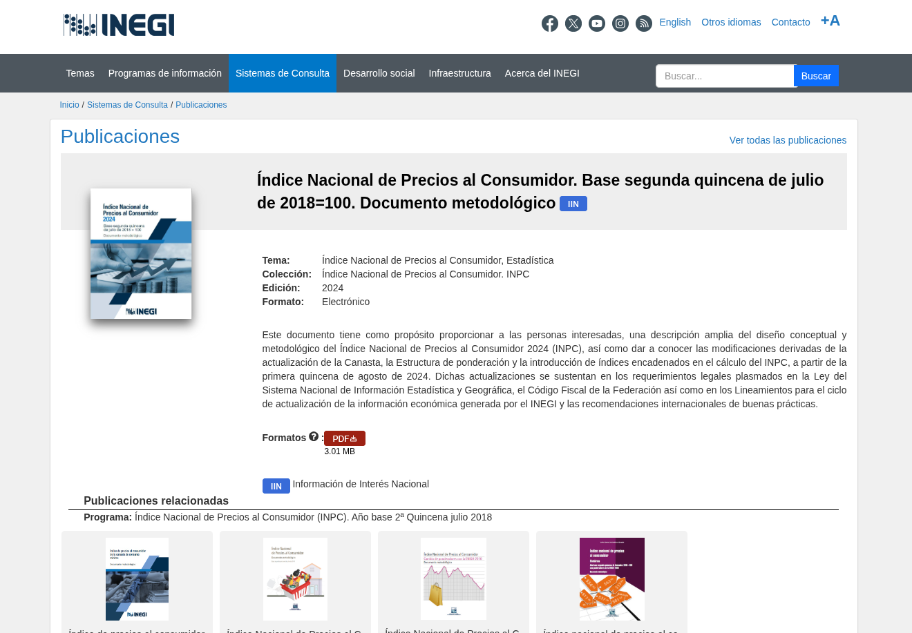
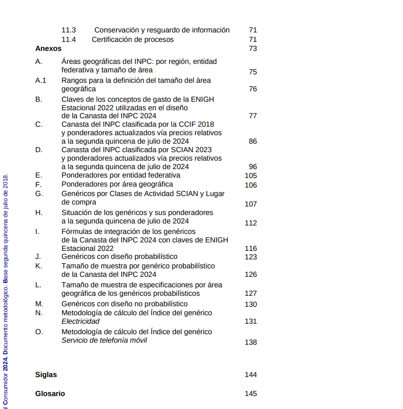
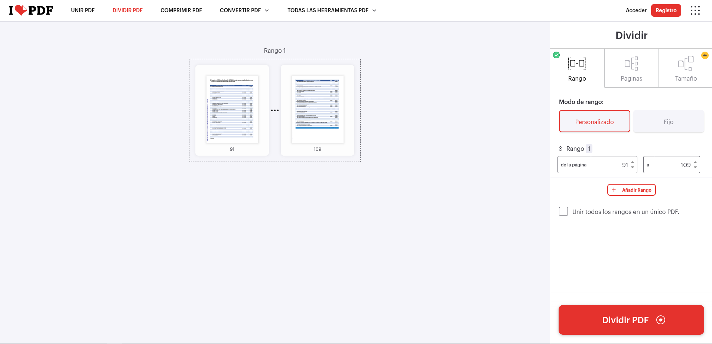

# Obtener ponderadores — INPC 2018 y 2024

> Las capturas de pantalla de esta guía corresponden al sitio del INEGI
> (inegi.org.mx) y se incluyen únicamente con fines ilustrativos.

Los ponderadores son dos archivos: un **xlsx** con la estructura de ponderaciones
y un **PDF** con los anexos del documento metodológico. Ambos se usan como
entrada de `tools/generar_canasta.py` para generar la canasta intermedia.

Esta guía cubre la descarga para la canasta 2018 y la canasta 2024.

---

## INPC 2018

### 1. Ir a la página del programa INPC 2018

Misma URL de partida que para las series:

```text
https://www.inegi.org.mx/programas/inpc/2018/
```

Ruta equivalente en el sitio del INEGI:

> Inicio -> Programas de Información -> Históricas -> Índices de Precios ->
> Índice Nacional de Precios al Consumidor (INPC) -> Base 2ª Quincena Julio 2018


### 2. Descargar el xlsx

En la pestaña **Documentación**, expandir la sección **Ponderadores del INPC**
y descargar el archivo XLSX de:

> **Por Objeto del Gasto. Nacional Por Genérico. 2ª Quincena Julio 2018 = 100**

### 3. Descargar el documento metodológico

En la misma pestaña, expandir la sección **Metodología** y hacer clic en
**Documento Metodológico INPC**.



En la página de la publicación, hacer clic en el botón **PDF** y descargar
el archivo.



### 4. Extraer los anexos del PDF

El archivo descargado es el documento metodológico completo. Solo se necesitan
los **anexos C, D y E**, que contienen las canastas clasificadas por CCIF,
por Objeto del Gasto y por SCIAN respectivamente.

Estos tres anexos ocupan las **páginas físicas 91 a 115** del PDF
(no los números de página impresos en el documento).



Para extraerlos:

1. Ir a [ilovepdf.com](https://www.ilovepdf.com) y seleccionar **Dividir PDF**.
2. Subir el documento metodológico descargado.
3. Seleccionar modo de rango **Personalizado**.
4. Ingresar el rango **91** a **115**.
5. Hacer clic en **Dividir PDF**.



El archivo resultante es el PDF que se pasa a `generar_canasta.py`.

### 5. Dónde colocar los archivos

No hay una ruta obligatoria — las rutas se pasan como argumentos al script.
Se recomienda colocarlos en:

```text
data/inputs/canastas/
```

### 6. Siguiente paso

Con el xlsx y el PDF de anexos listos, ejecutar `generar_canasta.py`:

```bash
python tools/generar_canasta.py --version 2018 \
  --xlsx data/inputs/canastas/ponderadores_2018.xlsx \
  --pdf data/inputs/canastas/anexos_2018.pdf \
  --preferir pdf \
  -o data/inputs/canastas/
```

> Se usa `--preferir pdf` porque existe al menos una diferencia conocida entre
> ambas fuentes: la división CCIF aparece como **"Ropa y calzado"** en el xlsx
> y como **"Prendas de Vestir y Calzado"** en el manual. Se asume que el manual
> es la fuente correcta. Sin `--preferir pdf`, el script preguntará
> interactivamente qué valor conservar en cada conflicto detectado.

Ver [tools/uso_generar_canasta.md](../tools/uso_generar_canasta.md) para el
detalle completo del script.

---

## INPC 2024

### 1. Ir a la página del programa INPC 2024

Misma URL de partida que para las series 2024:

```text
https://www.inegi.org.mx/programas/inpc/2018a/
```

Ruta equivalente en el sitio del INEGI:

> Inicio -> Programas de Información -> Índices de Precios ->
> Índice Nacional de Precios al Consumidor (INPC)


### 2. Descargar el xlsx (2024)

En la pestaña **Documentación**, expandir las secciones correspondientes.



Para el **xlsx**: descargar el archivo de ponderadores por Objeto del Gasto, nacional por genérico, base segunda quincena julio 2018 = 100.

### 3. Descargar el documento metodológico (2024)

En la misma pestaña, hacer clic en **Documento Metodológico INPC**.



En la página de la publicación, hacer clic en el botón **PDF** y descargar el archivo.

### 4. Extraer los anexos del PDF (2024)

El archivo descargado es el documento metodológico completo. Solo se necesitan
los anexos con las canastas clasificadas por CCIF, por Objeto del Gasto y por SCIAN.

Estos anexos ocupan las **páginas físicas 91 a 109** del PDF
(páginas impresas 86 a 104 del documento).



Para extraerlos:

1. Ir a [ilovepdf.com](https://www.ilovepdf.com) y seleccionar **Dividir PDF**.
2. Subir el documento metodológico descargado.
3. Seleccionar modo de rango **Personalizado**.
4. Ingresar el rango **91** a **109**.
5. Hacer clic en **Dividir PDF**.



El archivo resultante es el PDF que se pasa a `generar_canasta.py`.

### 5. Dónde colocar los archivos (2024)

No hay una ruta obligatoria — las rutas se pasan como argumentos al script.
Se recomienda colocarlos en:

```text
data/inputs/canastas/
```

### 6. Siguiente paso (2024)

Con el xlsx y el PDF de anexos listos, ejecutar `generar_canasta.py`:

```bash
python tools/generar_canasta.py --version 2024 \
  --xlsx data/inputs/canastas/ponderadores_2024.xlsx \
  --pdf data/inputs/canastas/anexos_2024.pdf \
  --preferir pdf \
  -o data/inputs/canastas/
```

Ver [tools/uso_generar_canasta.md](../tools/uso_generar_canasta.md) para el
detalle completo del script.
