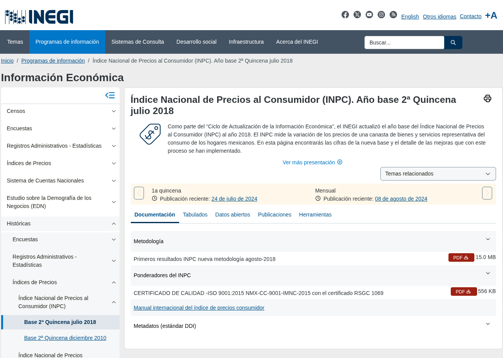
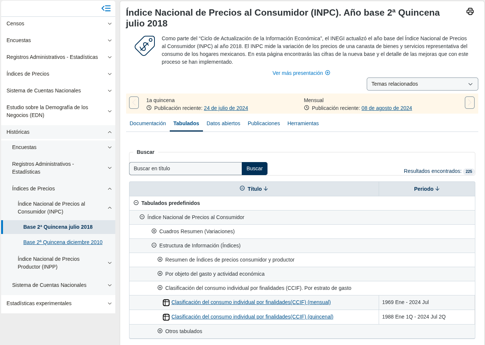
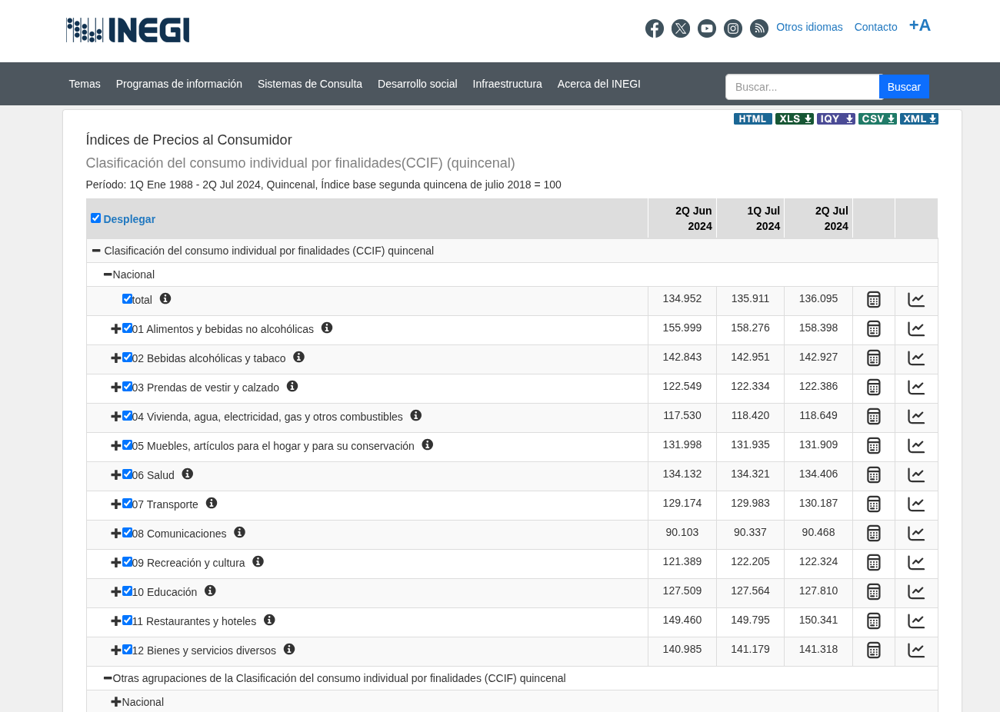
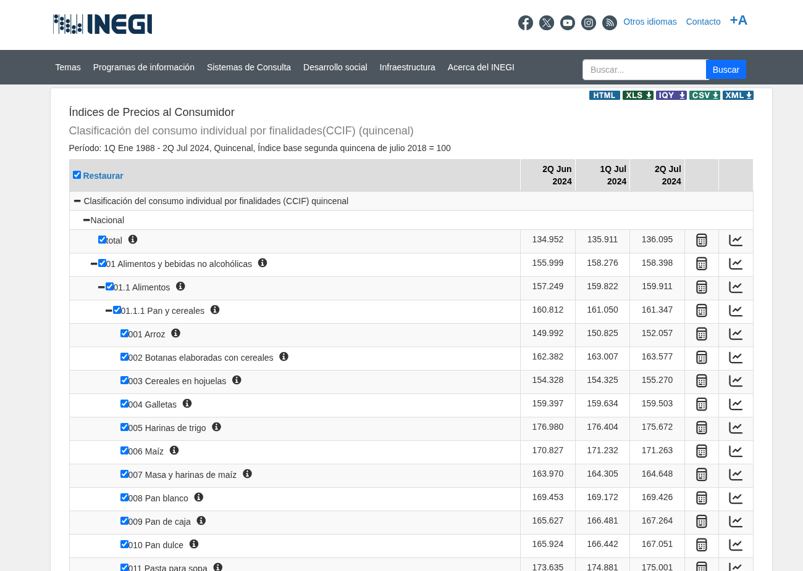
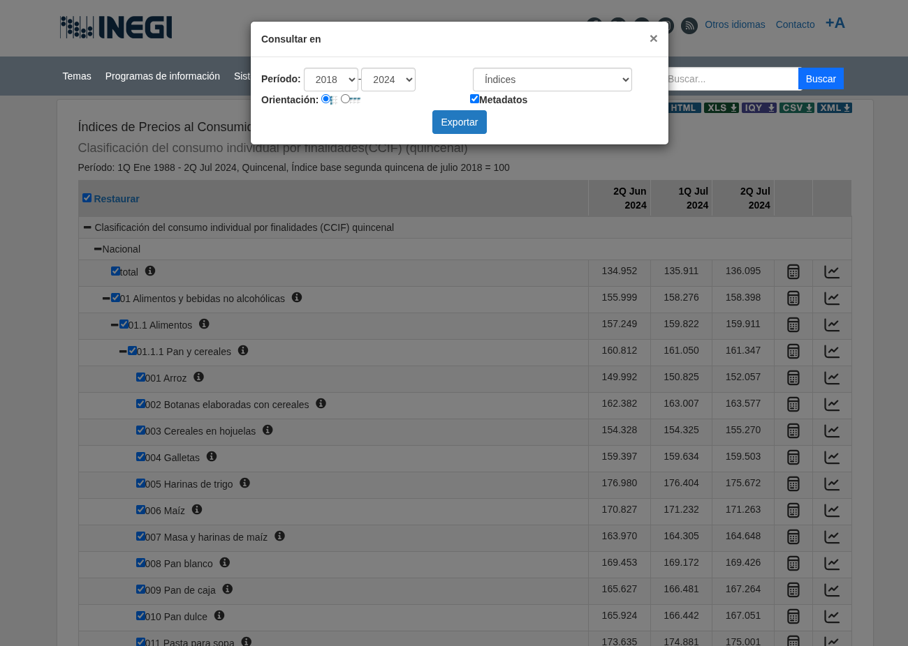
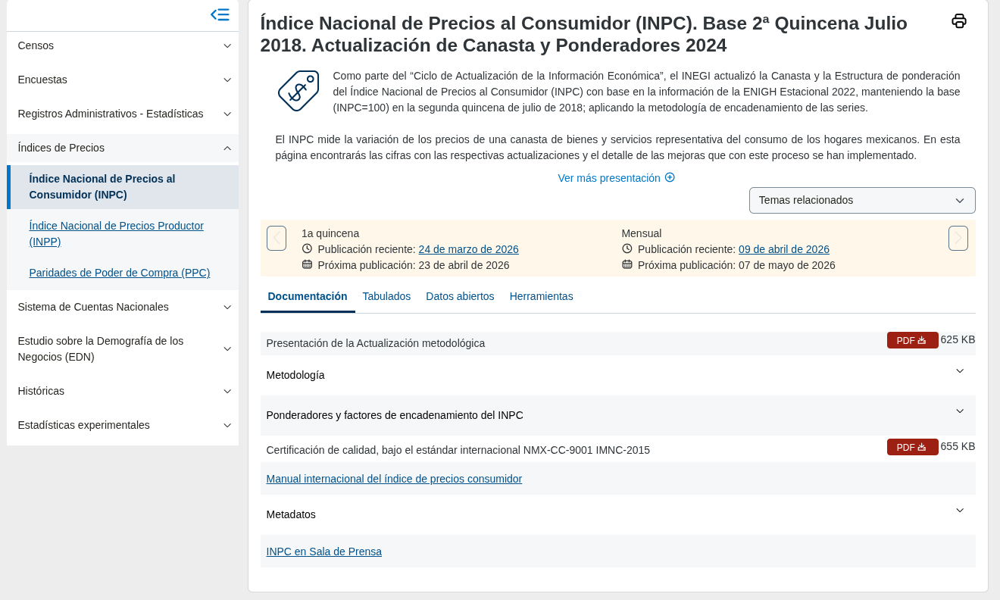
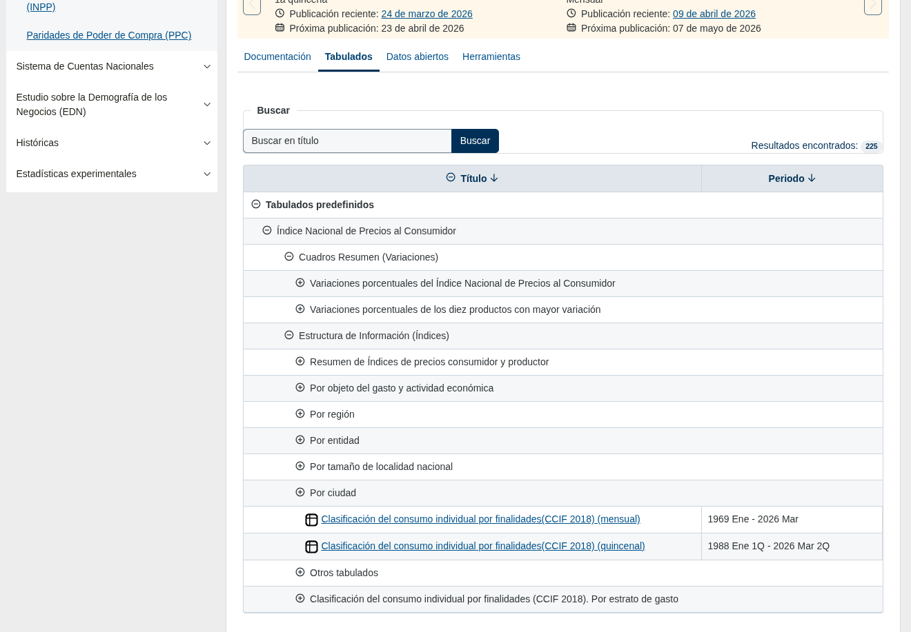
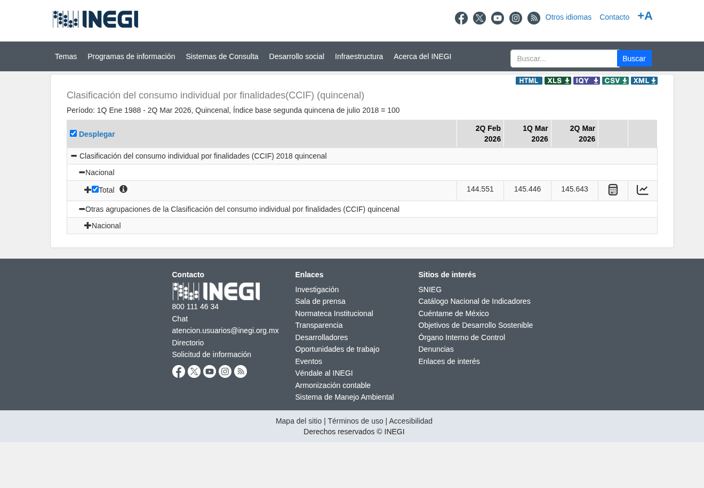
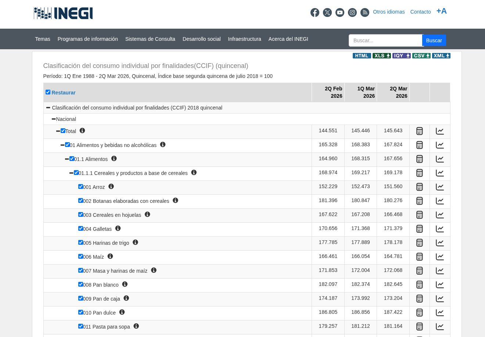
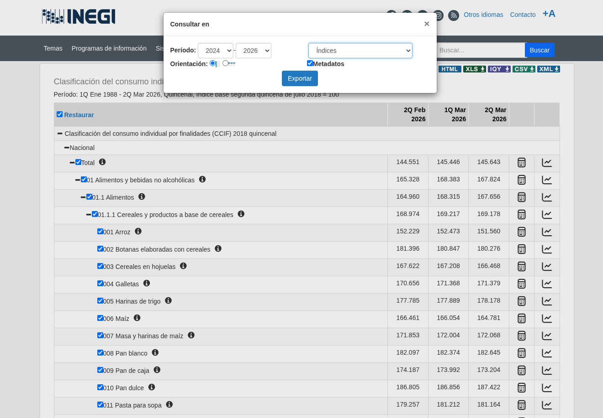

# Obtener series de genéricos — INPC 2018 y 2024

> Las capturas de pantalla de esta guía corresponden al sitio del INEGI
> (inegi.org.mx) y se incluyen únicamente con fines ilustrativos.

Las series de genéricos son los índices publicados por el INEGI para cada
genérico de la canasta, quincena por quincena. Son uno de los dos insumos
que necesita el sistema para calcular el INPC.

Para la canasta 2018 y la canasta 2024 se necesitan series distintas, descargadas
desde programas distintos del INEGI. Esta guía cubre ambos casos.

---

## Series para canasta 2018

### 1. Ir al programa INPC 2018

Abrir la siguiente URL:

```text
https://www.inegi.org.mx/programas/inpc/2018/
```

Ruta equivalente en el sitio del INEGI:

> Inicio -> Programas de Información -> Históricas -> Índices de Precios ->
> Índice Nacional de Precios al Consumidor (INPC) -> Base 2ª Quincena Julio 2018



### 2. Ir a la pestaña Tabulados (2018)

Hacer clic en la pestaña **Tabulados**.



### 3. Seleccionar el tabulado CCIF quincenal (2018)

Dentro de **Tabulados predefinidos**, desplegar:

> Índice Nacional de Precios al Consumidor →
> Estructura de Información (Índices) →
> **Clasificación del consumo individual por finalidades(CCIF) (quincenal)**



### 4. Desplegar la tabla y exportar (2018)

1. Hacer clic en **Desplegar** y esperar a que cargue la tabla completa.
2. Hacer clic en el botón verde **CSV**.



### 5. Configurar la exportación (2018)



| Campo               | Valor               |
| ------------------- | ------------------- |
| Período             | `2018` — `2024`     |
| Orientación         | cualquiera          |
| Metadatos           | cualquiera          |
| Tipo de información | **Índices** o Vacio |

> El campo **Tipo de información** debe quedar en **Índices** o dejarse en
> blanco (valor por defecto). Las opciones de inflación (quincenal, acumulada
> anual, interanual) no son las que usa el sistema.

Hacer clic en **Exportar**.

## Dónde colocar el archivo

Mover el CSV descargado a:

```text
data/inputs/series/
```

## Notas (canasta 2018)

- El encoding del archivo es `cp1252`. El sistema lo maneja automáticamente.
- La orientación y los metadatos no importan; el sistema los maneja automáticamente.
- El sistema solo usa periodos entre `2Q Jul 2018` y `2Q Jul 2024`. El rango
  de descarga debe incluir al menos un periodo dentro de ese intervalo, de lo
  contrario el sistema no encontrará periodos calculables y fallará.

---

## Series para canasta 2024

### 1. Ir al programa INPC 2024

Abrir la siguiente URL:

```text
https://www.inegi.org.mx/programas/inpc/2018a/
```

Ruta equivalente en el sitio del INEGI:

> Inicio -> Programas de Información -> Índices de Precios ->
> Índice Nacional de Precios al Consumidor (INPC)



### 2. Ir a la pestaña Tabulados (2024)

Hacer clic en la pestaña **Tabulados**.



### 3. Seleccionar el tabulado CCIF quincenal (2024)

Dentro de **Tabulados predefinidos**, desplegar:

> Índice Nacional de Precios al Consumidor →
> Estructura de Información (Índices) →
> **Clasificación del consumo individual por finalidades(CCIF) (quincenal)**



### 4. Desplegar la tabla y exportar (2024)

1. Hacer clic en **Desplegar** y esperar a que cargue la tabla completa.
2. Hacer clic en el botón verde **CSV**.



### 5. Configurar la exportación (2024)



| Campo               | Valor                      |
| ------------------- | -------------------------- |
| Período             | `2024` — hasta la fecha    |
| Orientación         | cualquiera                 |
| Metadatos           | cualquiera                 |
| Tipo de información | **Índices** o Vacío        |

> El campo **Tipo de información** debe quedar en **Índices** o dejarse en
> blanco (valor por defecto). Las opciones de inflación no son las que usa el sistema.

Hacer clic en **Exportar**.

## Dónde colocar el archivo (canasta 2024)

Mover el CSV descargado a:

```text
data/inputs/series/
```

## Notas (canasta 2024)

- El encoding del archivo es `cp1252`. El sistema lo maneja automáticamente.
- La orientación y los metadatos no importan; el sistema los maneja automáticamente.
- El sistema usa periodos a partir de `2Q Jul 2024`. Incluir al menos ese periodo
  en la descarga.
- Para obtener `f_h` exacto al calcular, ejecutar primero la corrida 2018 y pasar
  su resultado como `resultado_referencia` en la corrida 2024. Ver `docs/metodologia_replica.md`.
